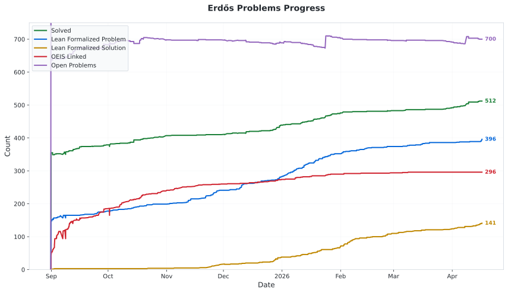

# Erdős problem database

**[Browse the interactive table](https://teorth.github.io/erdosproblems/)** - Sort, filter, and search all the problems in the database

A community database for the problems on the [erdosproblems.com](https://www.erdosproblems.com/) site.  We are particularly [seeking community contributions regarding the integer sequences associated with these problems](CONTRIBUTING.md#linking-with-the-oeis), and linking them to the [OEIS](https://oeis.org).

The table below is auto-generated from the YAML file [data/problems.yaml](data/problems.yaml), which is the "ground truth" for this data as far as this repository is concerned.

- To propose changes, open a PR editing [data/problems.yaml](data/problems.yaml).
- See [CONTRIBUTING.md](CONTRIBUTING.md) for guidelines and field definitions.

For further discussion of this project, see [this blog post](https://terrytao.wordpress.com/2025/08/31/a-crowdsourced-project-to-link-up-erdosproblems-com-to-the-oeis/) (from Sep 1, 2025).

Several of the problems have received assistance from various AI tools.  A list of such assistance [can be found here](https://github.com/teorth/erdosproblems/wiki/AI-contributions-to-Erd%C5%91s-problems).
## Progress

<picture>
  <source media="(prefers-color-scheme: dark)" srcset="data/statistics_history_dark.svg">
  <source media="(prefers-color-scheme: light)" srcset="data/statistics_history_light.svg">
  
</picture>

## Table

<!-- TABLE:START -->
There are 1136 problems in total, of which
- [104](https://teorth.github.io/erdosproblems/?prize=yes) are attached to a monetary prize.
- [290](https://teorth.github.io/erdosproblems/?status=proved) have been proved.
  - [33](https://teorth.github.io/erdosproblems/?status=proved+%28Lean%29) of these proofs have been formalized in [Lean](https://lean-lang.org/).
- [109](https://teorth.github.io/erdosproblems/?status=disproved) have been disproved.
  - [23](https://teorth.github.io/erdosproblems/?status=disproved+%28Lean%29) of these disproofs have been formalized in [Lean](https://lean-lang.org/).
- [59](https://teorth.github.io/erdosproblems/?status=solved) have been otherwise solved.
  - [3](https://teorth.github.io/erdosproblems/?status=solved+%28Lean%29) of these solutions have been formalized in [Lean](https://lean-lang.org/).
- [5](https://teorth.github.io/erdosproblems/?status=not+provable) appear to be open, but cannot be proven from the axioms of ZFC. (not provable)
- 0 appear to be open, but cannot be disproven from the axioms of ZFC. (not disprovable)
- 2 are known to be independent of the ZFC axioms of mathematics. (independent)
- [8](https://teorth.github.io/erdosproblems/?status=decidable) appear to be open, but have been reduced to a finite computation. (decidable)
- [30](https://teorth.github.io/erdosproblems/?status=falsifiable) appear to be open, but can be disproven by a finite computation if false. (falsifiable)
- [7](https://teorth.github.io/erdosproblems/?status=verifiable) appear to be open, but can be proven by a finite computation if true. (verifiable)
- [626](https://teorth.github.io/erdosproblems/?status=open) appear to be completely open.
- 6 have ambiguous statements.
- 1 have a literature review requested.
- [337](https://teorth.github.io/erdosproblems/?formalized=yes) have their statements formalized in [Lean](https://lean-lang.org/) in the [Formal Conjectures Repository](https://github.com/google-deepmind/formal-conjectures).
- [285](https://teorth.github.io/erdosproblems/?oeis=linked) have been linked to 348 distinct [OEIS](https://oeis.org/) sequences, with a total of 415 links created.
  - 62 of these OEIS sequences were added since the creation of this database (A387000 onwards).
- [301](https://teorth.github.io/erdosproblems/?oeis=possible) are potentially related to an [OEIS](https://oeis.org/) sequence not already listed.
  - 260 of these problems are not currently linked to any existing [OEIS](https://oeis.org/) sequence.
- 0 have a related sequence currently being submitted to the [OEIS](https://oeis.org/).
- [1](https://teorth.github.io/erdosproblems/?oeis=inprogress) have a related sequence whose generation is currently in progress.

| # | Prize | Status | Formalized | AI Attempts | OEIS | Tags | Comments |
|---|---|---|---|---|---|---|---|
| [1](https://www.erdosproblems.com/1) | $500 | open | [yes](https://github.com/google-deepmind/formal-conjectures/blob/main/FormalConjectures/ErdosProblems/1.lean) | [view](https://mehmetmars7.github.io/Erdosproblems-llm-hunter/problem.html?type=erdos&id=1) | [A276661](https://oeis.org/A276661) | [number theory](https://www.erdosproblems.com/tags/number%20theory), [additive combinatorics](https://www.erdosproblems.com/tags/additive%20combinatorics) |  |
| [2](https://www.erdosproblems.com/2) | $1000 | disproved | no | [view](https://mehmetmars7.github.io/Erdosproblems-llm-hunter/problem.html?type=erdos&id=2) | [A160559](https://oeis.org/A160559) | [number theory](https://www.erdosproblems.com/tags/number%20theory), [covering systems](https://www.erdosproblems.com/tags/covering%20systems) |  |
| [3](https://www.erdosproblems.com/3) | $5000 | open | [yes](https://github.com/google-deepmind/formal-conjectures/blob/main/FormalConjectures/ErdosProblems/3.lean) | [view](https://mehmetmars7.github.io/Erdosproblems-llm-hunter/problem.html?type=erdos&id=3) | [A003002](https://oeis.org/A003002), [A003003](https://oeis.org/A003003), [A003004](https://oeis.org/A003004), [A003005](https://oeis.org/A003005) | [number theory](https://www.erdosproblems.com/tags/number%20theory), [additive combinatorics](https://www.erdosproblems.com/tags/additive%20combinatorics), [arithmetic progressions](https://www.erdosproblems.com/tags/arithmetic%20progressions) |  |
| [4](https://www.erdosproblems.com/4) | $10000 | proved | [yes](https://github.com/google-deepmind/formal-conjectures/blob/main/FormalConjectures/ErdosProblems/4.lean) | [view](https://mehmetmars7.github.io/Erdosproblems-llm-hunter/problem.html?type=erdos&id=4) | [A002386](https://oeis.org/A002386) | [number theory](https://www.erdosproblems.com/tags/number%20theory), [primes](https://www.erdosproblems.com/tags/primes) |  |
| [5](https://www.erdosproblems.com/5) | no | open | no | [view](https://mehmetmars7.github.io/Erdosproblems-llm-hunter/problem.html?type=erdos&id=5) | [A001223](https://oeis.org/A001223) | [number theory](https://www.erdosproblems.com/tags/number%20theory), [primes](https://www.erdosproblems.com/tags/primes) |  |
| [6](https://www.erdosproblems.com/6) | $100 | proved | [yes](https://github.com/google-deepmind/formal-conjectures/blob/main/FormalConjectures/ErdosProblems/6.lean) | [view](https://mehmetmars7.github.io/Erdosproblems-llm-hunter/problem.html?type=erdos&id=6) | [A335277](https://oeis.org/A335277) | [number theory](https://www.erdosproblems.com/tags/number%20theory), [primes](https://www.erdosproblems.com/tags/primes) |  |
| [7](https://www.erdosproblems.com/7) | no | verifiable | no | [view](https://mehmetmars7.github.io/Erdosproblems-llm-hunter/problem.html?type=erdos&id=7) | N/A | [number theory](https://www.erdosproblems.com/tags/number%20theory), [covering systems](https://www.erdosproblems.com/tags/covering%20systems) |  |
| [8](https://www.erdosproblems.com/8) | no | disproved | no | [view](https://mehmetmars7.github.io/Erdosproblems-llm-hunter/problem.html?type=erdos&id=8) | N/A | [number theory](https://www.erdosproblems.com/tags/number%20theory), [covering systems](https://www.erdosproblems.com/tags/covering%20systems) |  |
| [9](https://www.erdosproblems.com/9) | no | open | [yes](https://github.com/google-deepmind/formal-conjectures/blob/main/FormalConjectures/ErdosProblems/9.lean) | [view](https://mehmetmars7.github.io/Erdosproblems-llm-hunter/problem.html?type=erdos&id=9) | [A006286](https://oeis.org/A006286) | [number theory](https://www.erdosproblems.com/tags/number%20theory), [additive basis](https://www.erdosproblems.com/tags/additive%20basis), [primes](https://www.erdosproblems.com/tags/primes) |  |
| [10](https://www.erdosproblems.com/10) | no | open | [yes](https://github.com/google-deepmind/formal-conjectures/blob/main/FormalConjectures/ErdosProblems/10.lean) | [view](https://mehmetmars7.github.io/Erdosproblems-llm-hunter/problem.html?type=erdos&id=10) | [A387053](https://oeis.org/A387053) | [number theory](https://www.erdosproblems.com/tags/number%20theory), [additive basis](https://www.erdosproblems.com/tags/additive%20basis), [primes](https://www.erdosproblems.com/tags/primes) |  |
| [11](https://www.erdosproblems.com/11) | no | falsifiable | [yes](https://github.com/google-deepmind/formal-conjectures/blob/main/FormalConjectures/ErdosProblems/11.lean) | [view](https://mehmetmars7.github.io/Erdosproblems-llm-hunter/problem.html?type=erdos&id=11) | [A001220](https://oeis.org/A001220), [A377587](https://oeis.org/A377587) | [number theory](https://www.erdosproblems.com/tags/number%20theory), [additive basis](https://www.erdosproblems.com/tags/additive%20basis) |  |
| [12](https://www.erdosproblems.com/12) | no | open | [yes](https://github.com/google-deepmind/formal-conjectures/blob/main/FormalConjectures/ErdosProblems/12.lean) | [view](https://mehmetmars7.github.io/Erdosproblems-llm-hunter/problem.html?type=erdos&id=12) | N/A | [number theory](https://www.erdosproblems.com/tags/number%20theory) |  |
| [13](https://www.erdosproblems.com/13) | $100 | proved | no | [view](https://mehmetmars7.github.io/Erdosproblems-llm-hunter/problem.html?type=erdos&id=13) | [A002264](https://oeis.org/A002264) | [number theory](https://www.erdosproblems.com/tags/number%20theory) |  |
| [14](https://www.erdosproblems.com/14) | no | open | [yes](https://github.com/google-deepmind/formal-conjectures/blob/main/FormalConjectures/ErdosProblems/14.lean) | [view](https://mehmetmars7.github.io/Erdosproblems-llm-hunter/problem.html?type=erdos&id=14) | [A143824](https://oeis.org/A143824), possible | [number theory](https://www.erdosproblems.com/tags/number%20theory), [sidon sets](https://www.erdosproblems.com/tags/sidon%20sets), [additive combinatorics](https://www.erdosproblems.com/tags/additive%20combinatorics) |  |
| [15](https://www.erdosproblems.com/15) | no | open | no | [view](https://mehmetmars7.github.io/Erdosproblems-llm-hunter/problem.html?type=erdos&id=15) | N/A | [number theory](https://www.erdosproblems.com/tags/number%20theory), [primes](https://www.erdosproblems.com/tags/primes) |  |
| [16](https://www.erdosproblems.com/16) | no | disproved | no | [view](https://mehmetmars7.github.io/Erdosproblems-llm-hunter/problem.html?type=erdos&id=16) | [A006285](https://oeis.org/A006285) | [number theory](https://www.erdosproblems.com/tags/number%20theory), [additive basis](https://www.erdosproblems.com/tags/additive%20basis), [primes](https://www.erdosproblems.com/tags/primes) |  |
| [17](https://www.erdosproblems.com/17) | no | open | [yes](https://github.com/google-deepmind/formal-conjectures/blob/main/FormalConjectures/ErdosProblems/17.lean) | [view](https://mehmetmars7.github.io/Erdosproblems-llm-hunter/problem.html?type=erdos&id=17) | [A038133](https://oeis.org/A038133) | [number theory](https://www.erdosproblems.com/tags/number%20theory), [primes](https://www.erdosproblems.com/tags/primes) | cluster primes |
| [18](https://www.erdosproblems.com/18) | no | open | no | [view](https://mehmetmars7.github.io/Erdosproblems-llm-hunter/problem.html?type=erdos&id=18) | [A005153](https://oeis.org/A005153) | [number theory](https://www.erdosproblems.com/tags/number%20theory), [divisors](https://www.erdosproblems.com/tags/divisors), [factorials](https://www.erdosproblems.com/tags/factorials) | practical numbers |
| [19](https://www.erdosproblems.com/19) | $500 | decidable | no | [view](https://mehmetmars7.github.io/Erdosproblems-llm-hunter/problem.html?type=erdos&id=19) | N/A | [graph theory](https://www.erdosproblems.com/tags/graph%20theory), [chromatic number](https://www.erdosproblems.com/tags/chromatic%20number) |  |
| [20](https://www.erdosproblems.com/20) | $1000 | open | [yes](https://github.com/google-deepmind/formal-conjectures/blob/main/FormalConjectures/ErdosProblems/20.lean) | [view](https://mehmetmars7.github.io/Erdosproblems-llm-hunter/problem.html?type=erdos&id=20) | [A332077](https://oeis.org/A332077) | [combinatorics](https://www.erdosproblems.com/tags/combinatorics) | sunflower conjecture |
| [21](https://www.erdosproblems.com/21) | $500 | proved | no | [view](https://mehmetmars7.github.io/Erdosproblems-llm-hunter/problem.html?type=erdos&id=21) | possible | [combinatorics](https://www.erdosproblems.com/tags/combinatorics), [intersecting family](https://www.erdosproblems.com/tags/intersecting%20family) |  |
| [22](https://www.erdosproblems.com/22) | no | proved | no | [view](https://mehmetmars7.github.io/Erdosproblems-llm-hunter/problem.html?type=erdos&id=22) | possible | [graph theory](https://www.erdosproblems.com/tags/graph%20theory) |  |
| [23](https://www.erdosproblems.com/23) | no | falsifiable | no | [view](https://mehmetmars7.github.io/Erdosproblems-llm-hunter/problem.html?type=erdos&id=23) | [A389646](https://oeis.org/A389646) | [graph theory](https://www.erdosproblems.com/tags/graph%20theory) |  |
| [24](https://www.erdosproblems.com/24) | no | proved | no | [view](https://mehmetmars7.github.io/Erdosproblems-llm-hunter/problem.html?type=erdos&id=24) | possible | [graph theory](https://www.erdosproblems.com/tags/graph%20theory) |  |
| [25](https://www.erdosproblems.com/25) | no | open | [yes](https://github.com/google-deepmind/formal-conjectures/blob/main/FormalConjectures/ErdosProblems/25.lean) | [view](https://mehmetmars7.github.io/Erdosproblems-llm-hunter/problem.html?type=erdos&id=25) | N/A | [number theory](https://www.erdosproblems.com/tags/number%20theory) |  |
| [26](https://www.erdosproblems.com/26) | no | disproved (Lean) | [yes](https://github.com/google-deepmind/formal-conjectures/blob/main/FormalConjectures/ErdosProblems/26.lean) | [view](https://mehmetmars7.github.io/Erdosproblems-llm-hunter/problem.html?type=erdos&id=26) | N/A | [number theory](https://www.erdosproblems.com/tags/number%20theory), [divisors](https://www.erdosproblems.com/tags/divisors) |  |
| [27](https://www.erdosproblems.com/27) | $100 | disproved | no | [view](https://mehmetmars7.github.io/Erdosproblems-llm-hunter/problem.html?type=erdos&id=27) | N/A | [number theory](https://www.erdosproblems.com/tags/number%20theory), [covering systems](https://www.erdosproblems.com/tags/covering%20systems) |  |
| [28](https://www.erdosproblems.com/28) | $500 | open | [yes](https://github.com/google-deepmind/formal-conjectures/blob/main/FormalConjectures/ErdosProblems/28.lean) | [view](https://mehmetmars7.github.io/Erdosproblems-llm-hunter/problem.html?type=erdos&id=28) | N/A | [number theory](https://www.erdosproblems.com/tags/number%20theory), [additive basis](https://www.erdosproblems.com/tags/additive%20basis) |  |
| [29](https://www.erdosproblems.com/29) | $100 | proved | no | [view](https://mehmetmars7.github.io/Erdosproblems-llm-hunter/problem.html?type=erdos&id=29) | N/A | [number theory](https://www.erdosproblems.com/tags/number%20theory), [additive basis](https://www.erdosproblems.com/tags/additive%20basis) |  |
| [30](https://www.erdosproblems.com/30) | $1000 | open | [yes](https://github.com/google-deepmind/formal-conjectures/blob/main/FormalConjectures/ErdosProblems/30.lean) | [view](https://mehmetmars7.github.io/Erdosproblems-llm-hunter/problem.html?type=erdos&id=30) | [A143824](https://oeis.org/A143824), [A227590](https://oeis.org/A227590), [A003022](https://oeis.org/A003022) | [number theory](https://www.erdosproblems.com/tags/number%20theory), [sidon sets](https://www.erdosproblems.com/tags/sidon%20sets), [additive combinatorics](https://www.erdosproblems.com/tags/additive%20combinatorics) |  |
| [31](https://www.erdosproblems.com/31) | no | proved (Lean) | no | [view](https://mehmetmars7.github.io/Erdosproblems-llm-hunter/problem.html?type=erdos&id=31) | N/A | [number theory](https://www.erdosproblems.com/tags/number%20theory), [additive basis](https://www.erdosproblems.com/tags/additive%20basis) |  |
| [32](https://www.erdosproblems.com/32) | no | open | no | [view](https://mehmetmars7.github.io/Erdosproblems-llm-hunter/problem.html?type=erdos&id=32) | N/A | [number theory](https://www.erdosproblems.com/tags/number%20theory), [additive basis](https://www.erdosproblems.com/tags/additive%20basis) |  |
| [33](https://www.erdosproblems.com/33) | no | open | [yes](https://github.com/google-deepmind/formal-conjectures/blob/main/FormalConjectures/ErdosProblems/33.lean) | [view](https://mehmetmars7.github.io/Erdosproblems-llm-hunter/problem.html?type=erdos&id=33) | N/A | [number theory](https://www.erdosproblems.com/tags/number%20theory), [additive basis](https://www.erdosproblems.com/tags/additive%20basis) |  |
| [34](https://www.erdosproblems.com/34) | no | disproved | no | [view](https://mehmetmars7.github.io/Erdosproblems-llm-hunter/problem.html?type=erdos&id=34) | [A389241](https://oeis.org/A389241), [A234813](https://oeis.org/A234813), [A390187](https://oeis.org/A390187) | [number theory](https://www.erdosproblems.com/tags/number%20theory) |  |
| [35](https://www.erdosproblems.com/35) | no | proved | no | [view](https://mehmetmars7.github.io/Erdosproblems-llm-hunter/problem.html?type=erdos&id=35) | N/A | [number theory](https://www.erdosproblems.com/tags/number%20theory), [additive basis](https://www.erdosproblems.com/tags/additive%20basis) |  |
| [36](https://www.erdosproblems.com/36) | no | open | [yes](https://github.com/google-deepmind/formal-conjectures/blob/main/FormalConjectures/ErdosProblems/36.lean) | [view](https://mehmetmars7.github.io/Erdosproblems-llm-hunter/problem.html?type=erdos&id=36) | possible | [number theory](https://www.erdosproblems.com/tags/number%20theory), [additive combinatorics](https://www.erdosproblems.com/tags/additive%20combinatorics) | minimum overlap problem |
| [37](https://www.erdosproblems.com/37) | no | disproved | no | [view](https://mehmetmars7.github.io/Erdosproblems-llm-hunter/problem.html?type=erdos&id=37) | N/A | [number theory](https://www.erdosproblems.com/tags/number%20theory), [additive combinatorics](https://www.erdosproblems.com/tags/additive%20combinatorics) |  |
| [38](https://www.erdosproblems.com/38) | no | open | [yes](https://github.com/google-deepmind/formal-conjectures/blob/main/FormalConjectures/ErdosProblems/38.lean) | [view](https://mehmetmars7.github.io/Erdosproblems-llm-hunter/problem.html?type=erdos&id=38) | N/A | [number theory](https://www.erdosproblems.com/tags/number%20theory) |  |
| [39](https://www.erdosproblems.com/39) | $500 | open | [yes](https://github.com/google-deepmind/formal-conjectures/blob/main/FormalConjectures/ErdosProblems/39.lean) | [view](https://mehmetmars7.github.io/Erdosproblems-llm-hunter/problem.html?type=erdos&id=39) | N/A | [number theory](https://www.erdosproblems.com/tags/number%20theory), [sidon sets](https://www.erdosproblems.com/tags/sidon%20sets), [additive combinatorics](https://www.erdosproblems.com/tags/additive%20combinatorics) |  |
| [40](https://www.erdosproblems.com/40) | $500 | open | [yes](https://github.com/google-deepmind/formal-conjectures/blob/main/FormalConjectures/ErdosProblems/40.lean) | [view](https://mehmetmars7.github.io/Erdosproblems-llm-hunter/problem.html?type=erdos&id=40) | N/A | [number theory](https://www.erdosproblems.com/tags/number%20theory), [additive basis](https://www.erdosproblems.com/tags/additive%20basis) |  |
| [41](https://www.erdosproblems.com/41) | $500 | open | [yes](https://github.com/google-deepmind/formal-conjectures/blob/main/FormalConjectures/ErdosProblems/41.lean) | [view](https://mehmetmars7.github.io/Erdosproblems-llm-hunter/problem.html?type=erdos&id=41) | N/A | [number theory](https://www.erdosproblems.com/tags/number%20theory), [sidon sets](https://www.erdosproblems.com/tags/sidon%20sets), [additive combinatorics](https://www.erdosproblems.com/tags/additive%20combinatorics) |  |
| [42](https://www.erdosproblems.com/42) | no | open | [yes](https://github.com/google-deepmind/formal-conjectures/blob/main/FormalConjectures/ErdosProblems/42.lean) | [view](https://mehmetmars7.github.io/Erdosproblems-llm-hunter/problem.html?type=erdos&id=42) | N/A | [number theory](https://www.erdosproblems.com/tags/number%20theory), [sidon sets](https://www.erdosproblems.com/tags/sidon%20sets), [additive combinatorics](https://www.erdosproblems.com/tags/additive%20combinatorics) |  |
| [43](https://www.erdosproblems.com/43) | $100 | open | no | [view](https://mehmetmars7.github.io/Erdosproblems-llm-hunter/problem.html?type=erdos&id=43) | [A143824](https://oeis.org/A143824), [A227590](https://oeis.org/A227590), [A003022](https://oeis.org/A003022), possible | [number theory](https://www.erdosproblems.com/tags/number%20theory), [sidon sets](https://www.erdosproblems.com/tags/sidon%20sets), [additive combinatorics](https://www.erdosproblems.com/tags/additive%20combinatorics) |  |
| [44](https://www.erdosproblems.com/44) | no | open | [yes](https://github.com/google-deepmind/formal-conjectures/blob/main/FormalConjectures/ErdosProblems/44.lean) | [view](https://mehmetmars7.github.io/Erdosproblems-llm-hunter/problem.html?type=erdos&id=44) | N/A | [number theory](https://www.erdosproblems.com/tags/number%20theory), [sidon sets](https://www.erdosproblems.com/tags/sidon%20sets), [additive combinatorics](https://www.erdosproblems.com/tags/additive%20combinatorics) |  |
| [45](https://www.erdosproblems.com/45) | no | proved | no | [view](https://mehmetmars7.github.io/Erdosproblems-llm-hunter/problem.html?type=erdos&id=45) | possible | [number theory](https://www.erdosproblems.com/tags/number%20theory), [unit fractions](https://www.erdosproblems.com/tags/unit%20fractions), [ramsey theory](https://www.erdosproblems.com/tags/ramsey%20theory) |  |
| [46](https://www.erdosproblems.com/46) | no | proved (Lean) | no | [view](https://mehmetmars7.github.io/Erdosproblems-llm-hunter/problem.html?type=erdos&id=46) | N/A | [number theory](https://www.erdosproblems.com/tags/number%20theory), [unit fractions](https://www.erdosproblems.com/tags/unit%20fractions), [ramsey theory](https://www.erdosproblems.com/tags/ramsey%20theory) |  |
| [47](https://www.erdosproblems.com/47) | $100 | proved (Lean) | no | [view](https://mehmetmars7.github.io/Erdosproblems-llm-hunter/problem.html?type=erdos&id=47) | N/A | [number theory](https://www.erdosproblems.com/tags/number%20theory), [unit fractions](https://www.erdosproblems.com/tags/unit%20fractions) |  |
| [48](https://www.erdosproblems.com/48) | no | proved | [yes](https://github.com/google-deepmind/formal-conjectures/blob/main/FormalConjectures/ErdosProblems/48.lean) | [view](https://mehmetmars7.github.io/Erdosproblems-llm-hunter/problem.html?type=erdos&id=48) | N/A | [number theory](https://www.erdosproblems.com/tags/number%20theory) |  |
| [49](https://www.erdosproblems.com/49) | no | proved | no | [view](https://mehmetmars7.github.io/Erdosproblems-llm-hunter/problem.html?type=erdos&id=49) | [A365339](https://oeis.org/A365339), [A365474](https://oeis.org/A365474) | [number theory](https://www.erdosproblems.com/tags/number%20theory), [primes](https://www.erdosproblems.com/tags/primes) |  |
| [50](https://www.erdosproblems.com/50) | $250 | open | no | [view](https://mehmetmars7.github.io/Erdosproblems-llm-hunter/problem.html?type=erdos&id=50) | N/A | [number theory](https://www.erdosproblems.com/tags/number%20theory) |  |
| [51](https://www.erdosproblems.com/51) | no | open | [yes](https://github.com/google-deepmind/formal-conjectures/blob/main/FormalConjectures/ErdosProblems/51.lean) | [view](https://mehmetmars7.github.io/Erdosproblems-llm-hunter/problem.html?type=erdos&id=51) | [A002202](https://oeis.org/A002202), [A014197](https://oeis.org/A014197) | [number theory](https://www.erdosproblems.com/tags/number%20theory) |  |
| [52](https://www.erdosproblems.com/52) | $250 | open | no | [view](https://mehmetmars7.github.io/Erdosproblems-llm-hunter/problem.html?type=erdos&id=52) | [A263996](https://oeis.org/A263996) | [number theory](https://www.erdosproblems.com/tags/number%20theory), [additive combinatorics](https://www.erdosproblems.com/tags/additive%20combinatorics) | sum-product problem |
| [53](https://www.erdosproblems.com/53) | no | proved | no | [view](https://mehmetmars7.github.io/Erdosproblems-llm-hunter/problem.html?type=erdos&id=53) | possible | [number theory](https://www.erdosproblems.com/tags/number%20theory), [additive combinatorics](https://www.erdosproblems.com/tags/additive%20combinatorics) |  |
| [54](https://www.erdosproblems.com/54) | $100 | solved | no | [view](https://mehmetmars7.github.io/Erdosproblems-llm-hunter/problem.html?type=erdos&id=54) | N/A | [number theory](https://www.erdosproblems.com/tags/number%20theory), [ramsey theory](https://www.erdosproblems.com/tags/ramsey%20theory) |  |
| [55](https://www.erdosproblems.com/55) | $250 | solved | no | [view](https://mehmetmars7.github.io/Erdosproblems-llm-hunter/problem.html?type=erdos&id=55) | N/A | [number theory](https://www.erdosproblems.com/tags/number%20theory), [ramsey theory](https://www.erdosproblems.com/tags/ramsey%20theory) |  |
| [56](https://www.erdosproblems.com/56) | $10 | disproved (Lean) | [yes](https://github.com/google-deepmind/formal-conjectures/blob/main/FormalConjectures/ErdosProblems/56.lean) | [view](https://mehmetmars7.github.io/Erdosproblems-llm-hunter/problem.html?type=erdos&id=56) | N/A | [number theory](https://www.erdosproblems.com/tags/number%20theory), [intersecting family](https://www.erdosproblems.com/tags/intersecting%20family) |  |
| [57](https://www.erdosproblems.com/57) | no | proved | no | [view](https://mehmetmars7.github.io/Erdosproblems-llm-hunter/problem.html?type=erdos&id=57) | N/A | [graph theory](https://www.erdosproblems.com/tags/graph%20theory), [chromatic number](https://www.erdosproblems.com/tags/chromatic%20number), [cycles](https://www.erdosproblems.com/tags/cycles) |  |
| [58](https://www.erdosproblems.com/58) | no | proved | no | [view](https://mehmetmars7.github.io/Erdosproblems-llm-hunter/problem.html?type=erdos&id=58) | N/A | [graph theory](https://www.erdosproblems.com/tags/graph%20theory), [chromatic number](https://www.erdosproblems.com/tags/chromatic%20number), [cycles](https://www.erdosproblems.com/tags/cycles) |  |
| [59](https://www.erdosproblems.com/59) | no | disproved | no | [view](https://mehmetmars7.github.io/Erdosproblems-llm-hunter/problem.html?type=erdos&id=59) | N/A | [graph theory](https://www.erdosproblems.com/tags/graph%20theory), [turan number](https://www.erdosproblems.com/tags/turan%20number) |  |
| [60](https://www.erdosproblems.com/60) | no | open | no | [view](https://mehmetmars7.github.io/Erdosproblems-llm-hunter/problem.html?type=erdos&id=60) | possible | [graph theory](https://www.erdosproblems.com/tags/graph%20theory), [cycles](https://www.erdosproblems.com/tags/cycles) |  |
| [61](https://www.erdosproblems.com/61) | no | open | [yes](https://github.com/google-deepmind/formal-conjectures/blob/main/FormalConjectures/ErdosProblems/61.lean) | [view](https://mehmetmars7.github.io/Erdosproblems-llm-hunter/problem.html?type=erdos&id=61) | N/A | [graph theory](https://www.erdosproblems.com/tags/graph%20theory) |  |
| [62](https://www.erdosproblems.com/62) | no | open | no | [view](https://mehmetmars7.github.io/Erdosproblems-llm-hunter/problem.html?type=erdos&id=62) | N/A | [graph theory](https://www.erdosproblems.com/tags/graph%20theory) |  |
| [63](https://www.erdosproblems.com/63) | no | proved | no | [view](https://mehmetmars7.github.io/Erdosproblems-llm-hunter/problem.html?type=erdos&id=63) | N/A | [graph theory](https://www.erdosproblems.com/tags/graph%20theory), [chromatic number](https://www.erdosproblems.com/tags/chromatic%20number), [cycles](https://www.erdosproblems.com/tags/cycles) |  |
| [64](https://www.erdosproblems.com/64) | $1000 | falsifiable | [yes](https://github.com/google-deepmind/formal-conjectures/blob/main/FormalConjectures/ErdosProblems/64.lean) | [view](https://mehmetmars7.github.io/Erdosproblems-llm-hunter/problem.html?type=erdos&id=64) | N/A | [graph theory](https://www.erdosproblems.com/tags/graph%20theory), [cycles](https://www.erdosproblems.com/tags/cycles) |  |
| [65](https://www.erdosproblems.com/65) | no | open | no | [view](https://mehmetmars7.github.io/Erdosproblems-llm-hunter/problem.html?type=erdos&id=65) | N/A | [graph theory](https://www.erdosproblems.com/tags/graph%20theory), [cycles](https://www.erdosproblems.com/tags/cycles) |  |
| [66](https://www.erdosproblems.com/66) | $500 | open | [yes](https://github.com/google-deepmind/formal-conjectures/blob/main/FormalConjectures/ErdosProblems/66.lean) | [view](https://mehmetmars7.github.io/Erdosproblems-llm-hunter/problem.html?type=erdos&id=66) | N/A | [number theory](https://www.erdosproblems.com/tags/number%20theory), [additive basis](https://www.erdosproblems.com/tags/additive%20basis) |  |
| [67](https://www.erdosproblems.com/67) | $500 | proved | [yes](https://github.com/google-deepmind/formal-conjectures/blob/main/FormalConjectures/ErdosProblems/67.lean) | [view](https://mehmetmars7.github.io/Erdosproblems-llm-hunter/problem.html?type=erdos&id=67) | [A181740](https://oeis.org/A181740), [A237695](https://oeis.org/A237695) | [discrepancy](https://www.erdosproblems.com/tags/discrepancy) | Erdős discrepancy problem |
| [68](https://www.erdosproblems.com/68) | no | open | [yes](https://github.com/google-deepmind/formal-conjectures/blob/main/FormalConjectures/ErdosProblems/68.lean) | [view](https://mehmetmars7.github.io/Erdosproblems-llm-hunter/problem.html?type=erdos&id=68) | [A331373](https://oeis.org/A331373) | [number theory](https://www.erdosproblems.com/tags/number%20theory), [irrationality](https://www.erdosproblems.com/tags/irrationality) |  |
| [69](https://www.erdosproblems.com/69) | no | proved | [yes](https://github.com/google-deepmind/formal-conjectures/blob/main/FormalConjectures/ErdosProblems/69.lean) | [view](https://mehmetmars7.github.io/Erdosproblems-llm-hunter/problem.html?type=erdos&id=69) | [A262153](https://oeis.org/A262153) | [number theory](https://www.erdosproblems.com/tags/number%20theory), [irrationality](https://www.erdosproblems.com/tags/irrationality) |  |
| [70](https://www.erdosproblems.com/70) | no | open | no | [view](https://mehmetmars7.github.io/Erdosproblems-llm-hunter/problem.html?type=erdos&id=70) | N/A | [graph theory](https://www.erdosproblems.com/tags/graph%20theory), [ramsey theory](https://www.erdosproblems.com/tags/ramsey%20theory), [set theory](https://www.erdosproblems.com/tags/set%20theory) |  |
| [71](https://www.erdosproblems.com/71) | no | proved | no | [view](https://mehmetmars7.github.io/Erdosproblems-llm-hunter/problem.html?type=erdos&id=71) | N/A | [graph theory](https://www.erdosproblems.com/tags/graph%20theory), [cycles](https://www.erdosproblems.com/tags/cycles) |  |
| [72](https://www.erdosproblems.com/72) | $100 | proved | no | [view](https://mehmetmars7.github.io/Erdosproblems-llm-hunter/problem.html?type=erdos&id=72) | N/A | [graph theory](https://www.erdosproblems.com/tags/graph%20theory), [cycles](https://www.erdosproblems.com/tags/cycles) |  |
| [73](https://www.erdosproblems.com/73) | no | proved | no | [view](https://mehmetmars7.github.io/Erdosproblems-llm-hunter/problem.html?type=erdos&id=73) | N/A | [graph theory](https://www.erdosproblems.com/tags/graph%20theory) |  |
| [74](https://www.erdosproblems.com/74) | $500 | open | [yes](https://github.com/google-deepmind/formal-conjectures/blob/main/FormalConjectures/ErdosProblems/74.lean) | [view](https://mehmetmars7.github.io/Erdosproblems-llm-hunter/problem.html?type=erdos&id=74) | N/A | [graph theory](https://www.erdosproblems.com/tags/graph%20theory), [chromatic number](https://www.erdosproblems.com/tags/chromatic%20number), [cycles](https://www.erdosproblems.com/tags/cycles) |  |
| [75](https://www.erdosproblems.com/75) | no | open | no | [view](https://mehmetmars7.github.io/Erdosproblems-llm-hunter/problem.html?type=erdos&id=75) | N/A | [graph theory](https://www.erdosproblems.com/tags/graph%20theory), [chromatic number](https://www.erdosproblems.com/tags/chromatic%20number) |  |
| [76](https://www.erdosproblems.com/76) | no | proved | no | [view](https://mehmetmars7.github.io/Erdosproblems-llm-hunter/problem.html?type=erdos&id=76) | [A060407](https://oeis.org/A060407) | [graph theory](https://www.erdosproblems.com/tags/graph%20theory), [ramsey theory](https://www.erdosproblems.com/tags/ramsey%20theory) |  |
| [77](https://www.erdosproblems.com/77) | $250 | open | no | [view](https://mehmetmars7.github.io/Erdosproblems-llm-hunter/problem.html?type=erdos&id=77) | [A059442](https://oeis.org/A059442) | [graph theory](https://www.erdosproblems.com/tags/graph%20theory), [ramsey theory](https://www.erdosproblems.com/tags/ramsey%20theory) |  |
| [78](https://www.erdosproblems.com/78) | $100 | open | no | [view](https://mehmetmars7.github.io/Erdosproblems-llm-hunter/problem.html?type=erdos&id=78) | [A059442](https://oeis.org/A059442) | [graph theory](https://www.erdosproblems.com/tags/graph%20theory), [ramsey theory](https://www.erdosproblems.com/tags/ramsey%20theory) |  |
| [79](https://www.erdosproblems.com/79) | no | proved | no | [view](https://mehmetmars7.github.io/Erdosproblems-llm-hunter/problem.html?type=erdos&id=79) | N/A | [graph theory](https://www.erdosproblems.com/tags/graph%20theory), [ramsey theory](https://www.erdosproblems.com/tags/ramsey%20theory) |  |
| [80](https://www.erdosproblems.com/80) | no | open | no | [view](https://mehmetmars7.github.io/Erdosproblems-llm-hunter/problem.html?type=erdos&id=80) | N/A | [graph theory](https://www.erdosproblems.com/tags/graph%20theory), [ramsey theory](https://www.erdosproblems.com/tags/ramsey%20theory) |  |
| [81](https://www.erdosproblems.com/81) | no | open | no | [view](https://mehmetmars7.github.io/Erdosproblems-llm-hunter/problem.html?type=erdos&id=81) | possible | [graph theory](https://www.erdosproblems.com/tags/graph%20theory) |  |
| [82](https://www.erdosproblems.com/82) | no | open | [yes](https://github.com/google-deepmind/formal-conjectures/blob/main/FormalConjectures/ErdosProblems/82.lean) | [view](https://mehmetmars7.github.io/Erdosproblems-llm-hunter/problem.html?type=erdos&id=82) | [A120414](https://oeis.org/A120414), [A390256](https://oeis.org/A390256), [A390257](https://oeis.org/A390257) | [graph theory](https://www.erdosproblems.com/tags/graph%20theory) |  |
| [83](https://www.erdosproblems.com/83) | $500 | proved | no | [view](https://mehmetmars7.github.io/Erdosproblems-llm-hunter/problem.html?type=erdos&id=83) | [A071799](https://oeis.org/A071799), [A387635](https://oeis.org/A387635) | [combinatorics](https://www.erdosproblems.com/tags/combinatorics) |  |
| [84](https://www.erdosproblems.com/84) | no | open | no | [view](https://mehmetmars7.github.io/Erdosproblems-llm-hunter/problem.html?type=erdos&id=84) | possible | [graph theory](https://www.erdosproblems.com/tags/graph%20theory), [cycles](https://www.erdosproblems.com/tags/cycles) |  |
| [85](https://www.erdosproblems.com/85) | no | falsifiable | [yes](https://github.com/google-deepmind/formal-conjectures/blob/main/FormalConjectures/ErdosProblems/85.lean) | [view](https://mehmetmars7.github.io/Erdosproblems-llm-hunter/problem.html?type=erdos&id=85) | [A006672](https://oeis.org/A006672), possible | [graph theory](https://www.erdosproblems.com/tags/graph%20theory) |  |
| [86](https://www.erdosproblems.com/86) | $100 | open | no | [view](https://mehmetmars7.github.io/Erdosproblems-llm-hunter/problem.html?type=erdos&id=86) | [A245762](https://oeis.org/A245762) | [graph theory](https://www.erdosproblems.com/tags/graph%20theory) |  |
| [87](https://www.erdosproblems.com/87) | no | open | no | [view](https://mehmetmars7.github.io/Erdosproblems-llm-hunter/problem.html?type=erdos&id=87) | [A059442](https://oeis.org/A059442), possible | [graph theory](https://www.erdosproblems.com/tags/graph%20theory), [ramsey theory](https://www.erdosproblems.com/tags/ramsey%20theory) |  |
| [88](https://www.erdosproblems.com/88) | $100 | proved | no | [view](https://mehmetmars7.github.io/Erdosproblems-llm-hunter/problem.html?type=erdos&id=88) | N/A | [graph theory](https://www.erdosproblems.com/tags/graph%20theory), [ramsey theory](https://www.erdosproblems.com/tags/ramsey%20theory) |  |
| [89](https://www.erdosproblems.com/89) | $500 | open | [yes](https://github.com/google-deepmind/formal-conjectures/blob/main/FormalConjectures/ErdosProblems/89.lean) | [view](https://mehmetmars7.github.io/Erdosproblems-llm-hunter/problem.html?type=erdos&id=89) | [A186704](https://oeis.org/A186704), [A131628](https://oeis.org/A131628) | [geometry](https://www.erdosproblems.com/tags/geometry), [distances](https://www.erdosproblems.com/tags/distances) | Erdős distance problem |
| [90](https://www.erdosproblems.com/90) | $500 | open | [yes](https://github.com/google-deepmind/formal-conjectures/blob/main/FormalConjectures/ErdosProblems/90.lean) | [view](https://mehmetmars7.github.io/Erdosproblems-llm-hunter/problem.html?type=erdos&id=90) | [A186705](https://oeis.org/A186705) | [geometry](https://www.erdosproblems.com/tags/geometry), [distances](https://www.erdosproblems.com/tags/distances) | unit distance problem |
| [91](https://www.erdosproblems.com/91) | no | open | no | [view](https://mehmetmars7.github.io/Erdosproblems-llm-hunter/problem.html?type=erdos&id=91) | [A186704](https://oeis.org/A186704), possible | [geometry](https://www.erdosproblems.com/tags/geometry), [distances](https://www.erdosproblems.com/tags/distances) |  |
| [92](https://www.erdosproblems.com/92) | $500 | open | [yes](https://github.com/google-deepmind/formal-conjectures/blob/main/FormalConjectures/ErdosProblems/92.lean) | [view](https://mehmetmars7.github.io/Erdosproblems-llm-hunter/problem.html?type=erdos&id=92) | possible | [geometry](https://www.erdosproblems.com/tags/geometry), [distances](https://www.erdosproblems.com/tags/distances) |  |
| [93](https://www.erdosproblems.com/93) | no | proved | no | [view](https://mehmetmars7.github.io/Erdosproblems-llm-hunter/problem.html?type=erdos&id=93) | N/A | [geometry](https://www.erdosproblems.com/tags/geometry), [convex](https://www.erdosproblems.com/tags/convex), [distances](https://www.erdosproblems.com/tags/distances) |  |
| [94](https://www.erdosproblems.com/94) | £25 | proved (Lean) | no | [view](https://mehmetmars7.github.io/Erdosproblems-llm-hunter/problem.html?type=erdos&id=94) | [A387858](https://oeis.org/A387858) | [geometry](https://www.erdosproblems.com/tags/geometry), [convex](https://www.erdosproblems.com/tags/convex), [distances](https://www.erdosproblems.com/tags/distances) |  |
| [95](https://www.erdosproblems.com/95) | $500 | proved | no | [view](https://mehmetmars7.github.io/Erdosproblems-llm-hunter/problem.html?type=erdos&id=95) | possible | [geometry](https://www.erdosproblems.com/tags/geometry), [convex](https://www.erdosproblems.com/tags/convex), [distances](https://www.erdosproblems.com/tags/distances) |  |
| [96](https://www.erdosproblems.com/96) | no | open | no | [view](https://mehmetmars7.github.io/Erdosproblems-llm-hunter/problem.html?type=erdos&id=96) | possible | [geometry](https://www.erdosproblems.com/tags/geometry), [distances](https://www.erdosproblems.com/tags/distances), [convex](https://www.erdosproblems.com/tags/convex) |  |
| [97](https://www.erdosproblems.com/97) | $100 | falsifiable | [yes](https://github.com/google-deepmind/formal-conjectures/blob/main/FormalConjectures/ErdosProblems/97.lean) | [view](https://mehmetmars7.github.io/Erdosproblems-llm-hunter/problem.html?type=erdos&id=97) | N/A | [geometry](https://www.erdosproblems.com/tags/geometry), [distances](https://www.erdosproblems.com/tags/distances), [convex](https://www.erdosproblems.com/tags/convex) |  |
| [98](https://www.erdosproblems.com/98) | no | open | no | [view](https://mehmetmars7.github.io/Erdosproblems-llm-hunter/problem.html?type=erdos&id=98) | possible | [geometry](https://www.erdosproblems.com/tags/geometry), [distances](https://www.erdosproblems.com/tags/distances) |  |
| [99](https://www.erdosproblems.com/99) | $100 | open | [yes](https://github.com/google-deepmind/formal-conjectures/blob/main/FormalConjectures/ErdosProblems/99.lean) | [view](https://mehmetmars7.github.io/Erdosproblems-llm-hunter/problem.html?type=erdos&id=99) | N/A | [geometry](https://www.erdosproblems.com/tags/geometry), [distances](https://www.erdosproblems.com/tags/distances) |  |
| [100](https://www.erdosproblems.com/100) | no | open | no | [view](https://mehmetmars7.github.io/Erdosproblems-llm-hunter/problem.html?type=erdos&id=100) | N/A | [geometry](https://www.erdosproblems.com/tags/geometry), [distances](https://www.erdosproblems.com/tags/distances) |  |
| [101](https://www.erdosproblems.com/101) | $100 | open | no | [view](https://mehmetmars7.github.io/Erdosproblems-llm-hunter/problem.html?type=erdos&id=101) | [A006065](https://oeis.org/A006065), possible | [geometry](https://www.erdosproblems.com/tags/geometry) |  |
| [102](https://www.erdosproblems.com/102) | no | open | no | [view](https://mehmetmars7.github.io/Erdosproblems-llm-hunter/problem.html?type=erdos&id=102) | N/A | [geometry](https://www.erdosproblems.com/tags/geometry) |  |
| [103](https://www.erdosproblems.com/103) | no | open | no | [view](https://mehmetmars7.github.io/Erdosproblems-llm-hunter/problem.html?type=erdos&id=103) | possible | [geometry](https://www.erdosproblems.com/tags/geometry), [distances](https://www.erdosproblems.com/tags/distances) |  |
| [104](https://www.erdosproblems.com/104) | $100 | open | no | [view](https://mehmetmars7.github.io/Erdosproblems-llm-hunter/problem.html?type=erdos&id=104) | [A003829](https://oeis.org/A003829) | [geometry](https://www.erdosproblems.com/tags/geometry) |  |
| [105](https://www.erdosproblems.com/105) | $50 | disproved (Lean) | no | [view](https://mehmetmars7.github.io/Erdosproblems-llm-hunter/problem.html?type=erdos&id=105) | N/A | [geometry](https://www.erdosproblems.com/tags/geometry) |  |
| [106](https://www.erdosproblems.com/106) | no | falsifiable | no | [view](https://mehmetmars7.github.io/Erdosproblems-llm-hunter/problem.html?type=erdos&id=106) | N/A | [geometry](https://www.erdosproblems.com/tags/geometry) |  |
| [107](https://www.erdosproblems.com/107) | $500 | falsifiable | [yes](https://github.com/google-deepmind/formal-conjectures/blob/main/FormalConjectures/ErdosProblems/107.lean) | [view](https://mehmetmars7.github.io/Erdosproblems-llm-hunter/problem.html?type=erdos&id=107) | [A000051](https://oeis.org/A000051) | [geometry](https://www.erdosproblems.com/tags/geometry), [convex](https://www.erdosproblems.com/tags/convex) | 'Happy Ending' problem |
| [108](https://www.erdosproblems.com/108) | no | open | [yes](https://github.com/google-deepmind/formal-conjectures/blob/main/FormalConjectures/ErdosProblems/108.lean) | [view](https://mehmetmars7.github.io/Erdosproblems-llm-hunter/problem.html?type=erdos&id=108) | possible | [graph theory](https://www.erdosproblems.com/tags/graph%20theory), [chromatic number](https://www.erdosproblems.com/tags/chromatic%20number), [cycles](https://www.erdosproblems.com/tags/cycles) |  |
| [109](https://www.erdosproblems.com/109) | no | proved | [yes](https://github.com/google-deepmind/formal-conjectures/blob/main/FormalConjectures/ErdosProblems/109.lean) | [view](https://mehmetmars7.github.io/Erdosproblems-llm-hunter/problem.html?type=erdos&id=109) | N/A | [additive combinatorics](https://www.erdosproblems.com/tags/additive%20combinatorics) | Erdős sumset conjecture |
| [110](https://www.erdosproblems.com/110) | no | not provable | no | [view](https://mehmetmars7.github.io/Erdosproblems-llm-hunter/problem.html?type=erdos&id=110) | N/A | [graph theory](https://www.erdosproblems.com/tags/graph%20theory), [chromatic number](https://www.erdosproblems.com/tags/chromatic%20number), [cycles](https://www.erdosproblems.com/tags/cycles) |  |
| [111](https://www.erdosproblems.com/111) | no | open | no | [view](https://mehmetmars7.github.io/Erdosproblems-llm-hunter/problem.html?type=erdos&id=111) | N/A | [graph theory](https://www.erdosproblems.com/tags/graph%20theory), [chromatic number](https://www.erdosproblems.com/tags/chromatic%20number), [set theory](https://www.erdosproblems.com/tags/set%20theory) |  |
| [112](https://www.erdosproblems.com/112) | no | open | no | [view](https://mehmetmars7.github.io/Erdosproblems-llm-hunter/problem.html?type=erdos&id=112) | possible | [graph theory](https://www.erdosproblems.com/tags/graph%20theory), [ramsey theory](https://www.erdosproblems.com/tags/ramsey%20theory) |  |
| [113](https://www.erdosproblems.com/113) | $500 | disproved | no | [view](https://mehmetmars7.github.io/Erdosproblems-llm-hunter/problem.html?type=erdos&id=113) | N/A | [graph theory](https://www.erdosproblems.com/tags/graph%20theory), [turan number](https://www.erdosproblems.com/tags/turan%20number) |  |
| [114](https://www.erdosproblems.com/114) | no | open | no | [view](https://mehmetmars7.github.io/Erdosproblems-llm-hunter/problem.html?type=erdos&id=114) | N/A | [polynomials](https://www.erdosproblems.com/tags/polynomials), [analysis](https://www.erdosproblems.com/tags/analysis) |  |
| [115](https://www.erdosproblems.com/115) | no | proved | no | [view](https://mehmetmars7.github.io/Erdosproblems-llm-hunter/problem.html?type=erdos&id=115) | N/A | [polynomials](https://www.erdosproblems.com/tags/polynomials), [analysis](https://www.erdosproblems.com/tags/analysis) |  |
| [116](https://www.erdosproblems.com/116) | no | proved | no | [view](https://mehmetmars7.github.io/Erdosproblems-llm-hunter/problem.html?type=erdos&id=116) | N/A | [polynomials](https://www.erdosproblems.com/tags/polynomials), [analysis](https://www.erdosproblems.com/tags/analysis) |  |
| [117](https://www.erdosproblems.com/117) | no | open | no | [view](https://mehmetmars7.github.io/Erdosproblems-llm-hunter/problem.html?type=erdos&id=117) | possible | [group theory](https://www.erdosproblems.com/tags/group%20theory) |  |
| [118](https://www.erdosproblems.com/118) | no | disproved | no | [view](https://mehmetmars7.github.io/Erdosproblems-llm-hunter/problem.html?type=erdos&id=118) | N/A | [set theory](https://www.erdosproblems.com/tags/set%20theory), [ramsey theory](https://www.erdosproblems.com/tags/ramsey%20theory) |  |
| [119](https://www.erdosproblems.com/119) | $100 | open | [yes](https://github.com/google-deepmind/formal-conjectures/blob/main/FormalConjectures/ErdosProblems/119.lean) | [view](https://mehmetmars7.github.io/Erdosproblems-llm-hunter/problem.html?type=erdos&id=119) | N/A | [analysis](https://www.erdosproblems.com/tags/analysis), [polynomials](https://www.erdosproblems.com/tags/polynomials) |  |
| [120](https://www.erdosproblems.com/120) | $100 | open | no | [view](https://mehmetmars7.github.io/Erdosproblems-llm-hunter/problem.html?type=erdos&id=120) | N/A | [combinatorics](https://www.erdosproblems.com/tags/combinatorics) | Erdős similarity problem |
| [121](https://www.erdosproblems.com/121) | no | disproved | no | [view](https://mehmetmars7.github.io/Erdosproblems-llm-hunter/problem.html?type=erdos&id=121) | [A028391](https://oeis.org/A028391), [A013928](https://oeis.org/A013928), [A372306](https://oeis.org/A372306), [A373319](https://oeis.org/A373319), [A372306](https://oeis.org/A372306), [A373178](https://oeis.org/A373178), [A360659](https://oeis.org/A360659), [A373114](https://oeis.org/A373114), [A143301](https://oeis.org/A143301) | [number theory](https://www.erdosproblems.com/tags/number%20theory), [squares](https://www.erdosproblems.com/tags/squares) |  |
| [122](https://www.erdosproblems.com/122) | no | open | no | [view](https://mehmetmars7.github.io/Erdosproblems-llm-hunter/problem.html?type=erdos&id=122) | N/A | [number theory](https://www.erdosproblems.com/tags/number%20theory) |  |
| [123](https://www.erdosproblems.com/123) | $250 | open | [yes](https://github.com/google-deepmind/formal-conjectures/blob/main/FormalConjectures/ErdosProblems/123.lean) | [view](https://mehmetmars7.github.io/Erdosproblems-llm-hunter/problem.html?type=erdos&id=123) | N/A | [number theory](https://www.erdosproblems.com/tags/number%20theory) |  |
| [124](https://www.erdosproblems.com/124) | no | open | [yes](https://github.com/google-deepmind/formal-conjectures/blob/main/FormalConjectures/ErdosProblems/124.lean) | [view](https://mehmetmars7.github.io/Erdosproblems-llm-hunter/problem.html?type=erdos&id=124) | N/A | [number theory](https://www.erdosproblems.com/tags/number%20theory), [base representations](https://www.erdosproblems.com/tags/base%20representations) |  |
| [125](https://www.erdosproblems.com/125) | no | open | [yes](https://github.com/google-deepmind/formal-conjectures/blob/main/FormalConjectures/ErdosProblems/125.lean) | [view](https://mehmetmars7.github.io/Erdosproblems-llm-hunter/problem.html?type=erdos&id=125) | [A367090](https://oeis.org/A367090) | [number theory](https://www.erdosproblems.com/tags/number%20theory), [base representations](https://www.erdosproblems.com/tags/base%20representations) |  |
| [126](https://www.erdosproblems.com/126) | $250 | open | [yes](https://github.com/google-deepmind/formal-conjectures/blob/main/FormalConjectures/ErdosProblems/126.lean) | [view](https://mehmetmars7.github.io/Erdosproblems-llm-hunter/problem.html?type=erdos&id=126) | possible | [number theory](https://www.erdosproblems.com/tags/number%20theory) |  |
| [127](https://www.erdosproblems.com/127) | no | proved | no | [view](https://mehmetmars7.github.io/Erdosproblems-llm-hunter/problem.html?type=erdos&id=127) | possible | [graph theory](https://www.erdosproblems.com/tags/graph%20theory) |  |
| [128](https://www.erdosproblems.com/128) | $250 | falsifiable | [yes](https://github.com/google-deepmind/formal-conjectures/blob/main/FormalConjectures/ErdosProblems/128.lean) | [view](https://mehmetmars7.github.io/Erdosproblems-llm-hunter/problem.html?type=erdos&id=128) | N/A | [graph theory](https://www.erdosproblems.com/tags/graph%20theory) |  |
| [129](https://www.erdosproblems.com/129) | no | open | no | [view](https://mehmetmars7.github.io/Erdosproblems-llm-hunter/problem.html?type=erdos&id=129) | possible | [graph theory](https://www.erdosproblems.com/tags/graph%20theory), [ramsey theory](https://www.erdosproblems.com/tags/ramsey%20theory) | ambiguous statement |
| [130](https://www.erdosproblems.com/130) | no | open | no | [view](https://mehmetmars7.github.io/Erdosproblems-llm-hunter/problem.html?type=erdos&id=130) | N/A | [graph theory](https://www.erdosproblems.com/tags/graph%20theory), [chromatic number](https://www.erdosproblems.com/tags/chromatic%20number) |  |
| [131](https://www.erdosproblems.com/131) | no | open | no | [view](https://mehmetmars7.github.io/Erdosproblems-llm-hunter/problem.html?type=erdos&id=131) | [A068063](https://oeis.org/A068063) | [number theory](https://www.erdosproblems.com/tags/number%20theory) |  |
| [132](https://www.erdosproblems.com/132) | $100 | open | no | [view](https://mehmetmars7.github.io/Erdosproblems-llm-hunter/problem.html?type=erdos&id=132) | N/A | [distances](https://www.erdosproblems.com/tags/distances) |  |
| [133](https://www.erdosproblems.com/133) | no | disproved | no | [view](https://mehmetmars7.github.io/Erdosproblems-llm-hunter/problem.html?type=erdos&id=133) | possible | [graph theory](https://www.erdosproblems.com/tags/graph%20theory) |  |
| [134](https://www.erdosproblems.com/134) | no | proved | no | [view](https://mehmetmars7.github.io/Erdosproblems-llm-hunter/problem.html?type=erdos&id=134) | N/A | [graph theory](https://www.erdosproblems.com/tags/graph%20theory) |  |
| [135](https://www.erdosproblems.com/135) | $250 | disproved | no | [view](https://mehmetmars7.github.io/Erdosproblems-llm-hunter/problem.html?type=erdos&id=135) | possible | [distances](https://www.erdosproblems.com/tags/distances), [geometry](https://www.erdosproblems.com/tags/geometry) |  |
| [136](https://www.erdosproblems.com/136) | no | solved | no | [view](https://mehmetmars7.github.io/Erdosproblems-llm-hunter/problem.html?type=erdos&id=136) | possible | [graph theory](https://www.erdosproblems.com/tags/graph%20theory) |  |
| [137](https://www.erdosproblems.com/137) | no | open | [yes](https://github.com/google-deepmind/formal-conjectures/blob/main/FormalConjectures/ErdosProblems/137.lean) | [view](https://mehmetmars7.github.io/Erdosproblems-llm-hunter/problem.html?type=erdos&id=137) | N/A | [number theory](https://www.erdosproblems.com/tags/number%20theory) |  |
| [138](https://www.erdosproblems.com/138) | $500 | open | [yes](https://github.com/google-deepmind/formal-conjectures/blob/main/FormalConjectures/ErdosProblems/138.lean) | [view](https://mehmetmars7.github.io/Erdosproblems-llm-hunter/problem.html?type=erdos&id=138) | [A005346](https://oeis.org/A005346) | [additive combinatorics](https://www.erdosproblems.com/tags/additive%20combinatorics) |  |
| [139](https://www.erdosproblems.com/139) | $1000 | proved | [yes](https://github.com/google-deepmind/formal-conjectures/blob/main/FormalConjectures/ErdosProblems/139.lean) | [view](https://mehmetmars7.github.io/Erdosproblems-llm-hunter/problem.html?type=erdos&id=139) | [A003002](https://oeis.org/A003002), [A003003](https://oeis.org/A003003), [A003004](https://oeis.org/A003004), [A003005](https://oeis.org/A003005) | [additive combinatorics](https://www.erdosproblems.com/tags/additive%20combinatorics), [arithmetic progressions](https://www.erdosproblems.com/tags/arithmetic%20progressions) | Szemerédi's theorem |
| [140](https://www.erdosproblems.com/140) | $500 | proved | no | [view](https://mehmetmars7.github.io/Erdosproblems-llm-hunter/problem.html?type=erdos&id=140) | [A003002](https://oeis.org/A003002) | [additive combinatorics](https://www.erdosproblems.com/tags/additive%20combinatorics), [arithmetic progressions](https://www.erdosproblems.com/tags/arithmetic%20progressions) |  |
| [141](https://www.erdosproblems.com/141) | no | open | [yes](https://github.com/google-deepmind/formal-conjectures/blob/main/FormalConjectures/ErdosProblems/141.lean) | [view](https://mehmetmars7.github.io/Erdosproblems-llm-hunter/problem.html?type=erdos&id=141) | [A006560](https://oeis.org/A006560) | [additive combinatorics](https://www.erdosproblems.com/tags/additive%20combinatorics), [primes](https://www.erdosproblems.com/tags/primes), [arithmetic progressions](https://www.erdosproblems.com/tags/arithmetic%20progressions) |  |
| [142](https://www.erdosproblems.com/142) | $10000 | open | [yes](https://github.com/google-deepmind/formal-conjectures/blob/main/FormalConjectures/ErdosProblems/142.lean) | [view](https://mehmetmars7.github.io/Erdosproblems-llm-hunter/problem.html?type=erdos&id=142) | [A003002](https://oeis.org/A003002), [A003003](https://oeis.org/A003003), [A003004](https://oeis.org/A003004), [A003005](https://oeis.org/A003005) | [additive combinatorics](https://www.erdosproblems.com/tags/additive%20combinatorics), [arithmetic progressions](https://www.erdosproblems.com/tags/arithmetic%20progressions) |  |
| [143](https://www.erdosproblems.com/143) | $500 | open | [yes](https://github.com/google-deepmind/formal-conjectures/blob/main/FormalConjectures/ErdosProblems/143.lean) | [view](https://mehmetmars7.github.io/Erdosproblems-llm-hunter/problem.html?type=erdos&id=143) | N/A | [primitive sets](https://www.erdosproblems.com/tags/primitive%20sets) |  |
| [144](https://www.erdosproblems.com/144) | $250 | proved | no | [view](https://mehmetmars7.github.io/Erdosproblems-llm-hunter/problem.html?type=erdos&id=144) | [A005279](https://oeis.org/A005279) | [number theory](https://www.erdosproblems.com/tags/number%20theory), [divisors](https://www.erdosproblems.com/tags/divisors) |  |
| [145](https://www.erdosproblems.com/145) | no | open | [yes](https://github.com/google-deepmind/formal-conjectures/blob/main/FormalConjectures/ErdosProblems/145.lean) | [view](https://mehmetmars7.github.io/Erdosproblems-llm-hunter/problem.html?type=erdos&id=145) | [A005117](https://oeis.org/A005117) | [number theory](https://www.erdosproblems.com/tags/number%20theory) |  |
| [146](https://www.erdosproblems.com/146) | $500 | open | no | [view](https://mehmetmars7.github.io/Erdosproblems-llm-hunter/problem.html?type=erdos&id=146) | N/A | [graph theory](https://www.erdosproblems.com/tags/graph%20theory), [turan number](https://www.erdosproblems.com/tags/turan%20number) |  |
| [147](https://www.erdosproblems.com/147) | $500 | disproved | no | [view](https://mehmetmars7.github.io/Erdosproblems-llm-hunter/problem.html?type=erdos&id=147) | N/A | [graph theory](https://www.erdosproblems.com/tags/graph%20theory), [turan number](https://www.erdosproblems.com/tags/turan%20number) |  |
| [148](https://www.erdosproblems.com/148) | no | open | no | [view](https://mehmetmars7.github.io/Erdosproblems-llm-hunter/problem.html?type=erdos&id=148) | [A076393](https://oeis.org/A076393), [A006585](https://oeis.org/A006585) | [number theory](https://www.erdosproblems.com/tags/number%20theory), [unit fractions](https://www.erdosproblems.com/tags/unit%20fractions) |  |
| [149](https://www.erdosproblems.com/149) | no | open | no | [view](https://mehmetmars7.github.io/Erdosproblems-llm-hunter/problem.html?type=erdos&id=149) | N/A | [graph theory](https://www.erdosproblems.com/tags/graph%20theory) |  |
| [150](https://www.erdosproblems.com/150) | no | proved | no | [view](https://mehmetmars7.github.io/Erdosproblems-llm-hunter/problem.html?type=erdos&id=150) | possible | [graph theory](https://www.erdosproblems.com/tags/graph%20theory) |  |
| [151](https://www.erdosproblems.com/151) | no | open | no | [view](https://mehmetmars7.github.io/Erdosproblems-llm-hunter/problem.html?type=erdos&id=151) | possible | [graph theory](https://www.erdosproblems.com/tags/graph%20theory) |  |
| [152](https://www.erdosproblems.com/152) | no | open | [yes](https://github.com/google-deepmind/formal-conjectures/blob/main/FormalConjectures/ErdosProblems/152.lean) | [view](https://mehmetmars7.github.io/Erdosproblems-llm-hunter/problem.html?type=erdos&id=152) | N/A | [sidon sets](https://www.erdosproblems.com/tags/sidon%20sets) |  |
| [153](https://www.erdosproblems.com/153) | no | open | [yes](https://github.com/google-deepmind/formal-conjectures/blob/main/FormalConjectures/ErdosProblems/153.lean) | [view](https://mehmetmars7.github.io/Erdosproblems-llm-hunter/problem.html?type=erdos&id=153) | N/A | [sidon sets](https://www.erdosproblems.com/tags/sidon%20sets) |  |
| [154](https://www.erdosproblems.com/154) | no | proved | no | [view](https://mehmetmars7.github.io/Erdosproblems-llm-hunter/problem.html?type=erdos&id=154) | N/A | [sidon sets](https://www.erdosproblems.com/tags/sidon%20sets) |  |
| [155](https://www.erdosproblems.com/155) | no | open | [yes](https://github.com/google-deepmind/formal-conjectures/blob/main/FormalConjectures/ErdosProblems/155.lean) | [view](https://mehmetmars7.github.io/Erdosproblems-llm-hunter/problem.html?type=erdos&id=155) | [A143824](https://oeis.org/A143824), [A227590](https://oeis.org/A227590), [A003022](https://oeis.org/A003022) | [additive combinatorics](https://www.erdosproblems.com/tags/additive%20combinatorics), [sidon sets](https://www.erdosproblems.com/tags/sidon%20sets) |  |
| [156](https://www.erdosproblems.com/156) | no | open | no | [view](https://mehmetmars7.github.io/Erdosproblems-llm-hunter/problem.html?type=erdos&id=156) | [A382397](https://oeis.org/A382397) | [sidon sets](https://www.erdosproblems.com/tags/sidon%20sets) |  |
| [157](https://www.erdosproblems.com/157) | no | proved | no | [view](https://mehmetmars7.github.io/Erdosproblems-llm-hunter/problem.html?type=erdos&id=157) | N/A | [sidon sets](https://www.erdosproblems.com/tags/sidon%20sets) |  |
| [158](https://www.erdosproblems.com/158) | no | open | [yes](https://github.com/google-deepmind/formal-conjectures/blob/main/FormalConjectures/ErdosProblems/158.lean) | [view](https://mehmetmars7.github.io/Erdosproblems-llm-hunter/problem.html?type=erdos&id=158) | N/A | [sidon sets](https://www.erdosproblems.com/tags/sidon%20sets) |  |
| [159](https://www.erdosproblems.com/159) | no | open | no | [view](https://mehmetmars7.github.io/Erdosproblems-llm-hunter/problem.html?type=erdos&id=159) | possible | [graph theory](https://www.erdosproblems.com/tags/graph%20theory), [ramsey theory](https://www.erdosproblems.com/tags/ramsey%20theory) |  |
| [160](https://www.erdosproblems.com/160) | no | open | [yes](https://github.com/google-deepmind/formal-conjectures/blob/main/FormalConjectures/ErdosProblems/160.lean) | [view](https://mehmetmars7.github.io/Erdosproblems-llm-hunter/problem.html?type=erdos&id=160) | possible | [additive combinatorics](https://www.erdosproblems.com/tags/additive%20combinatorics), [arithmetic progressions](https://www.erdosproblems.com/tags/arithmetic%20progressions) |  |
| [161](https://www.erdosproblems.com/161) | $500 | open | no | [view](https://mehmetmars7.github.io/Erdosproblems-llm-hunter/problem.html?type=erdos&id=161) | N/A | [combinatorics](https://www.erdosproblems.com/tags/combinatorics), [ramsey theory](https://www.erdosproblems.com/tags/ramsey%20theory), [discrepancy](https://www.erdosproblems.com/tags/discrepancy) |  |
| [162](https://www.erdosproblems.com/162) | no | open | no | [view](https://mehmetmars7.github.io/Erdosproblems-llm-hunter/problem.html?type=erdos&id=162) | N/A | [combinatorics](https://www.erdosproblems.com/tags/combinatorics), [ramsey theory](https://www.erdosproblems.com/tags/ramsey%20theory), [discrepancy](https://www.erdosproblems.com/tags/discrepancy) |  |
| [163](https://www.erdosproblems.com/163) | no | proved | no | [view](https://mehmetmars7.github.io/Erdosproblems-llm-hunter/problem.html?type=erdos&id=163) | N/A | [graph theory](https://www.erdosproblems.com/tags/graph%20theory), [ramsey theory](https://www.erdosproblems.com/tags/ramsey%20theory) | Burr-Erdős conjecture |
| [164](https://www.erdosproblems.com/164) | no | proved | no | [view](https://mehmetmars7.github.io/Erdosproblems-llm-hunter/problem.html?type=erdos&id=164) | [A137245](https://oeis.org/A137245) | [number theory](https://www.erdosproblems.com/tags/number%20theory), [primitive sets](https://www.erdosproblems.com/tags/primitive%20sets) |  |
| [165](https://www.erdosproblems.com/165) | $250 | open | no | [view](https://mehmetmars7.github.io/Erdosproblems-llm-hunter/problem.html?type=erdos&id=165) | [A000791](https://oeis.org/A000791) | [graph theory](https://www.erdosproblems.com/tags/graph%20theory), [ramsey theory](https://www.erdosproblems.com/tags/ramsey%20theory) |  |
| [166](https://www.erdosproblems.com/166) | $250 | proved | no | [view](https://mehmetmars7.github.io/Erdosproblems-llm-hunter/problem.html?type=erdos&id=166) | [A059442](https://oeis.org/A059442) | [graph theory](https://www.erdosproblems.com/tags/graph%20theory), [ramsey theory](https://www.erdosproblems.com/tags/ramsey%20theory) |  |
| [167](https://www.erdosproblems.com/167) | no | falsifiable | no | [view](https://mehmetmars7.github.io/Erdosproblems-llm-hunter/problem.html?type=erdos&id=167) | N/A | [graph theory](https://www.erdosproblems.com/tags/graph%20theory) |  |
| [168](https://www.erdosproblems.com/168) | no | open | [yes](https://github.com/google-deepmind/formal-conjectures/blob/main/FormalConjectures/ErdosProblems/168.lean) | [view](https://mehmetmars7.github.io/Erdosproblems-llm-hunter/problem.html?type=erdos&id=168) | [A004059](https://oeis.org/A004059), [A057561](https://oeis.org/A057561), [A094708](https://oeis.org/A094708), [A386439](https://oeis.org/A386439) | [additive combinatorics](https://www.erdosproblems.com/tags/additive%20combinatorics) |  |
| [169](https://www.erdosproblems.com/169) | no | open | no | [view](https://mehmetmars7.github.io/Erdosproblems-llm-hunter/problem.html?type=erdos&id=169) | [A005346](https://oeis.org/A005346) | [additive combinatorics](https://www.erdosproblems.com/tags/additive%20combinatorics), [arithmetic progressions](https://www.erdosproblems.com/tags/arithmetic%20progressions) |  |
| [170](https://www.erdosproblems.com/170) | no | open | [yes](https://github.com/google-deepmind/formal-conjectures/blob/main/FormalConjectures/ErdosProblems/170.lean) | [view](https://mehmetmars7.github.io/Erdosproblems-llm-hunter/problem.html?type=erdos&id=170) | [A046693](https://oeis.org/A046693) | [additive combinatorics](https://www.erdosproblems.com/tags/additive%20combinatorics) | sparse ruler problem |
| [171](https://www.erdosproblems.com/171) | no | proved | no | [view](https://mehmetmars7.github.io/Erdosproblems-llm-hunter/problem.html?type=erdos&id=171) | [A156989](https://oeis.org/A156989) | [additive combinatorics](https://www.erdosproblems.com/tags/additive%20combinatorics), [combinatorics](https://www.erdosproblems.com/tags/combinatorics) | density Hales-Jewett |
| [172](https://www.erdosproblems.com/172) | no | open | [yes](https://github.com/google-deepmind/formal-conjectures/blob/main/FormalConjectures/ErdosProblems/172.lean) | [view](https://mehmetmars7.github.io/Erdosproblems-llm-hunter/problem.html?type=erdos&id=172) | N/A | [additive combinatorics](https://www.erdosproblems.com/tags/additive%20combinatorics), [ramsey theory](https://www.erdosproblems.com/tags/ramsey%20theory) |  |
| [173](https://www.erdosproblems.com/173) | no | open | no | [view](https://mehmetmars7.github.io/Erdosproblems-llm-hunter/problem.html?type=erdos&id=173) | N/A | [geometry](https://www.erdosproblems.com/tags/geometry), [ramsey theory](https://www.erdosproblems.com/tags/ramsey%20theory) |  |
| [174](https://www.erdosproblems.com/174) | no | open | no | [view](https://mehmetmars7.github.io/Erdosproblems-llm-hunter/problem.html?type=erdos&id=174) | N/A | [geometry](https://www.erdosproblems.com/tags/geometry), [ramsey theory](https://www.erdosproblems.com/tags/ramsey%20theory) |  |
| [175](https://www.erdosproblems.com/175) | no | proved | no | [view](https://mehmetmars7.github.io/Erdosproblems-llm-hunter/problem.html?type=erdos&id=175) | N/A | [number theory](https://www.erdosproblems.com/tags/number%20theory), [binomial coefficients](https://www.erdosproblems.com/tags/binomial%20coefficients) |  |
| [176](https://www.erdosproblems.com/176) | no | open | no | [view](https://mehmetmars7.github.io/Erdosproblems-llm-hunter/problem.html?type=erdos&id=176) | possible | [additive combinatorics](https://www.erdosproblems.com/tags/additive%20combinatorics), [arithmetic progressions](https://www.erdosproblems.com/tags/arithmetic%20progressions), [discrepancy](https://www.erdosproblems.com/tags/discrepancy) |  |
| [177](https://www.erdosproblems.com/177) | no | open | no | [view](https://mehmetmars7.github.io/Erdosproblems-llm-hunter/problem.html?type=erdos&id=177) | N/A | [discrepancy](https://www.erdosproblems.com/tags/discrepancy), [arithmetic progressions](https://www.erdosproblems.com/tags/arithmetic%20progressions) |  |
| [178](https://www.erdosproblems.com/178) | no | proved | no | [view](https://mehmetmars7.github.io/Erdosproblems-llm-hunter/problem.html?type=erdos&id=178) | N/A | [discrepancy](https://www.erdosproblems.com/tags/discrepancy) |  |
| [179](https://www.erdosproblems.com/179) | no | proved | no | [view](https://mehmetmars7.github.io/Erdosproblems-llm-hunter/problem.html?type=erdos&id=179) | possible | [additive combinatorics](https://www.erdosproblems.com/tags/additive%20combinatorics), [arithmetic progressions](https://www.erdosproblems.com/tags/arithmetic%20progressions) |  |
| [180](https://www.erdosproblems.com/180) | no | open | no | [view](https://mehmetmars7.github.io/Erdosproblems-llm-hunter/problem.html?type=erdos&id=180) | N/A | [graph theory](https://www.erdosproblems.com/tags/graph%20theory), [turan number](https://www.erdosproblems.com/tags/turan%20number) |  |
| [181](https://www.erdosproblems.com/181) | no | open | no | [view](https://mehmetmars7.github.io/Erdosproblems-llm-hunter/problem.html?type=erdos&id=181) | possible | [graph theory](https://www.erdosproblems.com/tags/graph%20theory), [ramsey theory](https://www.erdosproblems.com/tags/ramsey%20theory) |  |
| [182](https://www.erdosproblems.com/182) | no | proved | no | [view](https://mehmetmars7.github.io/Erdosproblems-llm-hunter/problem.html?type=erdos&id=182) | possible | [graph theory](https://www.erdosproblems.com/tags/graph%20theory) |  |
| [183](https://www.erdosproblems.com/183) | $250 | open | no | [view](https://mehmetmars7.github.io/Erdosproblems-llm-hunter/problem.html?type=erdos&id=183) | [A003323](https://oeis.org/A003323) | [graph theory](https://www.erdosproblems.com/tags/graph%20theory), [ramsey theory](https://www.erdosproblems.com/tags/ramsey%20theory) |  |
| [184](https://www.erdosproblems.com/184) | no | open | no | [view](https://mehmetmars7.github.io/Erdosproblems-llm-hunter/problem.html?type=erdos&id=184) | possible | [graph theory](https://www.erdosproblems.com/tags/graph%20theory), [cycles](https://www.erdosproblems.com/tags/cycles) |  |
| [185](https://www.erdosproblems.com/185) | no | proved | no | [view](https://mehmetmars7.github.io/Erdosproblems-llm-hunter/problem.html?type=erdos&id=185) | [A003142](https://oeis.org/A003142) | [additive combinatorics](https://www.erdosproblems.com/tags/additive%20combinatorics) |  |
| [186](https://www.erdosproblems.com/186) | no | solved | no | [view](https://mehmetmars7.github.io/Erdosproblems-llm-hunter/problem.html?type=erdos&id=186) | [A389784](https://oeis.org/A389784) | [additive combinatorics](https://www.erdosproblems.com/tags/additive%20combinatorics) |  |
| [187](https://www.erdosproblems.com/187) | no | open | no | [view](https://mehmetmars7.github.io/Erdosproblems-llm-hunter/problem.html?type=erdos&id=187) | N/A | [additive combinatorics](https://www.erdosproblems.com/tags/additive%20combinatorics), [ramsey theory](https://www.erdosproblems.com/tags/ramsey%20theory) |  |
| [188](https://www.erdosproblems.com/188) | no | open | [yes](https://github.com/google-deepmind/formal-conjectures/blob/main/FormalConjectures/ErdosProblems/188.lean) | [view](https://mehmetmars7.github.io/Erdosproblems-llm-hunter/problem.html?type=erdos&id=188) | N/A | [geometry](https://www.erdosproblems.com/tags/geometry), [ramsey theory](https://www.erdosproblems.com/tags/ramsey%20theory) |  |
| [189](https://www.erdosproblems.com/189) | no | disproved (Lean) | [yes](https://github.com/google-deepmind/formal-conjectures/blob/main/FormalConjectures/ErdosProblems/189.lean) | [view](https://mehmetmars7.github.io/Erdosproblems-llm-hunter/problem.html?type=erdos&id=189) | N/A | [geometry](https://www.erdosproblems.com/tags/geometry), [ramsey theory](https://www.erdosproblems.com/tags/ramsey%20theory) |  |
| [190](https://www.erdosproblems.com/190) | no | open | no | [view](https://mehmetmars7.github.io/Erdosproblems-llm-hunter/problem.html?type=erdos&id=190) | possible | [additive combinatorics](https://www.erdosproblems.com/tags/additive%20combinatorics), [arithmetic progressions](https://www.erdosproblems.com/tags/arithmetic%20progressions) |  |
| [191](https://www.erdosproblems.com/191) | no | proved | no | [view](https://mehmetmars7.github.io/Erdosproblems-llm-hunter/problem.html?type=erdos&id=191) | N/A | [combinatorics](https://www.erdosproblems.com/tags/combinatorics), [ramsey theory](https://www.erdosproblems.com/tags/ramsey%20theory) |  |
| [192](https://www.erdosproblems.com/192) | no | solved | no | [view](https://mehmetmars7.github.io/Erdosproblems-llm-hunter/problem.html?type=erdos&id=192) | N/A | [arithmetic progressions](https://www.erdosproblems.com/tags/arithmetic%20progressions), [combinatorics](https://www.erdosproblems.com/tags/combinatorics) |  |
| [193](https://www.erdosproblems.com/193) | no | open | no | [view](https://mehmetmars7.github.io/Erdosproblems-llm-hunter/problem.html?type=erdos&id=193) | [A231255](https://oeis.org/A231255) | [geometry](https://www.erdosproblems.com/tags/geometry) |  |
| [194](https://www.erdosproblems.com/194) | no | disproved | [yes](https://github.com/google-deepmind/formal-conjectures/blob/main/FormalConjectures/ErdosProblems/194.lean) | [view](https://mehmetmars7.github.io/Erdosproblems-llm-hunter/problem.html?type=erdos&id=194) | N/A | [arithmetic progressions](https://www.erdosproblems.com/tags/arithmetic%20progressions) |  |
| [195](https://www.erdosproblems.com/195) | no | open | [yes](https://github.com/google-deepmind/formal-conjectures/blob/main/FormalConjectures/ErdosProblems/195.lean) | [view](https://mehmetmars7.github.io/Erdosproblems-llm-hunter/problem.html?type=erdos&id=195) | N/A | [arithmetic progressions](https://www.erdosproblems.com/tags/arithmetic%20progressions) |  |
| [196](https://www.erdosproblems.com/196) | no | open | [yes](https://github.com/google-deepmind/formal-conjectures/blob/main/FormalConjectures/ErdosProblems/196.lean) | [view](https://mehmetmars7.github.io/Erdosproblems-llm-hunter/problem.html?type=erdos&id=196) | N/A | [arithmetic progressions](https://www.erdosproblems.com/tags/arithmetic%20progressions) |  |
| [197](https://www.erdosproblems.com/197) | no | open | [yes](https://github.com/google-deepmind/formal-conjectures/blob/main/FormalConjectures/ErdosProblems/197.lean) | [view](https://mehmetmars7.github.io/Erdosproblems-llm-hunter/problem.html?type=erdos&id=197) | N/A | [arithmetic progressions](https://www.erdosproblems.com/tags/arithmetic%20progressions) |  |
| [198](https://www.erdosproblems.com/198) | no | disproved (Lean) | [yes](https://github.com/google-deepmind/formal-conjectures/blob/main/FormalConjectures/ErdosProblems/198.lean) | [view](https://mehmetmars7.github.io/Erdosproblems-llm-hunter/problem.html?type=erdos&id=198) | N/A | [additive combinatorics](https://www.erdosproblems.com/tags/additive%20combinatorics), [sidon sets](https://www.erdosproblems.com/tags/sidon%20sets), [arithmetic progressions](https://www.erdosproblems.com/tags/arithmetic%20progressions) |  |
| [199](https://www.erdosproblems.com/199) | no | disproved | no | [view](https://mehmetmars7.github.io/Erdosproblems-llm-hunter/problem.html?type=erdos&id=199) | N/A | [arithmetic progressions](https://www.erdosproblems.com/tags/arithmetic%20progressions) |  |
| [200](https://www.erdosproblems.com/200) | no | open | [yes](https://github.com/google-deepmind/formal-conjectures/blob/main/FormalConjectures/ErdosProblems/200.lean) | [view](https://mehmetmars7.github.io/Erdosproblems-llm-hunter/problem.html?type=erdos&id=200) | [A005115](https://oeis.org/A005115) | [primes](https://www.erdosproblems.com/tags/primes), [arithmetic progressions](https://www.erdosproblems.com/tags/arithmetic%20progressions) |  |
| [201](https://www.erdosproblems.com/201) | no | open | no | [view](https://mehmetmars7.github.io/Erdosproblems-llm-hunter/problem.html?type=erdos&id=201) | [A003002](https://oeis.org/A003002), [A003003](https://oeis.org/A003003), [A003004](https://oeis.org/A003004), [A003005](https://oeis.org/A003005), possible | [additive combinatorics](https://www.erdosproblems.com/tags/additive%20combinatorics), [arithmetic progressions](https://www.erdosproblems.com/tags/arithmetic%20progressions) |  |
| [202](https://www.erdosproblems.com/202) | no | open | no | [view](https://mehmetmars7.github.io/Erdosproblems-llm-hunter/problem.html?type=erdos&id=202) | [A389975](https://oeis.org/A389975) | [covering systems](https://www.erdosproblems.com/tags/covering%20systems) |  |
| [203](https://www.erdosproblems.com/203) | no | open | [yes](https://github.com/google-deepmind/formal-conjectures/blob/main/FormalConjectures/ErdosProblems/203.lean) | [view](https://mehmetmars7.github.io/Erdosproblems-llm-hunter/problem.html?type=erdos&id=203) | N/A | [primes](https://www.erdosproblems.com/tags/primes), [covering systems](https://www.erdosproblems.com/tags/covering%20systems) |  |
| [204](https://www.erdosproblems.com/204) | no | disproved | [yes](https://github.com/google-deepmind/formal-conjectures/blob/main/FormalConjectures/ErdosProblems/204.lean) | [view](https://mehmetmars7.github.io/Erdosproblems-llm-hunter/problem.html?type=erdos&id=204) | N/A | [covering systems](https://www.erdosproblems.com/tags/covering%20systems) |  |
| [205](https://www.erdosproblems.com/205) | no | disproved (Lean) | no | [view](https://mehmetmars7.github.io/Erdosproblems-llm-hunter/problem.html?type=erdos&id=205) | possible | [number theory](https://www.erdosproblems.com/tags/number%20theory) |  |
| [206](https://www.erdosproblems.com/206) | no | disproved | no | [view](https://mehmetmars7.github.io/Erdosproblems-llm-hunter/problem.html?type=erdos&id=206) | N/A | [number theory](https://www.erdosproblems.com/tags/number%20theory), [unit fractions](https://www.erdosproblems.com/tags/unit%20fractions) |  |
| [207](https://www.erdosproblems.com/207) | no | proved | no | [view](https://mehmetmars7.github.io/Erdosproblems-llm-hunter/problem.html?type=erdos&id=207) | N/A | [combinatorics](https://www.erdosproblems.com/tags/combinatorics), [hypergraphs](https://www.erdosproblems.com/tags/hypergraphs) |  |
| [208](https://www.erdosproblems.com/208) | no | open | [yes](https://github.com/google-deepmind/formal-conjectures/blob/main/FormalConjectures/ErdosProblems/208.lean) | [view](https://mehmetmars7.github.io/Erdosproblems-llm-hunter/problem.html?type=erdos&id=208) | [A005117](https://oeis.org/A005117), [A076259](https://oeis.org/A076259) | [number theory](https://www.erdosproblems.com/tags/number%20theory) |  |
| [209](https://www.erdosproblems.com/209) | no | disproved | no | [view](https://mehmetmars7.github.io/Erdosproblems-llm-hunter/problem.html?type=erdos&id=209) | N/A | [geometry](https://www.erdosproblems.com/tags/geometry) |  |
| [210](https://www.erdosproblems.com/210) | no | proved | no | [view](https://mehmetmars7.github.io/Erdosproblems-llm-hunter/problem.html?type=erdos&id=210) | [A003034](https://oeis.org/A003034) | [geometry](https://www.erdosproblems.com/tags/geometry) |  |
| [211](https://www.erdosproblems.com/211) | $100 | proved | no | [view](https://mehmetmars7.github.io/Erdosproblems-llm-hunter/problem.html?type=erdos&id=211) | N/A | [geometry](https://www.erdosproblems.com/tags/geometry) |  |
| [212](https://www.erdosproblems.com/212) | no | open | [yes](https://github.com/google-deepmind/formal-conjectures/blob/main/FormalConjectures/ErdosProblems/212.lean) | [view](https://mehmetmars7.github.io/Erdosproblems-llm-hunter/problem.html?type=erdos&id=212) | N/A | [geometry](https://www.erdosproblems.com/tags/geometry), [distances](https://www.erdosproblems.com/tags/distances) |  |
| [213](https://www.erdosproblems.com/213) | no | open | [yes](https://github.com/google-deepmind/formal-conjectures/blob/main/FormalConjectures/ErdosProblems/213.lean) | [view](https://mehmetmars7.github.io/Erdosproblems-llm-hunter/problem.html?type=erdos&id=213) | N/A | [geometry](https://www.erdosproblems.com/tags/geometry), [distances](https://www.erdosproblems.com/tags/distances) |  |
| [214](https://www.erdosproblems.com/214) | no | proved | no | [view](https://mehmetmars7.github.io/Erdosproblems-llm-hunter/problem.html?type=erdos&id=214) | N/A | [geometry](https://www.erdosproblems.com/tags/geometry), [distances](https://www.erdosproblems.com/tags/distances) |  |
| [215](https://www.erdosproblems.com/215) | no | proved | no | [view](https://mehmetmars7.github.io/Erdosproblems-llm-hunter/problem.html?type=erdos&id=215) | N/A | [geometry](https://www.erdosproblems.com/tags/geometry) |  |
| [216](https://www.erdosproblems.com/216) | no | disproved | no | [view](https://mehmetmars7.github.io/Erdosproblems-llm-hunter/problem.html?type=erdos&id=216) | [A381776](https://oeis.org/A381776) | [geometry](https://www.erdosproblems.com/tags/geometry), [convex](https://www.erdosproblems.com/tags/convex) |  |
| [217](https://www.erdosproblems.com/217) | no | open | no | [view](https://mehmetmars7.github.io/Erdosproblems-llm-hunter/problem.html?type=erdos&id=217) | possible | [geometry](https://www.erdosproblems.com/tags/geometry), [distances](https://www.erdosproblems.com/tags/distances) |  |
| [218](https://www.erdosproblems.com/218) | no | open | [yes](https://github.com/google-deepmind/formal-conjectures/blob/main/FormalConjectures/ErdosProblems/218.lean) | [view](https://mehmetmars7.github.io/Erdosproblems-llm-hunter/problem.html?type=erdos&id=218) | [A333230](https://oeis.org/A333230), [A333231](https://oeis.org/A333231), [A064113](https://oeis.org/A064113) | [number theory](https://www.erdosproblems.com/tags/number%20theory), [primes](https://www.erdosproblems.com/tags/primes) |  |
| [219](https://www.erdosproblems.com/219) | no | proved | [yes](https://github.com/google-deepmind/formal-conjectures/blob/main/FormalConjectures/ErdosProblems/219.lean) | [view](https://mehmetmars7.github.io/Erdosproblems-llm-hunter/problem.html?type=erdos&id=219) | [A005115](https://oeis.org/A005115), [A113827](https://oeis.org/A113827), [A123556](https://oeis.org/A123556) | [number theory](https://www.erdosproblems.com/tags/number%20theory), [additive combinatorics](https://www.erdosproblems.com/tags/additive%20combinatorics), [primes](https://www.erdosproblems.com/tags/primes), [arithmetic progressions](https://www.erdosproblems.com/tags/arithmetic%20progressions) | Green-Tao theorem |
| [220](https://www.erdosproblems.com/220) | $500 | proved | no | [view](https://mehmetmars7.github.io/Erdosproblems-llm-hunter/problem.html?type=erdos&id=220) | [A322144](https://oeis.org/A322144) | [number theory](https://www.erdosproblems.com/tags/number%20theory) |  |
| [221](https://www.erdosproblems.com/221) | no | proved | no | [view](https://mehmetmars7.github.io/Erdosproblems-llm-hunter/problem.html?type=erdos&id=221) | N/A | [number theory](https://www.erdosproblems.com/tags/number%20theory), [additive basis](https://www.erdosproblems.com/tags/additive%20basis) |  |
| [222](https://www.erdosproblems.com/222) | no | open | no | [view](https://mehmetmars7.github.io/Erdosproblems-llm-hunter/problem.html?type=erdos&id=222) | [A256435](https://oeis.org/A256435) | [number theory](https://www.erdosproblems.com/tags/number%20theory), [squares](https://www.erdosproblems.com/tags/squares) |  |
| [223](https://www.erdosproblems.com/223) | no | solved | no | [view](https://mehmetmars7.github.io/Erdosproblems-llm-hunter/problem.html?type=erdos&id=223) | possible | [geometry](https://www.erdosproblems.com/tags/geometry), [distances](https://www.erdosproblems.com/tags/distances) |  |
| [224](https://www.erdosproblems.com/224) | no | proved (Lean) | no | [view](https://mehmetmars7.github.io/Erdosproblems-llm-hunter/problem.html?type=erdos&id=224) | N/A | [geometry](https://www.erdosproblems.com/tags/geometry) |  |
| [225](https://www.erdosproblems.com/225) | no | proved | no | [view](https://mehmetmars7.github.io/Erdosproblems-llm-hunter/problem.html?type=erdos&id=225) | N/A | [analysis](https://www.erdosproblems.com/tags/analysis) |  |
| [226](https://www.erdosproblems.com/226) | no | proved (Lean) | no | [view](https://mehmetmars7.github.io/Erdosproblems-llm-hunter/problem.html?type=erdos&id=226) | N/A | [analysis](https://www.erdosproblems.com/tags/analysis) |  |
| [227](https://www.erdosproblems.com/227) | no | disproved | no | [view](https://mehmetmars7.github.io/Erdosproblems-llm-hunter/problem.html?type=erdos&id=227) | N/A | [analysis](https://www.erdosproblems.com/tags/analysis) |  |
| [228](https://www.erdosproblems.com/228) | no | proved | [yes](https://github.com/google-deepmind/formal-conjectures/blob/main/FormalConjectures/ErdosProblems/228.lean) | [view](https://mehmetmars7.github.io/Erdosproblems-llm-hunter/problem.html?type=erdos&id=228) | N/A | [analysis](https://www.erdosproblems.com/tags/analysis), [polynomials](https://www.erdosproblems.com/tags/polynomials) |  |
| [229](https://www.erdosproblems.com/229) | no | proved (Lean) | [yes](https://github.com/google-deepmind/formal-conjectures/blob/main/FormalConjectures/ErdosProblems/229.lean) | [view](https://mehmetmars7.github.io/Erdosproblems-llm-hunter/problem.html?type=erdos&id=229) | N/A | [analysis](https://www.erdosproblems.com/tags/analysis), [iterated functions](https://www.erdosproblems.com/tags/iterated%20functions) |  |
| [230](https://www.erdosproblems.com/230) | no | disproved | no | [view](https://mehmetmars7.github.io/Erdosproblems-llm-hunter/problem.html?type=erdos&id=230) | N/A | [analysis](https://www.erdosproblems.com/tags/analysis), [polynomials](https://www.erdosproblems.com/tags/polynomials) |  |
| [231](https://www.erdosproblems.com/231) | no | disproved | no | [view](https://mehmetmars7.github.io/Erdosproblems-llm-hunter/problem.html?type=erdos&id=231) | N/A | [combinatorics](https://www.erdosproblems.com/tags/combinatorics) |  |
| [232](https://www.erdosproblems.com/232) | no | proved | no | [view](https://mehmetmars7.github.io/Erdosproblems-llm-hunter/problem.html?type=erdos&id=232) | N/A | [geometry](https://www.erdosproblems.com/tags/geometry), [distances](https://www.erdosproblems.com/tags/distances) |  |
| [233](https://www.erdosproblems.com/233) | no | open | [yes](https://github.com/google-deepmind/formal-conjectures/blob/main/FormalConjectures/ErdosProblems/233.lean) | [view](https://mehmetmars7.github.io/Erdosproblems-llm-hunter/problem.html?type=erdos&id=233) | [A074741](https://oeis.org/A074741) | [number theory](https://www.erdosproblems.com/tags/number%20theory), [primes](https://www.erdosproblems.com/tags/primes) |  |
| [234](https://www.erdosproblems.com/234) | no | open | [yes](https://github.com/google-deepmind/formal-conjectures/blob/main/FormalConjectures/ErdosProblems/234.lean) | [view](https://mehmetmars7.github.io/Erdosproblems-llm-hunter/problem.html?type=erdos&id=234) | N/A | [number theory](https://www.erdosproblems.com/tags/number%20theory), [primes](https://www.erdosproblems.com/tags/primes) |  |
| [235](https://www.erdosproblems.com/235) | no | proved | no | [view](https://mehmetmars7.github.io/Erdosproblems-llm-hunter/problem.html?type=erdos&id=235) | N/A | [number theory](https://www.erdosproblems.com/tags/number%20theory) |  |
| [236](https://www.erdosproblems.com/236) | no | open | [yes](https://github.com/google-deepmind/formal-conjectures/blob/main/FormalConjectures/ErdosProblems/236.lean) | [view](https://mehmetmars7.github.io/Erdosproblems-llm-hunter/problem.html?type=erdos&id=236) | [A039669](https://oeis.org/A039669), [A109925](https://oeis.org/A109925) | [number theory](https://www.erdosproblems.com/tags/number%20theory), [primes](https://www.erdosproblems.com/tags/primes) |  |
| [237](https://www.erdosproblems.com/237) | no | proved | no | [view](https://mehmetmars7.github.io/Erdosproblems-llm-hunter/problem.html?type=erdos&id=237) | N/A | [number theory](https://www.erdosproblems.com/tags/number%20theory), [primes](https://www.erdosproblems.com/tags/primes) |  |
| [238](https://www.erdosproblems.com/238) | no | open | [yes](https://github.com/google-deepmind/formal-conjectures/blob/main/FormalConjectures/ErdosProblems/238.lean) | [view](https://mehmetmars7.github.io/Erdosproblems-llm-hunter/problem.html?type=erdos&id=238) | N/A | [number theory](https://www.erdosproblems.com/tags/number%20theory), [primes](https://www.erdosproblems.com/tags/primes) |  |
| [239](https://www.erdosproblems.com/239) | no | proved | [yes](https://github.com/google-deepmind/formal-conjectures/blob/main/FormalConjectures/ErdosProblems/239.lean) | [view](https://mehmetmars7.github.io/Erdosproblems-llm-hunter/problem.html?type=erdos&id=239) | N/A | [number theory](https://www.erdosproblems.com/tags/number%20theory) |  |
| [240](https://www.erdosproblems.com/240) | no | proved | no | [view](https://mehmetmars7.github.io/Erdosproblems-llm-hunter/problem.html?type=erdos&id=240) | N/A | [number theory](https://www.erdosproblems.com/tags/number%20theory), [primes](https://www.erdosproblems.com/tags/primes) |  |
| [241](https://www.erdosproblems.com/241) | $100 | open | no | [view](https://mehmetmars7.github.io/Erdosproblems-llm-hunter/problem.html?type=erdos&id=241) | [A387704](https://oeis.org/A387704) | [additive combinatorics](https://www.erdosproblems.com/tags/additive%20combinatorics), [sidon sets](https://www.erdosproblems.com/tags/sidon%20sets) |  |
| [242](https://www.erdosproblems.com/242) | no | falsifiable | [yes](https://github.com/google-deepmind/formal-conjectures/blob/main/FormalConjectures/ErdosProblems/242.lean) | [view](https://mehmetmars7.github.io/Erdosproblems-llm-hunter/problem.html?type=erdos&id=242) | [A073101](https://oeis.org/A073101), [A075245](https://oeis.org/A075245), [A075246](https://oeis.org/A075246), [A075247](https://oeis.org/A075247), [A075248](https://oeis.org/A075248), [A287116](https://oeis.org/A287116) | [number theory](https://www.erdosproblems.com/tags/number%20theory), [unit fractions](https://www.erdosproblems.com/tags/unit%20fractions) | Erdős-Straus conjecture |
| [243](https://www.erdosproblems.com/243) | no | open | [yes](https://github.com/google-deepmind/formal-conjectures/blob/main/FormalConjectures/ErdosProblems/243.lean) | [view](https://mehmetmars7.github.io/Erdosproblems-llm-hunter/problem.html?type=erdos&id=243) | [A000058](https://oeis.org/A000058) | [number theory](https://www.erdosproblems.com/tags/number%20theory) |  |
| [244](https://www.erdosproblems.com/244) | no | open | [yes](https://github.com/google-deepmind/formal-conjectures/blob/main/FormalConjectures/ErdosProblems/244.lean) | [view](https://mehmetmars7.github.io/Erdosproblems-llm-hunter/problem.html?type=erdos&id=244) | N/A | [number theory](https://www.erdosproblems.com/tags/number%20theory), [primes](https://www.erdosproblems.com/tags/primes) |  |
| [245](https://www.erdosproblems.com/245) | no | proved | [yes](https://github.com/google-deepmind/formal-conjectures/blob/main/FormalConjectures/ErdosProblems/245.lean) | [view](https://mehmetmars7.github.io/Erdosproblems-llm-hunter/problem.html?type=erdos&id=245) | N/A | [additive combinatorics](https://www.erdosproblems.com/tags/additive%20combinatorics) |  |
| [246](https://www.erdosproblems.com/246) | no | proved (Lean) | no | [view](https://mehmetmars7.github.io/Erdosproblems-llm-hunter/problem.html?type=erdos&id=246) | N/A | [number theory](https://www.erdosproblems.com/tags/number%20theory) |  |
| [247](https://www.erdosproblems.com/247) | no | open | [yes](https://github.com/google-deepmind/formal-conjectures/blob/main/FormalConjectures/ErdosProblems/247.lean) | [view](https://mehmetmars7.github.io/Erdosproblems-llm-hunter/problem.html?type=erdos&id=247) | N/A | [number theory](https://www.erdosproblems.com/tags/number%20theory), [irrationality](https://www.erdosproblems.com/tags/irrationality) |  |
| [248](https://www.erdosproblems.com/248) | no | proved | [yes](https://github.com/google-deepmind/formal-conjectures/blob/main/FormalConjectures/ErdosProblems/248.lean) | [view](https://mehmetmars7.github.io/Erdosproblems-llm-hunter/problem.html?type=erdos&id=248) | N/A | [number theory](https://www.erdosproblems.com/tags/number%20theory) |  |
| [249](https://www.erdosproblems.com/249) | no | open | [yes](https://github.com/google-deepmind/formal-conjectures/blob/main/FormalConjectures/ErdosProblems/249.lean) | [view](https://mehmetmars7.github.io/Erdosproblems-llm-hunter/problem.html?type=erdos&id=249) | [A256936](https://oeis.org/A256936) | [number theory](https://www.erdosproblems.com/tags/number%20theory), [irrationality](https://www.erdosproblems.com/tags/irrationality) |  |
| [250](https://www.erdosproblems.com/250) | no | proved | [yes](https://github.com/google-deepmind/formal-conjectures/blob/main/FormalConjectures/ErdosProblems/250.lean) | [view](https://mehmetmars7.github.io/Erdosproblems-llm-hunter/problem.html?type=erdos&id=250) | [A066766](https://oeis.org/A066766) | [number theory](https://www.erdosproblems.com/tags/number%20theory), [irrationality](https://www.erdosproblems.com/tags/irrationality) |  |
| [251](https://www.erdosproblems.com/251) | no | open | [yes](https://github.com/google-deepmind/formal-conjectures/blob/main/FormalConjectures/ErdosProblems/251.lean) | [view](https://mehmetmars7.github.io/Erdosproblems-llm-hunter/problem.html?type=erdos&id=251) | [A098990](https://oeis.org/A098990) | [number theory](https://www.erdosproblems.com/tags/number%20theory), [irrationality](https://www.erdosproblems.com/tags/irrationality) |  |
| [252](https://www.erdosproblems.com/252) | no | open | [yes](https://github.com/google-deepmind/formal-conjectures/blob/main/FormalConjectures/ErdosProblems/252.lean) | [view](https://mehmetmars7.github.io/Erdosproblems-llm-hunter/problem.html?type=erdos&id=252) | [A227988](https://oeis.org/A227988), [A227989](https://oeis.org/A227989), possible | [number theory](https://www.erdosproblems.com/tags/number%20theory), [irrationality](https://www.erdosproblems.com/tags/irrationality) |  |
| [253](https://www.erdosproblems.com/253) | no | disproved | [yes](https://github.com/google-deepmind/formal-conjectures/blob/main/FormalConjectures/ErdosProblems/253.lean) | [view](https://mehmetmars7.github.io/Erdosproblems-llm-hunter/problem.html?type=erdos&id=253) | N/A | [number theory](https://www.erdosproblems.com/tags/number%20theory) |  |
| [254](https://www.erdosproblems.com/254) | no | open | no | [view](https://mehmetmars7.github.io/Erdosproblems-llm-hunter/problem.html?type=erdos&id=254) | N/A | [number theory](https://www.erdosproblems.com/tags/number%20theory) |  |
| [255](https://www.erdosproblems.com/255) | no | proved | no | [view](https://mehmetmars7.github.io/Erdosproblems-llm-hunter/problem.html?type=erdos&id=255) | N/A | [discrepancy](https://www.erdosproblems.com/tags/discrepancy) |  |
| [256](https://www.erdosproblems.com/256) | no | open | no | [view](https://mehmetmars7.github.io/Erdosproblems-llm-hunter/problem.html?type=erdos&id=256) | N/A | [analysis](https://www.erdosproblems.com/tags/analysis) |  |
| [257](https://www.erdosproblems.com/257) | no | open | [yes](https://github.com/google-deepmind/formal-conjectures/blob/main/FormalConjectures/ErdosProblems/257.lean) | [view](https://mehmetmars7.github.io/Erdosproblems-llm-hunter/problem.html?type=erdos&id=257) | N/A | [irrationality](https://www.erdosproblems.com/tags/irrationality) |  |
| [258](https://www.erdosproblems.com/258) | no | open | [yes](https://github.com/google-deepmind/formal-conjectures/blob/main/FormalConjectures/ErdosProblems/258.lean) | [view](https://mehmetmars7.github.io/Erdosproblems-llm-hunter/problem.html?type=erdos&id=258) | N/A | [irrationality](https://www.erdosproblems.com/tags/irrationality) |  |
| [259](https://www.erdosproblems.com/259) | no | proved | [yes](https://github.com/google-deepmind/formal-conjectures/blob/main/FormalConjectures/ErdosProblems/259.lean) | [view](https://mehmetmars7.github.io/Erdosproblems-llm-hunter/problem.html?type=erdos&id=259) | [A371134](https://oeis.org/A371134) | [irrationality](https://www.erdosproblems.com/tags/irrationality) |  |
| [260](https://www.erdosproblems.com/260) | no | open | no | [view](https://mehmetmars7.github.io/Erdosproblems-llm-hunter/problem.html?type=erdos&id=260) | N/A | [irrationality](https://www.erdosproblems.com/tags/irrationality) |  |
| [261](https://www.erdosproblems.com/261) | no | open | no | [view](https://mehmetmars7.github.io/Erdosproblems-llm-hunter/problem.html?type=erdos&id=261) | N/A | [number theory](https://www.erdosproblems.com/tags/number%20theory) |  |
| [262](https://www.erdosproblems.com/262) | no | solved | no | [view](https://mehmetmars7.github.io/Erdosproblems-llm-hunter/problem.html?type=erdos&id=262) | N/A | [irrationality](https://www.erdosproblems.com/tags/irrationality) |  |
| [263](https://www.erdosproblems.com/263) | no | open | no | [view](https://mehmetmars7.github.io/Erdosproblems-llm-hunter/problem.html?type=erdos&id=263) | N/A | [irrationality](https://www.erdosproblems.com/tags/irrationality) |  |
| [264](https://www.erdosproblems.com/264) | no | open | [yes](https://github.com/google-deepmind/formal-conjectures/blob/main/FormalConjectures/ErdosProblems/264.lean) | [view](https://mehmetmars7.github.io/Erdosproblems-llm-hunter/problem.html?type=erdos&id=264) | N/A | [irrationality](https://www.erdosproblems.com/tags/irrationality) |  |
| [265](https://www.erdosproblems.com/265) | no | open | no | [view](https://mehmetmars7.github.io/Erdosproblems-llm-hunter/problem.html?type=erdos&id=265) | N/A | [irrationality](https://www.erdosproblems.com/tags/irrationality) |  |
| [266](https://www.erdosproblems.com/266) | no | disproved | [yes](https://github.com/google-deepmind/formal-conjectures/blob/main/FormalConjectures/ErdosProblems/266.lean) | [view](https://mehmetmars7.github.io/Erdosproblems-llm-hunter/problem.html?type=erdos&id=266) | N/A | [irrationality](https://www.erdosproblems.com/tags/irrationality) |  |
| [267](https://www.erdosproblems.com/267) | no | open | [yes](https://github.com/google-deepmind/formal-conjectures/blob/main/FormalConjectures/ErdosProblems/267.lean) | [view](https://mehmetmars7.github.io/Erdosproblems-llm-hunter/problem.html?type=erdos&id=267) | N/A | [irrationality](https://www.erdosproblems.com/tags/irrationality) |  |
| [268](https://www.erdosproblems.com/268) | no | proved | [yes](https://github.com/google-deepmind/formal-conjectures/blob/main/FormalConjectures/ErdosProblems/268.lean) | [view](https://mehmetmars7.github.io/Erdosproblems-llm-hunter/problem.html?type=erdos&id=268) | N/A | [number theory](https://www.erdosproblems.com/tags/number%20theory) |  |
| [269](https://www.erdosproblems.com/269) | no | open | [yes](https://github.com/google-deepmind/formal-conjectures/blob/main/FormalConjectures/ErdosProblems/269.lean) | [view](https://mehmetmars7.github.io/Erdosproblems-llm-hunter/problem.html?type=erdos&id=269) | N/A | [irrationality](https://www.erdosproblems.com/tags/irrationality) |  |
| [270](https://www.erdosproblems.com/270) | no | disproved | no | [view](https://mehmetmars7.github.io/Erdosproblems-llm-hunter/problem.html?type=erdos&id=270) | [A073016](https://oeis.org/A073016) | [irrationality](https://www.erdosproblems.com/tags/irrationality) |  |
| [271](https://www.erdosproblems.com/271) | no | open | no | [view](https://mehmetmars7.github.io/Erdosproblems-llm-hunter/problem.html?type=erdos&id=271) | [A005487](https://oeis.org/A005487) | [additive combinatorics](https://www.erdosproblems.com/tags/additive%20combinatorics), [arithmetic progressions](https://www.erdosproblems.com/tags/arithmetic%20progressions) | Stanley sequences |
| [272](https://www.erdosproblems.com/272) | no | open | no | [view](https://mehmetmars7.github.io/Erdosproblems-llm-hunter/problem.html?type=erdos&id=272) | possible | [additive combinatorics](https://www.erdosproblems.com/tags/additive%20combinatorics), [arithmetic progressions](https://www.erdosproblems.com/tags/arithmetic%20progressions) |  |
| [273](https://www.erdosproblems.com/273) | no | open | [yes](https://github.com/google-deepmind/formal-conjectures/blob/main/FormalConjectures/ErdosProblems/273.lean) | [view](https://mehmetmars7.github.io/Erdosproblems-llm-hunter/problem.html?type=erdos&id=273) | N/A | [number theory](https://www.erdosproblems.com/tags/number%20theory), [covering systems](https://www.erdosproblems.com/tags/covering%20systems) |  |
| [274](https://www.erdosproblems.com/274) | no | open | [yes](https://github.com/google-deepmind/formal-conjectures/blob/main/FormalConjectures/ErdosProblems/274.lean) | [view](https://mehmetmars7.github.io/Erdosproblems-llm-hunter/problem.html?type=erdos&id=274) | N/A | [group theory](https://www.erdosproblems.com/tags/group%20theory), [covering systems](https://www.erdosproblems.com/tags/covering%20systems) | Herzog-Schönheim conjecture |
| [275](https://www.erdosproblems.com/275) | no | proved (Lean) | [yes](https://github.com/google-deepmind/formal-conjectures/blob/main/FormalConjectures/ErdosProblems/275.lean) | [view](https://mehmetmars7.github.io/Erdosproblems-llm-hunter/problem.html?type=erdos&id=275) | N/A | [number theory](https://www.erdosproblems.com/tags/number%20theory), [covering systems](https://www.erdosproblems.com/tags/covering%20systems) |  |
| [276](https://www.erdosproblems.com/276) | no | open | [yes](https://github.com/google-deepmind/formal-conjectures/blob/main/FormalConjectures/ErdosProblems/276.lean) | [view](https://mehmetmars7.github.io/Erdosproblems-llm-hunter/problem.html?type=erdos&id=276) | N/A | [number theory](https://www.erdosproblems.com/tags/number%20theory), [covering systems](https://www.erdosproblems.com/tags/covering%20systems) |  |
| [277](https://www.erdosproblems.com/277) | no | proved | [yes](https://github.com/google-deepmind/formal-conjectures/blob/main/FormalConjectures/ErdosProblems/277.lean) | [view](https://mehmetmars7.github.io/Erdosproblems-llm-hunter/problem.html?type=erdos&id=277) | N/A | [number theory](https://www.erdosproblems.com/tags/number%20theory), [covering systems](https://www.erdosproblems.com/tags/covering%20systems) |  |
| [278](https://www.erdosproblems.com/278) | no | open | no | [view](https://mehmetmars7.github.io/Erdosproblems-llm-hunter/problem.html?type=erdos&id=278) | N/A | [number theory](https://www.erdosproblems.com/tags/number%20theory), [covering systems](https://www.erdosproblems.com/tags/covering%20systems) |  |
| [279](https://www.erdosproblems.com/279) | no | open | no | [view](https://mehmetmars7.github.io/Erdosproblems-llm-hunter/problem.html?type=erdos&id=279) | N/A | [number theory](https://www.erdosproblems.com/tags/number%20theory), [covering systems](https://www.erdosproblems.com/tags/covering%20systems), [primes](https://www.erdosproblems.com/tags/primes) |  |
| [280](https://www.erdosproblems.com/280) | no | disproved | no | [view](https://mehmetmars7.github.io/Erdosproblems-llm-hunter/problem.html?type=erdos&id=280) | N/A | [number theory](https://www.erdosproblems.com/tags/number%20theory), [covering systems](https://www.erdosproblems.com/tags/covering%20systems) |  |
| [281](https://www.erdosproblems.com/281) | no | proved (Lean) | no | [view](https://mehmetmars7.github.io/Erdosproblems-llm-hunter/problem.html?type=erdos&id=281) | N/A | [number theory](https://www.erdosproblems.com/tags/number%20theory), [covering systems](https://www.erdosproblems.com/tags/covering%20systems) |  |
| [282](https://www.erdosproblems.com/282) | no | open | no | [view](https://mehmetmars7.github.io/Erdosproblems-llm-hunter/problem.html?type=erdos&id=282) | N/A | [number theory](https://www.erdosproblems.com/tags/number%20theory), [unit fractions](https://www.erdosproblems.com/tags/unit%20fractions) |  |
| [283](https://www.erdosproblems.com/283) | no | open | [yes](https://github.com/google-deepmind/formal-conjectures/blob/main/FormalConjectures/ErdosProblems/283.lean) | [view](https://mehmetmars7.github.io/Erdosproblems-llm-hunter/problem.html?type=erdos&id=283) | [A380791](https://oeis.org/A380791) | [number theory](https://www.erdosproblems.com/tags/number%20theory), [unit fractions](https://www.erdosproblems.com/tags/unit%20fractions) |  |
| [284](https://www.erdosproblems.com/284) | no | proved | no | [view](https://mehmetmars7.github.io/Erdosproblems-llm-hunter/problem.html?type=erdos&id=284) | possible | [number theory](https://www.erdosproblems.com/tags/number%20theory), [unit fractions](https://www.erdosproblems.com/tags/unit%20fractions) |  |
| [285](https://www.erdosproblems.com/285) | no | proved | [yes](https://github.com/google-deepmind/formal-conjectures/blob/main/FormalConjectures/ErdosProblems/285.lean) | [view](https://mehmetmars7.github.io/Erdosproblems-llm-hunter/problem.html?type=erdos&id=285) | possible | [number theory](https://www.erdosproblems.com/tags/number%20theory), [unit fractions](https://www.erdosproblems.com/tags/unit%20fractions) |  |
| [286](https://www.erdosproblems.com/286) | no | proved | no | [view](https://mehmetmars7.github.io/Erdosproblems-llm-hunter/problem.html?type=erdos&id=286) | N/A | [number theory](https://www.erdosproblems.com/tags/number%20theory), [unit fractions](https://www.erdosproblems.com/tags/unit%20fractions) |  |
| [287](https://www.erdosproblems.com/287) | no | falsifiable | no | [view](https://mehmetmars7.github.io/Erdosproblems-llm-hunter/problem.html?type=erdos&id=287) | N/A | [number theory](https://www.erdosproblems.com/tags/number%20theory), [unit fractions](https://www.erdosproblems.com/tags/unit%20fractions) |  |
| [288](https://www.erdosproblems.com/288) | no | open | [yes](https://github.com/google-deepmind/formal-conjectures/blob/main/FormalConjectures/ErdosProblems/288.lean) | [view](https://mehmetmars7.github.io/Erdosproblems-llm-hunter/problem.html?type=erdos&id=288) | N/A | [number theory](https://www.erdosproblems.com/tags/number%20theory), [unit fractions](https://www.erdosproblems.com/tags/unit%20fractions) |  |
| [289](https://www.erdosproblems.com/289) | no | open | [yes](https://github.com/google-deepmind/formal-conjectures/blob/main/FormalConjectures/ErdosProblems/289.lean) | [view](https://mehmetmars7.github.io/Erdosproblems-llm-hunter/problem.html?type=erdos&id=289) | N/A | [number theory](https://www.erdosproblems.com/tags/number%20theory), [unit fractions](https://www.erdosproblems.com/tags/unit%20fractions) |  |
| [290](https://www.erdosproblems.com/290) | no | proved (Lean) | no | [view](https://mehmetmars7.github.io/Erdosproblems-llm-hunter/problem.html?type=erdos&id=290) | [A375081](https://oeis.org/A375081) | [number theory](https://www.erdosproblems.com/tags/number%20theory), [unit fractions](https://www.erdosproblems.com/tags/unit%20fractions) |  |
| [291](https://www.erdosproblems.com/291) | no | open | no | [view](https://mehmetmars7.github.io/Erdosproblems-llm-hunter/problem.html?type=erdos&id=291) | [A110566](https://oeis.org/A110566) | [number theory](https://www.erdosproblems.com/tags/number%20theory), [unit fractions](https://www.erdosproblems.com/tags/unit%20fractions) |  |
| [292](https://www.erdosproblems.com/292) | no | proved | no | [view](https://mehmetmars7.github.io/Erdosproblems-llm-hunter/problem.html?type=erdos&id=292) | [A092671](https://oeis.org/A092671) | [number theory](https://www.erdosproblems.com/tags/number%20theory), [unit fractions](https://www.erdosproblems.com/tags/unit%20fractions) |  |
| [293](https://www.erdosproblems.com/293) | no | open | no | [view](https://mehmetmars7.github.io/Erdosproblems-llm-hunter/problem.html?type=erdos&id=293) | possible | [number theory](https://www.erdosproblems.com/tags/number%20theory), [unit fractions](https://www.erdosproblems.com/tags/unit%20fractions) |  |
| [294](https://www.erdosproblems.com/294) | no | proved | no | [view](https://mehmetmars7.github.io/Erdosproblems-llm-hunter/problem.html?type=erdos&id=294) | possible | [number theory](https://www.erdosproblems.com/tags/number%20theory), [unit fractions](https://www.erdosproblems.com/tags/unit%20fractions) |  |
| [295](https://www.erdosproblems.com/295) | no | open | [yes](https://github.com/google-deepmind/formal-conjectures/blob/main/FormalConjectures/ErdosProblems/295.lean) | [view](https://mehmetmars7.github.io/Erdosproblems-llm-hunter/problem.html?type=erdos&id=295) | possible | [number theory](https://www.erdosproblems.com/tags/number%20theory), [unit fractions](https://www.erdosproblems.com/tags/unit%20fractions) |  |
| [296](https://www.erdosproblems.com/296) | no | proved | no | [view](https://mehmetmars7.github.io/Erdosproblems-llm-hunter/problem.html?type=erdos&id=296) | possible | [number theory](https://www.erdosproblems.com/tags/number%20theory), [unit fractions](https://www.erdosproblems.com/tags/unit%20fractions) |  |
| [297](https://www.erdosproblems.com/297) | no | solved | no | [view](https://mehmetmars7.github.io/Erdosproblems-llm-hunter/problem.html?type=erdos&id=297) | [A092670](https://oeis.org/A092670) | [number theory](https://www.erdosproblems.com/tags/number%20theory), [unit fractions](https://www.erdosproblems.com/tags/unit%20fractions) |  |
| [298](https://www.erdosproblems.com/298) | no | proved (Lean) | [yes](https://github.com/google-deepmind/formal-conjectures/blob/main/FormalConjectures/ErdosProblems/298.lean) | [view](https://mehmetmars7.github.io/Erdosproblems-llm-hunter/problem.html?type=erdos&id=298) | N/A | [number theory](https://www.erdosproblems.com/tags/number%20theory), [unit fractions](https://www.erdosproblems.com/tags/unit%20fractions) |  |
| [299](https://www.erdosproblems.com/299) | no | disproved (Lean) | [yes](https://github.com/google-deepmind/formal-conjectures/blob/main/FormalConjectures/ErdosProblems/299.lean) | [view](https://mehmetmars7.github.io/Erdosproblems-llm-hunter/problem.html?type=erdos&id=299) | N/A | [number theory](https://www.erdosproblems.com/tags/number%20theory), [unit fractions](https://www.erdosproblems.com/tags/unit%20fractions) |  |
| [300](https://www.erdosproblems.com/300) | no | solved | no | [view](https://mehmetmars7.github.io/Erdosproblems-llm-hunter/problem.html?type=erdos&id=300) | [A390393](https://oeis.org/A390393) | [number theory](https://www.erdosproblems.com/tags/number%20theory), [unit fractions](https://www.erdosproblems.com/tags/unit%20fractions) |  |
| [301](https://www.erdosproblems.com/301) | no | open | no | [view](https://mehmetmars7.github.io/Erdosproblems-llm-hunter/problem.html?type=erdos&id=301) | [A390394](https://oeis.org/A390394) | [number theory](https://www.erdosproblems.com/tags/number%20theory), [unit fractions](https://www.erdosproblems.com/tags/unit%20fractions) |  |
| [302](https://www.erdosproblems.com/302) | no | open | no | [view](https://mehmetmars7.github.io/Erdosproblems-llm-hunter/problem.html?type=erdos&id=302) | [A390395](https://oeis.org/A390395) | [number theory](https://www.erdosproblems.com/tags/number%20theory), [unit fractions](https://www.erdosproblems.com/tags/unit%20fractions) |  |
| [303](https://www.erdosproblems.com/303) | no | proved (Lean) | [yes](https://github.com/google-deepmind/formal-conjectures/blob/main/FormalConjectures/ErdosProblems/303.lean) | [view](https://mehmetmars7.github.io/Erdosproblems-llm-hunter/problem.html?type=erdos&id=303) | N/A | [number theory](https://www.erdosproblems.com/tags/number%20theory), [unit fractions](https://www.erdosproblems.com/tags/unit%20fractions) |  |
| [304](https://www.erdosproblems.com/304) | no | open | [yes](https://github.com/google-deepmind/formal-conjectures/blob/main/FormalConjectures/ErdosProblems/304.lean) | [view](https://mehmetmars7.github.io/Erdosproblems-llm-hunter/problem.html?type=erdos&id=304) | possible | [number theory](https://www.erdosproblems.com/tags/number%20theory), [unit fractions](https://www.erdosproblems.com/tags/unit%20fractions) |  |
| [305](https://www.erdosproblems.com/305) | no | proved | no | [view](https://mehmetmars7.github.io/Erdosproblems-llm-hunter/problem.html?type=erdos&id=305) | possible | [number theory](https://www.erdosproblems.com/tags/number%20theory), [unit fractions](https://www.erdosproblems.com/tags/unit%20fractions) |  |
| [306](https://www.erdosproblems.com/306) | no | open | [yes](https://github.com/google-deepmind/formal-conjectures/blob/main/FormalConjectures/ErdosProblems/306.lean) | [view](https://mehmetmars7.github.io/Erdosproblems-llm-hunter/problem.html?type=erdos&id=306) | N/A | [number theory](https://www.erdosproblems.com/tags/number%20theory), [unit fractions](https://www.erdosproblems.com/tags/unit%20fractions) |  |
| [307](https://www.erdosproblems.com/307) | no | verifiable | [yes](https://github.com/google-deepmind/formal-conjectures/blob/main/FormalConjectures/ErdosProblems/307.lean) | [view](https://mehmetmars7.github.io/Erdosproblems-llm-hunter/problem.html?type=erdos&id=307) | N/A | [number theory](https://www.erdosproblems.com/tags/number%20theory), [unit fractions](https://www.erdosproblems.com/tags/unit%20fractions) |  |
| [308](https://www.erdosproblems.com/308) | no | proved | no | [view](https://mehmetmars7.github.io/Erdosproblems-llm-hunter/problem.html?type=erdos&id=308) | possible | [number theory](https://www.erdosproblems.com/tags/number%20theory), [unit fractions](https://www.erdosproblems.com/tags/unit%20fractions) |  |
| [309](https://www.erdosproblems.com/309) | no | disproved | no | [view](https://mehmetmars7.github.io/Erdosproblems-llm-hunter/problem.html?type=erdos&id=309) | [A217693](https://oeis.org/A217693) | [number theory](https://www.erdosproblems.com/tags/number%20theory), [unit fractions](https://www.erdosproblems.com/tags/unit%20fractions) |  |
| [310](https://www.erdosproblems.com/310) | no | proved | no | [view](https://mehmetmars7.github.io/Erdosproblems-llm-hunter/problem.html?type=erdos&id=310) | N/A | [number theory](https://www.erdosproblems.com/tags/number%20theory), [unit fractions](https://www.erdosproblems.com/tags/unit%20fractions) |  |
| [311](https://www.erdosproblems.com/311) | no | open | no | [view](https://mehmetmars7.github.io/Erdosproblems-llm-hunter/problem.html?type=erdos&id=311) | N/A | [number theory](https://www.erdosproblems.com/tags/number%20theory), [unit fractions](https://www.erdosproblems.com/tags/unit%20fractions) |  |
| [312](https://www.erdosproblems.com/312) | no | open | [yes](https://github.com/google-deepmind/formal-conjectures/blob/main/FormalConjectures/ErdosProblems/312.lean) | [view](https://mehmetmars7.github.io/Erdosproblems-llm-hunter/problem.html?type=erdos&id=312) | N/A | [number theory](https://www.erdosproblems.com/tags/number%20theory), [unit fractions](https://www.erdosproblems.com/tags/unit%20fractions) |  |
| [313](https://www.erdosproblems.com/313) | no | open | [yes](https://github.com/google-deepmind/formal-conjectures/blob/main/FormalConjectures/ErdosProblems/313.lean) | [view](https://mehmetmars7.github.io/Erdosproblems-llm-hunter/problem.html?type=erdos&id=313) | [A054377](https://oeis.org/A054377) | [number theory](https://www.erdosproblems.com/tags/number%20theory), [unit fractions](https://www.erdosproblems.com/tags/unit%20fractions) |  |
| [314](https://www.erdosproblems.com/314) | no | proved | no | [view](https://mehmetmars7.github.io/Erdosproblems-llm-hunter/problem.html?type=erdos&id=314) | N/A | [number theory](https://www.erdosproblems.com/tags/number%20theory), [unit fractions](https://www.erdosproblems.com/tags/unit%20fractions) |  |
| [315](https://www.erdosproblems.com/315) | no | proved | no | [view](https://mehmetmars7.github.io/Erdosproblems-llm-hunter/problem.html?type=erdos&id=315) | [A000058](https://oeis.org/A000058), [A076393](https://oeis.org/A076393) | [number theory](https://www.erdosproblems.com/tags/number%20theory), [unit fractions](https://www.erdosproblems.com/tags/unit%20fractions) |  |
| [316](https://www.erdosproblems.com/316) | no | disproved (Lean) | [yes](https://github.com/google-deepmind/formal-conjectures/blob/main/FormalConjectures/ErdosProblems/316.lean) | [view](https://mehmetmars7.github.io/Erdosproblems-llm-hunter/problem.html?type=erdos&id=316) | N/A | [number theory](https://www.erdosproblems.com/tags/number%20theory), [unit fractions](https://www.erdosproblems.com/tags/unit%20fractions) |  |
| [317](https://www.erdosproblems.com/317) | no | open | [yes](https://github.com/google-deepmind/formal-conjectures/blob/main/FormalConjectures/ErdosProblems/317.lean) | [view](https://mehmetmars7.github.io/Erdosproblems-llm-hunter/problem.html?type=erdos&id=317) | N/A | [number theory](https://www.erdosproblems.com/tags/number%20theory), [unit fractions](https://www.erdosproblems.com/tags/unit%20fractions) |  |
| [318](https://www.erdosproblems.com/318) | no | open | [yes](https://github.com/google-deepmind/formal-conjectures/blob/main/FormalConjectures/ErdosProblems/318.lean) | [view](https://mehmetmars7.github.io/Erdosproblems-llm-hunter/problem.html?type=erdos&id=318) | N/A | [number theory](https://www.erdosproblems.com/tags/number%20theory), [unit fractions](https://www.erdosproblems.com/tags/unit%20fractions) |  |
| [319](https://www.erdosproblems.com/319) | no | open | [yes](https://github.com/google-deepmind/formal-conjectures/blob/main/FormalConjectures/ErdosProblems/319.lean) | [view](https://mehmetmars7.github.io/Erdosproblems-llm-hunter/problem.html?type=erdos&id=319) | possible | [number theory](https://www.erdosproblems.com/tags/number%20theory), [unit fractions](https://www.erdosproblems.com/tags/unit%20fractions) |  |
| [320](https://www.erdosproblems.com/320) | no | open | no | [view](https://mehmetmars7.github.io/Erdosproblems-llm-hunter/problem.html?type=erdos&id=320) | [A072207](https://oeis.org/A072207) | [number theory](https://www.erdosproblems.com/tags/number%20theory), [unit fractions](https://www.erdosproblems.com/tags/unit%20fractions) |  |
| [321](https://www.erdosproblems.com/321) | no | open | [yes](https://github.com/google-deepmind/formal-conjectures/blob/main/FormalConjectures/ErdosProblems/321.lean) | [view](https://mehmetmars7.github.io/Erdosproblems-llm-hunter/problem.html?type=erdos&id=321) | [A384927](https://oeis.org/A384927), [A391592](https://oeis.org/A391592) | [number theory](https://www.erdosproblems.com/tags/number%20theory), [unit fractions](https://www.erdosproblems.com/tags/unit%20fractions) |  |
| [322](https://www.erdosproblems.com/322) | no | open | no | [view](https://mehmetmars7.github.io/Erdosproblems-llm-hunter/problem.html?type=erdos&id=322) | [A025456](https://oeis.org/A025456), [A025418](https://oeis.org/A025418) | [number theory](https://www.erdosproblems.com/tags/number%20theory), [powers](https://www.erdosproblems.com/tags/powers) |  |
| [323](https://www.erdosproblems.com/323) | no | open | no | [view](https://mehmetmars7.github.io/Erdosproblems-llm-hunter/problem.html?type=erdos&id=323) | possible | [number theory](https://www.erdosproblems.com/tags/number%20theory), [powers](https://www.erdosproblems.com/tags/powers) |  |
| [324](https://www.erdosproblems.com/324) | no | open | [yes](https://github.com/google-deepmind/formal-conjectures/blob/main/FormalConjectures/ErdosProblems/324.lean) | [view](https://mehmetmars7.github.io/Erdosproblems-llm-hunter/problem.html?type=erdos&id=324) | N/A | [number theory](https://www.erdosproblems.com/tags/number%20theory), [powers](https://www.erdosproblems.com/tags/powers) |  |
| [325](https://www.erdosproblems.com/325) | no | open | [yes](https://github.com/google-deepmind/formal-conjectures/blob/main/FormalConjectures/ErdosProblems/325.lean) | [view](https://mehmetmars7.github.io/Erdosproblems-llm-hunter/problem.html?type=erdos&id=325) | possible | [number theory](https://www.erdosproblems.com/tags/number%20theory), [powers](https://www.erdosproblems.com/tags/powers) |  |
| [326](https://www.erdosproblems.com/326) | no | open | [yes](https://github.com/google-deepmind/formal-conjectures/blob/main/FormalConjectures/ErdosProblems/326.lean) | [view](https://mehmetmars7.github.io/Erdosproblems-llm-hunter/problem.html?type=erdos&id=326) | N/A | [number theory](https://www.erdosproblems.com/tags/number%20theory), [additive basis](https://www.erdosproblems.com/tags/additive%20basis) |  |
| [327](https://www.erdosproblems.com/327) | no | open | no | [view](https://mehmetmars7.github.io/Erdosproblems-llm-hunter/problem.html?type=erdos&id=327) | [A384927](https://oeis.org/A384927) | [number theory](https://www.erdosproblems.com/tags/number%20theory), [unit fractions](https://www.erdosproblems.com/tags/unit%20fractions) |  |
| [328](https://www.erdosproblems.com/328) | no | disproved | no | [view](https://mehmetmars7.github.io/Erdosproblems-llm-hunter/problem.html?type=erdos&id=328) | N/A | [number theory](https://www.erdosproblems.com/tags/number%20theory), [additive combinatorics](https://www.erdosproblems.com/tags/additive%20combinatorics) |  |
| [329](https://www.erdosproblems.com/329) | no | open | [yes](https://github.com/google-deepmind/formal-conjectures/blob/main/FormalConjectures/ErdosProblems/329.lean) | [view](https://mehmetmars7.github.io/Erdosproblems-llm-hunter/problem.html?type=erdos&id=329) | possible | [number theory](https://www.erdosproblems.com/tags/number%20theory) |  |
| [330](https://www.erdosproblems.com/330) | no | open | [yes](https://github.com/google-deepmind/formal-conjectures/blob/main/FormalConjectures/ErdosProblems/330.lean) | [view](https://mehmetmars7.github.io/Erdosproblems-llm-hunter/problem.html?type=erdos&id=330) | N/A | [number theory](https://www.erdosproblems.com/tags/number%20theory), [additive basis](https://www.erdosproblems.com/tags/additive%20basis) |  |
| [331](https://www.erdosproblems.com/331) | no | disproved | [yes](https://github.com/google-deepmind/formal-conjectures/blob/main/FormalConjectures/ErdosProblems/331.lean) | [view](https://mehmetmars7.github.io/Erdosproblems-llm-hunter/problem.html?type=erdos&id=331) | N/A | [number theory](https://www.erdosproblems.com/tags/number%20theory), [additive combinatorics](https://www.erdosproblems.com/tags/additive%20combinatorics) |  |
| [332](https://www.erdosproblems.com/332) | no | open | [yes](https://github.com/google-deepmind/formal-conjectures/blob/main/FormalConjectures/ErdosProblems/332.lean) | [view](https://mehmetmars7.github.io/Erdosproblems-llm-hunter/problem.html?type=erdos&id=332) | N/A | [number theory](https://www.erdosproblems.com/tags/number%20theory) |  |
| [333](https://www.erdosproblems.com/333) | no | disproved (Lean) | no | [view](https://mehmetmars7.github.io/Erdosproblems-llm-hunter/problem.html?type=erdos&id=333) | N/A | [number theory](https://www.erdosproblems.com/tags/number%20theory), [additive basis](https://www.erdosproblems.com/tags/additive%20basis) |  |
| [334](https://www.erdosproblems.com/334) | no | open | no | [view](https://mehmetmars7.github.io/Erdosproblems-llm-hunter/problem.html?type=erdos&id=334) | possible | [number theory](https://www.erdosproblems.com/tags/number%20theory) |  |
| [335](https://www.erdosproblems.com/335) | no | open | no | [view](https://mehmetmars7.github.io/Erdosproblems-llm-hunter/problem.html?type=erdos&id=335) | N/A | [number theory](https://www.erdosproblems.com/tags/number%20theory), [additive combinatorics](https://www.erdosproblems.com/tags/additive%20combinatorics) |  |
| [336](https://www.erdosproblems.com/336) | no | open | no | [view](https://mehmetmars7.github.io/Erdosproblems-llm-hunter/problem.html?type=erdos&id=336) | possible | [number theory](https://www.erdosproblems.com/tags/number%20theory), [additive basis](https://www.erdosproblems.com/tags/additive%20basis) |  |
| [337](https://www.erdosproblems.com/337) | no | disproved (Lean) | no | [view](https://mehmetmars7.github.io/Erdosproblems-llm-hunter/problem.html?type=erdos&id=337) | N/A | [number theory](https://www.erdosproblems.com/tags/number%20theory), [additive combinatorics](https://www.erdosproblems.com/tags/additive%20combinatorics), [additive basis](https://www.erdosproblems.com/tags/additive%20basis) |  |
| [338](https://www.erdosproblems.com/338) | no | open | no | [view](https://mehmetmars7.github.io/Erdosproblems-llm-hunter/problem.html?type=erdos&id=338) | N/A | [number theory](https://www.erdosproblems.com/tags/number%20theory), [additive basis](https://www.erdosproblems.com/tags/additive%20basis) |  |
| [339](https://www.erdosproblems.com/339) | no | proved | no | [view](https://mehmetmars7.github.io/Erdosproblems-llm-hunter/problem.html?type=erdos&id=339) | N/A | [number theory](https://www.erdosproblems.com/tags/number%20theory), [additive basis](https://www.erdosproblems.com/tags/additive%20basis) |  |
| [340](https://www.erdosproblems.com/340) | no | open | [yes](https://github.com/google-deepmind/formal-conjectures/blob/main/FormalConjectures/ErdosProblems/340.lean) | [view](https://mehmetmars7.github.io/Erdosproblems-llm-hunter/problem.html?type=erdos&id=340) | [A080200](https://oeis.org/A080200), [A005282](https://oeis.org/A005282) | [number theory](https://www.erdosproblems.com/tags/number%20theory), [additive combinatorics](https://www.erdosproblems.com/tags/additive%20combinatorics), [sidon sets](https://www.erdosproblems.com/tags/sidon%20sets) |  |
| [341](https://www.erdosproblems.com/341) | no | open | no | [view](https://mehmetmars7.github.io/Erdosproblems-llm-hunter/problem.html?type=erdos&id=341) | N/A | [number theory](https://www.erdosproblems.com/tags/number%20theory) |  |
| [342](https://www.erdosproblems.com/342) | no | open | no | [view](https://mehmetmars7.github.io/Erdosproblems-llm-hunter/problem.html?type=erdos&id=342) | [A002858](https://oeis.org/A002858) | [number theory](https://www.erdosproblems.com/tags/number%20theory) |  |
| [343](https://www.erdosproblems.com/343) | no | proved | no | [view](https://mehmetmars7.github.io/Erdosproblems-llm-hunter/problem.html?type=erdos&id=343) | N/A | [number theory](https://www.erdosproblems.com/tags/number%20theory), [complete sequences](https://www.erdosproblems.com/tags/complete%20sequences) |  |
| [344](https://www.erdosproblems.com/344) | no | proved | no | [view](https://mehmetmars7.github.io/Erdosproblems-llm-hunter/problem.html?type=erdos&id=344) | N/A | [number theory](https://www.erdosproblems.com/tags/number%20theory), [complete sequences](https://www.erdosproblems.com/tags/complete%20sequences) |  |
| [345](https://www.erdosproblems.com/345) | no | open | no | [view](https://mehmetmars7.github.io/Erdosproblems-llm-hunter/problem.html?type=erdos&id=345) | [A001661](https://oeis.org/A001661) | [number theory](https://www.erdosproblems.com/tags/number%20theory), [complete sequences](https://www.erdosproblems.com/tags/complete%20sequences) |  |
| [346](https://www.erdosproblems.com/346) | no | open | [yes](https://github.com/google-deepmind/formal-conjectures/blob/main/FormalConjectures/ErdosProblems/346.lean) | [view](https://mehmetmars7.github.io/Erdosproblems-llm-hunter/problem.html?type=erdos&id=346) | N/A | [number theory](https://www.erdosproblems.com/tags/number%20theory), [complete sequences](https://www.erdosproblems.com/tags/complete%20sequences) |  |
| [347](https://www.erdosproblems.com/347) | no | open | [yes](https://github.com/google-deepmind/formal-conjectures/blob/main/FormalConjectures/ErdosProblems/347.lean) | [view](https://mehmetmars7.github.io/Erdosproblems-llm-hunter/problem.html?type=erdos&id=347) | N/A | [number theory](https://www.erdosproblems.com/tags/number%20theory), [complete sequences](https://www.erdosproblems.com/tags/complete%20sequences) |  |
| [348](https://www.erdosproblems.com/348) | no | open | [yes](https://github.com/google-deepmind/formal-conjectures/blob/main/FormalConjectures/ErdosProblems/348.lean) | [view](https://mehmetmars7.github.io/Erdosproblems-llm-hunter/problem.html?type=erdos&id=348) | N/A | [number theory](https://www.erdosproblems.com/tags/number%20theory), [complete sequences](https://www.erdosproblems.com/tags/complete%20sequences) |  |
| [349](https://www.erdosproblems.com/349) | no | open | [yes](https://github.com/google-deepmind/formal-conjectures/blob/main/FormalConjectures/ErdosProblems/349.lean) | [view](https://mehmetmars7.github.io/Erdosproblems-llm-hunter/problem.html?type=erdos&id=349) | N/A | [number theory](https://www.erdosproblems.com/tags/number%20theory), [complete sequences](https://www.erdosproblems.com/tags/complete%20sequences) |  |
| [350](https://www.erdosproblems.com/350) | no | proved (Lean) | [yes](https://github.com/google-deepmind/formal-conjectures/blob/main/FormalConjectures/ErdosProblems/350.lean) | [view](https://mehmetmars7.github.io/Erdosproblems-llm-hunter/problem.html?type=erdos&id=350) | N/A | [number theory](https://www.erdosproblems.com/tags/number%20theory), [additive combinatorics](https://www.erdosproblems.com/tags/additive%20combinatorics) |  |
| [351](https://www.erdosproblems.com/351) | no | open | [yes](https://github.com/google-deepmind/formal-conjectures/blob/main/FormalConjectures/ErdosProblems/351.lean) | [view](https://mehmetmars7.github.io/Erdosproblems-llm-hunter/problem.html?type=erdos&id=351) | N/A | [number theory](https://www.erdosproblems.com/tags/number%20theory), [complete sequences](https://www.erdosproblems.com/tags/complete%20sequences) |  |
| [352](https://www.erdosproblems.com/352) | no | open | [yes](https://github.com/google-deepmind/formal-conjectures/blob/main/FormalConjectures/ErdosProblems/352.lean) | [view](https://mehmetmars7.github.io/Erdosproblems-llm-hunter/problem.html?type=erdos&id=352) | N/A | [geometry](https://www.erdosproblems.com/tags/geometry) |  |
| [353](https://www.erdosproblems.com/353) | no | proved | no | [view](https://mehmetmars7.github.io/Erdosproblems-llm-hunter/problem.html?type=erdos&id=353) | N/A | [geometry](https://www.erdosproblems.com/tags/geometry) |  |
| [354](https://www.erdosproblems.com/354) | no | open | [yes](https://github.com/google-deepmind/formal-conjectures/blob/main/FormalConjectures/ErdosProblems/354.lean) | [view](https://mehmetmars7.github.io/Erdosproblems-llm-hunter/problem.html?type=erdos&id=354) | N/A | [number theory](https://www.erdosproblems.com/tags/number%20theory) |  |
| [355](https://www.erdosproblems.com/355) | no | proved | [yes](https://github.com/google-deepmind/formal-conjectures/blob/main/FormalConjectures/ErdosProblems/355.lean) | [view](https://mehmetmars7.github.io/Erdosproblems-llm-hunter/problem.html?type=erdos&id=355) | N/A | [number theory](https://www.erdosproblems.com/tags/number%20theory), [unit fractions](https://www.erdosproblems.com/tags/unit%20fractions) |  |
| [356](https://www.erdosproblems.com/356) | no | proved | no | [view](https://mehmetmars7.github.io/Erdosproblems-llm-hunter/problem.html?type=erdos&id=356) | possible | [number theory](https://www.erdosproblems.com/tags/number%20theory) |  |
| [357](https://www.erdosproblems.com/357) | no | open | [yes](https://github.com/google-deepmind/formal-conjectures/blob/main/FormalConjectures/ErdosProblems/357.lean) | [view](https://mehmetmars7.github.io/Erdosproblems-llm-hunter/problem.html?type=erdos&id=357) | [A364132](https://oeis.org/A364132), [A364153](https://oeis.org/A364153), possible | [number theory](https://www.erdosproblems.com/tags/number%20theory) |  |
| [358](https://www.erdosproblems.com/358) | no | open | [yes](https://github.com/google-deepmind/formal-conjectures/blob/main/FormalConjectures/ErdosProblems/358.lean) | [view](https://mehmetmars7.github.io/Erdosproblems-llm-hunter/problem.html?type=erdos&id=358) | possible | [number theory](https://www.erdosproblems.com/tags/number%20theory), [additive basis](https://www.erdosproblems.com/tags/additive%20basis), [primes](https://www.erdosproblems.com/tags/primes) |  |
| [359](https://www.erdosproblems.com/359) | no | open | [yes](https://github.com/google-deepmind/formal-conjectures/blob/main/FormalConjectures/ErdosProblems/359.lean) | [view](https://mehmetmars7.github.io/Erdosproblems-llm-hunter/problem.html?type=erdos&id=359) | [A002048](https://oeis.org/A002048) | [number theory](https://www.erdosproblems.com/tags/number%20theory) | segmented numbers |
| [360](https://www.erdosproblems.com/360) | no | solved | no | [view](https://mehmetmars7.github.io/Erdosproblems-llm-hunter/problem.html?type=erdos&id=360) | possible | [number theory](https://www.erdosproblems.com/tags/number%20theory) |  |
| [361](https://www.erdosproblems.com/361) | no | open | [yes](https://github.com/google-deepmind/formal-conjectures/blob/main/FormalConjectures/ErdosProblems/361.lean) | [view](https://mehmetmars7.github.io/Erdosproblems-llm-hunter/problem.html?type=erdos&id=361) | possible | [number theory](https://www.erdosproblems.com/tags/number%20theory) |  |
| [362](https://www.erdosproblems.com/362) | no | proved | no | [view](https://mehmetmars7.github.io/Erdosproblems-llm-hunter/problem.html?type=erdos&id=362) | possible | [number theory](https://www.erdosproblems.com/tags/number%20theory) |  |
| [363](https://www.erdosproblems.com/363) | no | disproved | no | [view](https://mehmetmars7.github.io/Erdosproblems-llm-hunter/problem.html?type=erdos&id=363) | N/A | [number theory](https://www.erdosproblems.com/tags/number%20theory) |  |
| [364](https://www.erdosproblems.com/364) | no | verifiable | [yes](https://github.com/google-deepmind/formal-conjectures/blob/main/FormalConjectures/ErdosProblems/364.lean) | [view](https://mehmetmars7.github.io/Erdosproblems-llm-hunter/problem.html?type=erdos&id=364) | [A060355](https://oeis.org/A060355), [A076445](https://oeis.org/A076445) | [number theory](https://www.erdosproblems.com/tags/number%20theory) |  |
| [365](https://www.erdosproblems.com/365) | no | open | no | [view](https://mehmetmars7.github.io/Erdosproblems-llm-hunter/problem.html?type=erdos&id=365) | [A060355](https://oeis.org/A060355), [A060859](https://oeis.org/A060859), [A175155](https://oeis.org/A175155) | [number theory](https://www.erdosproblems.com/tags/number%20theory) |  |
| [366](https://www.erdosproblems.com/366) | no | verifiable | [yes](https://github.com/google-deepmind/formal-conjectures/blob/main/FormalConjectures/ErdosProblems/366.lean) | [view](https://mehmetmars7.github.io/Erdosproblems-llm-hunter/problem.html?type=erdos&id=366) | [A060355](https://oeis.org/A060355) | [number theory](https://www.erdosproblems.com/tags/number%20theory) |  |
| [367](https://www.erdosproblems.com/367) | no | open | no | [view](https://mehmetmars7.github.io/Erdosproblems-llm-hunter/problem.html?type=erdos&id=367) | [A057521](https://oeis.org/A057521) | [number theory](https://www.erdosproblems.com/tags/number%20theory) |  |
| [368](https://www.erdosproblems.com/368) | no | open | no | [view](https://mehmetmars7.github.io/Erdosproblems-llm-hunter/problem.html?type=erdos&id=368) | [A074399](https://oeis.org/A074399) | [number theory](https://www.erdosproblems.com/tags/number%20theory) |  |
| [369](https://www.erdosproblems.com/369) | no | open | no | [view](https://mehmetmars7.github.io/Erdosproblems-llm-hunter/problem.html?type=erdos&id=369) | N/A | [number theory](https://www.erdosproblems.com/tags/number%20theory) |  |
| [370](https://www.erdosproblems.com/370) | no | proved (Lean) | [yes](https://github.com/google-deepmind/formal-conjectures/blob/main/FormalConjectures/ErdosProblems/370.lean) | [view](https://mehmetmars7.github.io/Erdosproblems-llm-hunter/problem.html?type=erdos&id=370) | N/A | [number theory](https://www.erdosproblems.com/tags/number%20theory) |  |
| [371](https://www.erdosproblems.com/371) | no | open | [yes](https://github.com/google-deepmind/formal-conjectures/blob/main/FormalConjectures/ErdosProblems/371.lean) | [view](https://mehmetmars7.github.io/Erdosproblems-llm-hunter/problem.html?type=erdos&id=371) | [A070089](https://oeis.org/A070089) | [number theory](https://www.erdosproblems.com/tags/number%20theory) |  |
| [372](https://www.erdosproblems.com/372) | no | proved | no | [view](https://mehmetmars7.github.io/Erdosproblems-llm-hunter/problem.html?type=erdos&id=372) | [A071870](https://oeis.org/A071870) | [number theory](https://www.erdosproblems.com/tags/number%20theory) |  |
| [373](https://www.erdosproblems.com/373) | no | open | [yes](https://github.com/google-deepmind/formal-conjectures/blob/main/FormalConjectures/ErdosProblems/373.lean) | [view](https://mehmetmars7.github.io/Erdosproblems-llm-hunter/problem.html?type=erdos&id=373) | [A003135](https://oeis.org/A003135) | [number theory](https://www.erdosproblems.com/tags/number%20theory), [factorials](https://www.erdosproblems.com/tags/factorials) |  |
| [374](https://www.erdosproblems.com/374) | no | open | no | [view](https://mehmetmars7.github.io/Erdosproblems-llm-hunter/problem.html?type=erdos&id=374) | [A388851](https://oeis.org/A388851), [A387184](https://oeis.org/A387184), [A389117](https://oeis.org/A389117), [A389148](https://oeis.org/A389148) | [number theory](https://www.erdosproblems.com/tags/number%20theory) |  |
| [375](https://www.erdosproblems.com/375) | no | falsifiable | [yes](https://github.com/google-deepmind/formal-conjectures/blob/main/FormalConjectures/ErdosProblems/375.lean) | [view](https://mehmetmars7.github.io/Erdosproblems-llm-hunter/problem.html?type=erdos&id=375) | N/A | [number theory](https://www.erdosproblems.com/tags/number%20theory) |  |
| [376](https://www.erdosproblems.com/376) | no | open | [yes](https://github.com/google-deepmind/formal-conjectures/blob/main/FormalConjectures/ErdosProblems/376.lean) | [view](https://mehmetmars7.github.io/Erdosproblems-llm-hunter/problem.html?type=erdos&id=376) | [A030979](https://oeis.org/A030979) | [number theory](https://www.erdosproblems.com/tags/number%20theory), [binomial coefficients](https://www.erdosproblems.com/tags/binomial%20coefficients), [base representations](https://www.erdosproblems.com/tags/base%20representations) |  |
| [377](https://www.erdosproblems.com/377) | no | open | [yes](https://github.com/google-deepmind/formal-conjectures/blob/main/FormalConjectures/ErdosProblems/377.lean) | [view](https://mehmetmars7.github.io/Erdosproblems-llm-hunter/problem.html?type=erdos&id=377) | N/A | [number theory](https://www.erdosproblems.com/tags/number%20theory), [binomial coefficients](https://www.erdosproblems.com/tags/binomial%20coefficients) |  |
| [378](https://www.erdosproblems.com/378) | no | proved | no | [view](https://mehmetmars7.github.io/Erdosproblems-llm-hunter/problem.html?type=erdos&id=378) | N/A | [number theory](https://www.erdosproblems.com/tags/number%20theory), [binomial coefficients](https://www.erdosproblems.com/tags/binomial%20coefficients) |  |
| [379](https://www.erdosproblems.com/379) | no | proved (Lean) | [yes](https://github.com/google-deepmind/formal-conjectures/blob/main/FormalConjectures/ErdosProblems/379.lean) | [view](https://mehmetmars7.github.io/Erdosproblems-llm-hunter/problem.html?type=erdos&id=379) | possible | [number theory](https://www.erdosproblems.com/tags/number%20theory), [binomial coefficients](https://www.erdosproblems.com/tags/binomial%20coefficients) |  |
| [380](https://www.erdosproblems.com/380) | no | open | no | [view](https://mehmetmars7.github.io/Erdosproblems-llm-hunter/problem.html?type=erdos&id=380) | [A070003](https://oeis.org/A070003), [A388654](https://oeis.org/A388654), [A387054](https://oeis.org/A387054), [A389100](https://oeis.org/A389100) | [number theory](https://www.erdosproblems.com/tags/number%20theory) |  |
| [381](https://www.erdosproblems.com/381) | no | disproved | no | [view](https://mehmetmars7.github.io/Erdosproblems-llm-hunter/problem.html?type=erdos&id=381) | [A002182](https://oeis.org/A002182) | [number theory](https://www.erdosproblems.com/tags/number%20theory), [divisors](https://www.erdosproblems.com/tags/divisors) |  |
| [382](https://www.erdosproblems.com/382) | no | open | no | [view](https://mehmetmars7.github.io/Erdosproblems-llm-hunter/problem.html?type=erdos&id=382) | [A388850](https://oeis.org/A388850) | [number theory](https://www.erdosproblems.com/tags/number%20theory) |  |
| [383](https://www.erdosproblems.com/383) | no | open | [yes](https://github.com/google-deepmind/formal-conjectures/blob/main/FormalConjectures/ErdosProblems/383.lean) | [view](https://mehmetmars7.github.io/Erdosproblems-llm-hunter/problem.html?type=erdos&id=383) | N/A | [number theory](https://www.erdosproblems.com/tags/number%20theory) |  |
| [384](https://www.erdosproblems.com/384) | no | proved | no | [view](https://mehmetmars7.github.io/Erdosproblems-llm-hunter/problem.html?type=erdos&id=384) | N/A | [number theory](https://www.erdosproblems.com/tags/number%20theory), [binomial coefficients](https://www.erdosproblems.com/tags/binomial%20coefficients) |  |
| [385](https://www.erdosproblems.com/385) | no | open | no | [view](https://mehmetmars7.github.io/Erdosproblems-llm-hunter/problem.html?type=erdos&id=385) | [A322292](https://oeis.org/A322292) | [number theory](https://www.erdosproblems.com/tags/number%20theory) |  |
| [386](https://www.erdosproblems.com/386) | no | open | [yes](https://github.com/google-deepmind/formal-conjectures/blob/main/FormalConjectures/ErdosProblems/386.lean) | [view](https://mehmetmars7.github.io/Erdosproblems-llm-hunter/problem.html?type=erdos&id=386) | [A280992](https://oeis.org/A280992) | [number theory](https://www.erdosproblems.com/tags/number%20theory), [binomial coefficients](https://www.erdosproblems.com/tags/binomial%20coefficients) |  |
| [387](https://www.erdosproblems.com/387) | no | open | [yes](https://github.com/google-deepmind/formal-conjectures/blob/main/FormalConjectures/ErdosProblems/387.lean) | [view](https://mehmetmars7.github.io/Erdosproblems-llm-hunter/problem.html?type=erdos&id=387) | N/A | [number theory](https://www.erdosproblems.com/tags/number%20theory), [binomial coefficients](https://www.erdosproblems.com/tags/binomial%20coefficients) |  |
| [388](https://www.erdosproblems.com/388) | no | open | no | [view](https://mehmetmars7.github.io/Erdosproblems-llm-hunter/problem.html?type=erdos&id=388) | N/A | [number theory](https://www.erdosproblems.com/tags/number%20theory) |  |
| [389](https://www.erdosproblems.com/389) | no | open | [yes](https://github.com/google-deepmind/formal-conjectures/blob/main/FormalConjectures/ErdosProblems/389.lean) | [view](https://mehmetmars7.github.io/Erdosproblems-llm-hunter/problem.html?type=erdos&id=389) | [A375071](https://oeis.org/A375071) | [number theory](https://www.erdosproblems.com/tags/number%20theory) |  |
| [390](https://www.erdosproblems.com/390) | no | open | [yes](https://github.com/google-deepmind/formal-conjectures/blob/main/FormalConjectures/ErdosProblems/390.lean) | [view](https://mehmetmars7.github.io/Erdosproblems-llm-hunter/problem.html?type=erdos&id=390) | [A193429](https://oeis.org/A193429) | [number theory](https://www.erdosproblems.com/tags/number%20theory), [factorials](https://www.erdosproblems.com/tags/factorials) |  |
| [391](https://www.erdosproblems.com/391) | no | proved | no | [view](https://mehmetmars7.github.io/Erdosproblems-llm-hunter/problem.html?type=erdos&id=391) | [A034258](https://oeis.org/A034258), [A034259](https://oeis.org/A034259) | [number theory](https://www.erdosproblems.com/tags/number%20theory), [factorials](https://www.erdosproblems.com/tags/factorials) |  |
| [392](https://www.erdosproblems.com/392) | no | proved | [yes](https://github.com/google-deepmind/formal-conjectures/blob/main/FormalConjectures/ErdosProblems/392.lean) | [view](https://mehmetmars7.github.io/Erdosproblems-llm-hunter/problem.html?type=erdos&id=392) | possible | [number theory](https://www.erdosproblems.com/tags/number%20theory), [factorials](https://www.erdosproblems.com/tags/factorials) |  |
| [393](https://www.erdosproblems.com/393) | no | open | no | [view](https://mehmetmars7.github.io/Erdosproblems-llm-hunter/problem.html?type=erdos&id=393) | [A388302](https://oeis.org/A388302) | [number theory](https://www.erdosproblems.com/tags/number%20theory), [factorials](https://www.erdosproblems.com/tags/factorials) |  |
| [394](https://www.erdosproblems.com/394) | no | open | no | [view](https://mehmetmars7.github.io/Erdosproblems-llm-hunter/problem.html?type=erdos&id=394) | [A344005](https://oeis.org/A344005) | [number theory](https://www.erdosproblems.com/tags/number%20theory) |  |
| [395](https://www.erdosproblems.com/395) | no | proved | no | [view](https://mehmetmars7.github.io/Erdosproblems-llm-hunter/problem.html?type=erdos&id=395) | N/A | [analysis](https://www.erdosproblems.com/tags/analysis) | reverse Littlewood-Offord problem |
| [396](https://www.erdosproblems.com/396) | no | open | [yes](https://github.com/google-deepmind/formal-conjectures/blob/main/FormalConjectures/ErdosProblems/396.lean) | [view](https://mehmetmars7.github.io/Erdosproblems-llm-hunter/problem.html?type=erdos&id=396) | [A375077](https://oeis.org/A375077) | [number theory](https://www.erdosproblems.com/tags/number%20theory), [binomial coefficients](https://www.erdosproblems.com/tags/binomial%20coefficients) |  |
| [397](https://www.erdosproblems.com/397) | no | disproved (Lean) | [yes](https://github.com/google-deepmind/formal-conjectures/blob/main/FormalConjectures/ErdosProblems/397.lean) | [view](https://mehmetmars7.github.io/Erdosproblems-llm-hunter/problem.html?type=erdos&id=397) | N/A | [number theory](https://www.erdosproblems.com/tags/number%20theory), [binomial coefficients](https://www.erdosproblems.com/tags/binomial%20coefficients) |  |
| [398](https://www.erdosproblems.com/398) | no | falsifiable | [yes](https://github.com/google-deepmind/formal-conjectures/blob/main/FormalConjectures/ErdosProblems/398.lean) | [view](https://mehmetmars7.github.io/Erdosproblems-llm-hunter/problem.html?type=erdos&id=398) | [A146968](https://oeis.org/A146968) | [number theory](https://www.erdosproblems.com/tags/number%20theory), [factorials](https://www.erdosproblems.com/tags/factorials) | Brocard-Ramanujan conjecture |
| [399](https://www.erdosproblems.com/399) | no | disproved | [yes](https://github.com/google-deepmind/formal-conjectures/blob/main/FormalConjectures/ErdosProblems/399.lean) | [view](https://mehmetmars7.github.io/Erdosproblems-llm-hunter/problem.html?type=erdos&id=399) | N/A | [number theory](https://www.erdosproblems.com/tags/number%20theory), [factorials](https://www.erdosproblems.com/tags/factorials) |  |
| [400](https://www.erdosproblems.com/400) | no | open | no | [view](https://mehmetmars7.github.io/Erdosproblems-llm-hunter/problem.html?type=erdos&id=400) | possible | [number theory](https://www.erdosproblems.com/tags/number%20theory), [factorials](https://www.erdosproblems.com/tags/factorials) |  |
| [401](https://www.erdosproblems.com/401) | no | proved (Lean) | no | [view](https://mehmetmars7.github.io/Erdosproblems-llm-hunter/problem.html?type=erdos&id=401) | N/A | [number theory](https://www.erdosproblems.com/tags/number%20theory), [factorials](https://www.erdosproblems.com/tags/factorials) |  |
| [402](https://www.erdosproblems.com/402) | no | proved | [yes](https://github.com/google-deepmind/formal-conjectures/blob/main/FormalConjectures/ErdosProblems/402.lean) | [view](https://mehmetmars7.github.io/Erdosproblems-llm-hunter/problem.html?type=erdos&id=402) | N/A | [number theory](https://www.erdosproblems.com/tags/number%20theory) |  |
| [403](https://www.erdosproblems.com/403) | no | proved | no | [view](https://mehmetmars7.github.io/Erdosproblems-llm-hunter/problem.html?type=erdos&id=403) | N/A | [number theory](https://www.erdosproblems.com/tags/number%20theory), [factorials](https://www.erdosproblems.com/tags/factorials) |  |
| [404](https://www.erdosproblems.com/404) | no | open | no | [view](https://mehmetmars7.github.io/Erdosproblems-llm-hunter/problem.html?type=erdos&id=404) | N/A | [number theory](https://www.erdosproblems.com/tags/number%20theory), [factorials](https://www.erdosproblems.com/tags/factorials) |  |
| [405](https://www.erdosproblems.com/405) | no | proved | no | [view](https://mehmetmars7.github.io/Erdosproblems-llm-hunter/problem.html?type=erdos&id=405) | N/A | [number theory](https://www.erdosproblems.com/tags/number%20theory), [factorials](https://www.erdosproblems.com/tags/factorials) |  |
| [406](https://www.erdosproblems.com/406) | no | open | [yes](https://github.com/google-deepmind/formal-conjectures/blob/main/FormalConjectures/ErdosProblems/406.lean) | [view](https://mehmetmars7.github.io/Erdosproblems-llm-hunter/problem.html?type=erdos&id=406) | N/A | [number theory](https://www.erdosproblems.com/tags/number%20theory), [base representations](https://www.erdosproblems.com/tags/base%20representations) |  |
| [407](https://www.erdosproblems.com/407) | no | proved | no | [view](https://mehmetmars7.github.io/Erdosproblems-llm-hunter/problem.html?type=erdos&id=407) | possible, [A387688](https://oeis.org/A387688) | [number theory](https://www.erdosproblems.com/tags/number%20theory) |  |
| [408](https://www.erdosproblems.com/408) | no | open | no | [view](https://mehmetmars7.github.io/Erdosproblems-llm-hunter/problem.html?type=erdos&id=408) | [A049108](https://oeis.org/A049108) | [number theory](https://www.erdosproblems.com/tags/number%20theory), [iterated functions](https://www.erdosproblems.com/tags/iterated%20functions) |  |
| [409](https://www.erdosproblems.com/409) | no | open | [yes](https://github.com/google-deepmind/formal-conjectures/blob/main/FormalConjectures/ErdosProblems/409.lean) | [view](https://mehmetmars7.github.io/Erdosproblems-llm-hunter/problem.html?type=erdos&id=409) | [A039651](https://oeis.org/A039651), [A229487](https://oeis.org/A229487) | [number theory](https://www.erdosproblems.com/tags/number%20theory), [iterated functions](https://www.erdosproblems.com/tags/iterated%20functions) |  |
| [410](https://www.erdosproblems.com/410) | no | open | [yes](https://github.com/google-deepmind/formal-conjectures/blob/main/FormalConjectures/ErdosProblems/410.lean) | [view](https://mehmetmars7.github.io/Erdosproblems-llm-hunter/problem.html?type=erdos&id=410) | [A007497](https://oeis.org/A007497), possible | [number theory](https://www.erdosproblems.com/tags/number%20theory), [iterated functions](https://www.erdosproblems.com/tags/iterated%20functions) |  |
| [411](https://www.erdosproblems.com/411) | no | open | no | [view](https://mehmetmars7.github.io/Erdosproblems-llm-hunter/problem.html?type=erdos&id=411) | [A383044](https://oeis.org/A383044), possible | [number theory](https://www.erdosproblems.com/tags/number%20theory), [iterated functions](https://www.erdosproblems.com/tags/iterated%20functions) |  |
| [412](https://www.erdosproblems.com/412) | no | open | [yes](https://github.com/google-deepmind/formal-conjectures/blob/main/FormalConjectures/ErdosProblems/412.lean) | [view](https://mehmetmars7.github.io/Erdosproblems-llm-hunter/problem.html?type=erdos&id=412) | [A007497](https://oeis.org/A007497), [A051572](https://oeis.org/A051572) | [number theory](https://www.erdosproblems.com/tags/number%20theory), [iterated functions](https://www.erdosproblems.com/tags/iterated%20functions) |  |
| [413](https://www.erdosproblems.com/413) | no | open | [yes](https://github.com/google-deepmind/formal-conjectures/blob/main/FormalConjectures/ErdosProblems/413.lean) | [view](https://mehmetmars7.github.io/Erdosproblems-llm-hunter/problem.html?type=erdos&id=413) | [A005236](https://oeis.org/A005236) | [number theory](https://www.erdosproblems.com/tags/number%20theory), [iterated functions](https://www.erdosproblems.com/tags/iterated%20functions) |  |
| [414](https://www.erdosproblems.com/414) | no | open | [yes](https://github.com/google-deepmind/formal-conjectures/blob/main/FormalConjectures/ErdosProblems/414.lean) | [view](https://mehmetmars7.github.io/Erdosproblems-llm-hunter/problem.html?type=erdos&id=414) | [A064491](https://oeis.org/A064491), possible | [number theory](https://www.erdosproblems.com/tags/number%20theory), [iterated functions](https://www.erdosproblems.com/tags/iterated%20functions) |  |
| [415](https://www.erdosproblems.com/415) | no | open | no | [view](https://mehmetmars7.github.io/Erdosproblems-llm-hunter/problem.html?type=erdos&id=415) | possible | [number theory](https://www.erdosproblems.com/tags/number%20theory) |  |
| [416](https://www.erdosproblems.com/416) | no | open | [yes](https://github.com/google-deepmind/formal-conjectures/blob/main/FormalConjectures/ErdosProblems/416.lean) | [view](https://mehmetmars7.github.io/Erdosproblems-llm-hunter/problem.html?type=erdos&id=416) | [A264810](https://oeis.org/A264810) | [number theory](https://www.erdosproblems.com/tags/number%20theory) |  |
| [417](https://www.erdosproblems.com/417) | no | open | no | [view](https://mehmetmars7.github.io/Erdosproblems-llm-hunter/problem.html?type=erdos&id=417) | [A264810](https://oeis.org/A264810), [A061070](https://oeis.org/A061070) | [number theory](https://www.erdosproblems.com/tags/number%20theory) |  |
| [418](https://www.erdosproblems.com/418) | no | proved (Lean) | [yes](https://github.com/google-deepmind/formal-conjectures/blob/main/FormalConjectures/ErdosProblems/418.lean) | [view](https://mehmetmars7.github.io/Erdosproblems-llm-hunter/problem.html?type=erdos&id=418) | [A005278](https://oeis.org/A005278), [A263958](https://oeis.org/A263958) | [number theory](https://www.erdosproblems.com/tags/number%20theory) |  |
| [419](https://www.erdosproblems.com/419) | no | solved | no | [view](https://mehmetmars7.github.io/Erdosproblems-llm-hunter/problem.html?type=erdos&id=419) | N/A | [number theory](https://www.erdosproblems.com/tags/number%20theory), [factorials](https://www.erdosproblems.com/tags/factorials) |  |
| [420](https://www.erdosproblems.com/420) | no | open | no | [view](https://mehmetmars7.github.io/Erdosproblems-llm-hunter/problem.html?type=erdos&id=420) | N/A | [number theory](https://www.erdosproblems.com/tags/number%20theory) |  |
| [421](https://www.erdosproblems.com/421) | no | open | [yes](https://github.com/google-deepmind/formal-conjectures/blob/main/FormalConjectures/ErdosProblems/421.lean) | [view](https://mehmetmars7.github.io/Erdosproblems-llm-hunter/problem.html?type=erdos&id=421) | [A389544](https://oeis.org/A389544), [A390848](https://oeis.org/A390848) | [number theory](https://www.erdosproblems.com/tags/number%20theory) |  |
| [422](https://www.erdosproblems.com/422) | no | open | [yes](https://github.com/google-deepmind/formal-conjectures/blob/main/FormalConjectures/ErdosProblems/422.lean) | [view](https://mehmetmars7.github.io/Erdosproblems-llm-hunter/problem.html?type=erdos&id=422) | [A005185](https://oeis.org/A005185) | [number theory](https://www.erdosproblems.com/tags/number%20theory) |  |
| [423](https://www.erdosproblems.com/423) | no | open | no | [view](https://mehmetmars7.github.io/Erdosproblems-llm-hunter/problem.html?type=erdos&id=423) | [A005243](https://oeis.org/A005243) | [number theory](https://www.erdosproblems.com/tags/number%20theory) |  |
| [424](https://www.erdosproblems.com/424) | no | open | [yes](https://github.com/google-deepmind/formal-conjectures/blob/main/FormalConjectures/ErdosProblems/424.lean) | [view](https://mehmetmars7.github.io/Erdosproblems-llm-hunter/problem.html?type=erdos&id=424) | [A005244](https://oeis.org/A005244) | [number theory](https://www.erdosproblems.com/tags/number%20theory) |  |
| [425](https://www.erdosproblems.com/425) | no | open | no | [view](https://mehmetmars7.github.io/Erdosproblems-llm-hunter/problem.html?type=erdos&id=425) | possible | [number theory](https://www.erdosproblems.com/tags/number%20theory), [sidon sets](https://www.erdosproblems.com/tags/sidon%20sets) |  |
| [426](https://www.erdosproblems.com/426) | $25 | disproved | no | [view](https://mehmetmars7.github.io/Erdosproblems-llm-hunter/problem.html?type=erdos&id=426) | possible | [graph theory](https://www.erdosproblems.com/tags/graph%20theory) |  |
| [427](https://www.erdosproblems.com/427) | no | proved | [yes](https://github.com/google-deepmind/formal-conjectures/blob/main/FormalConjectures/ErdosProblems/427.lean) | [view](https://mehmetmars7.github.io/Erdosproblems-llm-hunter/problem.html?type=erdos&id=427) | N/A | [number theory](https://www.erdosproblems.com/tags/number%20theory), [primes](https://www.erdosproblems.com/tags/primes) |  |
| [428](https://www.erdosproblems.com/428) | no | open | [yes](https://github.com/google-deepmind/formal-conjectures/blob/main/FormalConjectures/ErdosProblems/428.lean) | [view](https://mehmetmars7.github.io/Erdosproblems-llm-hunter/problem.html?type=erdos&id=428) | N/A | [number theory](https://www.erdosproblems.com/tags/number%20theory), [primes](https://www.erdosproblems.com/tags/primes) |  |
| [429](https://www.erdosproblems.com/429) | no | disproved | no | [view](https://mehmetmars7.github.io/Erdosproblems-llm-hunter/problem.html?type=erdos&id=429) | N/A | [number theory](https://www.erdosproblems.com/tags/number%20theory) |  |
| [430](https://www.erdosproblems.com/430) | no | open | no | [view](https://mehmetmars7.github.io/Erdosproblems-llm-hunter/problem.html?type=erdos&id=430) | possible | [number theory](https://www.erdosproblems.com/tags/number%20theory) |  |
| [431](https://www.erdosproblems.com/431) | no | open | no | [view](https://mehmetmars7.github.io/Erdosproblems-llm-hunter/problem.html?type=erdos&id=431) | N/A | [number theory](https://www.erdosproblems.com/tags/number%20theory), [primes](https://www.erdosproblems.com/tags/primes) | inverse Goldbach problem |
| [432](https://www.erdosproblems.com/432) | no | open | no | [view](https://mehmetmars7.github.io/Erdosproblems-llm-hunter/problem.html?type=erdos&id=432) | N/A | [number theory](https://www.erdosproblems.com/tags/number%20theory) |  |
| [433](https://www.erdosproblems.com/433) | no | proved | no | [view](https://mehmetmars7.github.io/Erdosproblems-llm-hunter/problem.html?type=erdos&id=433) | possible | [number theory](https://www.erdosproblems.com/tags/number%20theory) |  |
| [434](https://www.erdosproblems.com/434) | no | proved | [yes](https://github.com/google-deepmind/formal-conjectures/blob/main/FormalConjectures/ErdosProblems/434.lean) | [view](https://mehmetmars7.github.io/Erdosproblems-llm-hunter/problem.html?type=erdos&id=434) | possible | [number theory](https://www.erdosproblems.com/tags/number%20theory) |  |
| [435](https://www.erdosproblems.com/435) | no | proved | no | [view](https://mehmetmars7.github.io/Erdosproblems-llm-hunter/problem.html?type=erdos&id=435) | [A389479](https://oeis.org/A389479) | [number theory](https://www.erdosproblems.com/tags/number%20theory) |  |
| [436](https://www.erdosproblems.com/436) | no | open | no | [view](https://mehmetmars7.github.io/Erdosproblems-llm-hunter/problem.html?type=erdos&id=436) | [A000445](https://oeis.org/A000445), possible | [number theory](https://www.erdosproblems.com/tags/number%20theory) |  |
| [437](https://www.erdosproblems.com/437) | no | proved | no | [view](https://mehmetmars7.github.io/Erdosproblems-llm-hunter/problem.html?type=erdos&id=437) | possible | [number theory](https://www.erdosproblems.com/tags/number%20theory) |  |
| [438](https://www.erdosproblems.com/438) | no | solved | no | [view](https://mehmetmars7.github.io/Erdosproblems-llm-hunter/problem.html?type=erdos&id=438) | [A363069](https://oeis.org/A363069) | [number theory](https://www.erdosproblems.com/tags/number%20theory) |  |
| [439](https://www.erdosproblems.com/439) | no | proved | no | [view](https://mehmetmars7.github.io/Erdosproblems-llm-hunter/problem.html?type=erdos&id=439) | N/A | [number theory](https://www.erdosproblems.com/tags/number%20theory), [ramsey theory](https://www.erdosproblems.com/tags/ramsey%20theory) |  |
| [440](https://www.erdosproblems.com/440) | no | solved | no | [view](https://mehmetmars7.github.io/Erdosproblems-llm-hunter/problem.html?type=erdos&id=440) | N/A | [number theory](https://www.erdosproblems.com/tags/number%20theory) |  |
| [441](https://www.erdosproblems.com/441) | no | disproved | no | [view](https://mehmetmars7.github.io/Erdosproblems-llm-hunter/problem.html?type=erdos&id=441) | [A068509](https://oeis.org/A068509) | [number theory](https://www.erdosproblems.com/tags/number%20theory) |  |
| [442](https://www.erdosproblems.com/442) | no | disproved | [yes](https://github.com/google-deepmind/formal-conjectures/blob/main/FormalConjectures/ErdosProblems/442.lean) | [view](https://mehmetmars7.github.io/Erdosproblems-llm-hunter/problem.html?type=erdos&id=442) | N/A | [number theory](https://www.erdosproblems.com/tags/number%20theory) |  |
| [443](https://www.erdosproblems.com/443) | no | proved | no | [view](https://mehmetmars7.github.io/Erdosproblems-llm-hunter/problem.html?type=erdos&id=443) | N/A | [number theory](https://www.erdosproblems.com/tags/number%20theory) |  |
| [444](https://www.erdosproblems.com/444) | no | proved | no | [view](https://mehmetmars7.github.io/Erdosproblems-llm-hunter/problem.html?type=erdos&id=444) | N/A | [number theory](https://www.erdosproblems.com/tags/number%20theory), [divisors](https://www.erdosproblems.com/tags/divisors) |  |
| [445](https://www.erdosproblems.com/445) | no | open | no | [view](https://mehmetmars7.github.io/Erdosproblems-llm-hunter/problem.html?type=erdos&id=445) | N/A | [number theory](https://www.erdosproblems.com/tags/number%20theory) |  |
| [446](https://www.erdosproblems.com/446) | no | solved | no | [view](https://mehmetmars7.github.io/Erdosproblems-llm-hunter/problem.html?type=erdos&id=446) | [A074738](https://oeis.org/A074738) | [number theory](https://www.erdosproblems.com/tags/number%20theory), [divisors](https://www.erdosproblems.com/tags/divisors) |  |
| [447](https://www.erdosproblems.com/447) | no | proved | no | [view](https://mehmetmars7.github.io/Erdosproblems-llm-hunter/problem.html?type=erdos&id=447) | possible | [combinatorics](https://www.erdosproblems.com/tags/combinatorics) |  |
| [448](https://www.erdosproblems.com/448) | no | disproved | no | [view](https://mehmetmars7.github.io/Erdosproblems-llm-hunter/problem.html?type=erdos&id=448) | possible | [number theory](https://www.erdosproblems.com/tags/number%20theory), [divisors](https://www.erdosproblems.com/tags/divisors) |  |
| [449](https://www.erdosproblems.com/449) | no | disproved | no | [view](https://mehmetmars7.github.io/Erdosproblems-llm-hunter/problem.html?type=erdos&id=449) | possible | [number theory](https://www.erdosproblems.com/tags/number%20theory), [divisors](https://www.erdosproblems.com/tags/divisors) |  |
| [450](https://www.erdosproblems.com/450) | no | open | no | [view](https://mehmetmars7.github.io/Erdosproblems-llm-hunter/problem.html?type=erdos&id=450) | N/A | [number theory](https://www.erdosproblems.com/tags/number%20theory), [divisors](https://www.erdosproblems.com/tags/divisors) |  |
| [451](https://www.erdosproblems.com/451) | no | open | no | [view](https://mehmetmars7.github.io/Erdosproblems-llm-hunter/problem.html?type=erdos&id=451) | [A386620](https://oeis.org/A386620) | [number theory](https://www.erdosproblems.com/tags/number%20theory) |  |
| [452](https://www.erdosproblems.com/452) | no | open | no | [view](https://mehmetmars7.github.io/Erdosproblems-llm-hunter/problem.html?type=erdos&id=452) | possible | [number theory](https://www.erdosproblems.com/tags/number%20theory) |  |
| [453](https://www.erdosproblems.com/453) | no | disproved | no | [view](https://mehmetmars7.github.io/Erdosproblems-llm-hunter/problem.html?type=erdos&id=453) | N/A | [number theory](https://www.erdosproblems.com/tags/number%20theory) |  |
| [454](https://www.erdosproblems.com/454) | no | open | [yes](https://github.com/google-deepmind/formal-conjectures/blob/main/FormalConjectures/ErdosProblems/454.lean) | [view](https://mehmetmars7.github.io/Erdosproblems-llm-hunter/problem.html?type=erdos&id=454) | [A389676](https://oeis.org/A389676), [A389677](https://oeis.org/A389677) | [number theory](https://www.erdosproblems.com/tags/number%20theory), [primes](https://www.erdosproblems.com/tags/primes) |  |
| [455](https://www.erdosproblems.com/455) | no | open | [yes](https://github.com/google-deepmind/formal-conjectures/blob/main/FormalConjectures/ErdosProblems/455.lean) | [view](https://mehmetmars7.github.io/Erdosproblems-llm-hunter/problem.html?type=erdos&id=455) | N/A | [number theory](https://www.erdosproblems.com/tags/number%20theory) |  |
| [456](https://www.erdosproblems.com/456) | no | open | no | [view](https://mehmetmars7.github.io/Erdosproblems-llm-hunter/problem.html?type=erdos&id=456) | possible | [number theory](https://www.erdosproblems.com/tags/number%20theory) |  |
| [457](https://www.erdosproblems.com/457) | no | open | [yes](https://github.com/google-deepmind/formal-conjectures/blob/main/FormalConjectures/ErdosProblems/457.lean) | [view](https://mehmetmars7.github.io/Erdosproblems-llm-hunter/problem.html?type=erdos&id=457) | [A391668](https://oeis.org/A391668) | [number theory](https://www.erdosproblems.com/tags/number%20theory) |  |
| [458](https://www.erdosproblems.com/458) | no | falsifiable | [yes](https://github.com/google-deepmind/formal-conjectures/blob/main/FormalConjectures/ErdosProblems/458.lean) | [view](https://mehmetmars7.github.io/Erdosproblems-llm-hunter/problem.html?type=erdos&id=458) | [A056604](https://oeis.org/A056604) | [number theory](https://www.erdosproblems.com/tags/number%20theory), [primes](https://www.erdosproblems.com/tags/primes) |  |
| [459](https://www.erdosproblems.com/459) | no | solved | no | [view](https://mehmetmars7.github.io/Erdosproblems-llm-hunter/problem.html?type=erdos&id=459) | [A289280](https://oeis.org/A289280) | [number theory](https://www.erdosproblems.com/tags/number%20theory), [primes](https://www.erdosproblems.com/tags/primes) |  |
| [460](https://www.erdosproblems.com/460) | no | open | no | [view](https://mehmetmars7.github.io/Erdosproblems-llm-hunter/problem.html?type=erdos&id=460) | N/A | [number theory](https://www.erdosproblems.com/tags/number%20theory) | ambiguous statement |
| [461](https://www.erdosproblems.com/461) | no | open | no | [view](https://mehmetmars7.github.io/Erdosproblems-llm-hunter/problem.html?type=erdos&id=461) | possible | [number theory](https://www.erdosproblems.com/tags/number%20theory), [primes](https://www.erdosproblems.com/tags/primes) |  |
| [462](https://www.erdosproblems.com/462) | no | open | no | [view](https://mehmetmars7.github.io/Erdosproblems-llm-hunter/problem.html?type=erdos&id=462) | [A032742](https://oeis.org/A032742), possible | [number theory](https://www.erdosproblems.com/tags/number%20theory), [primes](https://www.erdosproblems.com/tags/primes) |  |
| [463](https://www.erdosproblems.com/463) | no | open | [yes](https://github.com/google-deepmind/formal-conjectures/blob/main/FormalConjectures/ErdosProblems/463.lean) | [view](https://mehmetmars7.github.io/Erdosproblems-llm-hunter/problem.html?type=erdos&id=463) | possible | [number theory](https://www.erdosproblems.com/tags/number%20theory), [primes](https://www.erdosproblems.com/tags/primes) |  |
| [464](https://www.erdosproblems.com/464) | no | proved | no | [view](https://mehmetmars7.github.io/Erdosproblems-llm-hunter/problem.html?type=erdos&id=464) | N/A | [number theory](https://www.erdosproblems.com/tags/number%20theory) |  |
| [465](https://www.erdosproblems.com/465) | no | proved | no | [view](https://mehmetmars7.github.io/Erdosproblems-llm-hunter/problem.html?type=erdos&id=465) | N/A | [number theory](https://www.erdosproblems.com/tags/number%20theory) |  |
| [466](https://www.erdosproblems.com/466) | no | proved | no | [view](https://mehmetmars7.github.io/Erdosproblems-llm-hunter/problem.html?type=erdos&id=466) | N/A | [number theory](https://www.erdosproblems.com/tags/number%20theory) |  |
| [467](https://www.erdosproblems.com/467) | no | open | no | [view](https://mehmetmars7.github.io/Erdosproblems-llm-hunter/problem.html?type=erdos&id=467) | N/A | [number theory](https://www.erdosproblems.com/tags/number%20theory) | ambiguous statement |
| [468](https://www.erdosproblems.com/468) | no | open | no | [view](https://mehmetmars7.github.io/Erdosproblems-llm-hunter/problem.html?type=erdos&id=468) | [A167485](https://oeis.org/A167485), [A387502](https://oeis.org/A387502), [A387503](https://oeis.org/A387503) | [number theory](https://www.erdosproblems.com/tags/number%20theory), [divisors](https://www.erdosproblems.com/tags/divisors) |  |
| [469](https://www.erdosproblems.com/469) | no | open | [yes](https://github.com/google-deepmind/formal-conjectures/blob/main/FormalConjectures/ErdosProblems/469.lean) | [view](https://mehmetmars7.github.io/Erdosproblems-llm-hunter/problem.html?type=erdos&id=469) | [A006036](https://oeis.org/A006036), [A119425](https://oeis.org/A119425), possible | [number theory](https://www.erdosproblems.com/tags/number%20theory), [divisors](https://www.erdosproblems.com/tags/divisors) |  |
| [470](https://www.erdosproblems.com/470) | $10 | open | [yes](https://github.com/google-deepmind/formal-conjectures/blob/main/FormalConjectures/ErdosProblems/470.lean) | [view](https://mehmetmars7.github.io/Erdosproblems-llm-hunter/problem.html?type=erdos&id=470) | [A006037](https://oeis.org/A006037), [A002975](https://oeis.org/A002975) | [number theory](https://www.erdosproblems.com/tags/number%20theory), [divisors](https://www.erdosproblems.com/tags/divisors) |  |
| [471](https://www.erdosproblems.com/471) | no | proved | no | [view](https://mehmetmars7.github.io/Erdosproblems-llm-hunter/problem.html?type=erdos&id=471) | possible | [number theory](https://www.erdosproblems.com/tags/number%20theory) |  |
| [472](https://www.erdosproblems.com/472) | no | open | no | [view](https://mehmetmars7.github.io/Erdosproblems-llm-hunter/problem.html?type=erdos&id=472) | [A389713](https://oeis.org/A389713), possible | [number theory](https://www.erdosproblems.com/tags/number%20theory) |  |
| [473](https://www.erdosproblems.com/473) | no | proved | no | [view](https://mehmetmars7.github.io/Erdosproblems-llm-hunter/problem.html?type=erdos&id=473) | [A055265](https://oeis.org/A055265) | [number theory](https://www.erdosproblems.com/tags/number%20theory) |  |
| [474](https://www.erdosproblems.com/474) | $100 | not provable | no | [view](https://mehmetmars7.github.io/Erdosproblems-llm-hunter/problem.html?type=erdos&id=474) | N/A | [set theory](https://www.erdosproblems.com/tags/set%20theory), [ramsey theory](https://www.erdosproblems.com/tags/ramsey%20theory) |  |
| [475](https://www.erdosproblems.com/475) | no | falsifiable | no | [view](https://mehmetmars7.github.io/Erdosproblems-llm-hunter/problem.html?type=erdos&id=475) | N/A | [number theory](https://www.erdosproblems.com/tags/number%20theory), [additive combinatorics](https://www.erdosproblems.com/tags/additive%20combinatorics) |  |
| [476](https://www.erdosproblems.com/476) | no | proved (Lean) | no | [view](https://mehmetmars7.github.io/Erdosproblems-llm-hunter/problem.html?type=erdos&id=476) | N/A | [number theory](https://www.erdosproblems.com/tags/number%20theory), [additive combinatorics](https://www.erdosproblems.com/tags/additive%20combinatorics) |  |
| [477](https://www.erdosproblems.com/477) | no | open | [yes](https://github.com/google-deepmind/formal-conjectures/blob/main/FormalConjectures/ErdosProblems/477.lean) | [view](https://mehmetmars7.github.io/Erdosproblems-llm-hunter/problem.html?type=erdos&id=477) | N/A | [number theory](https://www.erdosproblems.com/tags/number%20theory) |  |
| [478](https://www.erdosproblems.com/478) | no | open | no | [view](https://mehmetmars7.github.io/Erdosproblems-llm-hunter/problem.html?type=erdos&id=478) | [A210184](https://oeis.org/A210184) | [number theory](https://www.erdosproblems.com/tags/number%20theory), [factorials](https://www.erdosproblems.com/tags/factorials) |  |
| [479](https://www.erdosproblems.com/479) | no | open | [yes](https://github.com/google-deepmind/formal-conjectures/blob/main/FormalConjectures/ErdosProblems/479.lean) | [view](https://mehmetmars7.github.io/Erdosproblems-llm-hunter/problem.html?type=erdos&id=479) | [A036236](https://oeis.org/A036236), [A015919](https://oeis.org/A015919), [A050259](https://oeis.org/A050259), [A015921](https://oeis.org/A015921), [A006521](https://oeis.org/A006521), [A006517](https://oeis.org/A006517), [A015940](https://oeis.org/A015940) | [number theory](https://www.erdosproblems.com/tags/number%20theory) |  |
| [480](https://www.erdosproblems.com/480) | no | proved | [yes](https://github.com/google-deepmind/formal-conjectures/blob/main/FormalConjectures/ErdosProblems/480.lean) | [view](https://mehmetmars7.github.io/Erdosproblems-llm-hunter/problem.html?type=erdos&id=480) | N/A | [number theory](https://www.erdosproblems.com/tags/number%20theory) |  |
| [481](https://www.erdosproblems.com/481) | no | proved (Lean) | no | [view](https://mehmetmars7.github.io/Erdosproblems-llm-hunter/problem.html?type=erdos&id=481) | N/A | [number theory](https://www.erdosproblems.com/tags/number%20theory) |  |
| [482](https://www.erdosproblems.com/482) | no | solved | no | [view](https://mehmetmars7.github.io/Erdosproblems-llm-hunter/problem.html?type=erdos&id=482) | [A004539](https://oeis.org/A004539) | [number theory](https://www.erdosproblems.com/tags/number%20theory) |  |
| [483](https://www.erdosproblems.com/483) | no | open | no | [view](https://mehmetmars7.github.io/Erdosproblems-llm-hunter/problem.html?type=erdos&id=483) | [A030126](https://oeis.org/A030126) | [number theory](https://www.erdosproblems.com/tags/number%20theory), [additive combinatorics](https://www.erdosproblems.com/tags/additive%20combinatorics), [ramsey theory](https://www.erdosproblems.com/tags/ramsey%20theory) |  |
| [484](https://www.erdosproblems.com/484) | no | proved | no | [view](https://mehmetmars7.github.io/Erdosproblems-llm-hunter/problem.html?type=erdos&id=484) | N/A | [number theory](https://www.erdosproblems.com/tags/number%20theory), [additive combinatorics](https://www.erdosproblems.com/tags/additive%20combinatorics), [ramsey theory](https://www.erdosproblems.com/tags/ramsey%20theory) |  |
| [485](https://www.erdosproblems.com/485) | no | proved | no | [view](https://mehmetmars7.github.io/Erdosproblems-llm-hunter/problem.html?type=erdos&id=485) | possible | [analysis](https://www.erdosproblems.com/tags/analysis), [polynomials](https://www.erdosproblems.com/tags/polynomials) |  |
| [486](https://www.erdosproblems.com/486) | no | open | [yes](https://github.com/google-deepmind/formal-conjectures/blob/main/FormalConjectures/ErdosProblems/486.lean) | [view](https://mehmetmars7.github.io/Erdosproblems-llm-hunter/problem.html?type=erdos&id=486) | N/A | [number theory](https://www.erdosproblems.com/tags/number%20theory), [primitive sets](https://www.erdosproblems.com/tags/primitive%20sets) |  |
| [487](https://www.erdosproblems.com/487) | no | proved | no | [view](https://mehmetmars7.github.io/Erdosproblems-llm-hunter/problem.html?type=erdos&id=487) | N/A | [number theory](https://www.erdosproblems.com/tags/number%20theory) |  |
| [488](https://www.erdosproblems.com/488) | no | open | [yes](https://github.com/google-deepmind/formal-conjectures/blob/main/FormalConjectures/ErdosProblems/488.lean) | [view](https://mehmetmars7.github.io/Erdosproblems-llm-hunter/problem.html?type=erdos&id=488) | N/A | [number theory](https://www.erdosproblems.com/tags/number%20theory) |  |
| [489](https://www.erdosproblems.com/489) | no | open | no | [view](https://mehmetmars7.github.io/Erdosproblems-llm-hunter/problem.html?type=erdos&id=489) | N/A | [number theory](https://www.erdosproblems.com/tags/number%20theory) |  |
| [490](https://www.erdosproblems.com/490) | no | proved | no | [view](https://mehmetmars7.github.io/Erdosproblems-llm-hunter/problem.html?type=erdos&id=490) | N/A | [number theory](https://www.erdosproblems.com/tags/number%20theory) |  |
| [491](https://www.erdosproblems.com/491) | no | proved | no | [view](https://mehmetmars7.github.io/Erdosproblems-llm-hunter/problem.html?type=erdos&id=491) | N/A | [number theory](https://www.erdosproblems.com/tags/number%20theory) |  |
| [492](https://www.erdosproblems.com/492) | no | disproved | no | [view](https://mehmetmars7.github.io/Erdosproblems-llm-hunter/problem.html?type=erdos&id=492) | N/A | [number theory](https://www.erdosproblems.com/tags/number%20theory) |  |
| [493](https://www.erdosproblems.com/493) | no | proved (Lean) | no | [view](https://mehmetmars7.github.io/Erdosproblems-llm-hunter/problem.html?type=erdos&id=493) | N/A | [number theory](https://www.erdosproblems.com/tags/number%20theory) |  |
| [494](https://www.erdosproblems.com/494) | no | proved | [yes](https://github.com/google-deepmind/formal-conjectures/blob/main/FormalConjectures/ErdosProblems/494.lean) | [view](https://mehmetmars7.github.io/Erdosproblems-llm-hunter/problem.html?type=erdos&id=494) | N/A | [analysis](https://www.erdosproblems.com/tags/analysis), [additive combinatorics](https://www.erdosproblems.com/tags/additive%20combinatorics) |  |
| [495](https://www.erdosproblems.com/495) | no | open | [yes](https://github.com/google-deepmind/formal-conjectures/blob/main/FormalConjectures/ErdosProblems/495.lean) | [view](https://mehmetmars7.github.io/Erdosproblems-llm-hunter/problem.html?type=erdos&id=495) | N/A | [diophantine approximation](https://www.erdosproblems.com/tags/diophantine%20approximation), [number theory](https://www.erdosproblems.com/tags/number%20theory) | Littlewood conjecture |
| [496](https://www.erdosproblems.com/496) | no | proved | no | [view](https://mehmetmars7.github.io/Erdosproblems-llm-hunter/problem.html?type=erdos&id=496) | N/A | [number theory](https://www.erdosproblems.com/tags/number%20theory), [diophantine approximation](https://www.erdosproblems.com/tags/diophantine%20approximation) |  |
| [497](https://www.erdosproblems.com/497) | no | solved | no | [view](https://mehmetmars7.github.io/Erdosproblems-llm-hunter/problem.html?type=erdos&id=497) | [A000372](https://oeis.org/A000372) | [combinatorics](https://www.erdosproblems.com/tags/combinatorics) | Dedekind's problem |
| [498](https://www.erdosproblems.com/498) | no | proved | no | [view](https://mehmetmars7.github.io/Erdosproblems-llm-hunter/problem.html?type=erdos&id=498) | N/A | [combinatorics](https://www.erdosproblems.com/tags/combinatorics), [analysis](https://www.erdosproblems.com/tags/analysis) | strong Littlewood-Offord problem |
| [499](https://www.erdosproblems.com/499) | no | proved (Lean) | [yes](https://github.com/google-deepmind/formal-conjectures/blob/main/FormalConjectures/ErdosProblems/499.lean) | [view](https://mehmetmars7.github.io/Erdosproblems-llm-hunter/problem.html?type=erdos&id=499) | N/A | [combinatorics](https://www.erdosproblems.com/tags/combinatorics) |  |
| [500](https://www.erdosproblems.com/500) | $500 | open | no | [view](https://mehmetmars7.github.io/Erdosproblems-llm-hunter/problem.html?type=erdos&id=500) | [A140462](https://oeis.org/A140462) | [graph theory](https://www.erdosproblems.com/tags/graph%20theory), [hypergraphs](https://www.erdosproblems.com/tags/hypergraphs), [turan number](https://www.erdosproblems.com/tags/turan%20number) |  |
| [501](https://www.erdosproblems.com/501) | no | open | no | [view](https://mehmetmars7.github.io/Erdosproblems-llm-hunter/problem.html?type=erdos&id=501) | N/A | [combinatorics](https://www.erdosproblems.com/tags/combinatorics), [set theory](https://www.erdosproblems.com/tags/set%20theory) |  |
| [502](https://www.erdosproblems.com/502) | no | solved | no | [view](https://mehmetmars7.github.io/Erdosproblems-llm-hunter/problem.html?type=erdos&id=502) | [A027627](https://oeis.org/A027627) | [geometry](https://www.erdosproblems.com/tags/geometry), [distances](https://www.erdosproblems.com/tags/distances) |  |
| [503](https://www.erdosproblems.com/503) | no | open | [yes](https://github.com/google-deepmind/formal-conjectures/blob/main/FormalConjectures/ErdosProblems/503.lean) | [view](https://mehmetmars7.github.io/Erdosproblems-llm-hunter/problem.html?type=erdos&id=503) | [A175769](https://oeis.org/A175769) | [geometry](https://www.erdosproblems.com/tags/geometry), [distances](https://www.erdosproblems.com/tags/distances) |  |
| [504](https://www.erdosproblems.com/504) | no | solved | no | [view](https://mehmetmars7.github.io/Erdosproblems-llm-hunter/problem.html?type=erdos&id=504) | N/A | [geometry](https://www.erdosproblems.com/tags/geometry) | Blumenthal's problem |
| [505](https://www.erdosproblems.com/505) | no | disproved | no | [view](https://mehmetmars7.github.io/Erdosproblems-llm-hunter/problem.html?type=erdos&id=505) | possible | [geometry](https://www.erdosproblems.com/tags/geometry) | Borsuk's problem |
| [506](https://www.erdosproblems.com/506) | no | decidable | no | [view](https://mehmetmars7.github.io/Erdosproblems-llm-hunter/problem.html?type=erdos&id=506) | possible | [geometry](https://www.erdosproblems.com/tags/geometry) |  |
| [507](https://www.erdosproblems.com/507) | no | open | no | [view](https://mehmetmars7.github.io/Erdosproblems-llm-hunter/problem.html?type=erdos&id=507) | N/A | [geometry](https://www.erdosproblems.com/tags/geometry) | Heilbronn's triangle problem |
| [508](https://www.erdosproblems.com/508) | no | open | [yes](https://github.com/google-deepmind/formal-conjectures/blob/main/FormalConjectures/ErdosProblems/508.lean) | [view](https://mehmetmars7.github.io/Erdosproblems-llm-hunter/problem.html?type=erdos&id=508) | N/A | [geometry](https://www.erdosproblems.com/tags/geometry), [ramsey theory](https://www.erdosproblems.com/tags/ramsey%20theory) | Hadwiger-Nelson problem |
| [509](https://www.erdosproblems.com/509) | no | open | [yes](https://github.com/google-deepmind/formal-conjectures/blob/main/FormalConjectures/ErdosProblems/509.lean) | [view](https://mehmetmars7.github.io/Erdosproblems-llm-hunter/problem.html?type=erdos&id=509) | N/A | [analysis](https://www.erdosproblems.com/tags/analysis) |  |
| [510](https://www.erdosproblems.com/510) | no | open | [yes](https://github.com/google-deepmind/formal-conjectures/blob/main/FormalConjectures/ErdosProblems/510.lean) | [view](https://mehmetmars7.github.io/Erdosproblems-llm-hunter/problem.html?type=erdos&id=510) | N/A | [analysis](https://www.erdosproblems.com/tags/analysis) | Chowla's cosine problem |
| [511](https://www.erdosproblems.com/511) | no | disproved | no | [view](https://mehmetmars7.github.io/Erdosproblems-llm-hunter/problem.html?type=erdos&id=511) | N/A | [analysis](https://www.erdosproblems.com/tags/analysis) |  |
| [512](https://www.erdosproblems.com/512) | no | proved | no | [view](https://mehmetmars7.github.io/Erdosproblems-llm-hunter/problem.html?type=erdos&id=512) | N/A | [analysis](https://www.erdosproblems.com/tags/analysis) | Littlewood's conjecture |
| [513](https://www.erdosproblems.com/513) | no | open | [yes](https://github.com/google-deepmind/formal-conjectures/blob/main/FormalConjectures/ErdosProblems/513.lean) | [view](https://mehmetmars7.github.io/Erdosproblems-llm-hunter/problem.html?type=erdos&id=513) | N/A | [analysis](https://www.erdosproblems.com/tags/analysis) |  |
| [514](https://www.erdosproblems.com/514) | no | open | no | [view](https://mehmetmars7.github.io/Erdosproblems-llm-hunter/problem.html?type=erdos&id=514) | N/A | [analysis](https://www.erdosproblems.com/tags/analysis) |  |
| [515](https://www.erdosproblems.com/515) | no | proved | no | [view](https://mehmetmars7.github.io/Erdosproblems-llm-hunter/problem.html?type=erdos&id=515) | N/A | [analysis](https://www.erdosproblems.com/tags/analysis) |  |
| [516](https://www.erdosproblems.com/516) | no | proved | [yes](https://github.com/google-deepmind/formal-conjectures/blob/main/FormalConjectures/ErdosProblems/516.lean) | [view](https://mehmetmars7.github.io/Erdosproblems-llm-hunter/problem.html?type=erdos&id=516) | N/A | [analysis](https://www.erdosproblems.com/tags/analysis) |  |
| [517](https://www.erdosproblems.com/517) | no | open | [yes](https://github.com/google-deepmind/formal-conjectures/blob/main/FormalConjectures/ErdosProblems/517.lean) | [view](https://mehmetmars7.github.io/Erdosproblems-llm-hunter/problem.html?type=erdos&id=517) | N/A | [analysis](https://www.erdosproblems.com/tags/analysis) |  |
| [518](https://www.erdosproblems.com/518) | no | proved | no | [view](https://mehmetmars7.github.io/Erdosproblems-llm-hunter/problem.html?type=erdos&id=518) | N/A | [graph theory](https://www.erdosproblems.com/tags/graph%20theory), [ramsey theory](https://www.erdosproblems.com/tags/ramsey%20theory) |  |
| [519](https://www.erdosproblems.com/519) | no | proved | no | [view](https://mehmetmars7.github.io/Erdosproblems-llm-hunter/problem.html?type=erdos&id=519) | N/A | [analysis](https://www.erdosproblems.com/tags/analysis) |  |
| [520](https://www.erdosproblems.com/520) | no | open | [yes](https://github.com/google-deepmind/formal-conjectures/blob/main/FormalConjectures/ErdosProblems/520.lean) | [view](https://mehmetmars7.github.io/Erdosproblems-llm-hunter/problem.html?type=erdos&id=520) | N/A | [number theory](https://www.erdosproblems.com/tags/number%20theory), [probability](https://www.erdosproblems.com/tags/probability) |  |
| [521](https://www.erdosproblems.com/521) | no | open | no | [view](https://mehmetmars7.github.io/Erdosproblems-llm-hunter/problem.html?type=erdos&id=521) | N/A | [analysis](https://www.erdosproblems.com/tags/analysis), [polynomials](https://www.erdosproblems.com/tags/polynomials), [probability](https://www.erdosproblems.com/tags/probability) |  |
| [522](https://www.erdosproblems.com/522) | no | open | [yes](https://github.com/google-deepmind/formal-conjectures/blob/main/FormalConjectures/ErdosProblems/522.lean) | [view](https://mehmetmars7.github.io/Erdosproblems-llm-hunter/problem.html?type=erdos&id=522) | N/A | [analysis](https://www.erdosproblems.com/tags/analysis), [polynomials](https://www.erdosproblems.com/tags/polynomials), [probability](https://www.erdosproblems.com/tags/probability) |  |
| [523](https://www.erdosproblems.com/523) | no | proved | no | [view](https://mehmetmars7.github.io/Erdosproblems-llm-hunter/problem.html?type=erdos&id=523) | N/A | [analysis](https://www.erdosproblems.com/tags/analysis), [probability](https://www.erdosproblems.com/tags/probability), [polynomials](https://www.erdosproblems.com/tags/polynomials) |  |
| [524](https://www.erdosproblems.com/524) | no | open | no | [view](https://mehmetmars7.github.io/Erdosproblems-llm-hunter/problem.html?type=erdos&id=524) | N/A | [analysis](https://www.erdosproblems.com/tags/analysis), [probability](https://www.erdosproblems.com/tags/probability), [polynomials](https://www.erdosproblems.com/tags/polynomials) |  |
| [525](https://www.erdosproblems.com/525) | no | proved | no | [view](https://mehmetmars7.github.io/Erdosproblems-llm-hunter/problem.html?type=erdos&id=525) | possible | [analysis](https://www.erdosproblems.com/tags/analysis), [probability](https://www.erdosproblems.com/tags/probability), [polynomials](https://www.erdosproblems.com/tags/polynomials) |  |
| [526](https://www.erdosproblems.com/526) | no | solved | no | [view](https://mehmetmars7.github.io/Erdosproblems-llm-hunter/problem.html?type=erdos&id=526) | N/A | [probability](https://www.erdosproblems.com/tags/probability), [geometry](https://www.erdosproblems.com/tags/geometry) |  |
| [527](https://www.erdosproblems.com/527) | no | proved | no | [view](https://mehmetmars7.github.io/Erdosproblems-llm-hunter/problem.html?type=erdos&id=527) | N/A | [analysis](https://www.erdosproblems.com/tags/analysis), [probability](https://www.erdosproblems.com/tags/probability) |  |
| [528](https://www.erdosproblems.com/528) | no | open | no | [view](https://mehmetmars7.github.io/Erdosproblems-llm-hunter/problem.html?type=erdos&id=528) | [A387897](https://oeis.org/A387897), [A156816](https://oeis.org/A156816) | [geometry](https://www.erdosproblems.com/tags/geometry) |  |
| [529](https://www.erdosproblems.com/529) | no | open | no | [view](https://mehmetmars7.github.io/Erdosproblems-llm-hunter/problem.html?type=erdos&id=529) | N/A | [geometry](https://www.erdosproblems.com/tags/geometry), [probability](https://www.erdosproblems.com/tags/probability) |  |
| [530](https://www.erdosproblems.com/530) | no | open | no | [view](https://mehmetmars7.github.io/Erdosproblems-llm-hunter/problem.html?type=erdos&id=530) | [A143824](https://oeis.org/A143824), possible | [number theory](https://www.erdosproblems.com/tags/number%20theory), [sidon sets](https://www.erdosproblems.com/tags/sidon%20sets) |  |
| [531](https://www.erdosproblems.com/531) | no | open | no | [view](https://mehmetmars7.github.io/Erdosproblems-llm-hunter/problem.html?type=erdos&id=531) | possible | [number theory](https://www.erdosproblems.com/tags/number%20theory), [ramsey theory](https://www.erdosproblems.com/tags/ramsey%20theory) |  |
| [532](https://www.erdosproblems.com/532) | no | proved | no | [view](https://mehmetmars7.github.io/Erdosproblems-llm-hunter/problem.html?type=erdos&id=532) | N/A | [number theory](https://www.erdosproblems.com/tags/number%20theory), [ramsey theory](https://www.erdosproblems.com/tags/ramsey%20theory) |  |
| [533](https://www.erdosproblems.com/533) | no | open | no | [view](https://mehmetmars7.github.io/Erdosproblems-llm-hunter/problem.html?type=erdos&id=533) | N/A | [graph theory](https://www.erdosproblems.com/tags/graph%20theory) |  |
| [534](https://www.erdosproblems.com/534) | no | solved | no | [view](https://mehmetmars7.github.io/Erdosproblems-llm-hunter/problem.html?type=erdos&id=534) | [A387543](https://oeis.org/A387543), [A387698](https://oeis.org/A387698) | [number theory](https://www.erdosproblems.com/tags/number%20theory), [intersecting family](https://www.erdosproblems.com/tags/intersecting%20family) |  |
| [535](https://www.erdosproblems.com/535) | no | open | no | [view](https://mehmetmars7.github.io/Erdosproblems-llm-hunter/problem.html?type=erdos&id=535) | possible | [number theory](https://www.erdosproblems.com/tags/number%20theory) |  |
| [536](https://www.erdosproblems.com/536) | no | open | [yes](https://github.com/google-deepmind/formal-conjectures/blob/main/FormalConjectures/ErdosProblems/536.lean) | [view](https://mehmetmars7.github.io/Erdosproblems-llm-hunter/problem.html?type=erdos&id=536) | possible | [number theory](https://www.erdosproblems.com/tags/number%20theory) |  |
| [537](https://www.erdosproblems.com/537) | no | disproved | no | [view](https://mehmetmars7.github.io/Erdosproblems-llm-hunter/problem.html?type=erdos&id=537) | possible | [number theory](https://www.erdosproblems.com/tags/number%20theory) |  |
| [538](https://www.erdosproblems.com/538) | no | open | no | [view](https://mehmetmars7.github.io/Erdosproblems-llm-hunter/problem.html?type=erdos&id=538) | N/A | [number theory](https://www.erdosproblems.com/tags/number%20theory) |  |
| [539](https://www.erdosproblems.com/539) | no | open | no | [view](https://mehmetmars7.github.io/Erdosproblems-llm-hunter/problem.html?type=erdos&id=539) | possible | [number theory](https://www.erdosproblems.com/tags/number%20theory) |  |
| [540](https://www.erdosproblems.com/540) | no | proved | no | [view](https://mehmetmars7.github.io/Erdosproblems-llm-hunter/problem.html?type=erdos&id=540) | [A034463](https://oeis.org/A034463) | [number theory](https://www.erdosproblems.com/tags/number%20theory) |  |
| [541](https://www.erdosproblems.com/541) | no | proved (Lean) | [yes](https://github.com/google-deepmind/formal-conjectures/blob/main/FormalConjectures/ErdosProblems/541.lean) | [view](https://mehmetmars7.github.io/Erdosproblems-llm-hunter/problem.html?type=erdos&id=541) | N/A | [number theory](https://www.erdosproblems.com/tags/number%20theory) |  |
| [542](https://www.erdosproblems.com/542) | no | solved | no | [view](https://mehmetmars7.github.io/Erdosproblems-llm-hunter/problem.html?type=erdos&id=542) | N/A | [number theory](https://www.erdosproblems.com/tags/number%20theory) |  |
| [543](https://www.erdosproblems.com/543) | no | open | no | [view](https://mehmetmars7.github.io/Erdosproblems-llm-hunter/problem.html?type=erdos&id=543) | possible | [number theory](https://www.erdosproblems.com/tags/number%20theory), [group theory](https://www.erdosproblems.com/tags/group%20theory) |  |
| [544](https://www.erdosproblems.com/544) | no | open | no | [view](https://mehmetmars7.github.io/Erdosproblems-llm-hunter/problem.html?type=erdos&id=544) | [A000791](https://oeis.org/A000791) | [graph theory](https://www.erdosproblems.com/tags/graph%20theory), [ramsey theory](https://www.erdosproblems.com/tags/ramsey%20theory) |  |
| [545](https://www.erdosproblems.com/545) | no | open | no | [view](https://mehmetmars7.github.io/Erdosproblems-llm-hunter/problem.html?type=erdos&id=545) | [A059442](https://oeis.org/A059442), possible | [graph theory](https://www.erdosproblems.com/tags/graph%20theory), [ramsey theory](https://www.erdosproblems.com/tags/ramsey%20theory) |  |
| [546](https://www.erdosproblems.com/546) | no | proved | no | [view](https://mehmetmars7.github.io/Erdosproblems-llm-hunter/problem.html?type=erdos&id=546) | possible | [graph theory](https://www.erdosproblems.com/tags/graph%20theory), [ramsey theory](https://www.erdosproblems.com/tags/ramsey%20theory) |  |
| [547](https://www.erdosproblems.com/547) | no | decidable | no | [view](https://mehmetmars7.github.io/Erdosproblems-llm-hunter/problem.html?type=erdos&id=547) | N/A | [graph theory](https://www.erdosproblems.com/tags/graph%20theory), [ramsey theory](https://www.erdosproblems.com/tags/ramsey%20theory) |  |
| [548](https://www.erdosproblems.com/548) | no | falsifiable | no | [view](https://mehmetmars7.github.io/Erdosproblems-llm-hunter/problem.html?type=erdos&id=548) | N/A | [graph theory](https://www.erdosproblems.com/tags/graph%20theory) |  |
| [549](https://www.erdosproblems.com/549) | no | disproved | no | [view](https://mehmetmars7.github.io/Erdosproblems-llm-hunter/problem.html?type=erdos&id=549) | N/A | [graph theory](https://www.erdosproblems.com/tags/graph%20theory), [ramsey theory](https://www.erdosproblems.com/tags/ramsey%20theory) |  |
| [550](https://www.erdosproblems.com/550) | no | open | no | [view](https://mehmetmars7.github.io/Erdosproblems-llm-hunter/problem.html?type=erdos&id=550) | N/A | [graph theory](https://www.erdosproblems.com/tags/graph%20theory), [ramsey theory](https://www.erdosproblems.com/tags/ramsey%20theory) |  |
| [551](https://www.erdosproblems.com/551) | no | decidable | no | [view](https://mehmetmars7.github.io/Erdosproblems-llm-hunter/problem.html?type=erdos&id=551) | N/A | [graph theory](https://www.erdosproblems.com/tags/graph%20theory), [ramsey theory](https://www.erdosproblems.com/tags/ramsey%20theory) |  |
| [552](https://www.erdosproblems.com/552) | no | open | no | [view](https://mehmetmars7.github.io/Erdosproblems-llm-hunter/problem.html?type=erdos&id=552) | [A006672](https://oeis.org/A006672) | [graph theory](https://www.erdosproblems.com/tags/graph%20theory), [ramsey theory](https://www.erdosproblems.com/tags/ramsey%20theory) |  |
| [553](https://www.erdosproblems.com/553) | no | proved | no | [view](https://mehmetmars7.github.io/Erdosproblems-llm-hunter/problem.html?type=erdos&id=553) | [A000791](https://oeis.org/A000791), possible | [graph theory](https://www.erdosproblems.com/tags/graph%20theory), [ramsey theory](https://www.erdosproblems.com/tags/ramsey%20theory) |  |
| [554](https://www.erdosproblems.com/554) | no | open | no | [view](https://mehmetmars7.github.io/Erdosproblems-llm-hunter/problem.html?type=erdos&id=554) | possible | [graph theory](https://www.erdosproblems.com/tags/graph%20theory), [ramsey theory](https://www.erdosproblems.com/tags/ramsey%20theory) |  |
| [555](https://www.erdosproblems.com/555) | no | open | no | [view](https://mehmetmars7.github.io/Erdosproblems-llm-hunter/problem.html?type=erdos&id=555) | possible | [graph theory](https://www.erdosproblems.com/tags/graph%20theory), [ramsey theory](https://www.erdosproblems.com/tags/ramsey%20theory) |  |
| [556](https://www.erdosproblems.com/556) | no | decidable | no | [view](https://mehmetmars7.github.io/Erdosproblems-llm-hunter/problem.html?type=erdos&id=556) | [A389335](https://oeis.org/A389335) | [graph theory](https://www.erdosproblems.com/tags/graph%20theory), [ramsey theory](https://www.erdosproblems.com/tags/ramsey%20theory) |  |
| [557](https://www.erdosproblems.com/557) | no | open | no | [view](https://mehmetmars7.github.io/Erdosproblems-llm-hunter/problem.html?type=erdos&id=557) | N/A | [graph theory](https://www.erdosproblems.com/tags/graph%20theory), [ramsey theory](https://www.erdosproblems.com/tags/ramsey%20theory) |  |
| [558](https://www.erdosproblems.com/558) | no | open | no | [view](https://mehmetmars7.github.io/Erdosproblems-llm-hunter/problem.html?type=erdos&id=558) | possible | [graph theory](https://www.erdosproblems.com/tags/graph%20theory), [ramsey theory](https://www.erdosproblems.com/tags/ramsey%20theory) |  |
| [559](https://www.erdosproblems.com/559) | no | disproved | no | [view](https://mehmetmars7.github.io/Erdosproblems-llm-hunter/problem.html?type=erdos&id=559) | possible | [graph theory](https://www.erdosproblems.com/tags/graph%20theory), [ramsey theory](https://www.erdosproblems.com/tags/ramsey%20theory) |  |
| [560](https://www.erdosproblems.com/560) | no | open | no | [view](https://mehmetmars7.github.io/Erdosproblems-llm-hunter/problem.html?type=erdos&id=560) | possible | [graph theory](https://www.erdosproblems.com/tags/graph%20theory), [ramsey theory](https://www.erdosproblems.com/tags/ramsey%20theory) |  |
| [561](https://www.erdosproblems.com/561) | no | open | no | [view](https://mehmetmars7.github.io/Erdosproblems-llm-hunter/problem.html?type=erdos&id=561) | N/A | [graph theory](https://www.erdosproblems.com/tags/graph%20theory), [ramsey theory](https://www.erdosproblems.com/tags/ramsey%20theory) |  |
| [562](https://www.erdosproblems.com/562) | no | open | [yes](https://github.com/google-deepmind/formal-conjectures/blob/main/FormalConjectures/ErdosProblems/562.lean) | [view](https://mehmetmars7.github.io/Erdosproblems-llm-hunter/problem.html?type=erdos&id=562) | possible | [graph theory](https://www.erdosproblems.com/tags/graph%20theory), [ramsey theory](https://www.erdosproblems.com/tags/ramsey%20theory), [hypergraphs](https://www.erdosproblems.com/tags/hypergraphs) |  |
| [563](https://www.erdosproblems.com/563) | no | open | no | [view](https://mehmetmars7.github.io/Erdosproblems-llm-hunter/problem.html?type=erdos&id=563) | N/A | [graph theory](https://www.erdosproblems.com/tags/graph%20theory), [ramsey theory](https://www.erdosproblems.com/tags/ramsey%20theory), [hypergraphs](https://www.erdosproblems.com/tags/hypergraphs) |  |
| [564](https://www.erdosproblems.com/564) | $500 | open | [yes](https://github.com/google-deepmind/formal-conjectures/blob/main/FormalConjectures/ErdosProblems/564.lean) | [view](https://mehmetmars7.github.io/Erdosproblems-llm-hunter/problem.html?type=erdos&id=564) | possible | [graph theory](https://www.erdosproblems.com/tags/graph%20theory), [ramsey theory](https://www.erdosproblems.com/tags/ramsey%20theory), [hypergraphs](https://www.erdosproblems.com/tags/hypergraphs) |  |
| [565](https://www.erdosproblems.com/565) | no | proved | no | [view](https://mehmetmars7.github.io/Erdosproblems-llm-hunter/problem.html?type=erdos&id=565) | possible | [graph theory](https://www.erdosproblems.com/tags/graph%20theory), [ramsey theory](https://www.erdosproblems.com/tags/ramsey%20theory) |  |
| [566](https://www.erdosproblems.com/566) | no | open | [yes](https://github.com/google-deepmind/formal-conjectures/blob/main/FormalConjectures/ErdosProblems/566.lean) | [view](https://mehmetmars7.github.io/Erdosproblems-llm-hunter/problem.html?type=erdos&id=566) | N/A | [graph theory](https://www.erdosproblems.com/tags/graph%20theory), [ramsey theory](https://www.erdosproblems.com/tags/ramsey%20theory) |  |
| [567](https://www.erdosproblems.com/567) | no | open | [yes](https://github.com/google-deepmind/formal-conjectures/blob/main/FormalConjectures/ErdosProblems/567.lean) | [view](https://mehmetmars7.github.io/Erdosproblems-llm-hunter/problem.html?type=erdos&id=567) | N/A | [graph theory](https://www.erdosproblems.com/tags/graph%20theory), [ramsey theory](https://www.erdosproblems.com/tags/ramsey%20theory) |  |
| [568](https://www.erdosproblems.com/568) | no | open | no | [view](https://mehmetmars7.github.io/Erdosproblems-llm-hunter/problem.html?type=erdos&id=568) | N/A | [graph theory](https://www.erdosproblems.com/tags/graph%20theory), [ramsey theory](https://www.erdosproblems.com/tags/ramsey%20theory) |  |
| [569](https://www.erdosproblems.com/569) | no | open | no | [view](https://mehmetmars7.github.io/Erdosproblems-llm-hunter/problem.html?type=erdos&id=569) | N/A | [graph theory](https://www.erdosproblems.com/tags/graph%20theory), [ramsey theory](https://www.erdosproblems.com/tags/ramsey%20theory) |  |
| [570](https://www.erdosproblems.com/570) | no | proved | no | [view](https://mehmetmars7.github.io/Erdosproblems-llm-hunter/problem.html?type=erdos&id=570) | N/A | [graph theory](https://www.erdosproblems.com/tags/graph%20theory), [ramsey theory](https://www.erdosproblems.com/tags/ramsey%20theory) |  |
| [571](https://www.erdosproblems.com/571) | no | open | no | [view](https://mehmetmars7.github.io/Erdosproblems-llm-hunter/problem.html?type=erdos&id=571) | N/A | [graph theory](https://www.erdosproblems.com/tags/graph%20theory), [turan number](https://www.erdosproblems.com/tags/turan%20number) |  |
| [572](https://www.erdosproblems.com/572) | no | open | no | [view](https://mehmetmars7.github.io/Erdosproblems-llm-hunter/problem.html?type=erdos&id=572) | possible | [graph theory](https://www.erdosproblems.com/tags/graph%20theory), [turan number](https://www.erdosproblems.com/tags/turan%20number) |  |
| [573](https://www.erdosproblems.com/573) | no | open | no | [view](https://mehmetmars7.github.io/Erdosproblems-llm-hunter/problem.html?type=erdos&id=573) | [A006856](https://oeis.org/A006856) | [graph theory](https://www.erdosproblems.com/tags/graph%20theory), [turan number](https://www.erdosproblems.com/tags/turan%20number) |  |
| [574](https://www.erdosproblems.com/574) | no | open | no | [view](https://mehmetmars7.github.io/Erdosproblems-llm-hunter/problem.html?type=erdos&id=574) | possible | [graph theory](https://www.erdosproblems.com/tags/graph%20theory), [turan number](https://www.erdosproblems.com/tags/turan%20number) |  |
| [575](https://www.erdosproblems.com/575) | no | open | no | [view](https://mehmetmars7.github.io/Erdosproblems-llm-hunter/problem.html?type=erdos&id=575) | N/A | [graph theory](https://www.erdosproblems.com/tags/graph%20theory), [turan number](https://www.erdosproblems.com/tags/turan%20number) |  |
| [576](https://www.erdosproblems.com/576) | no | open | no | [view](https://mehmetmars7.github.io/Erdosproblems-llm-hunter/problem.html?type=erdos&id=576) | possible | [graph theory](https://www.erdosproblems.com/tags/graph%20theory), [turan number](https://www.erdosproblems.com/tags/turan%20number) |  |
| [577](https://www.erdosproblems.com/577) | no | proved | no | [view](https://mehmetmars7.github.io/Erdosproblems-llm-hunter/problem.html?type=erdos&id=577) | N/A | [graph theory](https://www.erdosproblems.com/tags/graph%20theory) |  |
| [578](https://www.erdosproblems.com/578) | no | proved | no | [view](https://mehmetmars7.github.io/Erdosproblems-llm-hunter/problem.html?type=erdos&id=578) | N/A | [graph theory](https://www.erdosproblems.com/tags/graph%20theory) |  |
| [579](https://www.erdosproblems.com/579) | no | open | no | [view](https://mehmetmars7.github.io/Erdosproblems-llm-hunter/problem.html?type=erdos&id=579) | N/A | [graph theory](https://www.erdosproblems.com/tags/graph%20theory), [turan number](https://www.erdosproblems.com/tags/turan%20number) |  |
| [580](https://www.erdosproblems.com/580) | no | decidable | no | [view](https://mehmetmars7.github.io/Erdosproblems-llm-hunter/problem.html?type=erdos&id=580) | N/A | [graph theory](https://www.erdosproblems.com/tags/graph%20theory) |  |
| [581](https://www.erdosproblems.com/581) | no | solved | no | [view](https://mehmetmars7.github.io/Erdosproblems-llm-hunter/problem.html?type=erdos&id=581) | possible | [graph theory](https://www.erdosproblems.com/tags/graph%20theory) |  |
| [582](https://www.erdosproblems.com/582) | $100 | proved | no | [view](https://mehmetmars7.github.io/Erdosproblems-llm-hunter/problem.html?type=erdos&id=582) | N/A | [graph theory](https://www.erdosproblems.com/tags/graph%20theory), [ramsey theory](https://www.erdosproblems.com/tags/ramsey%20theory) |  |
| [583](https://www.erdosproblems.com/583) | no | falsifiable | no | [view](https://mehmetmars7.github.io/Erdosproblems-llm-hunter/problem.html?type=erdos&id=583) | N/A | [graph theory](https://www.erdosproblems.com/tags/graph%20theory) |  |
| [584](https://www.erdosproblems.com/584) | no | open | no | [view](https://mehmetmars7.github.io/Erdosproblems-llm-hunter/problem.html?type=erdos&id=584) | N/A | [graph theory](https://www.erdosproblems.com/tags/graph%20theory), [cycles](https://www.erdosproblems.com/tags/cycles) |  |
| [585](https://www.erdosproblems.com/585) | no | open | no | [view](https://mehmetmars7.github.io/Erdosproblems-llm-hunter/problem.html?type=erdos&id=585) | possible | [graph theory](https://www.erdosproblems.com/tags/graph%20theory), [cycles](https://www.erdosproblems.com/tags/cycles) |  |
| [586](https://www.erdosproblems.com/586) | no | disproved | no | [view](https://mehmetmars7.github.io/Erdosproblems-llm-hunter/problem.html?type=erdos&id=586) | N/A | [number theory](https://www.erdosproblems.com/tags/number%20theory), [covering systems](https://www.erdosproblems.com/tags/covering%20systems) |  |
| [587](https://www.erdosproblems.com/587) | no | solved | [yes](https://github.com/google-deepmind/formal-conjectures/blob/main/FormalConjectures/ErdosProblems/587.lean) | [view](https://mehmetmars7.github.io/Erdosproblems-llm-hunter/problem.html?type=erdos&id=587) | [A372040](https://oeis.org/A372040) | [number theory](https://www.erdosproblems.com/tags/number%20theory) |  |
| [588](https://www.erdosproblems.com/588) | $100 | open | no | [view](https://mehmetmars7.github.io/Erdosproblems-llm-hunter/problem.html?type=erdos&id=588) | possible | [geometry](https://www.erdosproblems.com/tags/geometry) |  |
| [589](https://www.erdosproblems.com/589) | no | open | no | [view](https://mehmetmars7.github.io/Erdosproblems-llm-hunter/problem.html?type=erdos&id=589) | possible | [geometry](https://www.erdosproblems.com/tags/geometry) |  |
| [590](https://www.erdosproblems.com/590) | $250 | proved | [yes](https://github.com/google-deepmind/formal-conjectures/blob/main/FormalConjectures/ErdosProblems/590.lean) | [view](https://mehmetmars7.github.io/Erdosproblems-llm-hunter/problem.html?type=erdos&id=590) | N/A | [set theory](https://www.erdosproblems.com/tags/set%20theory), [ramsey theory](https://www.erdosproblems.com/tags/ramsey%20theory) |  |
| [591](https://www.erdosproblems.com/591) | $250 | proved | [yes](https://github.com/google-deepmind/formal-conjectures/blob/main/FormalConjectures/ErdosProblems/591.lean) | [view](https://mehmetmars7.github.io/Erdosproblems-llm-hunter/problem.html?type=erdos&id=591) | N/A | [set theory](https://www.erdosproblems.com/tags/set%20theory), [ramsey theory](https://www.erdosproblems.com/tags/ramsey%20theory) |  |
| [592](https://www.erdosproblems.com/592) | $1000 | open | [yes](https://github.com/google-deepmind/formal-conjectures/blob/main/FormalConjectures/ErdosProblems/592.lean) | [view](https://mehmetmars7.github.io/Erdosproblems-llm-hunter/problem.html?type=erdos&id=592) | N/A | [set theory](https://www.erdosproblems.com/tags/set%20theory), [ramsey theory](https://www.erdosproblems.com/tags/ramsey%20theory) |  |
| [593](https://www.erdosproblems.com/593) | $500 | open | no | [view](https://mehmetmars7.github.io/Erdosproblems-llm-hunter/problem.html?type=erdos&id=593) | N/A | [set theory](https://www.erdosproblems.com/tags/set%20theory), [graph theory](https://www.erdosproblems.com/tags/graph%20theory), [hypergraphs](https://www.erdosproblems.com/tags/hypergraphs), [chromatic number](https://www.erdosproblems.com/tags/chromatic%20number) |  |
| [594](https://www.erdosproblems.com/594) | no | proved | no | [view](https://mehmetmars7.github.io/Erdosproblems-llm-hunter/problem.html?type=erdos&id=594) | N/A | [graph theory](https://www.erdosproblems.com/tags/graph%20theory), [set theory](https://www.erdosproblems.com/tags/set%20theory) |  |
| [595](https://www.erdosproblems.com/595) | $250 | open | no | [view](https://mehmetmars7.github.io/Erdosproblems-llm-hunter/problem.html?type=erdos&id=595) | N/A | [graph theory](https://www.erdosproblems.com/tags/graph%20theory), [set theory](https://www.erdosproblems.com/tags/set%20theory) |  |
| [596](https://www.erdosproblems.com/596) | no | open | no | [view](https://mehmetmars7.github.io/Erdosproblems-llm-hunter/problem.html?type=erdos&id=596) | N/A | [graph theory](https://www.erdosproblems.com/tags/graph%20theory), [ramsey theory](https://www.erdosproblems.com/tags/ramsey%20theory), [set theory](https://www.erdosproblems.com/tags/set%20theory) |  |
| [597](https://www.erdosproblems.com/597) | no | open | no | [view](https://mehmetmars7.github.io/Erdosproblems-llm-hunter/problem.html?type=erdos&id=597) | N/A | [graph theory](https://www.erdosproblems.com/tags/graph%20theory), [ramsey theory](https://www.erdosproblems.com/tags/ramsey%20theory), [set theory](https://www.erdosproblems.com/tags/set%20theory) |  |
| [598](https://www.erdosproblems.com/598) | no | open | [yes](https://github.com/google-deepmind/formal-conjectures/blob/main/FormalConjectures/ErdosProblems/598.lean) | [view](https://mehmetmars7.github.io/Erdosproblems-llm-hunter/problem.html?type=erdos&id=598) | N/A | [set theory](https://www.erdosproblems.com/tags/set%20theory), [ramsey theory](https://www.erdosproblems.com/tags/ramsey%20theory) |  |
| [599](https://www.erdosproblems.com/599) | no | proved | no | [view](https://mehmetmars7.github.io/Erdosproblems-llm-hunter/problem.html?type=erdos&id=599) | N/A | [graph theory](https://www.erdosproblems.com/tags/graph%20theory), [set theory](https://www.erdosproblems.com/tags/set%20theory) | Erdős-Menger conjecture |
| [600](https://www.erdosproblems.com/600) | no | open | no | [view](https://mehmetmars7.github.io/Erdosproblems-llm-hunter/problem.html?type=erdos&id=600) | possible | [graph theory](https://www.erdosproblems.com/tags/graph%20theory) |  |
| [601](https://www.erdosproblems.com/601) | $500 | open | no | [view](https://mehmetmars7.github.io/Erdosproblems-llm-hunter/problem.html?type=erdos&id=601) | N/A | [graph theory](https://www.erdosproblems.com/tags/graph%20theory), [set theory](https://www.erdosproblems.com/tags/set%20theory) |  |
| [602](https://www.erdosproblems.com/602) | no | open | no | [view](https://mehmetmars7.github.io/Erdosproblems-llm-hunter/problem.html?type=erdos&id=602) | N/A | [combinatorics](https://www.erdosproblems.com/tags/combinatorics), [set theory](https://www.erdosproblems.com/tags/set%20theory) | Property B |
| [603](https://www.erdosproblems.com/603) | no | open | no | [view](https://mehmetmars7.github.io/Erdosproblems-llm-hunter/problem.html?type=erdos&id=603) | N/A | [combinatorics](https://www.erdosproblems.com/tags/combinatorics), [set theory](https://www.erdosproblems.com/tags/set%20theory) |  |
| [604](https://www.erdosproblems.com/604) | $500 | open | no | [view](https://mehmetmars7.github.io/Erdosproblems-llm-hunter/problem.html?type=erdos&id=604) | possible | [geometry](https://www.erdosproblems.com/tags/geometry), [distances](https://www.erdosproblems.com/tags/distances) | pinned distance problem |
| [605](https://www.erdosproblems.com/605) | no | proved | no | [view](https://mehmetmars7.github.io/Erdosproblems-llm-hunter/problem.html?type=erdos&id=605) | possible | [geometry](https://www.erdosproblems.com/tags/geometry), [distances](https://www.erdosproblems.com/tags/distances) |  |
| [606](https://www.erdosproblems.com/606) | no | solved | no | [view](https://mehmetmars7.github.io/Erdosproblems-llm-hunter/problem.html?type=erdos&id=606) | N/A | [geometry](https://www.erdosproblems.com/tags/geometry) |  |
| [607](https://www.erdosproblems.com/607) | $250 | proved | no | [view](https://mehmetmars7.github.io/Erdosproblems-llm-hunter/problem.html?type=erdos&id=607) | possible | [geometry](https://www.erdosproblems.com/tags/geometry) |  |
| [608](https://www.erdosproblems.com/608) | no | disproved | no | [view](https://mehmetmars7.github.io/Erdosproblems-llm-hunter/problem.html?type=erdos&id=608) | N/A | [graph theory](https://www.erdosproblems.com/tags/graph%20theory) |  |
| [609](https://www.erdosproblems.com/609) | no | open | no | [view](https://mehmetmars7.github.io/Erdosproblems-llm-hunter/problem.html?type=erdos&id=609) | possible | [graph theory](https://www.erdosproblems.com/tags/graph%20theory), [ramsey theory](https://www.erdosproblems.com/tags/ramsey%20theory) |  |
| [610](https://www.erdosproblems.com/610) | no | open | no | [view](https://mehmetmars7.github.io/Erdosproblems-llm-hunter/problem.html?type=erdos&id=610) | possible | [graph theory](https://www.erdosproblems.com/tags/graph%20theory) |  |
| [611](https://www.erdosproblems.com/611) | no | open | no | [view](https://mehmetmars7.github.io/Erdosproblems-llm-hunter/problem.html?type=erdos&id=611) | N/A | [graph theory](https://www.erdosproblems.com/tags/graph%20theory) |  |
| [612](https://www.erdosproblems.com/612) | no | open | no | [view](https://mehmetmars7.github.io/Erdosproblems-llm-hunter/problem.html?type=erdos&id=612) | N/A | [graph theory](https://www.erdosproblems.com/tags/graph%20theory) |  |
| [613](https://www.erdosproblems.com/613) | no | disproved (Lean) | no | [view](https://mehmetmars7.github.io/Erdosproblems-llm-hunter/problem.html?type=erdos&id=613) | N/A | [graph theory](https://www.erdosproblems.com/tags/graph%20theory) |  |
| [614](https://www.erdosproblems.com/614) | no | open | no | [view](https://mehmetmars7.github.io/Erdosproblems-llm-hunter/problem.html?type=erdos&id=614) | possible | [graph theory](https://www.erdosproblems.com/tags/graph%20theory) |  |
| [615](https://www.erdosproblems.com/615) | no | disproved | no | [view](https://mehmetmars7.github.io/Erdosproblems-llm-hunter/problem.html?type=erdos&id=615) | possible | [graph theory](https://www.erdosproblems.com/tags/graph%20theory), [ramsey theory](https://www.erdosproblems.com/tags/ramsey%20theory) |  |
| [616](https://www.erdosproblems.com/616) | no | open | no | [view](https://mehmetmars7.github.io/Erdosproblems-llm-hunter/problem.html?type=erdos&id=616) | N/A | [graph theory](https://www.erdosproblems.com/tags/graph%20theory) |  |
| [617](https://www.erdosproblems.com/617) | no | falsifiable | no | [view](https://mehmetmars7.github.io/Erdosproblems-llm-hunter/problem.html?type=erdos&id=617) | N/A | [graph theory](https://www.erdosproblems.com/tags/graph%20theory) |  |
| [618](https://www.erdosproblems.com/618) | no | proved | no | [view](https://mehmetmars7.github.io/Erdosproblems-llm-hunter/problem.html?type=erdos&id=618) | N/A | [graph theory](https://www.erdosproblems.com/tags/graph%20theory) |  |
| [619](https://www.erdosproblems.com/619) | no | open | no | [view](https://mehmetmars7.github.io/Erdosproblems-llm-hunter/problem.html?type=erdos&id=619) | N/A | [graph theory](https://www.erdosproblems.com/tags/graph%20theory) |  |
| [620](https://www.erdosproblems.com/620) | no | open | no | [view](https://mehmetmars7.github.io/Erdosproblems-llm-hunter/problem.html?type=erdos&id=620) | possible | [graph theory](https://www.erdosproblems.com/tags/graph%20theory) | Erdős-Rogers problem |
| [621](https://www.erdosproblems.com/621) | no | proved | no | [view](https://mehmetmars7.github.io/Erdosproblems-llm-hunter/problem.html?type=erdos&id=621) | N/A | [graph theory](https://www.erdosproblems.com/tags/graph%20theory) |  |
| [622](https://www.erdosproblems.com/622) | no | proved | no | [view](https://mehmetmars7.github.io/Erdosproblems-llm-hunter/problem.html?type=erdos&id=622) | possible | [graph theory](https://www.erdosproblems.com/tags/graph%20theory) |  |
| [623](https://www.erdosproblems.com/623) | no | open | [yes](https://github.com/google-deepmind/formal-conjectures/blob/main/FormalConjectures/ErdosProblems/623.lean) | [view](https://mehmetmars7.github.io/Erdosproblems-llm-hunter/problem.html?type=erdos&id=623) | N/A | [set theory](https://www.erdosproblems.com/tags/set%20theory) |  |
| [624](https://www.erdosproblems.com/624) | no | open | [yes](https://github.com/google-deepmind/formal-conjectures/blob/main/FormalConjectures/ErdosProblems/624.lean) | [view](https://mehmetmars7.github.io/Erdosproblems-llm-hunter/problem.html?type=erdos&id=624) | possible | [combinatorics](https://www.erdosproblems.com/tags/combinatorics) |  |
| [625](https://www.erdosproblems.com/625) | $1000 | open | no | [view](https://mehmetmars7.github.io/Erdosproblems-llm-hunter/problem.html?type=erdos&id=625) | N/A | [graph theory](https://www.erdosproblems.com/tags/graph%20theory), [chromatic number](https://www.erdosproblems.com/tags/chromatic%20number) |  |
| [626](https://www.erdosproblems.com/626) | no | open | no | [view](https://mehmetmars7.github.io/Erdosproblems-llm-hunter/problem.html?type=erdos&id=626) | possible | [graph theory](https://www.erdosproblems.com/tags/graph%20theory), [chromatic number](https://www.erdosproblems.com/tags/chromatic%20number), [cycles](https://www.erdosproblems.com/tags/cycles) |  |
| [627](https://www.erdosproblems.com/627) | no | open | no | [view](https://mehmetmars7.github.io/Erdosproblems-llm-hunter/problem.html?type=erdos&id=627) | possible | [graph theory](https://www.erdosproblems.com/tags/graph%20theory), [chromatic number](https://www.erdosproblems.com/tags/chromatic%20number) |  |
| [628](https://www.erdosproblems.com/628) | no | falsifiable | no | [view](https://mehmetmars7.github.io/Erdosproblems-llm-hunter/problem.html?type=erdos&id=628) | N/A | [graph theory](https://www.erdosproblems.com/tags/graph%20theory), [chromatic number](https://www.erdosproblems.com/tags/chromatic%20number) | Erdős-Lovász Tihany Conjecture |
| [629](https://www.erdosproblems.com/629) | no | open | no | [view](https://mehmetmars7.github.io/Erdosproblems-llm-hunter/problem.html?type=erdos&id=629) | possible | [graph theory](https://www.erdosproblems.com/tags/graph%20theory), [chromatic number](https://www.erdosproblems.com/tags/chromatic%20number) |  |
| [630](https://www.erdosproblems.com/630) | no | proved | no | [view](https://mehmetmars7.github.io/Erdosproblems-llm-hunter/problem.html?type=erdos&id=630) | N/A | [graph theory](https://www.erdosproblems.com/tags/graph%20theory), [chromatic number](https://www.erdosproblems.com/tags/chromatic%20number) |  |
| [631](https://www.erdosproblems.com/631) | no | proved | no | [view](https://mehmetmars7.github.io/Erdosproblems-llm-hunter/problem.html?type=erdos&id=631) | N/A | [graph theory](https://www.erdosproblems.com/tags/graph%20theory), [chromatic number](https://www.erdosproblems.com/tags/chromatic%20number) |  |
| [632](https://www.erdosproblems.com/632) | no | disproved | no | [view](https://mehmetmars7.github.io/Erdosproblems-llm-hunter/problem.html?type=erdos&id=632) | N/A | [graph theory](https://www.erdosproblems.com/tags/graph%20theory), [chromatic number](https://www.erdosproblems.com/tags/chromatic%20number) |  |
| [633](https://www.erdosproblems.com/633) | $25 | open | no | [view](https://mehmetmars7.github.io/Erdosproblems-llm-hunter/problem.html?type=erdos&id=633) | N/A | [geometry](https://www.erdosproblems.com/tags/geometry) |  |
| [634](https://www.erdosproblems.com/634) | $25 | open | no | [view](https://mehmetmars7.github.io/Erdosproblems-llm-hunter/problem.html?type=erdos&id=634) | possible | [geometry](https://www.erdosproblems.com/tags/geometry) |  |
| [635](https://www.erdosproblems.com/635) | no | open | no | [view](https://mehmetmars7.github.io/Erdosproblems-llm-hunter/problem.html?type=erdos&id=635) | N/A | [number theory](https://www.erdosproblems.com/tags/number%20theory) |  |
| [636](https://www.erdosproblems.com/636) | no | proved | no | [view](https://mehmetmars7.github.io/Erdosproblems-llm-hunter/problem.html?type=erdos&id=636) | N/A | [graph theory](https://www.erdosproblems.com/tags/graph%20theory), [ramsey theory](https://www.erdosproblems.com/tags/ramsey%20theory) |  |
| [637](https://www.erdosproblems.com/637) | no | proved | no | [view](https://mehmetmars7.github.io/Erdosproblems-llm-hunter/problem.html?type=erdos&id=637) | N/A | [graph theory](https://www.erdosproblems.com/tags/graph%20theory), [ramsey theory](https://www.erdosproblems.com/tags/ramsey%20theory) |  |
| [638](https://www.erdosproblems.com/638) | no | open | no | [view](https://mehmetmars7.github.io/Erdosproblems-llm-hunter/problem.html?type=erdos&id=638) | N/A | [graph theory](https://www.erdosproblems.com/tags/graph%20theory), [ramsey theory](https://www.erdosproblems.com/tags/ramsey%20theory) |  |
| [639](https://www.erdosproblems.com/639) | no | proved | no | [view](https://mehmetmars7.github.io/Erdosproblems-llm-hunter/problem.html?type=erdos&id=639) | N/A | [graph theory](https://www.erdosproblems.com/tags/graph%20theory), [ramsey theory](https://www.erdosproblems.com/tags/ramsey%20theory) |  |
| [640](https://www.erdosproblems.com/640) | no | open | no | [view](https://mehmetmars7.github.io/Erdosproblems-llm-hunter/problem.html?type=erdos&id=640) | N/A | [graph theory](https://www.erdosproblems.com/tags/graph%20theory), [chromatic number](https://www.erdosproblems.com/tags/chromatic%20number) |  |
| [641](https://www.erdosproblems.com/641) | no | disproved | no | [view](https://mehmetmars7.github.io/Erdosproblems-llm-hunter/problem.html?type=erdos&id=641) | N/A | [graph theory](https://www.erdosproblems.com/tags/graph%20theory) |  |
| [642](https://www.erdosproblems.com/642) | no | open | no | [view](https://mehmetmars7.github.io/Erdosproblems-llm-hunter/problem.html?type=erdos&id=642) | possible | [graph theory](https://www.erdosproblems.com/tags/graph%20theory), [cycles](https://www.erdosproblems.com/tags/cycles) |  |
| [643](https://www.erdosproblems.com/643) | no | open | no | [view](https://mehmetmars7.github.io/Erdosproblems-llm-hunter/problem.html?type=erdos&id=643) | possible | [graph theory](https://www.erdosproblems.com/tags/graph%20theory), [hypergraphs](https://www.erdosproblems.com/tags/hypergraphs) |  |
| [644](https://www.erdosproblems.com/644) | no | open | no | [view](https://mehmetmars7.github.io/Erdosproblems-llm-hunter/problem.html?type=erdos&id=644) | possible | [combinatorics](https://www.erdosproblems.com/tags/combinatorics) |  |
| [645](https://www.erdosproblems.com/645) | no | proved (Lean) | [yes](https://github.com/google-deepmind/formal-conjectures/blob/main/FormalConjectures/ErdosProblems/645.lean) | [view](https://mehmetmars7.github.io/Erdosproblems-llm-hunter/problem.html?type=erdos&id=645) | N/A | [number theory](https://www.erdosproblems.com/tags/number%20theory), [additive combinatorics](https://www.erdosproblems.com/tags/additive%20combinatorics), [ramsey theory](https://www.erdosproblems.com/tags/ramsey%20theory) |  |
| [646](https://www.erdosproblems.com/646) | no | proved | no | [view](https://mehmetmars7.github.io/Erdosproblems-llm-hunter/problem.html?type=erdos&id=646) | N/A | [number theory](https://www.erdosproblems.com/tags/number%20theory), [factorials](https://www.erdosproblems.com/tags/factorials) |  |
| [647](https://www.erdosproblems.com/647) | £25 | verifiable | [yes](https://github.com/google-deepmind/formal-conjectures/blob/main/FormalConjectures/ErdosProblems/647.lean) | [view](https://mehmetmars7.github.io/Erdosproblems-llm-hunter/problem.html?type=erdos&id=647) | [A062249](https://oeis.org/A062249), [A087280](https://oeis.org/A087280) | [number theory](https://www.erdosproblems.com/tags/number%20theory) |  |
| [648](https://www.erdosproblems.com/648) | no | solved | no | [view](https://mehmetmars7.github.io/Erdosproblems-llm-hunter/problem.html?type=erdos&id=648) | [A391750](https://oeis.org/A391750) | [number theory](https://www.erdosproblems.com/tags/number%20theory) |  |
| [649](https://www.erdosproblems.com/649) | no | disproved | no | [view](https://mehmetmars7.github.io/Erdosproblems-llm-hunter/problem.html?type=erdos&id=649) | possible | [number theory](https://www.erdosproblems.com/tags/number%20theory) |  |
| [650](https://www.erdosproblems.com/650) | no | open | no | [view](https://mehmetmars7.github.io/Erdosproblems-llm-hunter/problem.html?type=erdos&id=650) | possible | [number theory](https://www.erdosproblems.com/tags/number%20theory) |  |
| [651](https://www.erdosproblems.com/651) | no | disproved | no | [view](https://mehmetmars7.github.io/Erdosproblems-llm-hunter/problem.html?type=erdos&id=651) | possible | [geometry](https://www.erdosproblems.com/tags/geometry), [convex](https://www.erdosproblems.com/tags/convex) |  |
| [652](https://www.erdosproblems.com/652) | no | proved | no | [view](https://mehmetmars7.github.io/Erdosproblems-llm-hunter/problem.html?type=erdos&id=652) | N/A | [geometry](https://www.erdosproblems.com/tags/geometry), [distances](https://www.erdosproblems.com/tags/distances) |  |
| [653](https://www.erdosproblems.com/653) | no | open | no | [view](https://mehmetmars7.github.io/Erdosproblems-llm-hunter/problem.html?type=erdos&id=653) | possible | [geometry](https://www.erdosproblems.com/tags/geometry), [distances](https://www.erdosproblems.com/tags/distances) |  |
| [654](https://www.erdosproblems.com/654) | no | open | no | [view](https://mehmetmars7.github.io/Erdosproblems-llm-hunter/problem.html?type=erdos&id=654) | possible | [geometry](https://www.erdosproblems.com/tags/geometry), [distances](https://www.erdosproblems.com/tags/distances) |  |
| [655](https://www.erdosproblems.com/655) | no | open | no | [view](https://mehmetmars7.github.io/Erdosproblems-llm-hunter/problem.html?type=erdos&id=655) | possible | [geometry](https://www.erdosproblems.com/tags/geometry), [distances](https://www.erdosproblems.com/tags/distances) | ambiguous statement |
| [656](https://www.erdosproblems.com/656) | no | proved | no | [view](https://mehmetmars7.github.io/Erdosproblems-llm-hunter/problem.html?type=erdos&id=656) | N/A | [number theory](https://www.erdosproblems.com/tags/number%20theory), [additive combinatorics](https://www.erdosproblems.com/tags/additive%20combinatorics) |  |
| [657](https://www.erdosproblems.com/657) | no | open | no | [view](https://mehmetmars7.github.io/Erdosproblems-llm-hunter/problem.html?type=erdos&id=657) | possible | [geometry](https://www.erdosproblems.com/tags/geometry), [distances](https://www.erdosproblems.com/tags/distances) |  |
| [658](https://www.erdosproblems.com/658) | no | proved | no | [view](https://mehmetmars7.github.io/Erdosproblems-llm-hunter/problem.html?type=erdos&id=658) | possible | [additive combinatorics](https://www.erdosproblems.com/tags/additive%20combinatorics) |  |
| [659](https://www.erdosproblems.com/659) | no | proved (Lean) | [yes](https://github.com/google-deepmind/formal-conjectures/blob/main/FormalConjectures/ErdosProblems/659.lean) | [view](https://mehmetmars7.github.io/Erdosproblems-llm-hunter/problem.html?type=erdos&id=659) | possible | [geometry](https://www.erdosproblems.com/tags/geometry), [distances](https://www.erdosproblems.com/tags/distances) |  |
| [660](https://www.erdosproblems.com/660) | no | open | no | [view](https://mehmetmars7.github.io/Erdosproblems-llm-hunter/problem.html?type=erdos&id=660) | possible | [geometry](https://www.erdosproblems.com/tags/geometry), [distances](https://www.erdosproblems.com/tags/distances), [convex](https://www.erdosproblems.com/tags/convex) | ambiguous statement |
| [661](https://www.erdosproblems.com/661) | $50 | open | no | [view](https://mehmetmars7.github.io/Erdosproblems-llm-hunter/problem.html?type=erdos&id=661) | possible | [geometry](https://www.erdosproblems.com/tags/geometry), [distances](https://www.erdosproblems.com/tags/distances) |  |
| [662](https://www.erdosproblems.com/662) | no | open | no | [view](https://mehmetmars7.github.io/Erdosproblems-llm-hunter/problem.html?type=erdos&id=662) | N/A | [geometry](https://www.erdosproblems.com/tags/geometry), [distances](https://www.erdosproblems.com/tags/distances) | ambiguous statement |
| [663](https://www.erdosproblems.com/663) | no | open | no | [view](https://mehmetmars7.github.io/Erdosproblems-llm-hunter/problem.html?type=erdos&id=663) | [A391668](https://oeis.org/A391668) | [number theory](https://www.erdosproblems.com/tags/number%20theory) |  |
| [664](https://www.erdosproblems.com/664) | no | disproved | no | [view](https://mehmetmars7.github.io/Erdosproblems-llm-hunter/problem.html?type=erdos&id=664) | N/A | [combinatorics](https://www.erdosproblems.com/tags/combinatorics) |  |
| [665](https://www.erdosproblems.com/665) | no | open | no | [view](https://mehmetmars7.github.io/Erdosproblems-llm-hunter/problem.html?type=erdos&id=665) | N/A | [combinatorics](https://www.erdosproblems.com/tags/combinatorics) |  |
| [666](https://www.erdosproblems.com/666) | no | disproved | no | [view](https://mehmetmars7.github.io/Erdosproblems-llm-hunter/problem.html?type=erdos&id=666) | possible | [graph theory](https://www.erdosproblems.com/tags/graph%20theory) |  |
| [667](https://www.erdosproblems.com/667) | no | open | no | [view](https://mehmetmars7.github.io/Erdosproblems-llm-hunter/problem.html?type=erdos&id=667) | N/A | [graph theory](https://www.erdosproblems.com/tags/graph%20theory), [ramsey theory](https://www.erdosproblems.com/tags/ramsey%20theory) |  |
| [668](https://www.erdosproblems.com/668) | no | open | no | [view](https://mehmetmars7.github.io/Erdosproblems-llm-hunter/problem.html?type=erdos&id=668) | possible | [geometry](https://www.erdosproblems.com/tags/geometry), [distances](https://www.erdosproblems.com/tags/distances) |  |
| [669](https://www.erdosproblems.com/669) | no | open | no | [view](https://mehmetmars7.github.io/Erdosproblems-llm-hunter/problem.html?type=erdos&id=669) | [A003035](https://oeis.org/A003035), [A006065](https://oeis.org/A006065), [A008997](https://oeis.org/A008997), possible | [geometry](https://www.erdosproblems.com/tags/geometry) | orchard problems |
| [670](https://www.erdosproblems.com/670) | no | open | no | [view](https://mehmetmars7.github.io/Erdosproblems-llm-hunter/problem.html?type=erdos&id=670) | N/A | [geometry](https://www.erdosproblems.com/tags/geometry), [distances](https://www.erdosproblems.com/tags/distances) |  |
| [671](https://www.erdosproblems.com/671) | $250 | open | no | [view](https://mehmetmars7.github.io/Erdosproblems-llm-hunter/problem.html?type=erdos&id=671) | N/A | [analysis](https://www.erdosproblems.com/tags/analysis) |  |
| [672](https://www.erdosproblems.com/672) | no | verifiable | [yes](https://github.com/google-deepmind/formal-conjectures/blob/main/FormalConjectures/ErdosProblems/672.lean) | [view](https://mehmetmars7.github.io/Erdosproblems-llm-hunter/problem.html?type=erdos&id=672) | N/A | [number theory](https://www.erdosproblems.com/tags/number%20theory) |  |
| [673](https://www.erdosproblems.com/673) | no | proved | no | [view](https://mehmetmars7.github.io/Erdosproblems-llm-hunter/problem.html?type=erdos&id=673) | N/A | [number theory](https://www.erdosproblems.com/tags/number%20theory), [divisors](https://www.erdosproblems.com/tags/divisors) |  |
| [674](https://www.erdosproblems.com/674) | no | proved (Lean) | no | [view](https://mehmetmars7.github.io/Erdosproblems-llm-hunter/problem.html?type=erdos&id=674) | N/A | [number theory](https://www.erdosproblems.com/tags/number%20theory) |  |
| [675](https://www.erdosproblems.com/675) | no | open | no | [view](https://mehmetmars7.github.io/Erdosproblems-llm-hunter/problem.html?type=erdos&id=675) | N/A | [number theory](https://www.erdosproblems.com/tags/number%20theory) |  |
| [676](https://www.erdosproblems.com/676) | no | open | no | [view](https://mehmetmars7.github.io/Erdosproblems-llm-hunter/problem.html?type=erdos&id=676) | [A390181](https://oeis.org/A390181), in progress | [number theory](https://www.erdosproblems.com/tags/number%20theory) |  |
| [677](https://www.erdosproblems.com/677) | no | open | [yes](https://github.com/google-deepmind/formal-conjectures/blob/main/FormalConjectures/ErdosProblems/677.lean) | [view](https://mehmetmars7.github.io/Erdosproblems-llm-hunter/problem.html?type=erdos&id=677) | possible | [number theory](https://www.erdosproblems.com/tags/number%20theory) |  |
| [678](https://www.erdosproblems.com/678) | no | proved (Lean) | [yes](https://github.com/google-deepmind/formal-conjectures/blob/main/FormalConjectures/ErdosProblems/678.lean) | [view](https://mehmetmars7.github.io/Erdosproblems-llm-hunter/problem.html?type=erdos&id=678) | possible | [number theory](https://www.erdosproblems.com/tags/number%20theory) |  |
| [679](https://www.erdosproblems.com/679) | no | open | no | [view](https://mehmetmars7.github.io/Erdosproblems-llm-hunter/problem.html?type=erdos&id=679) | N/A | [number theory](https://www.erdosproblems.com/tags/number%20theory) |  |
| [680](https://www.erdosproblems.com/680) | no | open | [yes](https://github.com/google-deepmind/formal-conjectures/blob/main/FormalConjectures/ErdosProblems/680.lean) | [view](https://mehmetmars7.github.io/Erdosproblems-llm-hunter/problem.html?type=erdos&id=680) | N/A | [number theory](https://www.erdosproblems.com/tags/number%20theory), [primes](https://www.erdosproblems.com/tags/primes) |  |
| [681](https://www.erdosproblems.com/681) | no | open | [yes](https://github.com/google-deepmind/formal-conjectures/blob/main/FormalConjectures/ErdosProblems/681.lean) | [view](https://mehmetmars7.github.io/Erdosproblems-llm-hunter/problem.html?type=erdos&id=681) | [A389680](https://oeis.org/A389680) | [number theory](https://www.erdosproblems.com/tags/number%20theory), [primes](https://www.erdosproblems.com/tags/primes) |  |
| [682](https://www.erdosproblems.com/682) | no | proved | no | [view](https://mehmetmars7.github.io/Erdosproblems-llm-hunter/problem.html?type=erdos&id=682) | [A386978](https://oeis.org/A386978) | [number theory](https://www.erdosproblems.com/tags/number%20theory), [primes](https://www.erdosproblems.com/tags/primes) |  |
| [683](https://www.erdosproblems.com/683) | no | open | no | [view](https://mehmetmars7.github.io/Erdosproblems-llm-hunter/problem.html?type=erdos&id=683) | [A006530](https://oeis.org/A006530), [A074399](https://oeis.org/A074399), [A121359](https://oeis.org/A121359), possible | [number theory](https://www.erdosproblems.com/tags/number%20theory), [primes](https://www.erdosproblems.com/tags/primes), [binomial coefficients](https://www.erdosproblems.com/tags/binomial%20coefficients) |  |
| [684](https://www.erdosproblems.com/684) | no | open | no | [view](https://mehmetmars7.github.io/Erdosproblems-llm-hunter/problem.html?type=erdos&id=684) | [A392019](https://oeis.org/A392019), possible | [number theory](https://www.erdosproblems.com/tags/number%20theory), [primes](https://www.erdosproblems.com/tags/primes), [binomial coefficients](https://www.erdosproblems.com/tags/binomial%20coefficients) |  |
| [685](https://www.erdosproblems.com/685) | no | open | no | [view](https://mehmetmars7.github.io/Erdosproblems-llm-hunter/problem.html?type=erdos&id=685) | N/A | [number theory](https://www.erdosproblems.com/tags/number%20theory), [primes](https://www.erdosproblems.com/tags/primes), [binomial coefficients](https://www.erdosproblems.com/tags/binomial%20coefficients) |  |
| [686](https://www.erdosproblems.com/686) | no | open | [yes](https://github.com/google-deepmind/formal-conjectures/blob/main/FormalConjectures/ErdosProblems/686.lean) | [view](https://mehmetmars7.github.io/Erdosproblems-llm-hunter/problem.html?type=erdos&id=686) | N/A | [number theory](https://www.erdosproblems.com/tags/number%20theory) |  |
| [687](https://www.erdosproblems.com/687) | $1000 | open | no | [view](https://mehmetmars7.github.io/Erdosproblems-llm-hunter/problem.html?type=erdos&id=687) | [A048670](https://oeis.org/A048670), [A058989](https://oeis.org/A058989) | [number theory](https://www.erdosproblems.com/tags/number%20theory) |  |
| [688](https://www.erdosproblems.com/688) | no | open | no | [view](https://mehmetmars7.github.io/Erdosproblems-llm-hunter/problem.html?type=erdos&id=688) | N/A | [number theory](https://www.erdosproblems.com/tags/number%20theory) |  |
| [689](https://www.erdosproblems.com/689) | no | open | [yes](https://github.com/google-deepmind/formal-conjectures/blob/main/FormalConjectures/ErdosProblems/689.lean) | [view](https://mehmetmars7.github.io/Erdosproblems-llm-hunter/problem.html?type=erdos&id=689) | N/A | [number theory](https://www.erdosproblems.com/tags/number%20theory) |  |
| [690](https://www.erdosproblems.com/690) | no | open | no | [view](https://mehmetmars7.github.io/Erdosproblems-llm-hunter/problem.html?type=erdos&id=690) | possible | [number theory](https://www.erdosproblems.com/tags/number%20theory) |  |
| [691](https://www.erdosproblems.com/691) | no | open | no | [view](https://mehmetmars7.github.io/Erdosproblems-llm-hunter/problem.html?type=erdos&id=691) | N/A | [number theory](https://www.erdosproblems.com/tags/number%20theory) |  |
| [692](https://www.erdosproblems.com/692) | no | disproved | no | [view](https://mehmetmars7.github.io/Erdosproblems-llm-hunter/problem.html?type=erdos&id=692) | N/A | [number theory](https://www.erdosproblems.com/tags/number%20theory), [divisors](https://www.erdosproblems.com/tags/divisors) |  |
| [693](https://www.erdosproblems.com/693) | no | open | no | [view](https://mehmetmars7.github.io/Erdosproblems-llm-hunter/problem.html?type=erdos&id=693) | [A391118](https://oeis.org/A391118), possible | [number theory](https://www.erdosproblems.com/tags/number%20theory), [divisors](https://www.erdosproblems.com/tags/divisors) |  |
| [694](https://www.erdosproblems.com/694) | no | open | [yes](https://github.com/google-deepmind/formal-conjectures/blob/main/FormalConjectures/ErdosProblems/694.lean) | [view](https://mehmetmars7.github.io/Erdosproblems-llm-hunter/problem.html?type=erdos&id=694) | possible | [number theory](https://www.erdosproblems.com/tags/number%20theory) |  |
| [695](https://www.erdosproblems.com/695) | no | open | [yes](https://github.com/google-deepmind/formal-conjectures/blob/main/FormalConjectures/ErdosProblems/695.lean) | [view](https://mehmetmars7.github.io/Erdosproblems-llm-hunter/problem.html?type=erdos&id=695) | [A061092](https://oeis.org/A061092) | [number theory](https://www.erdosproblems.com/tags/number%20theory) |  |
| [696](https://www.erdosproblems.com/696) | no | open | no | [view](https://mehmetmars7.github.io/Erdosproblems-llm-hunter/problem.html?type=erdos&id=696) | possible | [number theory](https://www.erdosproblems.com/tags/number%20theory), [divisors](https://www.erdosproblems.com/tags/divisors) |  |
| [697](https://www.erdosproblems.com/697) | no | proved | [yes](https://github.com/google-deepmind/formal-conjectures/blob/main/FormalConjectures/ErdosProblems/697.lean) | [view](https://mehmetmars7.github.io/Erdosproblems-llm-hunter/problem.html?type=erdos&id=697) | N/A | [number theory](https://www.erdosproblems.com/tags/number%20theory), [divisors](https://www.erdosproblems.com/tags/divisors) |  |
| [698](https://www.erdosproblems.com/698) | no | proved (Lean) | no | [view](https://mehmetmars7.github.io/Erdosproblems-llm-hunter/problem.html?type=erdos&id=698) | possible | [number theory](https://www.erdosproblems.com/tags/number%20theory), [binomial coefficients](https://www.erdosproblems.com/tags/binomial%20coefficients) |  |
| [699](https://www.erdosproblems.com/699) | no | falsifiable | [yes](https://github.com/google-deepmind/formal-conjectures/blob/main/FormalConjectures/ErdosProblems/699.lean) | [view](https://mehmetmars7.github.io/Erdosproblems-llm-hunter/problem.html?type=erdos&id=699) | N/A | [number theory](https://www.erdosproblems.com/tags/number%20theory), [binomial coefficients](https://www.erdosproblems.com/tags/binomial%20coefficients) |  |
| [700](https://www.erdosproblems.com/700) | no | open | no | [view](https://mehmetmars7.github.io/Erdosproblems-llm-hunter/problem.html?type=erdos&id=700) | [A091963](https://oeis.org/A091963), possible | [number theory](https://www.erdosproblems.com/tags/number%20theory), [binomial coefficients](https://www.erdosproblems.com/tags/binomial%20coefficients) |  |
| [701](https://www.erdosproblems.com/701) | no | open | no | [view](https://mehmetmars7.github.io/Erdosproblems-llm-hunter/problem.html?type=erdos&id=701) | N/A | [combinatorics](https://www.erdosproblems.com/tags/combinatorics), [intersecting family](https://www.erdosproblems.com/tags/intersecting%20family) |  |
| [702](https://www.erdosproblems.com/702) | no | proved | no | [view](https://mehmetmars7.github.io/Erdosproblems-llm-hunter/problem.html?type=erdos&id=702) | N/A | [combinatorics](https://www.erdosproblems.com/tags/combinatorics) |  |
| [703](https://www.erdosproblems.com/703) | $250 | proved | no | [view](https://mehmetmars7.github.io/Erdosproblems-llm-hunter/problem.html?type=erdos&id=703) | [A390645](https://oeis.org/A390645) | [combinatorics](https://www.erdosproblems.com/tags/combinatorics) |  |
| [704](https://www.erdosproblems.com/704) | no | open | no | [view](https://mehmetmars7.github.io/Erdosproblems-llm-hunter/problem.html?type=erdos&id=704) | N/A | [graph theory](https://www.erdosproblems.com/tags/graph%20theory), [geometry](https://www.erdosproblems.com/tags/geometry), [chromatic number](https://www.erdosproblems.com/tags/chromatic%20number) |  |
| [705](https://www.erdosproblems.com/705) | no | open | [yes](https://github.com/google-deepmind/formal-conjectures/blob/main/FormalConjectures/ErdosProblems/705.lean) | [view](https://mehmetmars7.github.io/Erdosproblems-llm-hunter/problem.html?type=erdos&id=705) | N/A | [graph theory](https://www.erdosproblems.com/tags/graph%20theory), [chromatic number](https://www.erdosproblems.com/tags/chromatic%20number) |  |
| [706](https://www.erdosproblems.com/706) | no | open | no | [view](https://mehmetmars7.github.io/Erdosproblems-llm-hunter/problem.html?type=erdos&id=706) | possible | [graph theory](https://www.erdosproblems.com/tags/graph%20theory), [chromatic number](https://www.erdosproblems.com/tags/chromatic%20number) |  |
| [707](https://www.erdosproblems.com/707) | $1000 | disproved (Lean) | [yes](https://github.com/google-deepmind/formal-conjectures/blob/main/FormalConjectures/ErdosProblems/707.lean) | [view](https://mehmetmars7.github.io/Erdosproblems-llm-hunter/problem.html?type=erdos&id=707) | N/A | [additive combinatorics](https://www.erdosproblems.com/tags/additive%20combinatorics), [sidon sets](https://www.erdosproblems.com/tags/sidon%20sets) |  |
| [708](https://www.erdosproblems.com/708) | $100 | open | no | [view](https://mehmetmars7.github.io/Erdosproblems-llm-hunter/problem.html?type=erdos&id=708) | possible | [number theory](https://www.erdosproblems.com/tags/number%20theory) |  |
| [709](https://www.erdosproblems.com/709) | no | open | no | [view](https://mehmetmars7.github.io/Erdosproblems-llm-hunter/problem.html?type=erdos&id=709) | possible | [number theory](https://www.erdosproblems.com/tags/number%20theory) |  |
| [710](https://www.erdosproblems.com/710) | ₹2000 | open | no | [view](https://mehmetmars7.github.io/Erdosproblems-llm-hunter/problem.html?type=erdos&id=710) | [A390246](https://oeis.org/A390246) | [number theory](https://www.erdosproblems.com/tags/number%20theory) |  |
| [711](https://www.erdosproblems.com/711) | ₹1000 | open | no | [view](https://mehmetmars7.github.io/Erdosproblems-llm-hunter/problem.html?type=erdos&id=711) | possible | [number theory](https://www.erdosproblems.com/tags/number%20theory) |  |
| [712](https://www.erdosproblems.com/712) | $500 | open | no | [view](https://mehmetmars7.github.io/Erdosproblems-llm-hunter/problem.html?type=erdos&id=712) | possible | [graph theory](https://www.erdosproblems.com/tags/graph%20theory), [turan number](https://www.erdosproblems.com/tags/turan%20number), [hypergraphs](https://www.erdosproblems.com/tags/hypergraphs) |  |
| [713](https://www.erdosproblems.com/713) | $500 | open | no | [view](https://mehmetmars7.github.io/Erdosproblems-llm-hunter/problem.html?type=erdos&id=713) | N/A | [graph theory](https://www.erdosproblems.com/tags/graph%20theory), [turan number](https://www.erdosproblems.com/tags/turan%20number) |  |
| [714](https://www.erdosproblems.com/714) | no | open | no | [view](https://mehmetmars7.github.io/Erdosproblems-llm-hunter/problem.html?type=erdos&id=714) | possible | [graph theory](https://www.erdosproblems.com/tags/graph%20theory), [turan number](https://www.erdosproblems.com/tags/turan%20number) |  |
| [715](https://www.erdosproblems.com/715) | no | proved | no | [view](https://mehmetmars7.github.io/Erdosproblems-llm-hunter/problem.html?type=erdos&id=715) | N/A | [graph theory](https://www.erdosproblems.com/tags/graph%20theory) |  |
| [716](https://www.erdosproblems.com/716) | no | proved | no | [view](https://mehmetmars7.github.io/Erdosproblems-llm-hunter/problem.html?type=erdos&id=716) | possible | [graph theory](https://www.erdosproblems.com/tags/graph%20theory), [hypergraphs](https://www.erdosproblems.com/tags/hypergraphs) | Ruzsa-Szemerédi problem |
| [717](https://www.erdosproblems.com/717) | no | proved | no | [view](https://mehmetmars7.github.io/Erdosproblems-llm-hunter/problem.html?type=erdos&id=717) | N/A | [graph theory](https://www.erdosproblems.com/tags/graph%20theory) |  |
| [718](https://www.erdosproblems.com/718) | no | proved | no | [view](https://mehmetmars7.github.io/Erdosproblems-llm-hunter/problem.html?type=erdos&id=718) | N/A | [graph theory](https://www.erdosproblems.com/tags/graph%20theory) |  |
| [719](https://www.erdosproblems.com/719) | no | open | no | [view](https://mehmetmars7.github.io/Erdosproblems-llm-hunter/problem.html?type=erdos&id=719) | possible | [graph theory](https://www.erdosproblems.com/tags/graph%20theory), [hypergraphs](https://www.erdosproblems.com/tags/hypergraphs) |  |
| [720](https://www.erdosproblems.com/720) | $100 | proved | no | [view](https://mehmetmars7.github.io/Erdosproblems-llm-hunter/problem.html?type=erdos&id=720) | possible | [graph theory](https://www.erdosproblems.com/tags/graph%20theory), [ramsey theory](https://www.erdosproblems.com/tags/ramsey%20theory) |  |
| [721](https://www.erdosproblems.com/721) | no | solved | no | [view](https://mehmetmars7.github.io/Erdosproblems-llm-hunter/problem.html?type=erdos&id=721) | [A171081](https://oeis.org/A171081) | [number theory](https://www.erdosproblems.com/tags/number%20theory), [additive combinatorics](https://www.erdosproblems.com/tags/additive%20combinatorics), [ramsey theory](https://www.erdosproblems.com/tags/ramsey%20theory) |  |
| [722](https://www.erdosproblems.com/722) | no | proved | no | [view](https://mehmetmars7.github.io/Erdosproblems-llm-hunter/problem.html?type=erdos&id=722) | N/A | [combinatorics](https://www.erdosproblems.com/tags/combinatorics) |  |
| [723](https://www.erdosproblems.com/723) | no | falsifiable | [yes](https://github.com/google-deepmind/formal-conjectures/blob/main/FormalConjectures/ErdosProblems/723.lean) | [view](https://mehmetmars7.github.io/Erdosproblems-llm-hunter/problem.html?type=erdos&id=723) | N/A | [combinatorics](https://www.erdosproblems.com/tags/combinatorics) |  |
| [724](https://www.erdosproblems.com/724) | no | open | no | [view](https://mehmetmars7.github.io/Erdosproblems-llm-hunter/problem.html?type=erdos&id=724) | [A001438](https://oeis.org/A001438) | [combinatorics](https://www.erdosproblems.com/tags/combinatorics) |  |
| [725](https://www.erdosproblems.com/725) | no | open | no | [view](https://mehmetmars7.github.io/Erdosproblems-llm-hunter/problem.html?type=erdos&id=725) | [A001009](https://oeis.org/A001009) | [combinatorics](https://www.erdosproblems.com/tags/combinatorics) |  |
| [726](https://www.erdosproblems.com/726) | no | open | no | [view](https://mehmetmars7.github.io/Erdosproblems-llm-hunter/problem.html?type=erdos&id=726) | N/A | [number theory](https://www.erdosproblems.com/tags/number%20theory) |  |
| [727](https://www.erdosproblems.com/727) | no | open | [yes](https://github.com/google-deepmind/formal-conjectures/blob/main/FormalConjectures/ErdosProblems/727.lean) | [view](https://mehmetmars7.github.io/Erdosproblems-llm-hunter/problem.html?type=erdos&id=727) | [A002503](https://oeis.org/A002503), [A343507](https://oeis.org/A343507), [A389396](https://oeis.org/A389396) | [number theory](https://www.erdosproblems.com/tags/number%20theory), [factorials](https://www.erdosproblems.com/tags/factorials) |  |
| [728](https://www.erdosproblems.com/728) | no | proved (Lean) | [yes](https://github.com/google-deepmind/formal-conjectures/blob/main/FormalConjectures/ErdosProblems/728.lean) | [view](https://mehmetmars7.github.io/Erdosproblems-llm-hunter/problem.html?type=erdos&id=728) | N/A | [number theory](https://www.erdosproblems.com/tags/number%20theory), [factorials](https://www.erdosproblems.com/tags/factorials) |  |
| [729](https://www.erdosproblems.com/729) | no | proved (Lean) | no | [view](https://mehmetmars7.github.io/Erdosproblems-llm-hunter/problem.html?type=erdos&id=729) | N/A | [number theory](https://www.erdosproblems.com/tags/number%20theory), [factorials](https://www.erdosproblems.com/tags/factorials) |  |
| [730](https://www.erdosproblems.com/730) | no | open | [yes](https://github.com/google-deepmind/formal-conjectures/blob/main/FormalConjectures/ErdosProblems/730.lean) | [view](https://mehmetmars7.github.io/Erdosproblems-llm-hunter/problem.html?type=erdos&id=730) | [A129515](https://oeis.org/A129515) | [number theory](https://www.erdosproblems.com/tags/number%20theory), [binomial coefficients](https://www.erdosproblems.com/tags/binomial%20coefficients), [base representations](https://www.erdosproblems.com/tags/base%20representations) |  |
| [731](https://www.erdosproblems.com/731) | no | open | no | [view](https://mehmetmars7.github.io/Erdosproblems-llm-hunter/problem.html?type=erdos&id=731) | [A006197](https://oeis.org/A006197) | [number theory](https://www.erdosproblems.com/tags/number%20theory), [binomial coefficients](https://www.erdosproblems.com/tags/binomial%20coefficients) |  |
| [732](https://www.erdosproblems.com/732) | no | proved | no | [view](https://mehmetmars7.github.io/Erdosproblems-llm-hunter/problem.html?type=erdos&id=732) | N/A | [combinatorics](https://www.erdosproblems.com/tags/combinatorics) |  |
| [733](https://www.erdosproblems.com/733) | no | proved | no | [view](https://mehmetmars7.github.io/Erdosproblems-llm-hunter/problem.html?type=erdos&id=733) | possible | [combinatorics](https://www.erdosproblems.com/tags/combinatorics), [geometry](https://www.erdosproblems.com/tags/geometry) |  |
| [734](https://www.erdosproblems.com/734) | no | open | no | [view](https://mehmetmars7.github.io/Erdosproblems-llm-hunter/problem.html?type=erdos&id=734) | possible | [combinatorics](https://www.erdosproblems.com/tags/combinatorics) |  |
| [735](https://www.erdosproblems.com/735) | no | solved | no | [view](https://mehmetmars7.github.io/Erdosproblems-llm-hunter/problem.html?type=erdos&id=735) | N/A | [geometry](https://www.erdosproblems.com/tags/geometry) |  |
| [736](https://www.erdosproblems.com/736) | no | not provable | no | [view](https://mehmetmars7.github.io/Erdosproblems-llm-hunter/problem.html?type=erdos&id=736) | N/A | [graph theory](https://www.erdosproblems.com/tags/graph%20theory), [chromatic number](https://www.erdosproblems.com/tags/chromatic%20number) |  |
| [737](https://www.erdosproblems.com/737) | no | proved | no | [view](https://mehmetmars7.github.io/Erdosproblems-llm-hunter/problem.html?type=erdos&id=737) | N/A | [graph theory](https://www.erdosproblems.com/tags/graph%20theory), [chromatic number](https://www.erdosproblems.com/tags/chromatic%20number) |  |
| [738](https://www.erdosproblems.com/738) | no | open | no | [view](https://mehmetmars7.github.io/Erdosproblems-llm-hunter/problem.html?type=erdos&id=738) | N/A | [graph theory](https://www.erdosproblems.com/tags/graph%20theory), [chromatic number](https://www.erdosproblems.com/tags/chromatic%20number) |  |
| [739](https://www.erdosproblems.com/739) | no | not provable | no | [view](https://mehmetmars7.github.io/Erdosproblems-llm-hunter/problem.html?type=erdos&id=739) | N/A | [graph theory](https://www.erdosproblems.com/tags/graph%20theory), [chromatic number](https://www.erdosproblems.com/tags/chromatic%20number) |  |
| [740](https://www.erdosproblems.com/740) | no | open | no | [view](https://mehmetmars7.github.io/Erdosproblems-llm-hunter/problem.html?type=erdos&id=740) | N/A | [graph theory](https://www.erdosproblems.com/tags/graph%20theory), [chromatic number](https://www.erdosproblems.com/tags/chromatic%20number) |  |
| [741](https://www.erdosproblems.com/741) | no | open | [yes](https://github.com/google-deepmind/formal-conjectures/blob/main/FormalConjectures/ErdosProblems/741.lean) | [view](https://mehmetmars7.github.io/Erdosproblems-llm-hunter/problem.html?type=erdos&id=741) | N/A | [additive combinatorics](https://www.erdosproblems.com/tags/additive%20combinatorics) |  |
| [742](https://www.erdosproblems.com/742) | no | decidable | no | [view](https://mehmetmars7.github.io/Erdosproblems-llm-hunter/problem.html?type=erdos&id=742) | N/A | [graph theory](https://www.erdosproblems.com/tags/graph%20theory) |  |
| [743](https://www.erdosproblems.com/743) | no | falsifiable | no | [view](https://mehmetmars7.github.io/Erdosproblems-llm-hunter/problem.html?type=erdos&id=743) | N/A | [graph theory](https://www.erdosproblems.com/tags/graph%20theory) | tree packing conjecture |
| [744](https://www.erdosproblems.com/744) | no | disproved | no | [view](https://mehmetmars7.github.io/Erdosproblems-llm-hunter/problem.html?type=erdos&id=744) | possible | [graph theory](https://www.erdosproblems.com/tags/graph%20theory), [chromatic number](https://www.erdosproblems.com/tags/chromatic%20number) |  |
| [745](https://www.erdosproblems.com/745) | no | proved | no | [view](https://mehmetmars7.github.io/Erdosproblems-llm-hunter/problem.html?type=erdos&id=745) | N/A | [graph theory](https://www.erdosproblems.com/tags/graph%20theory) |  |
| [746](https://www.erdosproblems.com/746) | no | proved | no | [view](https://mehmetmars7.github.io/Erdosproblems-llm-hunter/problem.html?type=erdos&id=746) | N/A | [graph theory](https://www.erdosproblems.com/tags/graph%20theory) |  |
| [747](https://www.erdosproblems.com/747) | no | solved | no | [view](https://mehmetmars7.github.io/Erdosproblems-llm-hunter/problem.html?type=erdos&id=747) | N/A | [combinatorics](https://www.erdosproblems.com/tags/combinatorics), [hypergraphs](https://www.erdosproblems.com/tags/hypergraphs) |  |
| [748](https://www.erdosproblems.com/748) | no | proved | no | [view](https://mehmetmars7.github.io/Erdosproblems-llm-hunter/problem.html?type=erdos&id=748) | [A007865](https://oeis.org/A007865) | [number theory](https://www.erdosproblems.com/tags/number%20theory) | Cameron-Erdős conjecture |
| [749](https://www.erdosproblems.com/749) | no | open | [yes](https://github.com/google-deepmind/formal-conjectures/blob/main/FormalConjectures/ErdosProblems/749.lean) | [view](https://mehmetmars7.github.io/Erdosproblems-llm-hunter/problem.html?type=erdos&id=749) | N/A | [additive combinatorics](https://www.erdosproblems.com/tags/additive%20combinatorics) |  |
| [750](https://www.erdosproblems.com/750) | no | open | no | [view](https://mehmetmars7.github.io/Erdosproblems-llm-hunter/problem.html?type=erdos&id=750) | N/A | [graph theory](https://www.erdosproblems.com/tags/graph%20theory), [chromatic number](https://www.erdosproblems.com/tags/chromatic%20number) |  |
| [751](https://www.erdosproblems.com/751) | no | disproved | no | [view](https://mehmetmars7.github.io/Erdosproblems-llm-hunter/problem.html?type=erdos&id=751) | N/A | [graph theory](https://www.erdosproblems.com/tags/graph%20theory), [chromatic number](https://www.erdosproblems.com/tags/chromatic%20number) |  |
| [752](https://www.erdosproblems.com/752) | no | proved | no | [view](https://mehmetmars7.github.io/Erdosproblems-llm-hunter/problem.html?type=erdos&id=752) | N/A | [graph theory](https://www.erdosproblems.com/tags/graph%20theory), [cycles](https://www.erdosproblems.com/tags/cycles) |  |
| [753](https://www.erdosproblems.com/753) | no | disproved | no | [view](https://mehmetmars7.github.io/Erdosproblems-llm-hunter/problem.html?type=erdos&id=753) | N/A | [graph theory](https://www.erdosproblems.com/tags/graph%20theory), [chromatic number](https://www.erdosproblems.com/tags/chromatic%20number) |  |
| [754](https://www.erdosproblems.com/754) | no | proved | no | [view](https://mehmetmars7.github.io/Erdosproblems-llm-hunter/problem.html?type=erdos&id=754) | possible | [geometry](https://www.erdosproblems.com/tags/geometry), [distances](https://www.erdosproblems.com/tags/distances) |  |
| [755](https://www.erdosproblems.com/755) | no | proved | no | [view](https://mehmetmars7.github.io/Erdosproblems-llm-hunter/problem.html?type=erdos&id=755) | possible | [geometry](https://www.erdosproblems.com/tags/geometry) |  |
| [756](https://www.erdosproblems.com/756) | no | proved | no | [view](https://mehmetmars7.github.io/Erdosproblems-llm-hunter/problem.html?type=erdos&id=756) | possible | [geometry](https://www.erdosproblems.com/tags/geometry), [distances](https://www.erdosproblems.com/tags/distances) |  |
| [757](https://www.erdosproblems.com/757) | no | open | [yes](https://github.com/google-deepmind/formal-conjectures/blob/main/FormalConjectures/ErdosProblems/757.lean) | [view](https://mehmetmars7.github.io/Erdosproblems-llm-hunter/problem.html?type=erdos&id=757) | possible | [geometry](https://www.erdosproblems.com/tags/geometry), [distances](https://www.erdosproblems.com/tags/distances), [sidon sets](https://www.erdosproblems.com/tags/sidon%20sets) |  |
| [758](https://www.erdosproblems.com/758) | no | solved | no | [view](https://mehmetmars7.github.io/Erdosproblems-llm-hunter/problem.html?type=erdos&id=758) | possible | [graph theory](https://www.erdosproblems.com/tags/graph%20theory), [chromatic number](https://www.erdosproblems.com/tags/chromatic%20number) |  |
| [759](https://www.erdosproblems.com/759) | no | solved | no | [view](https://mehmetmars7.github.io/Erdosproblems-llm-hunter/problem.html?type=erdos&id=759) | possible | [graph theory](https://www.erdosproblems.com/tags/graph%20theory), [chromatic number](https://www.erdosproblems.com/tags/chromatic%20number) |  |
| [760](https://www.erdosproblems.com/760) | no | proved | no | [view](https://mehmetmars7.github.io/Erdosproblems-llm-hunter/problem.html?type=erdos&id=760) | N/A | [graph theory](https://www.erdosproblems.com/tags/graph%20theory), [chromatic number](https://www.erdosproblems.com/tags/chromatic%20number) |  |
| [761](https://www.erdosproblems.com/761) | no | open | no | [view](https://mehmetmars7.github.io/Erdosproblems-llm-hunter/problem.html?type=erdos&id=761) | N/A | [graph theory](https://www.erdosproblems.com/tags/graph%20theory), [chromatic number](https://www.erdosproblems.com/tags/chromatic%20number) |  |
| [762](https://www.erdosproblems.com/762) | no | disproved | no | [view](https://mehmetmars7.github.io/Erdosproblems-llm-hunter/problem.html?type=erdos&id=762) | N/A | [graph theory](https://www.erdosproblems.com/tags/graph%20theory), [chromatic number](https://www.erdosproblems.com/tags/chromatic%20number) |  |
| [763](https://www.erdosproblems.com/763) | no | disproved | no | [view](https://mehmetmars7.github.io/Erdosproblems-llm-hunter/problem.html?type=erdos&id=763) | N/A | [number theory](https://www.erdosproblems.com/tags/number%20theory), [additive combinatorics](https://www.erdosproblems.com/tags/additive%20combinatorics) |  |
| [764](https://www.erdosproblems.com/764) | no | disproved | no | [view](https://mehmetmars7.github.io/Erdosproblems-llm-hunter/problem.html?type=erdos&id=764) | N/A | [number theory](https://www.erdosproblems.com/tags/number%20theory), [additive combinatorics](https://www.erdosproblems.com/tags/additive%20combinatorics) |  |
| [765](https://www.erdosproblems.com/765) | no | solved | no | [view](https://mehmetmars7.github.io/Erdosproblems-llm-hunter/problem.html?type=erdos&id=765) | [A006855](https://oeis.org/A006855) | [graph theory](https://www.erdosproblems.com/tags/graph%20theory), [turan number](https://www.erdosproblems.com/tags/turan%20number) |  |
| [766](https://www.erdosproblems.com/766) | no | open | no | [view](https://mehmetmars7.github.io/Erdosproblems-llm-hunter/problem.html?type=erdos&id=766) | possible | [graph theory](https://www.erdosproblems.com/tags/graph%20theory), [turan number](https://www.erdosproblems.com/tags/turan%20number) |  |
| [767](https://www.erdosproblems.com/767) | no | proved | no | [view](https://mehmetmars7.github.io/Erdosproblems-llm-hunter/problem.html?type=erdos&id=767) | possible | [graph theory](https://www.erdosproblems.com/tags/graph%20theory), [turan number](https://www.erdosproblems.com/tags/turan%20number) |  |
| [768](https://www.erdosproblems.com/768) | no | open | no | [view](https://mehmetmars7.github.io/Erdosproblems-llm-hunter/problem.html?type=erdos&id=768) | [A001034](https://oeis.org/A001034), [A352287](https://oeis.org/A352287) | [number theory](https://www.erdosproblems.com/tags/number%20theory) |  |
| [769](https://www.erdosproblems.com/769) | no | open | no | [view](https://mehmetmars7.github.io/Erdosproblems-llm-hunter/problem.html?type=erdos&id=769) | possible | [number theory](https://www.erdosproblems.com/tags/number%20theory), [geometry](https://www.erdosproblems.com/tags/geometry) |  |
| [770](https://www.erdosproblems.com/770) | no | open | [yes](https://github.com/google-deepmind/formal-conjectures/blob/main/FormalConjectures/ErdosProblems/770.lean) | [view](https://mehmetmars7.github.io/Erdosproblems-llm-hunter/problem.html?type=erdos&id=770) | [A263647](https://oeis.org/A263647), possible | [number theory](https://www.erdosproblems.com/tags/number%20theory) |  |
| [771](https://www.erdosproblems.com/771) | no | proved | no | [view](https://mehmetmars7.github.io/Erdosproblems-llm-hunter/problem.html?type=erdos&id=771) | possible | [number theory](https://www.erdosproblems.com/tags/number%20theory) |  |
| [772](https://www.erdosproblems.com/772) | no | proved | no | [view](https://mehmetmars7.github.io/Erdosproblems-llm-hunter/problem.html?type=erdos&id=772) | possible | [number theory](https://www.erdosproblems.com/tags/number%20theory), [sidon sets](https://www.erdosproblems.com/tags/sidon%20sets), [additive combinatorics](https://www.erdosproblems.com/tags/additive%20combinatorics) |  |
| [773](https://www.erdosproblems.com/773) | no | open | no | [view](https://mehmetmars7.github.io/Erdosproblems-llm-hunter/problem.html?type=erdos&id=773) | [A390813](https://oeis.org/A390813) | [number theory](https://www.erdosproblems.com/tags/number%20theory), [sidon sets](https://www.erdosproblems.com/tags/sidon%20sets), [squares](https://www.erdosproblems.com/tags/squares) |  |
| [774](https://www.erdosproblems.com/774) | no | open | no | [view](https://mehmetmars7.github.io/Erdosproblems-llm-hunter/problem.html?type=erdos&id=774) | N/A | [number theory](https://www.erdosproblems.com/tags/number%20theory) |  |
| [775](https://www.erdosproblems.com/775) | no | disproved | no | [view](https://mehmetmars7.github.io/Erdosproblems-llm-hunter/problem.html?type=erdos&id=775) | possible | [graph theory](https://www.erdosproblems.com/tags/graph%20theory), [hypergraphs](https://www.erdosproblems.com/tags/hypergraphs) |  |
| [776](https://www.erdosproblems.com/776) | no | open | no | [view](https://mehmetmars7.github.io/Erdosproblems-llm-hunter/problem.html?type=erdos&id=776) | N/A | [combinatorics](https://www.erdosproblems.com/tags/combinatorics) |  |
| [777](https://www.erdosproblems.com/777) | no | solved | no | [view](https://mehmetmars7.github.io/Erdosproblems-llm-hunter/problem.html?type=erdos&id=777) | N/A | [graph theory](https://www.erdosproblems.com/tags/graph%20theory), [combinatorics](https://www.erdosproblems.com/tags/combinatorics) |  |
| [778](https://www.erdosproblems.com/778) | no | open | no | [view](https://mehmetmars7.github.io/Erdosproblems-llm-hunter/problem.html?type=erdos&id=778) | N/A | [graph theory](https://www.erdosproblems.com/tags/graph%20theory) |  |
| [779](https://www.erdosproblems.com/779) | no | falsifiable | [yes](https://github.com/google-deepmind/formal-conjectures/blob/main/FormalConjectures/ErdosProblems/779.lean) | [view](https://mehmetmars7.github.io/Erdosproblems-llm-hunter/problem.html?type=erdos&id=779) | [A005235](https://oeis.org/A005235) | [number theory](https://www.erdosproblems.com/tags/number%20theory), [primes](https://www.erdosproblems.com/tags/primes) |  |
| [780](https://www.erdosproblems.com/780) | no | proved | no | [view](https://mehmetmars7.github.io/Erdosproblems-llm-hunter/problem.html?type=erdos&id=780) | N/A | [combinatorics](https://www.erdosproblems.com/tags/combinatorics), [hypergraphs](https://www.erdosproblems.com/tags/hypergraphs), [chromatic number](https://www.erdosproblems.com/tags/chromatic%20number) |  |
| [781](https://www.erdosproblems.com/781) | no | disproved | no | [view](https://mehmetmars7.github.io/Erdosproblems-llm-hunter/problem.html?type=erdos&id=781) | possible | [additive combinatorics](https://www.erdosproblems.com/tags/additive%20combinatorics) |  |
| [782](https://www.erdosproblems.com/782) | no | open | no | [view](https://mehmetmars7.github.io/Erdosproblems-llm-hunter/problem.html?type=erdos&id=782) | N/A | [number theory](https://www.erdosproblems.com/tags/number%20theory) |  |
| [783](https://www.erdosproblems.com/783) | no | open | no | [view](https://mehmetmars7.github.io/Erdosproblems-llm-hunter/problem.html?type=erdos&id=783) | N/A | [number theory](https://www.erdosproblems.com/tags/number%20theory) |  |
| [784](https://www.erdosproblems.com/784) | no | solved | no | [view](https://mehmetmars7.github.io/Erdosproblems-llm-hunter/problem.html?type=erdos&id=784) | N/A | [number theory](https://www.erdosproblems.com/tags/number%20theory) |  |
| [785](https://www.erdosproblems.com/785) | no | proved | no | [view](https://mehmetmars7.github.io/Erdosproblems-llm-hunter/problem.html?type=erdos&id=785) | N/A | [additive combinatorics](https://www.erdosproblems.com/tags/additive%20combinatorics) | exact additive complements |
| [786](https://www.erdosproblems.com/786) | no | open | [yes](https://github.com/google-deepmind/formal-conjectures/blob/main/FormalConjectures/ErdosProblems/786.lean) | [view](https://mehmetmars7.github.io/Erdosproblems-llm-hunter/problem.html?type=erdos&id=786) | [A143301](https://oeis.org/A143301), possible | [number theory](https://www.erdosproblems.com/tags/number%20theory) |  |
| [787](https://www.erdosproblems.com/787) | no | open | no | [view](https://mehmetmars7.github.io/Erdosproblems-llm-hunter/problem.html?type=erdos&id=787) | possible | [additive combinatorics](https://www.erdosproblems.com/tags/additive%20combinatorics) |  |
| [788](https://www.erdosproblems.com/788) | no | open | no | [view](https://mehmetmars7.github.io/Erdosproblems-llm-hunter/problem.html?type=erdos&id=788) | possible | [additive combinatorics](https://www.erdosproblems.com/tags/additive%20combinatorics) |  |
| [789](https://www.erdosproblems.com/789) | no | open | no | [view](https://mehmetmars7.github.io/Erdosproblems-llm-hunter/problem.html?type=erdos&id=789) | possible | [additive combinatorics](https://www.erdosproblems.com/tags/additive%20combinatorics) |  |
| [790](https://www.erdosproblems.com/790) | no | open | no | [view](https://mehmetmars7.github.io/Erdosproblems-llm-hunter/problem.html?type=erdos&id=790) | possible | [additive combinatorics](https://www.erdosproblems.com/tags/additive%20combinatorics) |  |
| [791](https://www.erdosproblems.com/791) | no | open | no | [view](https://mehmetmars7.github.io/Erdosproblems-llm-hunter/problem.html?type=erdos&id=791) | [A066063](https://oeis.org/A066063) | [additive combinatorics](https://www.erdosproblems.com/tags/additive%20combinatorics) |  |
| [792](https://www.erdosproblems.com/792) | no | open | no | [view](https://mehmetmars7.github.io/Erdosproblems-llm-hunter/problem.html?type=erdos&id=792) | possible | [additive combinatorics](https://www.erdosproblems.com/tags/additive%20combinatorics) |  |
| [793](https://www.erdosproblems.com/793) | no | open | no | [view](https://mehmetmars7.github.io/Erdosproblems-llm-hunter/problem.html?type=erdos&id=793) | possible | [number theory](https://www.erdosproblems.com/tags/number%20theory) |  |
| [794](https://www.erdosproblems.com/794) | no | disproved | no | [view](https://mehmetmars7.github.io/Erdosproblems-llm-hunter/problem.html?type=erdos&id=794) | N/A | [graph theory](https://www.erdosproblems.com/tags/graph%20theory), [hypergraphs](https://www.erdosproblems.com/tags/hypergraphs), [turan number](https://www.erdosproblems.com/tags/turan%20number) |  |
| [795](https://www.erdosproblems.com/795) | no | proved | no | [view](https://mehmetmars7.github.io/Erdosproblems-llm-hunter/problem.html?type=erdos&id=795) | possible | [number theory](https://www.erdosproblems.com/tags/number%20theory) |  |
| [796](https://www.erdosproblems.com/796) | no | open | no | [view](https://mehmetmars7.github.io/Erdosproblems-llm-hunter/problem.html?type=erdos&id=796) | possible | [number theory](https://www.erdosproblems.com/tags/number%20theory) |  |
| [797](https://www.erdosproblems.com/797) | no | proved | no | [view](https://mehmetmars7.github.io/Erdosproblems-llm-hunter/problem.html?type=erdos&id=797) | possible | [graph theory](https://www.erdosproblems.com/tags/graph%20theory), [chromatic number](https://www.erdosproblems.com/tags/chromatic%20number) |  |
| [798](https://www.erdosproblems.com/798) | no | proved | no | [view](https://mehmetmars7.github.io/Erdosproblems-llm-hunter/problem.html?type=erdos&id=798) | possible | [geometry](https://www.erdosproblems.com/tags/geometry) |  |
| [799](https://www.erdosproblems.com/799) | no | proved | no | [view](https://mehmetmars7.github.io/Erdosproblems-llm-hunter/problem.html?type=erdos&id=799) | N/A | [graph theory](https://www.erdosproblems.com/tags/graph%20theory), [chromatic number](https://www.erdosproblems.com/tags/chromatic%20number) |  |
| [800](https://www.erdosproblems.com/800) | no | proved | no | [view](https://mehmetmars7.github.io/Erdosproblems-llm-hunter/problem.html?type=erdos&id=800) | N/A | [graph theory](https://www.erdosproblems.com/tags/graph%20theory), [ramsey theory](https://www.erdosproblems.com/tags/ramsey%20theory) |  |
| [801](https://www.erdosproblems.com/801) | no | proved | no | [view](https://mehmetmars7.github.io/Erdosproblems-llm-hunter/problem.html?type=erdos&id=801) | N/A | [graph theory](https://www.erdosproblems.com/tags/graph%20theory), [ramsey theory](https://www.erdosproblems.com/tags/ramsey%20theory) |  |
| [802](https://www.erdosproblems.com/802) | no | open | no | [view](https://mehmetmars7.github.io/Erdosproblems-llm-hunter/problem.html?type=erdos&id=802) | N/A | [graph theory](https://www.erdosproblems.com/tags/graph%20theory) |  |
| [803](https://www.erdosproblems.com/803) | no | disproved | no | [view](https://mehmetmars7.github.io/Erdosproblems-llm-hunter/problem.html?type=erdos&id=803) | N/A | [graph theory](https://www.erdosproblems.com/tags/graph%20theory) |  |
| [804](https://www.erdosproblems.com/804) | no | disproved | no | [view](https://mehmetmars7.github.io/Erdosproblems-llm-hunter/problem.html?type=erdos&id=804) | possible | [graph theory](https://www.erdosproblems.com/tags/graph%20theory) |  |
| [805](https://www.erdosproblems.com/805) | no | open | no | [view](https://mehmetmars7.github.io/Erdosproblems-llm-hunter/problem.html?type=erdos&id=805) | possible | [graph theory](https://www.erdosproblems.com/tags/graph%20theory) |  |
| [806](https://www.erdosproblems.com/806) | no | proved | no | [view](https://mehmetmars7.github.io/Erdosproblems-llm-hunter/problem.html?type=erdos&id=806) | possible | [additive combinatorics](https://www.erdosproblems.com/tags/additive%20combinatorics) |  |
| [807](https://www.erdosproblems.com/807) | no | disproved | no | [view](https://mehmetmars7.github.io/Erdosproblems-llm-hunter/problem.html?type=erdos&id=807) | N/A | [graph theory](https://www.erdosproblems.com/tags/graph%20theory) |  |
| [808](https://www.erdosproblems.com/808) | no | disproved | no | [view](https://mehmetmars7.github.io/Erdosproblems-llm-hunter/problem.html?type=erdos&id=808) | N/A | [additive combinatorics](https://www.erdosproblems.com/tags/additive%20combinatorics), [graph theory](https://www.erdosproblems.com/tags/graph%20theory) |  |
| [809](https://www.erdosproblems.com/809) | no | open | no | [view](https://mehmetmars7.github.io/Erdosproblems-llm-hunter/problem.html?type=erdos&id=809) | possible | [graph theory](https://www.erdosproblems.com/tags/graph%20theory), [ramsey theory](https://www.erdosproblems.com/tags/ramsey%20theory) |  |
| [810](https://www.erdosproblems.com/810) | no | open | no | [view](https://mehmetmars7.github.io/Erdosproblems-llm-hunter/problem.html?type=erdos&id=810) | possible | [graph theory](https://www.erdosproblems.com/tags/graph%20theory), [ramsey theory](https://www.erdosproblems.com/tags/ramsey%20theory) |  |
| [811](https://www.erdosproblems.com/811) | no | open | no | [view](https://mehmetmars7.github.io/Erdosproblems-llm-hunter/problem.html?type=erdos&id=811) | possible | [graph theory](https://www.erdosproblems.com/tags/graph%20theory), [ramsey theory](https://www.erdosproblems.com/tags/ramsey%20theory) |  |
| [812](https://www.erdosproblems.com/812) | no | open | no | [view](https://mehmetmars7.github.io/Erdosproblems-llm-hunter/problem.html?type=erdos&id=812) | possible | [graph theory](https://www.erdosproblems.com/tags/graph%20theory), [ramsey theory](https://www.erdosproblems.com/tags/ramsey%20theory) |  |
| [813](https://www.erdosproblems.com/813) | no | open | no | [view](https://mehmetmars7.github.io/Erdosproblems-llm-hunter/problem.html?type=erdos&id=813) | possible | [graph theory](https://www.erdosproblems.com/tags/graph%20theory) |  |
| [814](https://www.erdosproblems.com/814) | no | proved | no | [view](https://mehmetmars7.github.io/Erdosproblems-llm-hunter/problem.html?type=erdos&id=814) | possible | [graph theory](https://www.erdosproblems.com/tags/graph%20theory) |  |
| [815](https://www.erdosproblems.com/815) | no | disproved | no | [view](https://mehmetmars7.github.io/Erdosproblems-llm-hunter/problem.html?type=erdos&id=815) | N/A | [graph theory](https://www.erdosproblems.com/tags/graph%20theory) |  |
| [816](https://www.erdosproblems.com/816) | no | proved | no | [view](https://mehmetmars7.github.io/Erdosproblems-llm-hunter/problem.html?type=erdos&id=816) | N/A | [graph theory](https://www.erdosproblems.com/tags/graph%20theory) |  |
| [817](https://www.erdosproblems.com/817) | no | open | [yes](https://github.com/google-deepmind/formal-conjectures/blob/main/FormalConjectures/ErdosProblems/817.lean) | [view](https://mehmetmars7.github.io/Erdosproblems-llm-hunter/problem.html?type=erdos&id=817) | possible | [additive combinatorics](https://www.erdosproblems.com/tags/additive%20combinatorics) |  |
| [818](https://www.erdosproblems.com/818) | no | proved | no | [view](https://mehmetmars7.github.io/Erdosproblems-llm-hunter/problem.html?type=erdos&id=818) | N/A | [additive combinatorics](https://www.erdosproblems.com/tags/additive%20combinatorics) |  |
| [819](https://www.erdosproblems.com/819) | no | open | no | [view](https://mehmetmars7.github.io/Erdosproblems-llm-hunter/problem.html?type=erdos&id=819) | possible | [additive combinatorics](https://www.erdosproblems.com/tags/additive%20combinatorics) |  |
| [820](https://www.erdosproblems.com/820) | no | open | no | [view](https://mehmetmars7.github.io/Erdosproblems-llm-hunter/problem.html?type=erdos&id=820) | [A263647](https://oeis.org/A263647) | [number theory](https://www.erdosproblems.com/tags/number%20theory) |  |
| [821](https://www.erdosproblems.com/821) | no | open | no | [view](https://mehmetmars7.github.io/Erdosproblems-llm-hunter/problem.html?type=erdos&id=821) | [A014197](https://oeis.org/A014197) | [number theory](https://www.erdosproblems.com/tags/number%20theory) |  |
| [822](https://www.erdosproblems.com/822) | no | proved | [yes](https://github.com/google-deepmind/formal-conjectures/blob/main/FormalConjectures/ErdosProblems/822.lean) | [view](https://mehmetmars7.github.io/Erdosproblems-llm-hunter/problem.html?type=erdos&id=822) | [A121048](https://oeis.org/A121048), [A155085](https://oeis.org/A155085) | [number theory](https://www.erdosproblems.com/tags/number%20theory) |  |
| [823](https://www.erdosproblems.com/823) | no | proved | no | [view](https://mehmetmars7.github.io/Erdosproblems-llm-hunter/problem.html?type=erdos&id=823) | N/A | [number theory](https://www.erdosproblems.com/tags/number%20theory) |  |
| [824](https://www.erdosproblems.com/824) | no | open | no | [view](https://mehmetmars7.github.io/Erdosproblems-llm-hunter/problem.html?type=erdos&id=824) | possible | [number theory](https://www.erdosproblems.com/tags/number%20theory) |  |
| [825](https://www.erdosproblems.com/825) | $25 | open | [yes](https://github.com/google-deepmind/formal-conjectures/blob/main/FormalConjectures/ErdosProblems/825.lean) | [view](https://mehmetmars7.github.io/Erdosproblems-llm-hunter/problem.html?type=erdos&id=825) | [A006037](https://oeis.org/A006037), [A330244](https://oeis.org/A330244) | [number theory](https://www.erdosproblems.com/tags/number%20theory) |  |
| [826](https://www.erdosproblems.com/826) | no | open | [yes](https://github.com/google-deepmind/formal-conjectures/blob/main/FormalConjectures/ErdosProblems/826.lean) | [view](https://mehmetmars7.github.io/Erdosproblems-llm-hunter/problem.html?type=erdos&id=826) | N/A | [number theory](https://www.erdosproblems.com/tags/number%20theory) |  |
| [827](https://www.erdosproblems.com/827) | no | open | no | [view](https://mehmetmars7.github.io/Erdosproblems-llm-hunter/problem.html?type=erdos&id=827) | possible | [geometry](https://www.erdosproblems.com/tags/geometry) |  |
| [828](https://www.erdosproblems.com/828) | no | open | [yes](https://github.com/google-deepmind/formal-conjectures/blob/main/FormalConjectures/ErdosProblems/828.lean) | [view](https://mehmetmars7.github.io/Erdosproblems-llm-hunter/problem.html?type=erdos&id=828) | N/A | [number theory](https://www.erdosproblems.com/tags/number%20theory) |  |
| [829](https://www.erdosproblems.com/829) | no | open | no | [view](https://mehmetmars7.github.io/Erdosproblems-llm-hunter/problem.html?type=erdos&id=829) | possible | [number theory](https://www.erdosproblems.com/tags/number%20theory) |  |
| [830](https://www.erdosproblems.com/830) | no | open | [yes](https://github.com/google-deepmind/formal-conjectures/blob/main/FormalConjectures/ErdosProblems/830.lean) | [view](https://mehmetmars7.github.io/Erdosproblems-llm-hunter/problem.html?type=erdos&id=830) | [A259180](https://oeis.org/A259180) | [number theory](https://www.erdosproblems.com/tags/number%20theory) |  |
| [831](https://www.erdosproblems.com/831) | no | open | no | [view](https://mehmetmars7.github.io/Erdosproblems-llm-hunter/problem.html?type=erdos&id=831) | possible | [geometry](https://www.erdosproblems.com/tags/geometry) |  |
| [832](https://www.erdosproblems.com/832) | no | disproved | no | [view](https://mehmetmars7.github.io/Erdosproblems-llm-hunter/problem.html?type=erdos&id=832) | possible | [graph theory](https://www.erdosproblems.com/tags/graph%20theory), [hypergraphs](https://www.erdosproblems.com/tags/hypergraphs), [chromatic number](https://www.erdosproblems.com/tags/chromatic%20number) |  |
| [833](https://www.erdosproblems.com/833) | no | proved | no | [view](https://mehmetmars7.github.io/Erdosproblems-llm-hunter/problem.html?type=erdos&id=833) | possible | [graph theory](https://www.erdosproblems.com/tags/graph%20theory), [hypergraphs](https://www.erdosproblems.com/tags/hypergraphs), [chromatic number](https://www.erdosproblems.com/tags/chromatic%20number) |  |
| [834](https://www.erdosproblems.com/834) | no | solved | no | [view](https://mehmetmars7.github.io/Erdosproblems-llm-hunter/problem.html?type=erdos&id=834) | N/A | [graph theory](https://www.erdosproblems.com/tags/graph%20theory), [hypergraphs](https://www.erdosproblems.com/tags/hypergraphs) |  |
| [835](https://www.erdosproblems.com/835) | no | verifiable | no | [view](https://mehmetmars7.github.io/Erdosproblems-llm-hunter/problem.html?type=erdos&id=835) | N/A | [graph theory](https://www.erdosproblems.com/tags/graph%20theory), [hypergraphs](https://www.erdosproblems.com/tags/hypergraphs) |  |
| [836](https://www.erdosproblems.com/836) | no | open | no | [view](https://mehmetmars7.github.io/Erdosproblems-llm-hunter/problem.html?type=erdos&id=836) | N/A | [graph theory](https://www.erdosproblems.com/tags/graph%20theory), [hypergraphs](https://www.erdosproblems.com/tags/hypergraphs), [chromatic number](https://www.erdosproblems.com/tags/chromatic%20number) |  |
| [837](https://www.erdosproblems.com/837) | no | open | no | [view](https://mehmetmars7.github.io/Erdosproblems-llm-hunter/problem.html?type=erdos&id=837) | N/A | [graph theory](https://www.erdosproblems.com/tags/graph%20theory), [hypergraphs](https://www.erdosproblems.com/tags/hypergraphs) |  |
| [838](https://www.erdosproblems.com/838) | no | open | no | [view](https://mehmetmars7.github.io/Erdosproblems-llm-hunter/problem.html?type=erdos&id=838) | possible | [geometry](https://www.erdosproblems.com/tags/geometry), [convex](https://www.erdosproblems.com/tags/convex) |  |
| [839](https://www.erdosproblems.com/839) | no | open | no | [view](https://mehmetmars7.github.io/Erdosproblems-llm-hunter/problem.html?type=erdos&id=839) | N/A | [number theory](https://www.erdosproblems.com/tags/number%20theory) |  |
| [840](https://www.erdosproblems.com/840) | no | open | no | [view](https://mehmetmars7.github.io/Erdosproblems-llm-hunter/problem.html?type=erdos&id=840) | N/A | [additive combinatorics](https://www.erdosproblems.com/tags/additive%20combinatorics), [sidon sets](https://www.erdosproblems.com/tags/sidon%20sets) |  |
| [841](https://www.erdosproblems.com/841) | no | solved | no | [view](https://mehmetmars7.github.io/Erdosproblems-llm-hunter/problem.html?type=erdos&id=841) | [A092487](https://oeis.org/A092487) | [number theory](https://www.erdosproblems.com/tags/number%20theory) |  |
| [842](https://www.erdosproblems.com/842) | no | proved | no | [view](https://mehmetmars7.github.io/Erdosproblems-llm-hunter/problem.html?type=erdos&id=842) | N/A | [graph theory](https://www.erdosproblems.com/tags/graph%20theory), [chromatic number](https://www.erdosproblems.com/tags/chromatic%20number) |  |
| [843](https://www.erdosproblems.com/843) | no | proved | no | [view](https://mehmetmars7.github.io/Erdosproblems-llm-hunter/problem.html?type=erdos&id=843) | N/A | [number theory](https://www.erdosproblems.com/tags/number%20theory) |  |
| [844](https://www.erdosproblems.com/844) | no | proved | no | [view](https://mehmetmars7.github.io/Erdosproblems-llm-hunter/problem.html?type=erdos&id=844) | N/A | [number theory](https://www.erdosproblems.com/tags/number%20theory), [intersecting family](https://www.erdosproblems.com/tags/intersecting%20family) |  |
| [845](https://www.erdosproblems.com/845) | no | disproved (Lean) | [yes](https://github.com/google-deepmind/formal-conjectures/blob/main/FormalConjectures/ErdosProblems/845.lean) | [view](https://mehmetmars7.github.io/Erdosproblems-llm-hunter/problem.html?type=erdos&id=845) | N/A | [number theory](https://www.erdosproblems.com/tags/number%20theory) |  |
| [846](https://www.erdosproblems.com/846) | no | open | [yes](https://github.com/google-deepmind/formal-conjectures/blob/main/FormalConjectures/ErdosProblems/846.lean) | [view](https://mehmetmars7.github.io/Erdosproblems-llm-hunter/problem.html?type=erdos&id=846) | N/A | [geometry](https://www.erdosproblems.com/tags/geometry) |  |
| [847](https://www.erdosproblems.com/847) | no | disproved | no | [view](https://mehmetmars7.github.io/Erdosproblems-llm-hunter/problem.html?type=erdos&id=847) | N/A | [additive combinatorics](https://www.erdosproblems.com/tags/additive%20combinatorics) |  |
| [848](https://www.erdosproblems.com/848) | no | decidable | no | [view](https://mehmetmars7.github.io/Erdosproblems-llm-hunter/problem.html?type=erdos&id=848) | N/A | [number theory](https://www.erdosproblems.com/tags/number%20theory) |  |
| [849](https://www.erdosproblems.com/849) | no | open | [yes](https://github.com/google-deepmind/formal-conjectures/blob/main/FormalConjectures/ErdosProblems/849.lean) | [view](https://mehmetmars7.github.io/Erdosproblems-llm-hunter/problem.html?type=erdos&id=849) | [A003016](https://oeis.org/A003016), [A003015](https://oeis.org/A003015), [A059233](https://oeis.org/A059233), [A098565](https://oeis.org/A098565), [A090162](https://oeis.org/A090162), [A180058](https://oeis.org/A180058), [A182237](https://oeis.org/A182237) | [number theory](https://www.erdosproblems.com/tags/number%20theory), [binomial coefficients](https://www.erdosproblems.com/tags/binomial%20coefficients) | Singmaster's conjecture |
| [850](https://www.erdosproblems.com/850) | no | open | [yes](https://github.com/google-deepmind/formal-conjectures/blob/main/FormalConjectures/ErdosProblems/850.lean) | [view](https://mehmetmars7.github.io/Erdosproblems-llm-hunter/problem.html?type=erdos&id=850) | [A343101](https://oeis.org/A343101) | [number theory](https://www.erdosproblems.com/tags/number%20theory), [primes](https://www.erdosproblems.com/tags/primes) | Erdős-Woods conjecture |
| [851](https://www.erdosproblems.com/851) | no | open | [yes](https://github.com/google-deepmind/formal-conjectures/blob/main/FormalConjectures/ErdosProblems/851.lean) | [view](https://mehmetmars7.github.io/Erdosproblems-llm-hunter/problem.html?type=erdos&id=851) | N/A | [number theory](https://www.erdosproblems.com/tags/number%20theory) |  |
| [852](https://www.erdosproblems.com/852) | no | open | no | [view](https://mehmetmars7.github.io/Erdosproblems-llm-hunter/problem.html?type=erdos&id=852) | [A001223](https://oeis.org/A001223), [A053597](https://oeis.org/A053597), [A078515](https://oeis.org/A078515) | [number theory](https://www.erdosproblems.com/tags/number%20theory), [primes](https://www.erdosproblems.com/tags/primes) |  |
| [853](https://www.erdosproblems.com/853) | no | open | [yes](https://github.com/google-deepmind/formal-conjectures/blob/main/FormalConjectures/ErdosProblems/853.lean) | [view](https://mehmetmars7.github.io/Erdosproblems-llm-hunter/problem.html?type=erdos&id=853) | [A001223](https://oeis.org/A001223), [A390769](https://oeis.org/A390769) | [number theory](https://www.erdosproblems.com/tags/number%20theory), [primes](https://www.erdosproblems.com/tags/primes) |  |
| [854](https://www.erdosproblems.com/854) | no | open | no | [view](https://mehmetmars7.github.io/Erdosproblems-llm-hunter/problem.html?type=erdos&id=854) | [A389839](https://oeis.org/A389839), [A048670](https://oeis.org/A048670) | [number theory](https://www.erdosproblems.com/tags/number%20theory) |  |
| [855](https://www.erdosproblems.com/855) | no | falsifiable | [yes](https://github.com/google-deepmind/formal-conjectures/blob/main/FormalConjectures/ErdosProblems/855.lean) | [view](https://mehmetmars7.github.io/Erdosproblems-llm-hunter/problem.html?type=erdos&id=855) | [A023193](https://oeis.org/A023193) | [number theory](https://www.erdosproblems.com/tags/number%20theory), [primes](https://www.erdosproblems.com/tags/primes) | second Hardy-Littlewood conjecture |
| [856](https://www.erdosproblems.com/856) | no | open | no | [view](https://mehmetmars7.github.io/Erdosproblems-llm-hunter/problem.html?type=erdos&id=856) | possible | [number theory](https://www.erdosproblems.com/tags/number%20theory) |  |
| [857](https://www.erdosproblems.com/857) | no | open | no | [view](https://mehmetmars7.github.io/Erdosproblems-llm-hunter/problem.html?type=erdos&id=857) | possible | [combinatorics](https://www.erdosproblems.com/tags/combinatorics) | weak sunflower problem |
| [858](https://www.erdosproblems.com/858) | no | open | no | [view](https://mehmetmars7.github.io/Erdosproblems-llm-hunter/problem.html?type=erdos&id=858) | N/A | [number theory](https://www.erdosproblems.com/tags/number%20theory), [primitive sets](https://www.erdosproblems.com/tags/primitive%20sets) |  |
| [859](https://www.erdosproblems.com/859) | no | open | [yes](https://github.com/google-deepmind/formal-conjectures/blob/main/FormalConjectures/ErdosProblems/859.lean) | [view](https://mehmetmars7.github.io/Erdosproblems-llm-hunter/problem.html?type=erdos&id=859) | N/A | [number theory](https://www.erdosproblems.com/tags/number%20theory), [divisors](https://www.erdosproblems.com/tags/divisors) |  |
| [860](https://www.erdosproblems.com/860) | no | open | no | [view](https://mehmetmars7.github.io/Erdosproblems-llm-hunter/problem.html?type=erdos&id=860) | [A048670](https://oeis.org/A048670), [A058989](https://oeis.org/A058989) | [number theory](https://www.erdosproblems.com/tags/number%20theory), [primes](https://www.erdosproblems.com/tags/primes) |  |
| [861](https://www.erdosproblems.com/861) | no | solved | no | [view](https://mehmetmars7.github.io/Erdosproblems-llm-hunter/problem.html?type=erdos&id=861) | [A143824](https://oeis.org/A143824), [A227590](https://oeis.org/A227590), [A003022](https://oeis.org/A003022), [A143823](https://oeis.org/A143823) | [number theory](https://www.erdosproblems.com/tags/number%20theory), [sidon sets](https://www.erdosproblems.com/tags/sidon%20sets) |  |
| [862](https://www.erdosproblems.com/862) | no | solved | no | [view](https://mehmetmars7.github.io/Erdosproblems-llm-hunter/problem.html?type=erdos&id=862) | [A382395](https://oeis.org/A382395) | [number theory](https://www.erdosproblems.com/tags/number%20theory), [sidon sets](https://www.erdosproblems.com/tags/sidon%20sets) |  |
| [863](https://www.erdosproblems.com/863) | no | open | no | [view](https://mehmetmars7.github.io/Erdosproblems-llm-hunter/problem.html?type=erdos&id=863) | N/A | [number theory](https://www.erdosproblems.com/tags/number%20theory), [sidon sets](https://www.erdosproblems.com/tags/sidon%20sets), [additive combinatorics](https://www.erdosproblems.com/tags/additive%20combinatorics) |  |
| [864](https://www.erdosproblems.com/864) | no | open | no | [view](https://mehmetmars7.github.io/Erdosproblems-llm-hunter/problem.html?type=erdos&id=864) | [A389182](https://oeis.org/A389182) | [number theory](https://www.erdosproblems.com/tags/number%20theory), [sidon sets](https://www.erdosproblems.com/tags/sidon%20sets), [additive combinatorics](https://www.erdosproblems.com/tags/additive%20combinatorics) |  |
| [865](https://www.erdosproblems.com/865) | no | open | no | [view](https://mehmetmars7.github.io/Erdosproblems-llm-hunter/problem.html?type=erdos&id=865) | possible | [number theory](https://www.erdosproblems.com/tags/number%20theory), [additive combinatorics](https://www.erdosproblems.com/tags/additive%20combinatorics) |  |
| [866](https://www.erdosproblems.com/866) | no | open | no | [view](https://mehmetmars7.github.io/Erdosproblems-llm-hunter/problem.html?type=erdos&id=866) | possible | [number theory](https://www.erdosproblems.com/tags/number%20theory), [additive combinatorics](https://www.erdosproblems.com/tags/additive%20combinatorics) |  |
| [867](https://www.erdosproblems.com/867) | no | disproved | no | [view](https://mehmetmars7.github.io/Erdosproblems-llm-hunter/problem.html?type=erdos&id=867) | possible | [additive combinatorics](https://www.erdosproblems.com/tags/additive%20combinatorics) |  |
| [868](https://www.erdosproblems.com/868) | no | disproved | [yes](https://github.com/google-deepmind/formal-conjectures/blob/main/FormalConjectures/ErdosProblems/868.lean) | [view](https://mehmetmars7.github.io/Erdosproblems-llm-hunter/problem.html?type=erdos&id=868) | N/A | [number theory](https://www.erdosproblems.com/tags/number%20theory), [additive basis](https://www.erdosproblems.com/tags/additive%20basis) |  |
| [869](https://www.erdosproblems.com/869) | no | open | no | [view](https://mehmetmars7.github.io/Erdosproblems-llm-hunter/problem.html?type=erdos&id=869) | N/A | [number theory](https://www.erdosproblems.com/tags/number%20theory), [additive basis](https://www.erdosproblems.com/tags/additive%20basis) |  |
| [870](https://www.erdosproblems.com/870) | no | open | no | [view](https://mehmetmars7.github.io/Erdosproblems-llm-hunter/problem.html?type=erdos&id=870) | N/A | [number theory](https://www.erdosproblems.com/tags/number%20theory), [additive basis](https://www.erdosproblems.com/tags/additive%20basis) |  |
| [871](https://www.erdosproblems.com/871) | no | disproved (Lean) | no | [view](https://mehmetmars7.github.io/Erdosproblems-llm-hunter/problem.html?type=erdos&id=871) | N/A | [number theory](https://www.erdosproblems.com/tags/number%20theory), [additive basis](https://www.erdosproblems.com/tags/additive%20basis) |  |
| [872](https://www.erdosproblems.com/872) | no | open | no | [view](https://mehmetmars7.github.io/Erdosproblems-llm-hunter/problem.html?type=erdos&id=872) | possible | [number theory](https://www.erdosproblems.com/tags/number%20theory), [primitive sets](https://www.erdosproblems.com/tags/primitive%20sets) |  |
| [873](https://www.erdosproblems.com/873) | no | open | [yes](https://github.com/google-deepmind/formal-conjectures/blob/main/FormalConjectures/ErdosProblems/873.lean) | [view](https://mehmetmars7.github.io/Erdosproblems-llm-hunter/problem.html?type=erdos&id=873) | N/A | [number theory](https://www.erdosproblems.com/tags/number%20theory) |  |
| [874](https://www.erdosproblems.com/874) | no | proved | no | [view](https://mehmetmars7.github.io/Erdosproblems-llm-hunter/problem.html?type=erdos&id=874) | possible | [number theory](https://www.erdosproblems.com/tags/number%20theory), [additive combinatorics](https://www.erdosproblems.com/tags/additive%20combinatorics) |  |
| [875](https://www.erdosproblems.com/875) | no | open | no | [view](https://mehmetmars7.github.io/Erdosproblems-llm-hunter/problem.html?type=erdos&id=875) | N/A | [additive combinatorics](https://www.erdosproblems.com/tags/additive%20combinatorics) |  |
| [876](https://www.erdosproblems.com/876) | no | open | no | [view](https://mehmetmars7.github.io/Erdosproblems-llm-hunter/problem.html?type=erdos&id=876) | N/A | [additive combinatorics](https://www.erdosproblems.com/tags/additive%20combinatorics) |  |
| [877](https://www.erdosproblems.com/877) | no | proved | no | [view](https://mehmetmars7.github.io/Erdosproblems-llm-hunter/problem.html?type=erdos&id=877) | possible | [additive combinatorics](https://www.erdosproblems.com/tags/additive%20combinatorics) |  |
| [878](https://www.erdosproblems.com/878) | no | open | no | [view](https://mehmetmars7.github.io/Erdosproblems-llm-hunter/problem.html?type=erdos&id=878) | [A339378](https://oeis.org/A339378), possible | [number theory](https://www.erdosproblems.com/tags/number%20theory) |  |
| [879](https://www.erdosproblems.com/879) | no | open | no | [view](https://mehmetmars7.github.io/Erdosproblems-llm-hunter/problem.html?type=erdos&id=879) | [A186736](https://oeis.org/A186736) | [number theory](https://www.erdosproblems.com/tags/number%20theory) |  |
| [880](https://www.erdosproblems.com/880) | no | proved | no | [view](https://mehmetmars7.github.io/Erdosproblems-llm-hunter/problem.html?type=erdos&id=880) | N/A | [number theory](https://www.erdosproblems.com/tags/number%20theory), [additive basis](https://www.erdosproblems.com/tags/additive%20basis) |  |
| [881](https://www.erdosproblems.com/881) | no | open | [yes](https://github.com/google-deepmind/formal-conjectures/blob/main/FormalConjectures/ErdosProblems/881.lean) | [view](https://mehmetmars7.github.io/Erdosproblems-llm-hunter/problem.html?type=erdos&id=881) | N/A | [number theory](https://www.erdosproblems.com/tags/number%20theory), [additive basis](https://www.erdosproblems.com/tags/additive%20basis) |  |
| [882](https://www.erdosproblems.com/882) | no | solved | no | [view](https://mehmetmars7.github.io/Erdosproblems-llm-hunter/problem.html?type=erdos&id=882) | possible | [number theory](https://www.erdosproblems.com/tags/number%20theory), [primitive sets](https://www.erdosproblems.com/tags/primitive%20sets) |  |
| [883](https://www.erdosproblems.com/883) | no | open | no | [view](https://mehmetmars7.github.io/Erdosproblems-llm-hunter/problem.html?type=erdos&id=883) | N/A | [number theory](https://www.erdosproblems.com/tags/number%20theory), [graph theory](https://www.erdosproblems.com/tags/graph%20theory) |  |
| [884](https://www.erdosproblems.com/884) | no | open | no | [view](https://mehmetmars7.github.io/Erdosproblems-llm-hunter/problem.html?type=erdos&id=884) | N/A | [number theory](https://www.erdosproblems.com/tags/number%20theory), [divisors](https://www.erdosproblems.com/tags/divisors) |  |
| [885](https://www.erdosproblems.com/885) | no | open | [yes](https://github.com/google-deepmind/formal-conjectures/blob/main/FormalConjectures/ErdosProblems/885.lean) | [view](https://mehmetmars7.github.io/Erdosproblems-llm-hunter/problem.html?type=erdos&id=885) | N/A | [number theory](https://www.erdosproblems.com/tags/number%20theory), [divisors](https://www.erdosproblems.com/tags/divisors) |  |
| [886](https://www.erdosproblems.com/886) | no | open | no | [view](https://mehmetmars7.github.io/Erdosproblems-llm-hunter/problem.html?type=erdos&id=886) | N/A | [number theory](https://www.erdosproblems.com/tags/number%20theory), [divisors](https://www.erdosproblems.com/tags/divisors) |  |
| [887](https://www.erdosproblems.com/887) | no | open | [yes](https://github.com/google-deepmind/formal-conjectures/blob/main/FormalConjectures/ErdosProblems/887.lean) | [view](https://mehmetmars7.github.io/Erdosproblems-llm-hunter/problem.html?type=erdos&id=887) | N/A | [number theory](https://www.erdosproblems.com/tags/number%20theory), [divisors](https://www.erdosproblems.com/tags/divisors) |  |
| [888](https://www.erdosproblems.com/888) | no | open | [yes](https://github.com/google-deepmind/formal-conjectures/blob/main/FormalConjectures/ErdosProblems/888.lean) | [view](https://mehmetmars7.github.io/Erdosproblems-llm-hunter/problem.html?type=erdos&id=888) | [A387584](https://oeis.org/A387584) | [number theory](https://www.erdosproblems.com/tags/number%20theory), [squares](https://www.erdosproblems.com/tags/squares) |  |
| [889](https://www.erdosproblems.com/889) | no | open | [yes](https://github.com/google-deepmind/formal-conjectures/blob/main/FormalConjectures/ErdosProblems/889.lean) | [view](https://mehmetmars7.github.io/Erdosproblems-llm-hunter/problem.html?type=erdos&id=889) | possible | [number theory](https://www.erdosproblems.com/tags/number%20theory) |  |
| [890](https://www.erdosproblems.com/890) | no | open | no | [view](https://mehmetmars7.github.io/Erdosproblems-llm-hunter/problem.html?type=erdos&id=890) | N/A | [number theory](https://www.erdosproblems.com/tags/number%20theory), [primes](https://www.erdosproblems.com/tags/primes) |  |
| [891](https://www.erdosproblems.com/891) | no | open | no | [view](https://mehmetmars7.github.io/Erdosproblems-llm-hunter/problem.html?type=erdos&id=891) | N/A | [number theory](https://www.erdosproblems.com/tags/number%20theory) |  |
| [892](https://www.erdosproblems.com/892) | no | open | no | [view](https://mehmetmars7.github.io/Erdosproblems-llm-hunter/problem.html?type=erdos&id=892) | N/A | [number theory](https://www.erdosproblems.com/tags/number%20theory), [primitive sets](https://www.erdosproblems.com/tags/primitive%20sets) |  |
| [893](https://www.erdosproblems.com/893) | no | open | [yes](https://github.com/google-deepmind/formal-conjectures/blob/main/FormalConjectures/ErdosProblems/893.lean) | [view](https://mehmetmars7.github.io/Erdosproblems-llm-hunter/problem.html?type=erdos&id=893) | [A046801](https://oeis.org/A046801), possible | [number theory](https://www.erdosproblems.com/tags/number%20theory), [divisors](https://www.erdosproblems.com/tags/divisors) |  |
| [894](https://www.erdosproblems.com/894) | no | proved | no | [view](https://mehmetmars7.github.io/Erdosproblems-llm-hunter/problem.html?type=erdos&id=894) | N/A | [number theory](https://www.erdosproblems.com/tags/number%20theory), [ramsey theory](https://www.erdosproblems.com/tags/ramsey%20theory) |  |
| [895](https://www.erdosproblems.com/895) | no | proved | no | [view](https://mehmetmars7.github.io/Erdosproblems-llm-hunter/problem.html?type=erdos&id=895) | N/A | [additive combinatorics](https://www.erdosproblems.com/tags/additive%20combinatorics), [graph theory](https://www.erdosproblems.com/tags/graph%20theory) |  |
| [896](https://www.erdosproblems.com/896) | no | open | no | [view](https://mehmetmars7.github.io/Erdosproblems-llm-hunter/problem.html?type=erdos&id=896) | possible | [number theory](https://www.erdosproblems.com/tags/number%20theory) |  |
| [897](https://www.erdosproblems.com/897) | no | disproved (Lean) | [yes](https://github.com/google-deepmind/formal-conjectures/blob/main/FormalConjectures/ErdosProblems/897.lean) | [view](https://mehmetmars7.github.io/Erdosproblems-llm-hunter/problem.html?type=erdos&id=897) | N/A | [number theory](https://www.erdosproblems.com/tags/number%20theory) |  |
| [898](https://www.erdosproblems.com/898) | no | proved | no | [view](https://mehmetmars7.github.io/Erdosproblems-llm-hunter/problem.html?type=erdos&id=898) | N/A | [geometry](https://www.erdosproblems.com/tags/geometry) | Erdős-Mordell inequality |
| [899](https://www.erdosproblems.com/899) | no | proved | [yes](https://github.com/google-deepmind/formal-conjectures/blob/main/FormalConjectures/ErdosProblems/899.lean) | [view](https://mehmetmars7.github.io/Erdosproblems-llm-hunter/problem.html?type=erdos&id=899) | N/A | [additive combinatorics](https://www.erdosproblems.com/tags/additive%20combinatorics) |  |
| [900](https://www.erdosproblems.com/900) | no | proved | no | [view](https://mehmetmars7.github.io/Erdosproblems-llm-hunter/problem.html?type=erdos&id=900) | N/A | [graph theory](https://www.erdosproblems.com/tags/graph%20theory) |  |
| [901](https://www.erdosproblems.com/901) | no | open | no | [view](https://mehmetmars7.github.io/Erdosproblems-llm-hunter/problem.html?type=erdos&id=901) | possible | [combinatorics](https://www.erdosproblems.com/tags/combinatorics), [hypergraphs](https://www.erdosproblems.com/tags/hypergraphs) |  |
| [902](https://www.erdosproblems.com/902) | no | open | no | [view](https://mehmetmars7.github.io/Erdosproblems-llm-hunter/problem.html?type=erdos&id=902) | [A362137](https://oeis.org/A362137) | [graph theory](https://www.erdosproblems.com/tags/graph%20theory) |  |
| [903](https://www.erdosproblems.com/903) | no | proved | no | [view](https://mehmetmars7.github.io/Erdosproblems-llm-hunter/problem.html?type=erdos&id=903) | N/A | [combinatorics](https://www.erdosproblems.com/tags/combinatorics) |  |
| [904](https://www.erdosproblems.com/904) | no | proved | no | [view](https://mehmetmars7.github.io/Erdosproblems-llm-hunter/problem.html?type=erdos&id=904) | N/A | [graph theory](https://www.erdosproblems.com/tags/graph%20theory) |  |
| [905](https://www.erdosproblems.com/905) | no | proved | no | [view](https://mehmetmars7.github.io/Erdosproblems-llm-hunter/problem.html?type=erdos&id=905) | N/A | [graph theory](https://www.erdosproblems.com/tags/graph%20theory) |  |
| [906](https://www.erdosproblems.com/906) | no | open | [yes](https://github.com/google-deepmind/formal-conjectures/blob/main/FormalConjectures/ErdosProblems/906.lean) | [view](https://mehmetmars7.github.io/Erdosproblems-llm-hunter/problem.html?type=erdos&id=906) | N/A | [analysis](https://www.erdosproblems.com/tags/analysis), [iterated functions](https://www.erdosproblems.com/tags/iterated%20functions) |  |
| [907](https://www.erdosproblems.com/907) | no | proved | no | [view](https://mehmetmars7.github.io/Erdosproblems-llm-hunter/problem.html?type=erdos&id=907) | N/A | [analysis](https://www.erdosproblems.com/tags/analysis) |  |
| [908](https://www.erdosproblems.com/908) | no | proved | no | [view](https://mehmetmars7.github.io/Erdosproblems-llm-hunter/problem.html?type=erdos&id=908) | N/A | [analysis](https://www.erdosproblems.com/tags/analysis) |  |
| [909](https://www.erdosproblems.com/909) | no | proved | no | [view](https://mehmetmars7.github.io/Erdosproblems-llm-hunter/problem.html?type=erdos&id=909) | N/A | [analysis](https://www.erdosproblems.com/tags/analysis), [topology](https://www.erdosproblems.com/tags/topology) |  |
| [910](https://www.erdosproblems.com/910) | no | disproved | no | [view](https://mehmetmars7.github.io/Erdosproblems-llm-hunter/problem.html?type=erdos&id=910) | N/A | [topology](https://www.erdosproblems.com/tags/topology) |  |
| [911](https://www.erdosproblems.com/911) | no | open | no | [view](https://mehmetmars7.github.io/Erdosproblems-llm-hunter/problem.html?type=erdos&id=911) | N/A | [graph theory](https://www.erdosproblems.com/tags/graph%20theory), [ramsey theory](https://www.erdosproblems.com/tags/ramsey%20theory) |  |
| [912](https://www.erdosproblems.com/912) | no | open | no | [view](https://mehmetmars7.github.io/Erdosproblems-llm-hunter/problem.html?type=erdos&id=912) | [A071626](https://oeis.org/A071626) | [number theory](https://www.erdosproblems.com/tags/number%20theory), [factorials](https://www.erdosproblems.com/tags/factorials) |  |
| [913](https://www.erdosproblems.com/913) | no | open | [yes](https://github.com/google-deepmind/formal-conjectures/blob/main/FormalConjectures/ErdosProblems/913.lean) | [view](https://mehmetmars7.github.io/Erdosproblems-llm-hunter/problem.html?type=erdos&id=913) | [A359747](https://oeis.org/A359747) | [number theory](https://www.erdosproblems.com/tags/number%20theory) |  |
| [914](https://www.erdosproblems.com/914) | no | proved | no | [view](https://mehmetmars7.github.io/Erdosproblems-llm-hunter/problem.html?type=erdos&id=914) | N/A | [graph theory](https://www.erdosproblems.com/tags/graph%20theory) |  |
| [915](https://www.erdosproblems.com/915) | no | solved | no | [view](https://mehmetmars7.github.io/Erdosproblems-llm-hunter/problem.html?type=erdos&id=915) | N/A | [graph theory](https://www.erdosproblems.com/tags/graph%20theory) |  |
| [916](https://www.erdosproblems.com/916) | no | proved | no | [view](https://mehmetmars7.github.io/Erdosproblems-llm-hunter/problem.html?type=erdos&id=916) | N/A | [graph theory](https://www.erdosproblems.com/tags/graph%20theory), [cycles](https://www.erdosproblems.com/tags/cycles) |  |
| [917](https://www.erdosproblems.com/917) | no | open | no | [view](https://mehmetmars7.github.io/Erdosproblems-llm-hunter/problem.html?type=erdos&id=917) | N/A | [graph theory](https://www.erdosproblems.com/tags/graph%20theory), [chromatic number](https://www.erdosproblems.com/tags/chromatic%20number) |  |
| [918](https://www.erdosproblems.com/918) | no | open | [yes](https://github.com/google-deepmind/formal-conjectures/blob/main/FormalConjectures/ErdosProblems/918.lean) | [view](https://mehmetmars7.github.io/Erdosproblems-llm-hunter/problem.html?type=erdos&id=918) | N/A | [graph theory](https://www.erdosproblems.com/tags/graph%20theory), [chromatic number](https://www.erdosproblems.com/tags/chromatic%20number) |  |
| [919](https://www.erdosproblems.com/919) | no | open | no | [view](https://mehmetmars7.github.io/Erdosproblems-llm-hunter/problem.html?type=erdos&id=919) | N/A | [graph theory](https://www.erdosproblems.com/tags/graph%20theory), [chromatic number](https://www.erdosproblems.com/tags/chromatic%20number) |  |
| [920](https://www.erdosproblems.com/920) | no | open | no | [view](https://mehmetmars7.github.io/Erdosproblems-llm-hunter/problem.html?type=erdos&id=920) | possible | [graph theory](https://www.erdosproblems.com/tags/graph%20theory), [chromatic number](https://www.erdosproblems.com/tags/chromatic%20number) |  |
| [921](https://www.erdosproblems.com/921) | no | proved | no | [view](https://mehmetmars7.github.io/Erdosproblems-llm-hunter/problem.html?type=erdos&id=921) | possible | [graph theory](https://www.erdosproblems.com/tags/graph%20theory), [chromatic number](https://www.erdosproblems.com/tags/chromatic%20number), [cycles](https://www.erdosproblems.com/tags/cycles) |  |
| [922](https://www.erdosproblems.com/922) | no | proved | no | [view](https://mehmetmars7.github.io/Erdosproblems-llm-hunter/problem.html?type=erdos&id=922) | N/A | [graph theory](https://www.erdosproblems.com/tags/graph%20theory), [chromatic number](https://www.erdosproblems.com/tags/chromatic%20number) |  |
| [923](https://www.erdosproblems.com/923) | no | proved | no | [view](https://mehmetmars7.github.io/Erdosproblems-llm-hunter/problem.html?type=erdos&id=923) | N/A | [graph theory](https://www.erdosproblems.com/tags/graph%20theory), [chromatic number](https://www.erdosproblems.com/tags/chromatic%20number) |  |
| [924](https://www.erdosproblems.com/924) | no | proved | no | [view](https://mehmetmars7.github.io/Erdosproblems-llm-hunter/problem.html?type=erdos&id=924) | N/A | [graph theory](https://www.erdosproblems.com/tags/graph%20theory), [ramsey theory](https://www.erdosproblems.com/tags/ramsey%20theory) |  |
| [925](https://www.erdosproblems.com/925) | no | disproved | no | [view](https://mehmetmars7.github.io/Erdosproblems-llm-hunter/problem.html?type=erdos&id=925) | possible | [graph theory](https://www.erdosproblems.com/tags/graph%20theory), [ramsey theory](https://www.erdosproblems.com/tags/ramsey%20theory) |  |
| [926](https://www.erdosproblems.com/926) | no | proved | no | [view](https://mehmetmars7.github.io/Erdosproblems-llm-hunter/problem.html?type=erdos&id=926) | possible | [graph theory](https://www.erdosproblems.com/tags/graph%20theory) |  |
| [927](https://www.erdosproblems.com/927) | no | disproved | no | [view](https://mehmetmars7.github.io/Erdosproblems-llm-hunter/problem.html?type=erdos&id=927) | possible | [graph theory](https://www.erdosproblems.com/tags/graph%20theory) |  |
| [928](https://www.erdosproblems.com/928) | no | open | no | [view](https://mehmetmars7.github.io/Erdosproblems-llm-hunter/problem.html?type=erdos&id=928) | [A006530](https://oeis.org/A006530) | [number theory](https://www.erdosproblems.com/tags/number%20theory) |  |
| [929](https://www.erdosproblems.com/929) | no | open | no | [view](https://mehmetmars7.github.io/Erdosproblems-llm-hunter/problem.html?type=erdos&id=929) | possible | [number theory](https://www.erdosproblems.com/tags/number%20theory) |  |
| [930](https://www.erdosproblems.com/930) | no | open | [yes](https://github.com/google-deepmind/formal-conjectures/blob/main/FormalConjectures/ErdosProblems/930.lean) | [view](https://mehmetmars7.github.io/Erdosproblems-llm-hunter/problem.html?type=erdos&id=930) | N/A | [number theory](https://www.erdosproblems.com/tags/number%20theory) |  |
| [931](https://www.erdosproblems.com/931) | no | open | [yes](https://github.com/google-deepmind/formal-conjectures/blob/main/FormalConjectures/ErdosProblems/931.lean) | [view](https://mehmetmars7.github.io/Erdosproblems-llm-hunter/problem.html?type=erdos&id=931) | N/A | [number theory](https://www.erdosproblems.com/tags/number%20theory) |  |
| [932](https://www.erdosproblems.com/932) | no | open | [yes](https://github.com/google-deepmind/formal-conjectures/blob/main/FormalConjectures/ErdosProblems/932.lean) | [view](https://mehmetmars7.github.io/Erdosproblems-llm-hunter/problem.html?type=erdos&id=932) | [A387864](https://oeis.org/A387864) | [number theory](https://www.erdosproblems.com/tags/number%20theory) |  |
| [933](https://www.erdosproblems.com/933) | no | open | no | [view](https://mehmetmars7.github.io/Erdosproblems-llm-hunter/problem.html?type=erdos&id=933) | possible | [number theory](https://www.erdosproblems.com/tags/number%20theory) |  |
| [934](https://www.erdosproblems.com/934) | no | open | no | [view](https://mehmetmars7.github.io/Erdosproblems-llm-hunter/problem.html?type=erdos&id=934) | possible | [graph theory](https://www.erdosproblems.com/tags/graph%20theory) |  |
| [935](https://www.erdosproblems.com/935) | no | open | no | [view](https://mehmetmars7.github.io/Erdosproblems-llm-hunter/problem.html?type=erdos&id=935) | [A057521](https://oeis.org/A057521), [A389244](https://oeis.org/A389244), possible | [number theory](https://www.erdosproblems.com/tags/number%20theory) |  |
| [936](https://www.erdosproblems.com/936) | no | open | [yes](https://github.com/google-deepmind/formal-conjectures/blob/main/FormalConjectures/ErdosProblems/936.lean) | [view](https://mehmetmars7.github.io/Erdosproblems-llm-hunter/problem.html?type=erdos&id=936) | [A146968](https://oeis.org/A146968), possible | [number theory](https://www.erdosproblems.com/tags/number%20theory) |  |
| [937](https://www.erdosproblems.com/937) | no | proved | no | [view](https://mehmetmars7.github.io/Erdosproblems-llm-hunter/problem.html?type=erdos&id=937) | possible | [number theory](https://www.erdosproblems.com/tags/number%20theory) |  |
| [938](https://www.erdosproblems.com/938) | no | open | [yes](https://github.com/google-deepmind/formal-conjectures/blob/main/FormalConjectures/ErdosProblems/938.lean) | [view](https://mehmetmars7.github.io/Erdosproblems-llm-hunter/problem.html?type=erdos&id=938) | [A001694](https://oeis.org/A001694), possible | [number theory](https://www.erdosproblems.com/tags/number%20theory) |  |
| [939](https://www.erdosproblems.com/939) | no | open | [yes](https://github.com/google-deepmind/formal-conjectures/blob/main/FormalConjectures/ErdosProblems/939.lean) | [view](https://mehmetmars7.github.io/Erdosproblems-llm-hunter/problem.html?type=erdos&id=939) | possible | [number theory](https://www.erdosproblems.com/tags/number%20theory) |  |
| [940](https://www.erdosproblems.com/940) | no | open | [yes](https://github.com/google-deepmind/formal-conjectures/blob/main/FormalConjectures/ErdosProblems/940.lean) | [view](https://mehmetmars7.github.io/Erdosproblems-llm-hunter/problem.html?type=erdos&id=940) | possible | [number theory](https://www.erdosproblems.com/tags/number%20theory) |  |
| [941](https://www.erdosproblems.com/941) | no | proved | no | [view](https://mehmetmars7.github.io/Erdosproblems-llm-hunter/problem.html?type=erdos&id=941) | [A056828](https://oeis.org/A056828) | [number theory](https://www.erdosproblems.com/tags/number%20theory) |  |
| [942](https://www.erdosproblems.com/942) | no | open | [yes](https://github.com/google-deepmind/formal-conjectures/blob/main/FormalConjectures/ErdosProblems/942.lean) | [view](https://mehmetmars7.github.io/Erdosproblems-llm-hunter/problem.html?type=erdos&id=942) | possible | [number theory](https://www.erdosproblems.com/tags/number%20theory) |  |
| [943](https://www.erdosproblems.com/943) | no | open | [yes](https://github.com/google-deepmind/formal-conjectures/blob/main/FormalConjectures/ErdosProblems/943.lean) | [view](https://mehmetmars7.github.io/Erdosproblems-llm-hunter/problem.html?type=erdos&id=943) | possible | [number theory](https://www.erdosproblems.com/tags/number%20theory) |  |
| [944](https://www.erdosproblems.com/944) | no | open | [yes](https://github.com/google-deepmind/formal-conjectures/blob/main/FormalConjectures/ErdosProblems/944.lean) | [view](https://mehmetmars7.github.io/Erdosproblems-llm-hunter/problem.html?type=erdos&id=944) | N/A | [graph theory](https://www.erdosproblems.com/tags/graph%20theory), [chromatic number](https://www.erdosproblems.com/tags/chromatic%20number) |  |
| [945](https://www.erdosproblems.com/945) | no | open | [yes](https://github.com/google-deepmind/formal-conjectures/blob/main/FormalConjectures/ErdosProblems/945.lean) | [view](https://mehmetmars7.github.io/Erdosproblems-llm-hunter/problem.html?type=erdos&id=945) | possible, [A048892](https://oeis.org/A048892) | [number theory](https://www.erdosproblems.com/tags/number%20theory), [divisors](https://www.erdosproblems.com/tags/divisors) |  |
| [946](https://www.erdosproblems.com/946) | no | proved | [yes](https://github.com/google-deepmind/formal-conjectures/blob/main/FormalConjectures/ErdosProblems/946.lean) | [view](https://mehmetmars7.github.io/Erdosproblems-llm-hunter/problem.html?type=erdos&id=946) | [A005237](https://oeis.org/A005237), [A284783](https://oeis.org/A284783) | [number theory](https://www.erdosproblems.com/tags/number%20theory), [divisors](https://www.erdosproblems.com/tags/divisors) |  |
| [947](https://www.erdosproblems.com/947) | no | proved | no | [view](https://mehmetmars7.github.io/Erdosproblems-llm-hunter/problem.html?type=erdos&id=947) | N/A | [number theory](https://www.erdosproblems.com/tags/number%20theory), [covering systems](https://www.erdosproblems.com/tags/covering%20systems) |  |
| [948](https://www.erdosproblems.com/948) | no | open | no | [view](https://mehmetmars7.github.io/Erdosproblems-llm-hunter/problem.html?type=erdos&id=948) | N/A | [number theory](https://www.erdosproblems.com/tags/number%20theory), [ramsey theory](https://www.erdosproblems.com/tags/ramsey%20theory) |  |
| [949](https://www.erdosproblems.com/949) | no | open | [yes](https://github.com/google-deepmind/formal-conjectures/blob/main/FormalConjectures/ErdosProblems/949.lean) | [view](https://mehmetmars7.github.io/Erdosproblems-llm-hunter/problem.html?type=erdos&id=949) | N/A | [ramsey theory](https://www.erdosproblems.com/tags/ramsey%20theory) |  |
| [950](https://www.erdosproblems.com/950) | no | open | no | [view](https://mehmetmars7.github.io/Erdosproblems-llm-hunter/problem.html?type=erdos&id=950) | N/A | [number theory](https://www.erdosproblems.com/tags/number%20theory), [primes](https://www.erdosproblems.com/tags/primes) |  |
| [951](https://www.erdosproblems.com/951) | no | open | no | [view](https://mehmetmars7.github.io/Erdosproblems-llm-hunter/problem.html?type=erdos&id=951) | N/A | [number theory](https://www.erdosproblems.com/tags/number%20theory) |  |
| [952](https://www.erdosproblems.com/952) | no | open | [yes](https://github.com/google-deepmind/formal-conjectures/blob/main/FormalConjectures/ErdosProblems/952.lean) | [view](https://mehmetmars7.github.io/Erdosproblems-llm-hunter/problem.html?type=erdos&id=952) | N/A | [number theory](https://www.erdosproblems.com/tags/number%20theory) | Gaussian moat problem |
| [953](https://www.erdosproblems.com/953) | no | open | no | [view](https://mehmetmars7.github.io/Erdosproblems-llm-hunter/problem.html?type=erdos&id=953) | N/A | [geometry](https://www.erdosproblems.com/tags/geometry), [distances](https://www.erdosproblems.com/tags/distances) |  |
| [954](https://www.erdosproblems.com/954) | no | open | no | [view](https://mehmetmars7.github.io/Erdosproblems-llm-hunter/problem.html?type=erdos&id=954) | [A390642](https://oeis.org/A390642) | [number theory](https://www.erdosproblems.com/tags/number%20theory) |  |
| [955](https://www.erdosproblems.com/955) | no | open | no | [view](https://mehmetmars7.github.io/Erdosproblems-llm-hunter/problem.html?type=erdos&id=955) | possible | [number theory](https://www.erdosproblems.com/tags/number%20theory) |  |
| [956](https://www.erdosproblems.com/956) | no | open | no | [view](https://mehmetmars7.github.io/Erdosproblems-llm-hunter/problem.html?type=erdos&id=956) | possible | [geometry](https://www.erdosproblems.com/tags/geometry), [distances](https://www.erdosproblems.com/tags/distances), [convex](https://www.erdosproblems.com/tags/convex) |  |
| [957](https://www.erdosproblems.com/957) | no | proved | no | [view](https://mehmetmars7.github.io/Erdosproblems-llm-hunter/problem.html?type=erdos&id=957) | N/A | [geometry](https://www.erdosproblems.com/tags/geometry), [distances](https://www.erdosproblems.com/tags/distances) |  |
| [958](https://www.erdosproblems.com/958) | no | disproved (Lean) | no | [view](https://mehmetmars7.github.io/Erdosproblems-llm-hunter/problem.html?type=erdos&id=958) | N/A | [distances](https://www.erdosproblems.com/tags/distances), [geometry](https://www.erdosproblems.com/tags/geometry) |  |
| [959](https://www.erdosproblems.com/959) | no | open | no | [view](https://mehmetmars7.github.io/Erdosproblems-llm-hunter/problem.html?type=erdos&id=959) | N/A | [geometry](https://www.erdosproblems.com/tags/geometry), [distances](https://www.erdosproblems.com/tags/distances) |  |
| [960](https://www.erdosproblems.com/960) | no | open | no | [view](https://mehmetmars7.github.io/Erdosproblems-llm-hunter/problem.html?type=erdos&id=960) | possible | [geometry](https://www.erdosproblems.com/tags/geometry) |  |
| [961](https://www.erdosproblems.com/961) | no | open | [yes](https://github.com/google-deepmind/formal-conjectures/blob/main/FormalConjectures/ErdosProblems/961.lean) | [view](https://mehmetmars7.github.io/Erdosproblems-llm-hunter/problem.html?type=erdos&id=961) | [A213253](https://oeis.org/A213253) | [number theory](https://www.erdosproblems.com/tags/number%20theory) |  |
| [962](https://www.erdosproblems.com/962) | no | open | no | [view](https://mehmetmars7.github.io/Erdosproblems-llm-hunter/problem.html?type=erdos&id=962) | [A327909](https://oeis.org/A327909) | [number theory](https://www.erdosproblems.com/tags/number%20theory) |  |
| [963](https://www.erdosproblems.com/963) | no | open | no | [view](https://mehmetmars7.github.io/Erdosproblems-llm-hunter/problem.html?type=erdos&id=963) | possible | [number theory](https://www.erdosproblems.com/tags/number%20theory) |  |
| [964](https://www.erdosproblems.com/964) | no | proved | no | [view](https://mehmetmars7.github.io/Erdosproblems-llm-hunter/problem.html?type=erdos&id=964) | N/A | [number theory](https://www.erdosproblems.com/tags/number%20theory), [divisors](https://www.erdosproblems.com/tags/divisors) |  |
| [965](https://www.erdosproblems.com/965) | no | disproved | no | [view](https://mehmetmars7.github.io/Erdosproblems-llm-hunter/problem.html?type=erdos&id=965) | N/A | [ramsey theory](https://www.erdosproblems.com/tags/ramsey%20theory) |  |
| [966](https://www.erdosproblems.com/966) | no | proved | no | [view](https://mehmetmars7.github.io/Erdosproblems-llm-hunter/problem.html?type=erdos&id=966) | N/A | [number theory](https://www.erdosproblems.com/tags/number%20theory), [additive combinatorics](https://www.erdosproblems.com/tags/additive%20combinatorics), [ramsey theory](https://www.erdosproblems.com/tags/ramsey%20theory) |  |
| [967](https://www.erdosproblems.com/967) | no | disproved (Lean) | no | [view](https://mehmetmars7.github.io/Erdosproblems-llm-hunter/problem.html?type=erdos&id=967) | N/A | [number theory](https://www.erdosproblems.com/tags/number%20theory), [analysis](https://www.erdosproblems.com/tags/analysis) |  |
| [968](https://www.erdosproblems.com/968) | no | open | [yes](https://github.com/google-deepmind/formal-conjectures/blob/main/FormalConjectures/ErdosProblems/968.lean) | [view](https://mehmetmars7.github.io/Erdosproblems-llm-hunter/problem.html?type=erdos&id=968) | [A387591](https://oeis.org/A387591) | [number theory](https://www.erdosproblems.com/tags/number%20theory) |  |
| [969](https://www.erdosproblems.com/969) | no | open | no | [view](https://mehmetmars7.github.io/Erdosproblems-llm-hunter/problem.html?type=erdos&id=969) | [A013928](https://oeis.org/A013928) | [number theory](https://www.erdosproblems.com/tags/number%20theory) |  |
| [970](https://www.erdosproblems.com/970) | no | open | no | [view](https://mehmetmars7.github.io/Erdosproblems-llm-hunter/problem.html?type=erdos&id=970) | [A048669](https://oeis.org/A048669) | [number theory](https://www.erdosproblems.com/tags/number%20theory) | Jacobsthal's function |
| [971](https://www.erdosproblems.com/971) | no | open | [yes](https://github.com/google-deepmind/formal-conjectures/blob/main/FormalConjectures/ErdosProblems/971.lean) | [view](https://mehmetmars7.github.io/Erdosproblems-llm-hunter/problem.html?type=erdos&id=971) | [A226521](https://oeis.org/A226521) | [number theory](https://www.erdosproblems.com/tags/number%20theory) |  |
| [972](https://www.erdosproblems.com/972) | no | open | [yes](https://github.com/google-deepmind/formal-conjectures/blob/main/FormalConjectures/ErdosProblems/972.lean) | [view](https://mehmetmars7.github.io/Erdosproblems-llm-hunter/problem.html?type=erdos&id=972) | N/A | [number theory](https://www.erdosproblems.com/tags/number%20theory) |  |
| [973](https://www.erdosproblems.com/973) | no | open | no | [view](https://mehmetmars7.github.io/Erdosproblems-llm-hunter/problem.html?type=erdos&id=973) | N/A | [analysis](https://www.erdosproblems.com/tags/analysis) |  |
| [974](https://www.erdosproblems.com/974) | no | proved | no | [view](https://mehmetmars7.github.io/Erdosproblems-llm-hunter/problem.html?type=erdos&id=974) | N/A | [analysis](https://www.erdosproblems.com/tags/analysis) |  |
| [975](https://www.erdosproblems.com/975) | no | open | [yes](https://github.com/google-deepmind/formal-conjectures/blob/main/FormalConjectures/ErdosProblems/975.lean) | [view](https://mehmetmars7.github.io/Erdosproblems-llm-hunter/problem.html?type=erdos&id=975) | [A147807](https://oeis.org/A147807), possible | [number theory](https://www.erdosproblems.com/tags/number%20theory), [divisors](https://www.erdosproblems.com/tags/divisors) |  |
| [976](https://www.erdosproblems.com/976) | no | open | no | [view](https://mehmetmars7.github.io/Erdosproblems-llm-hunter/problem.html?type=erdos&id=976) | N/A | [number theory](https://www.erdosproblems.com/tags/number%20theory) |  |
| [977](https://www.erdosproblems.com/977) | no | proved | no | [view](https://mehmetmars7.github.io/Erdosproblems-llm-hunter/problem.html?type=erdos&id=977) | [A005420](https://oeis.org/A005420), [A002583](https://oeis.org/A002583) | [number theory](https://www.erdosproblems.com/tags/number%20theory) |  |
| [978](https://www.erdosproblems.com/978) | no | open | [yes](https://github.com/google-deepmind/formal-conjectures/blob/main/FormalConjectures/ErdosProblems/978.lean) | [view](https://mehmetmars7.github.io/Erdosproblems-llm-hunter/problem.html?type=erdos&id=978) | possible | [number theory](https://www.erdosproblems.com/tags/number%20theory) |  |
| [979](https://www.erdosproblems.com/979) | no | open | [yes](https://github.com/google-deepmind/formal-conjectures/blob/main/FormalConjectures/ErdosProblems/979.lean) | [view](https://mehmetmars7.github.io/Erdosproblems-llm-hunter/problem.html?type=erdos&id=979) | [A385316](https://oeis.org/A385316), possible | [number theory](https://www.erdosproblems.com/tags/number%20theory) |  |
| [980](https://www.erdosproblems.com/980) | no | proved | no | [view](https://mehmetmars7.github.io/Erdosproblems-llm-hunter/problem.html?type=erdos&id=980) | [A053760](https://oeis.org/A053760), [A098990](https://oeis.org/A098990), possible | [number theory](https://www.erdosproblems.com/tags/number%20theory) |  |
| [981](https://www.erdosproblems.com/981) | no | proved | no | [view](https://mehmetmars7.github.io/Erdosproblems-llm-hunter/problem.html?type=erdos&id=981) | N/A | [number theory](https://www.erdosproblems.com/tags/number%20theory) |  |
| [982](https://www.erdosproblems.com/982) | no | falsifiable | [yes](https://github.com/google-deepmind/formal-conjectures/blob/main/FormalConjectures/ErdosProblems/982.lean) | [view](https://mehmetmars7.github.io/Erdosproblems-llm-hunter/problem.html?type=erdos&id=982) | [A004526](https://oeis.org/A004526) | [geometry](https://www.erdosproblems.com/tags/geometry), [convex](https://www.erdosproblems.com/tags/convex), [distances](https://www.erdosproblems.com/tags/distances) |  |
| [983](https://www.erdosproblems.com/983) | no | open | no | [view](https://mehmetmars7.github.io/Erdosproblems-llm-hunter/problem.html?type=erdos&id=983) | possible | [number theory](https://www.erdosproblems.com/tags/number%20theory) |  |
| [984](https://www.erdosproblems.com/984) | no | proved | no | [view](https://mehmetmars7.github.io/Erdosproblems-llm-hunter/problem.html?type=erdos&id=984) | N/A | [arithmetic progressions](https://www.erdosproblems.com/tags/arithmetic%20progressions), [additive combinatorics](https://www.erdosproblems.com/tags/additive%20combinatorics) |  |
| [985](https://www.erdosproblems.com/985) | no | open | [yes](https://github.com/google-deepmind/formal-conjectures/blob/main/FormalConjectures/ErdosProblems/985.lean) | [view](https://mehmetmars7.github.io/Erdosproblems-llm-hunter/problem.html?type=erdos&id=985) | [A002233](https://oeis.org/A002233), [A219429](https://oeis.org/A219429), [A103309](https://oeis.org/A103309), possible | [number theory](https://www.erdosproblems.com/tags/number%20theory) |  |
| [986](https://www.erdosproblems.com/986) | no | open | no | [view](https://mehmetmars7.github.io/Erdosproblems-llm-hunter/problem.html?type=erdos&id=986) | [A000791](https://oeis.org/A000791), [A059442](https://oeis.org/A059442) | [graph theory](https://www.erdosproblems.com/tags/graph%20theory), [ramsey theory](https://www.erdosproblems.com/tags/ramsey%20theory) |  |
| [987](https://www.erdosproblems.com/987) | no | open | no | [view](https://mehmetmars7.github.io/Erdosproblems-llm-hunter/problem.html?type=erdos&id=987) | N/A | [analysis](https://www.erdosproblems.com/tags/analysis), [discrepancy](https://www.erdosproblems.com/tags/discrepancy) |  |
| [988](https://www.erdosproblems.com/988) | no | solved | no | [view](https://mehmetmars7.github.io/Erdosproblems-llm-hunter/problem.html?type=erdos&id=988) | possible | [discrepancy](https://www.erdosproblems.com/tags/discrepancy) |  |
| [989](https://www.erdosproblems.com/989) | no | solved | no | [view](https://mehmetmars7.github.io/Erdosproblems-llm-hunter/problem.html?type=erdos&id=989) | possible | [discrepancy](https://www.erdosproblems.com/tags/discrepancy) |  |
| [990](https://www.erdosproblems.com/990) | no | open | no | [view](https://mehmetmars7.github.io/Erdosproblems-llm-hunter/problem.html?type=erdos&id=990) | N/A | [analysis](https://www.erdosproblems.com/tags/analysis) |  |
| [991](https://www.erdosproblems.com/991) | no | proved | no | [view](https://mehmetmars7.github.io/Erdosproblems-llm-hunter/problem.html?type=erdos&id=991) | N/A | [discrepancy](https://www.erdosproblems.com/tags/discrepancy) |  |
| [992](https://www.erdosproblems.com/992) | no | open | no | [view](https://mehmetmars7.github.io/Erdosproblems-llm-hunter/problem.html?type=erdos&id=992) | N/A | [discrepancy](https://www.erdosproblems.com/tags/discrepancy) |  |
| [993](https://www.erdosproblems.com/993) | no | falsifiable | no | [view](https://mehmetmars7.github.io/Erdosproblems-llm-hunter/problem.html?type=erdos&id=993) | possible | [graph theory](https://www.erdosproblems.com/tags/graph%20theory) |  |
| [994](https://www.erdosproblems.com/994) | no | disproved | no | [view](https://mehmetmars7.github.io/Erdosproblems-llm-hunter/problem.html?type=erdos&id=994) | N/A | [analysis](https://www.erdosproblems.com/tags/analysis), [discrepancy](https://www.erdosproblems.com/tags/discrepancy) |  |
| [995](https://www.erdosproblems.com/995) | no | open | no | [view](https://mehmetmars7.github.io/Erdosproblems-llm-hunter/problem.html?type=erdos&id=995) | N/A | [analysis](https://www.erdosproblems.com/tags/analysis), [discrepancy](https://www.erdosproblems.com/tags/discrepancy) |  |
| [996](https://www.erdosproblems.com/996) | no | open | [yes](https://github.com/google-deepmind/formal-conjectures/blob/main/FormalConjectures/ErdosProblems/996.lean) | [view](https://mehmetmars7.github.io/Erdosproblems-llm-hunter/problem.html?type=erdos&id=996) | N/A | [analysis](https://www.erdosproblems.com/tags/analysis) |  |
| [997](https://www.erdosproblems.com/997) | no | open | no | [view](https://mehmetmars7.github.io/Erdosproblems-llm-hunter/problem.html?type=erdos&id=997) | N/A | [analysis](https://www.erdosproblems.com/tags/analysis), [discrepancy](https://www.erdosproblems.com/tags/discrepancy), [primes](https://www.erdosproblems.com/tags/primes) |  |
| [998](https://www.erdosproblems.com/998) | no | proved | no | [view](https://mehmetmars7.github.io/Erdosproblems-llm-hunter/problem.html?type=erdos&id=998) | N/A | [analysis](https://www.erdosproblems.com/tags/analysis), [diophantine approximation](https://www.erdosproblems.com/tags/diophantine%20approximation) |  |
| [999](https://www.erdosproblems.com/999) | no | proved | no | [view](https://mehmetmars7.github.io/Erdosproblems-llm-hunter/problem.html?type=erdos&id=999) | N/A | [number theory](https://www.erdosproblems.com/tags/number%20theory), [diophantine approximation](https://www.erdosproblems.com/tags/diophantine%20approximation) | Duffin-Schaeffer conjecture |
| [1000](https://www.erdosproblems.com/1000) | no | proved (Lean) | no | [view](https://mehmetmars7.github.io/Erdosproblems-llm-hunter/problem.html?type=erdos&id=1000) | N/A | [number theory](https://www.erdosproblems.com/tags/number%20theory), [diophantine approximation](https://www.erdosproblems.com/tags/diophantine%20approximation) |  |
| [1001](https://www.erdosproblems.com/1001) | no | solved | no | [view](https://mehmetmars7.github.io/Erdosproblems-llm-hunter/problem.html?type=erdos&id=1001) | N/A | [number theory](https://www.erdosproblems.com/tags/number%20theory), [diophantine approximation](https://www.erdosproblems.com/tags/diophantine%20approximation) |  |
| [1002](https://www.erdosproblems.com/1002) | no | open | no | [view](https://mehmetmars7.github.io/Erdosproblems-llm-hunter/problem.html?type=erdos&id=1002) | N/A | [analysis](https://www.erdosproblems.com/tags/analysis), [diophantine approximation](https://www.erdosproblems.com/tags/diophantine%20approximation) |  |
| [1003](https://www.erdosproblems.com/1003) | no | open | [yes](https://github.com/google-deepmind/formal-conjectures/blob/main/FormalConjectures/ErdosProblems/1003.lean) | [view](https://mehmetmars7.github.io/Erdosproblems-llm-hunter/problem.html?type=erdos&id=1003) | [A001274](https://oeis.org/A001274) | [number theory](https://www.erdosproblems.com/tags/number%20theory) |  |
| [1004](https://www.erdosproblems.com/1004) | no | open | [yes](https://github.com/google-deepmind/formal-conjectures/blob/main/FormalConjectures/ErdosProblems/1004.lean) | [view](https://mehmetmars7.github.io/Erdosproblems-llm-hunter/problem.html?type=erdos&id=1004) | possible | [number theory](https://www.erdosproblems.com/tags/number%20theory) |  |
| [1005](https://www.erdosproblems.com/1005) | no | open | no | [view](https://mehmetmars7.github.io/Erdosproblems-llm-hunter/problem.html?type=erdos&id=1005) | [A386893](https://oeis.org/A386893) | [number theory](https://www.erdosproblems.com/tags/number%20theory) |  |
| [1006](https://www.erdosproblems.com/1006) | no | disproved | no | [view](https://mehmetmars7.github.io/Erdosproblems-llm-hunter/problem.html?type=erdos&id=1006) | N/A | [graph theory](https://www.erdosproblems.com/tags/graph%20theory), [cycles](https://www.erdosproblems.com/tags/cycles) |  |
| [1007](https://www.erdosproblems.com/1007) | no | solved (Lean) | no | [view](https://mehmetmars7.github.io/Erdosproblems-llm-hunter/problem.html?type=erdos&id=1007) | N/A | [graph theory](https://www.erdosproblems.com/tags/graph%20theory) |  |
| [1008](https://www.erdosproblems.com/1008) | no | proved (Lean) | no | [view](https://mehmetmars7.github.io/Erdosproblems-llm-hunter/problem.html?type=erdos&id=1008) | N/A | [graph theory](https://www.erdosproblems.com/tags/graph%20theory) |  |
| [1009](https://www.erdosproblems.com/1009) | no | proved | no | [view](https://mehmetmars7.github.io/Erdosproblems-llm-hunter/problem.html?type=erdos&id=1009) | N/A | [graph theory](https://www.erdosproblems.com/tags/graph%20theory) |  |
| [1010](https://www.erdosproblems.com/1010) | no | proved | no | [view](https://mehmetmars7.github.io/Erdosproblems-llm-hunter/problem.html?type=erdos&id=1010) | N/A | [graph theory](https://www.erdosproblems.com/tags/graph%20theory) |  |
| [1011](https://www.erdosproblems.com/1011) | no | open | no | [view](https://mehmetmars7.github.io/Erdosproblems-llm-hunter/problem.html?type=erdos&id=1011) | possible | [graph theory](https://www.erdosproblems.com/tags/graph%20theory) |  |
| [1012](https://www.erdosproblems.com/1012) | no | solved | no | [view](https://mehmetmars7.github.io/Erdosproblems-llm-hunter/problem.html?type=erdos&id=1012) | ? | [graph theory](https://www.erdosproblems.com/tags/graph%20theory) |  |
| [1013](https://www.erdosproblems.com/1013) | no | open | no | [view](https://mehmetmars7.github.io/Erdosproblems-llm-hunter/problem.html?type=erdos&id=1013) | [A292528](https://oeis.org/A292528) | [graph theory](https://www.erdosproblems.com/tags/graph%20theory) |  |
| [1014](https://www.erdosproblems.com/1014) | no | open | no | [view](https://mehmetmars7.github.io/Erdosproblems-llm-hunter/problem.html?type=erdos&id=1014) | possible | [graph theory](https://www.erdosproblems.com/tags/graph%20theory) |  |
| [1015](https://www.erdosproblems.com/1015) | no | solved | no | [view](https://mehmetmars7.github.io/Erdosproblems-llm-hunter/problem.html?type=erdos&id=1015) | possible | [graph theory](https://www.erdosproblems.com/tags/graph%20theory), [ramsey theory](https://www.erdosproblems.com/tags/ramsey%20theory) |  |
| [1016](https://www.erdosproblems.com/1016) | no | open | no | [view](https://mehmetmars7.github.io/Erdosproblems-llm-hunter/problem.html?type=erdos&id=1016) | [A105206](https://oeis.org/A105206) | [graph theory](https://www.erdosproblems.com/tags/graph%20theory), [cycles](https://www.erdosproblems.com/tags/cycles) | pancyclic graphs |
| [1017](https://www.erdosproblems.com/1017) | no | open | no | [view](https://mehmetmars7.github.io/Erdosproblems-llm-hunter/problem.html?type=erdos&id=1017) | possible | [graph theory](https://www.erdosproblems.com/tags/graph%20theory) |  |
| [1018](https://www.erdosproblems.com/1018) | no | solved | no | [view](https://mehmetmars7.github.io/Erdosproblems-llm-hunter/problem.html?type=erdos&id=1018) | N/A | [graph theory](https://www.erdosproblems.com/tags/graph%20theory), [planar graphs](https://www.erdosproblems.com/tags/planar%20graphs) |  |
| [1019](https://www.erdosproblems.com/1019) | no | proved | no | [view](https://mehmetmars7.github.io/Erdosproblems-llm-hunter/problem.html?type=erdos&id=1019) | N/A | [graph theory](https://www.erdosproblems.com/tags/graph%20theory), [planar graphs](https://www.erdosproblems.com/tags/planar%20graphs) |  |
| [1020](https://www.erdosproblems.com/1020) | no | falsifiable | no | [view](https://mehmetmars7.github.io/Erdosproblems-llm-hunter/problem.html?type=erdos&id=1020) | N/A | [graph theory](https://www.erdosproblems.com/tags/graph%20theory), [hypergraphs](https://www.erdosproblems.com/tags/hypergraphs) | Erdős matching conjecture |
| [1021](https://www.erdosproblems.com/1021) | no | proved | no | [view](https://mehmetmars7.github.io/Erdosproblems-llm-hunter/problem.html?type=erdos&id=1021) | N/A | [graph theory](https://www.erdosproblems.com/tags/graph%20theory) |  |
| [1022](https://www.erdosproblems.com/1022) | no | open | no | [view](https://mehmetmars7.github.io/Erdosproblems-llm-hunter/problem.html?type=erdos&id=1022) | possible | [combinatorics](https://www.erdosproblems.com/tags/combinatorics), [hypergraphs](https://www.erdosproblems.com/tags/hypergraphs) | literature review sought |
| [1023](https://www.erdosproblems.com/1023) | no | solved | no | [view](https://mehmetmars7.github.io/Erdosproblems-llm-hunter/problem.html?type=erdos&id=1023) | possible | [combinatorics](https://www.erdosproblems.com/tags/combinatorics) |  |
| [1024](https://www.erdosproblems.com/1024) | no | solved | no | [view](https://mehmetmars7.github.io/Erdosproblems-llm-hunter/problem.html?type=erdos&id=1024) | possible | [graph theory](https://www.erdosproblems.com/tags/graph%20theory), [hypergraphs](https://www.erdosproblems.com/tags/hypergraphs) |  |
| [1025](https://www.erdosproblems.com/1025) | no | solved | no | [view](https://mehmetmars7.github.io/Erdosproblems-llm-hunter/problem.html?type=erdos&id=1025) | possible | [combinatorics](https://www.erdosproblems.com/tags/combinatorics) |  |
| [1026](https://www.erdosproblems.com/1026) | no | solved (Lean) | no | [view](https://mehmetmars7.github.io/Erdosproblems-llm-hunter/problem.html?type=erdos&id=1026) | [A391431](https://oeis.org/A391431), [A391490](https://oeis.org/A391490) | [combinatorics](https://www.erdosproblems.com/tags/combinatorics) |  |
| [1027](https://www.erdosproblems.com/1027) | no | proved | no | [view](https://mehmetmars7.github.io/Erdosproblems-llm-hunter/problem.html?type=erdos&id=1027) | N/A | [combinatorics](https://www.erdosproblems.com/tags/combinatorics) |  |
| [1028](https://www.erdosproblems.com/1028) | no | solved (Lean) | no | [view](https://mehmetmars7.github.io/Erdosproblems-llm-hunter/problem.html?type=erdos&id=1028) | possible | [graph theory](https://www.erdosproblems.com/tags/graph%20theory), [discrepancy](https://www.erdosproblems.com/tags/discrepancy) |  |
| [1029](https://www.erdosproblems.com/1029) | $100 | open | no | [view](https://mehmetmars7.github.io/Erdosproblems-llm-hunter/problem.html?type=erdos&id=1029) | possible | [graph theory](https://www.erdosproblems.com/tags/graph%20theory), [ramsey theory](https://www.erdosproblems.com/tags/ramsey%20theory) |  |
| [1030](https://www.erdosproblems.com/1030) | no | open | no | [view](https://mehmetmars7.github.io/Erdosproblems-llm-hunter/problem.html?type=erdos&id=1030) | [A000791](https://oeis.org/A000791), [A059442](https://oeis.org/A059442) | [graph theory](https://www.erdosproblems.com/tags/graph%20theory), [ramsey theory](https://www.erdosproblems.com/tags/ramsey%20theory) |  |
| [1031](https://www.erdosproblems.com/1031) | no | proved | no | [view](https://mehmetmars7.github.io/Erdosproblems-llm-hunter/problem.html?type=erdos&id=1031) | possible | [graph theory](https://www.erdosproblems.com/tags/graph%20theory) |  |
| [1032](https://www.erdosproblems.com/1032) | no | open | no | [view](https://mehmetmars7.github.io/Erdosproblems-llm-hunter/problem.html?type=erdos&id=1032) | possible | [graph theory](https://www.erdosproblems.com/tags/graph%20theory), [chromatic number](https://www.erdosproblems.com/tags/chromatic%20number) |  |
| [1033](https://www.erdosproblems.com/1033) | no | open | no | [view](https://mehmetmars7.github.io/Erdosproblems-llm-hunter/problem.html?type=erdos&id=1033) | possible | [graph theory](https://www.erdosproblems.com/tags/graph%20theory) |  |
| [1034](https://www.erdosproblems.com/1034) | no | disproved (Lean) | no | [view](https://mehmetmars7.github.io/Erdosproblems-llm-hunter/problem.html?type=erdos&id=1034) | possible | [graph theory](https://www.erdosproblems.com/tags/graph%20theory) |  |
| [1035](https://www.erdosproblems.com/1035) | no | open | no | [view](https://mehmetmars7.github.io/Erdosproblems-llm-hunter/problem.html?type=erdos&id=1035) | possible | [graph theory](https://www.erdosproblems.com/tags/graph%20theory) |  |
| [1036](https://www.erdosproblems.com/1036) | no | proved (Lean) | no | [view](https://mehmetmars7.github.io/Erdosproblems-llm-hunter/problem.html?type=erdos&id=1036) | possible | [graph theory](https://www.erdosproblems.com/tags/graph%20theory) |  |
| [1037](https://www.erdosproblems.com/1037) | no | disproved (Lean) | no | [view](https://mehmetmars7.github.io/Erdosproblems-llm-hunter/problem.html?type=erdos&id=1037) | N/A | [graph theory](https://www.erdosproblems.com/tags/graph%20theory) |  |
| [1038](https://www.erdosproblems.com/1038) | no | open | [yes](https://github.com/google-deepmind/formal-conjectures/blob/main/FormalConjectures/ErdosProblems/1038.lean) | [view](https://mehmetmars7.github.io/Erdosproblems-llm-hunter/problem.html?type=erdos&id=1038) | N/A | [analysis](https://www.erdosproblems.com/tags/analysis) |  |
| [1039](https://www.erdosproblems.com/1039) | no | open | no | [view](https://mehmetmars7.github.io/Erdosproblems-llm-hunter/problem.html?type=erdos&id=1039) | N/A | [analysis](https://www.erdosproblems.com/tags/analysis) |  |
| [1040](https://www.erdosproblems.com/1040) | no | open | no | [view](https://mehmetmars7.github.io/Erdosproblems-llm-hunter/problem.html?type=erdos&id=1040) | N/A | [analysis](https://www.erdosproblems.com/tags/analysis) |  |
| [1041](https://www.erdosproblems.com/1041) | no | falsifiable | [yes](https://github.com/google-deepmind/formal-conjectures/blob/main/FormalConjectures/ErdosProblems/1041.lean) | [view](https://mehmetmars7.github.io/Erdosproblems-llm-hunter/problem.html?type=erdos&id=1041) | N/A | [analysis](https://www.erdosproblems.com/tags/analysis) |  |
| [1042](https://www.erdosproblems.com/1042) | no | proved | no | [view](https://mehmetmars7.github.io/Erdosproblems-llm-hunter/problem.html?type=erdos&id=1042) | N/A | [analysis](https://www.erdosproblems.com/tags/analysis) |  |
| [1043](https://www.erdosproblems.com/1043) | no | disproved (Lean) | [yes](https://github.com/google-deepmind/formal-conjectures/blob/main/FormalConjectures/ErdosProblems/1043.lean) | [view](https://mehmetmars7.github.io/Erdosproblems-llm-hunter/problem.html?type=erdos&id=1043) | N/A | [analysis](https://www.erdosproblems.com/tags/analysis) |  |
| [1044](https://www.erdosproblems.com/1044) | no | solved | no | [view](https://mehmetmars7.github.io/Erdosproblems-llm-hunter/problem.html?type=erdos&id=1044) | N/A | [analysis](https://www.erdosproblems.com/tags/analysis) |  |
| [1045](https://www.erdosproblems.com/1045) | no | falsifiable | no | [view](https://mehmetmars7.github.io/Erdosproblems-llm-hunter/problem.html?type=erdos&id=1045) | N/A | [analysis](https://www.erdosproblems.com/tags/analysis) |  |
| [1046](https://www.erdosproblems.com/1046) | no | disproved | no | [view](https://mehmetmars7.github.io/Erdosproblems-llm-hunter/problem.html?type=erdos&id=1046) | N/A | [analysis](https://www.erdosproblems.com/tags/analysis) |  |
| [1047](https://www.erdosproblems.com/1047) | no | disproved (Lean) | no | [view](https://mehmetmars7.github.io/Erdosproblems-llm-hunter/problem.html?type=erdos&id=1047) | N/A | [analysis](https://www.erdosproblems.com/tags/analysis) |  |
| [1048](https://www.erdosproblems.com/1048) | no | disproved | no | [view](https://mehmetmars7.github.io/Erdosproblems-llm-hunter/problem.html?type=erdos&id=1048) | N/A | [analysis](https://www.erdosproblems.com/tags/analysis) |  |
| [1049](https://www.erdosproblems.com/1049) | no | open | no | [view](https://mehmetmars7.github.io/Erdosproblems-llm-hunter/problem.html?type=erdos&id=1049) | N/A | [irrationality](https://www.erdosproblems.com/tags/irrationality) |  |
| [1050](https://www.erdosproblems.com/1050) | no | proved | no | [view](https://mehmetmars7.github.io/Erdosproblems-llm-hunter/problem.html?type=erdos&id=1050) | [A331372](https://oeis.org/A331372) | [irrationality](https://www.erdosproblems.com/tags/irrationality) |  |
| [1051](https://www.erdosproblems.com/1051) | no | open | [yes](https://github.com/google-deepmind/formal-conjectures/blob/main/FormalConjectures/ErdosProblems/1051.lean) | [view](https://mehmetmars7.github.io/Erdosproblems-llm-hunter/problem.html?type=erdos&id=1051) | N/A | [irrationality](https://www.erdosproblems.com/tags/irrationality) |  |
| [1052](https://www.erdosproblems.com/1052) | $10 | open | [yes](https://github.com/google-deepmind/formal-conjectures/blob/main/FormalConjectures/ErdosProblems/1052.lean) | [view](https://mehmetmars7.github.io/Erdosproblems-llm-hunter/problem.html?type=erdos&id=1052) | [A002827](https://oeis.org/A002827) | [number theory](https://www.erdosproblems.com/tags/number%20theory) | unitary perfect numbers |
| [1053](https://www.erdosproblems.com/1053) | no | open | no | [view](https://mehmetmars7.github.io/Erdosproblems-llm-hunter/problem.html?type=erdos&id=1053) | [A007539](https://oeis.org/A007539) | [number theory](https://www.erdosproblems.com/tags/number%20theory) | multiply perfect numbers |
| [1054](https://www.erdosproblems.com/1054) | no | open | [yes](https://github.com/google-deepmind/formal-conjectures/blob/main/FormalConjectures/ErdosProblems/1054.lean) | [view](https://mehmetmars7.github.io/Erdosproblems-llm-hunter/problem.html?type=erdos&id=1054) | [A167485](https://oeis.org/A167485) | [number theory](https://www.erdosproblems.com/tags/number%20theory), [divisors](https://www.erdosproblems.com/tags/divisors) |  |
| [1055](https://www.erdosproblems.com/1055) | no | open | [yes](https://github.com/google-deepmind/formal-conjectures/blob/main/FormalConjectures/ErdosProblems/1055.lean) | [view](https://mehmetmars7.github.io/Erdosproblems-llm-hunter/problem.html?type=erdos&id=1055) | [A005113](https://oeis.org/A005113) | [number theory](https://www.erdosproblems.com/tags/number%20theory), [primes](https://www.erdosproblems.com/tags/primes) |  |
| [1056](https://www.erdosproblems.com/1056) | no | open | [yes](https://github.com/google-deepmind/formal-conjectures/blob/main/FormalConjectures/ErdosProblems/1056.lean) | [view](https://mehmetmars7.github.io/Erdosproblems-llm-hunter/problem.html?type=erdos&id=1056) | [A060427](https://oeis.org/A060427) | [number theory](https://www.erdosproblems.com/tags/number%20theory) |  |
| [1057](https://www.erdosproblems.com/1057) | no | open | no | [view](https://mehmetmars7.github.io/Erdosproblems-llm-hunter/problem.html?type=erdos&id=1057) | [A006931](https://oeis.org/A006931) | [number theory](https://www.erdosproblems.com/tags/number%20theory) | Carmichael numbers |
| [1058](https://www.erdosproblems.com/1058) | no | proved | no | [view](https://mehmetmars7.github.io/Erdosproblems-llm-hunter/problem.html?type=erdos&id=1058) | N/A | [number theory](https://www.erdosproblems.com/tags/number%20theory) |  |
| [1059](https://www.erdosproblems.com/1059) | no | open | [yes](https://github.com/google-deepmind/formal-conjectures/blob/main/FormalConjectures/ErdosProblems/1059.lean) | [view](https://mehmetmars7.github.io/Erdosproblems-llm-hunter/problem.html?type=erdos&id=1059) | [A064152](https://oeis.org/A064152) | [number theory](https://www.erdosproblems.com/tags/number%20theory), [primes](https://www.erdosproblems.com/tags/primes) |  |
| [1060](https://www.erdosproblems.com/1060) | no | open | [yes](https://github.com/google-deepmind/formal-conjectures/blob/main/FormalConjectures/ErdosProblems/1060.lean) | [view](https://mehmetmars7.github.io/Erdosproblems-llm-hunter/problem.html?type=erdos&id=1060) | [A327153](https://oeis.org/A327153) | [number theory](https://www.erdosproblems.com/tags/number%20theory) |  |
| [1061](https://www.erdosproblems.com/1061) | no | open | [yes](https://github.com/google-deepmind/formal-conjectures/blob/main/FormalConjectures/ErdosProblems/1061.lean) | [view](https://mehmetmars7.github.io/Erdosproblems-llm-hunter/problem.html?type=erdos&id=1061) | [A110177](https://oeis.org/A110177), possible | [number theory](https://www.erdosproblems.com/tags/number%20theory) |  |
| [1062](https://www.erdosproblems.com/1062) | no | open | [yes](https://github.com/google-deepmind/formal-conjectures/blob/main/FormalConjectures/ErdosProblems/1062.lean) | [view](https://mehmetmars7.github.io/Erdosproblems-llm-hunter/problem.html?type=erdos&id=1062) | [A038372](https://oeis.org/A038372) | [number theory](https://www.erdosproblems.com/tags/number%20theory) |  |
| [1063](https://www.erdosproblems.com/1063) | no | open | no | [view](https://mehmetmars7.github.io/Erdosproblems-llm-hunter/problem.html?type=erdos&id=1063) | [A389360](https://oeis.org/A389360) | [number theory](https://www.erdosproblems.com/tags/number%20theory) |  |
| [1064](https://www.erdosproblems.com/1064) | no | proved | [yes](https://github.com/google-deepmind/formal-conjectures/blob/main/FormalConjectures/ErdosProblems/1064.lean) | [view](https://mehmetmars7.github.io/Erdosproblems-llm-hunter/problem.html?type=erdos&id=1064) | [A051488](https://oeis.org/A051488), [A051487](https://oeis.org/A051487) | [number theory](https://www.erdosproblems.com/tags/number%20theory) |  |
| [1065](https://www.erdosproblems.com/1065) | no | open | [yes](https://github.com/google-deepmind/formal-conjectures/blob/main/FormalConjectures/ErdosProblems/1065.lean) | [view](https://mehmetmars7.github.io/Erdosproblems-llm-hunter/problem.html?type=erdos&id=1065) | [A074781](https://oeis.org/A074781), [A339465](https://oeis.org/A339465) | [number theory](https://www.erdosproblems.com/tags/number%20theory) |  |
| [1066](https://www.erdosproblems.com/1066) | no | open | no | [view](https://mehmetmars7.github.io/Erdosproblems-llm-hunter/problem.html?type=erdos&id=1066) | possible | [graph theory](https://www.erdosproblems.com/tags/graph%20theory), [planar graphs](https://www.erdosproblems.com/tags/planar%20graphs) |  |
| [1067](https://www.erdosproblems.com/1067) | no | disproved | [yes](https://github.com/google-deepmind/formal-conjectures/blob/main/FormalConjectures/ErdosProblems/1067.lean) | [view](https://mehmetmars7.github.io/Erdosproblems-llm-hunter/problem.html?type=erdos&id=1067) | N/A | [graph theory](https://www.erdosproblems.com/tags/graph%20theory), [set theory](https://www.erdosproblems.com/tags/set%20theory) |  |
| [1068](https://www.erdosproblems.com/1068) | no | open | [yes](https://github.com/google-deepmind/formal-conjectures/blob/main/FormalConjectures/ErdosProblems/1068.lean) | [view](https://mehmetmars7.github.io/Erdosproblems-llm-hunter/problem.html?type=erdos&id=1068) | N/A | [graph theory](https://www.erdosproblems.com/tags/graph%20theory), [set theory](https://www.erdosproblems.com/tags/set%20theory), [chromatic number](https://www.erdosproblems.com/tags/chromatic%20number) |  |
| [1069](https://www.erdosproblems.com/1069) | no | solved | no | [view](https://mehmetmars7.github.io/Erdosproblems-llm-hunter/problem.html?type=erdos&id=1069) | possible | [geometry](https://www.erdosproblems.com/tags/geometry) |  |
| [1070](https://www.erdosproblems.com/1070) | no | open | no | [view](https://mehmetmars7.github.io/Erdosproblems-llm-hunter/problem.html?type=erdos&id=1070) | possible | [geometry](https://www.erdosproblems.com/tags/geometry) |  |
| [1071](https://www.erdosproblems.com/1071) | no | open | [yes](https://github.com/google-deepmind/formal-conjectures/blob/main/FormalConjectures/ErdosProblems/1071.lean) | [view](https://mehmetmars7.github.io/Erdosproblems-llm-hunter/problem.html?type=erdos&id=1071) | N/A | [geometry](https://www.erdosproblems.com/tags/geometry) |  |
| [1072](https://www.erdosproblems.com/1072) | no | open | [yes](https://github.com/google-deepmind/formal-conjectures/blob/main/FormalConjectures/ErdosProblems/1072.lean) | [view](https://mehmetmars7.github.io/Erdosproblems-llm-hunter/problem.html?type=erdos&id=1072) | [A154554](https://oeis.org/A154554) | [number theory](https://www.erdosproblems.com/tags/number%20theory) |  |
| [1073](https://www.erdosproblems.com/1073) | no | open | [yes](https://github.com/google-deepmind/formal-conjectures/blob/main/FormalConjectures/ErdosProblems/1073.lean) | [view](https://mehmetmars7.github.io/Erdosproblems-llm-hunter/problem.html?type=erdos&id=1073) | [A256519](https://oeis.org/A256519) | [number theory](https://www.erdosproblems.com/tags/number%20theory) |  |
| [1074](https://www.erdosproblems.com/1074) | no | open | [yes](https://github.com/google-deepmind/formal-conjectures/blob/main/FormalConjectures/ErdosProblems/1074.lean) | [view](https://mehmetmars7.github.io/Erdosproblems-llm-hunter/problem.html?type=erdos&id=1074) | [A063980](https://oeis.org/A063980), [A064164](https://oeis.org/A064164) | [number theory](https://www.erdosproblems.com/tags/number%20theory) |  |
| [1075](https://www.erdosproblems.com/1075) | no | open | no | [view](https://mehmetmars7.github.io/Erdosproblems-llm-hunter/problem.html?type=erdos&id=1075) | N/A | [hypergraphs](https://www.erdosproblems.com/tags/hypergraphs) |  |
| [1076](https://www.erdosproblems.com/1076) | no | proved | no | [view](https://mehmetmars7.github.io/Erdosproblems-llm-hunter/problem.html?type=erdos&id=1076) | possible | [hypergraphs](https://www.erdosproblems.com/tags/hypergraphs) |  |
| [1077](https://www.erdosproblems.com/1077) | no | disproved | [yes](https://github.com/google-deepmind/formal-conjectures/blob/main/FormalConjectures/ErdosProblems/1077.lean) | [view](https://mehmetmars7.github.io/Erdosproblems-llm-hunter/problem.html?type=erdos&id=1077) | N/A | [graph theory](https://www.erdosproblems.com/tags/graph%20theory) |  |
| [1078](https://www.erdosproblems.com/1078) | no | proved | no | [view](https://mehmetmars7.github.io/Erdosproblems-llm-hunter/problem.html?type=erdos&id=1078) | N/A | [graph theory](https://www.erdosproblems.com/tags/graph%20theory) |  |
| [1079](https://www.erdosproblems.com/1079) | no | solved | no | [view](https://mehmetmars7.github.io/Erdosproblems-llm-hunter/problem.html?type=erdos&id=1079) | N/A | [graph theory](https://www.erdosproblems.com/tags/graph%20theory), [turan number](https://www.erdosproblems.com/tags/turan%20number) |  |
| [1080](https://www.erdosproblems.com/1080) | no | disproved (Lean) | [yes](https://github.com/google-deepmind/formal-conjectures/blob/main/FormalConjectures/ErdosProblems/1080.lean) | [view](https://mehmetmars7.github.io/Erdosproblems-llm-hunter/problem.html?type=erdos&id=1080) | possible | [graph theory](https://www.erdosproblems.com/tags/graph%20theory) |  |
| [1081](https://www.erdosproblems.com/1081) | no | disproved | no | [view](https://mehmetmars7.github.io/Erdosproblems-llm-hunter/problem.html?type=erdos&id=1081) | [A076871](https://oeis.org/A076871), [A076872](https://oeis.org/A076872), possible | [number theory](https://www.erdosproblems.com/tags/number%20theory), [powerful](https://www.erdosproblems.com/tags/powerful) |  |
| [1082](https://www.erdosproblems.com/1082) | no | falsifiable | no | [view](https://mehmetmars7.github.io/Erdosproblems-llm-hunter/problem.html?type=erdos&id=1082) | possible | [geometry](https://www.erdosproblems.com/tags/geometry), [distances](https://www.erdosproblems.com/tags/distances) |  |
| [1083](https://www.erdosproblems.com/1083) | no | open | no | [view](https://mehmetmars7.github.io/Erdosproblems-llm-hunter/problem.html?type=erdos&id=1083) | possible | [geometry](https://www.erdosproblems.com/tags/geometry), [distances](https://www.erdosproblems.com/tags/distances) |  |
| [1084](https://www.erdosproblems.com/1084) | no | open | [yes](https://github.com/google-deepmind/formal-conjectures/blob/main/FormalConjectures/ErdosProblems/1084.lean) | [view](https://mehmetmars7.github.io/Erdosproblems-llm-hunter/problem.html?type=erdos&id=1084) | possible | [geometry](https://www.erdosproblems.com/tags/geometry), [distances](https://www.erdosproblems.com/tags/distances) |  |
| [1085](https://www.erdosproblems.com/1085) | no | open | [yes](https://github.com/google-deepmind/formal-conjectures/blob/main/FormalConjectures/ErdosProblems/1085.lean) | [view](https://mehmetmars7.github.io/Erdosproblems-llm-hunter/problem.html?type=erdos&id=1085) | possible | [geometry](https://www.erdosproblems.com/tags/geometry), [distances](https://www.erdosproblems.com/tags/distances) |  |
| [1086](https://www.erdosproblems.com/1086) | no | open | no | [view](https://mehmetmars7.github.io/Erdosproblems-llm-hunter/problem.html?type=erdos&id=1086) | possible | [geometry](https://www.erdosproblems.com/tags/geometry), [distances](https://www.erdosproblems.com/tags/distances) |  |
| [1087](https://www.erdosproblems.com/1087) | no | open | no | [view](https://mehmetmars7.github.io/Erdosproblems-llm-hunter/problem.html?type=erdos&id=1087) | possible | [geometry](https://www.erdosproblems.com/tags/geometry), [distances](https://www.erdosproblems.com/tags/distances) |  |
| [1088](https://www.erdosproblems.com/1088) | no | open | no | [view](https://mehmetmars7.github.io/Erdosproblems-llm-hunter/problem.html?type=erdos&id=1088) | possible | [geometry](https://www.erdosproblems.com/tags/geometry) |  |
| [1089](https://www.erdosproblems.com/1089) | no | open | no | [view](https://mehmetmars7.github.io/Erdosproblems-llm-hunter/problem.html?type=erdos&id=1089) | possible | [geometry](https://www.erdosproblems.com/tags/geometry), [distances](https://www.erdosproblems.com/tags/distances) |  |
| [1090](https://www.erdosproblems.com/1090) | no | proved | no | [view](https://mehmetmars7.github.io/Erdosproblems-llm-hunter/problem.html?type=erdos&id=1090) | N/A | [geometry](https://www.erdosproblems.com/tags/geometry), [ramsey theory](https://www.erdosproblems.com/tags/ramsey%20theory) |  |
| [1091](https://www.erdosproblems.com/1091) | no | open | no | [view](https://mehmetmars7.github.io/Erdosproblems-llm-hunter/problem.html?type=erdos&id=1091) | N/A | [geometry](https://www.erdosproblems.com/tags/geometry), [chromatic number](https://www.erdosproblems.com/tags/chromatic%20number) |  |
| [1092](https://www.erdosproblems.com/1092) | no | open | [yes](https://github.com/google-deepmind/formal-conjectures/blob/main/FormalConjectures/ErdosProblems/1092.lean) | [view](https://mehmetmars7.github.io/Erdosproblems-llm-hunter/problem.html?type=erdos&id=1092) | N/A | [geometry](https://www.erdosproblems.com/tags/geometry), [chromatic number](https://www.erdosproblems.com/tags/chromatic%20number) |  |
| [1093](https://www.erdosproblems.com/1093) | no | open | [yes](https://github.com/google-deepmind/formal-conjectures/blob/main/FormalConjectures/ErdosProblems/1093.lean) | [view](https://mehmetmars7.github.io/Erdosproblems-llm-hunter/problem.html?type=erdos&id=1093) | N/A | [number theory](https://www.erdosproblems.com/tags/number%20theory), [binomial coefficients](https://www.erdosproblems.com/tags/binomial%20coefficients) |  |
| [1094](https://www.erdosproblems.com/1094) | no | open | [yes](https://github.com/google-deepmind/formal-conjectures/blob/main/FormalConjectures/ErdosProblems/1094.lean) | [view](https://mehmetmars7.github.io/Erdosproblems-llm-hunter/problem.html?type=erdos&id=1094) | N/A | [number theory](https://www.erdosproblems.com/tags/number%20theory), [binomial coefficients](https://www.erdosproblems.com/tags/binomial%20coefficients) |  |
| [1095](https://www.erdosproblems.com/1095) | no | open | [yes](https://github.com/google-deepmind/formal-conjectures/blob/main/FormalConjectures/ErdosProblems/1095.lean) | [view](https://mehmetmars7.github.io/Erdosproblems-llm-hunter/problem.html?type=erdos&id=1095) | [A003458](https://oeis.org/A003458) | [number theory](https://www.erdosproblems.com/tags/number%20theory), [binomial coefficients](https://www.erdosproblems.com/tags/binomial%20coefficients) |  |
| [1096](https://www.erdosproblems.com/1096) | no | open | no | [view](https://mehmetmars7.github.io/Erdosproblems-llm-hunter/problem.html?type=erdos&id=1096) | N/A | [number theory](https://www.erdosproblems.com/tags/number%20theory) |  |
| [1097](https://www.erdosproblems.com/1097) | no | open | [yes](https://github.com/google-deepmind/formal-conjectures/blob/main/FormalConjectures/ErdosProblems/1097.lean) | [view](https://mehmetmars7.github.io/Erdosproblems-llm-hunter/problem.html?type=erdos&id=1097) | N/A | [number theory](https://www.erdosproblems.com/tags/number%20theory), [additive combinatorics](https://www.erdosproblems.com/tags/additive%20combinatorics) |  |
| [1098](https://www.erdosproblems.com/1098) | no | proved | no | [view](https://mehmetmars7.github.io/Erdosproblems-llm-hunter/problem.html?type=erdos&id=1098) | N/A | [group theory](https://www.erdosproblems.com/tags/group%20theory) |  |
| [1099](https://www.erdosproblems.com/1099) | no | proved | no | [view](https://mehmetmars7.github.io/Erdosproblems-llm-hunter/problem.html?type=erdos&id=1099) | N/A | [number theory](https://www.erdosproblems.com/tags/number%20theory), [divisors](https://www.erdosproblems.com/tags/divisors) |  |
| [1100](https://www.erdosproblems.com/1100) | no | open | no | [view](https://mehmetmars7.github.io/Erdosproblems-llm-hunter/problem.html?type=erdos&id=1100) | [A325864](https://oeis.org/A325864), possible | [number theory](https://www.erdosproblems.com/tags/number%20theory), [divisors](https://www.erdosproblems.com/tags/divisors) |  |
| [1101](https://www.erdosproblems.com/1101) | no | open | [yes](https://github.com/google-deepmind/formal-conjectures/blob/main/FormalConjectures/ErdosProblems/1101.lean) | [view](https://mehmetmars7.github.io/Erdosproblems-llm-hunter/problem.html?type=erdos&id=1101) | N/A | [number theory](https://www.erdosproblems.com/tags/number%20theory) |  |
| [1102](https://www.erdosproblems.com/1102) | no | solved | [yes](https://github.com/google-deepmind/formal-conjectures/blob/main/FormalConjectures/ErdosProblems/1102.lean) | [view](https://mehmetmars7.github.io/Erdosproblems-llm-hunter/problem.html?type=erdos&id=1102) | N/A | [number theory](https://www.erdosproblems.com/tags/number%20theory) |  |
| [1103](https://www.erdosproblems.com/1103) | no | open | no | [view](https://mehmetmars7.github.io/Erdosproblems-llm-hunter/problem.html?type=erdos&id=1103) | [A392164](https://oeis.org/A392164) | [number theory](https://www.erdosproblems.com/tags/number%20theory) |  |
| [1104](https://www.erdosproblems.com/1104) | no | open | [yes](https://github.com/google-deepmind/formal-conjectures/blob/main/FormalConjectures/ErdosProblems/1104.lean) | [view](https://mehmetmars7.github.io/Erdosproblems-llm-hunter/problem.html?type=erdos&id=1104) | possible | [graph theory](https://www.erdosproblems.com/tags/graph%20theory), [chromatic number](https://www.erdosproblems.com/tags/chromatic%20number) |  |
| [1105](https://www.erdosproblems.com/1105) | no | open | [yes](https://github.com/google-deepmind/formal-conjectures/blob/main/FormalConjectures/ErdosProblems/1105.lean) | [view](https://mehmetmars7.github.io/Erdosproblems-llm-hunter/problem.html?type=erdos&id=1105) | possible | [graph theory](https://www.erdosproblems.com/tags/graph%20theory), [ramsey theory](https://www.erdosproblems.com/tags/ramsey%20theory) |  |
| [1106](https://www.erdosproblems.com/1106) | no | open | [yes](https://github.com/google-deepmind/formal-conjectures/blob/main/FormalConjectures/ErdosProblems/1106.lean) | [view](https://mehmetmars7.github.io/Erdosproblems-llm-hunter/problem.html?type=erdos&id=1106) | [A194259](https://oeis.org/A194259), [A194260](https://oeis.org/A194260) | [number theory](https://www.erdosproblems.com/tags/number%20theory) |  |
| [1107](https://www.erdosproblems.com/1107) | no | open | [yes](https://github.com/google-deepmind/formal-conjectures/blob/main/FormalConjectures/ErdosProblems/1107.lean) | [view](https://mehmetmars7.github.io/Erdosproblems-llm-hunter/problem.html?type=erdos&id=1107) | [A056828](https://oeis.org/A056828), [A392342](https://oeis.org/A392342), [A392343](https://oeis.org/A392343), possible | [number theory](https://www.erdosproblems.com/tags/number%20theory), [powerful](https://www.erdosproblems.com/tags/powerful) |  |
| [1108](https://www.erdosproblems.com/1108) | no | open | [yes](https://github.com/google-deepmind/formal-conjectures/blob/main/FormalConjectures/ErdosProblems/1108.lean) | [view](https://mehmetmars7.github.io/Erdosproblems-llm-hunter/problem.html?type=erdos&id=1108) | [A051761](https://oeis.org/A051761), [A115645](https://oeis.org/A115645), [A025494](https://oeis.org/A025494) | [number theory](https://www.erdosproblems.com/tags/number%20theory), [factorials](https://www.erdosproblems.com/tags/factorials) |  |
| [1109](https://www.erdosproblems.com/1109) | no | open | no | [view](https://mehmetmars7.github.io/Erdosproblems-llm-hunter/problem.html?type=erdos&id=1109) | [A392164](https://oeis.org/A392164), [A392165](https://oeis.org/A392165) | [number theory](https://www.erdosproblems.com/tags/number%20theory) |  |
| [1110](https://www.erdosproblems.com/1110) | no | open | no | [view](https://mehmetmars7.github.io/Erdosproblems-llm-hunter/problem.html?type=erdos&id=1110) | possible | [number theory](https://www.erdosproblems.com/tags/number%20theory) |  |
| [1111](https://www.erdosproblems.com/1111) | no | open | no | [view](https://mehmetmars7.github.io/Erdosproblems-llm-hunter/problem.html?type=erdos&id=1111) | possible | [graph theory](https://www.erdosproblems.com/tags/graph%20theory) |  |
| [1112](https://www.erdosproblems.com/1112) | no | open | no | [view](https://mehmetmars7.github.io/Erdosproblems-llm-hunter/problem.html?type=erdos&id=1112) | N/A | [additive combinatorics](https://www.erdosproblems.com/tags/additive%20combinatorics) |  |
| [1113](https://www.erdosproblems.com/1113) | no | open | no | [view](https://mehmetmars7.github.io/Erdosproblems-llm-hunter/problem.html?type=erdos&id=1113) | [A076336](https://oeis.org/A076336) | [number theory](https://www.erdosproblems.com/tags/number%20theory), [covering systems](https://www.erdosproblems.com/tags/covering%20systems) | Sierpinski numbers |
| [1114](https://www.erdosproblems.com/1114) | no | proved | no | [view](https://mehmetmars7.github.io/Erdosproblems-llm-hunter/problem.html?type=erdos&id=1114) | N/A | [analysis](https://www.erdosproblems.com/tags/analysis), [polynomials](https://www.erdosproblems.com/tags/polynomials) |  |
| [1115](https://www.erdosproblems.com/1115) | no | solved | no | [view](https://mehmetmars7.github.io/Erdosproblems-llm-hunter/problem.html?type=erdos&id=1115) | N/A | [analysis](https://www.erdosproblems.com/tags/analysis) |  |
| [1116](https://www.erdosproblems.com/1116) | no | solved | no | [view](https://mehmetmars7.github.io/Erdosproblems-llm-hunter/problem.html?type=erdos&id=1116) | N/A | [analysis](https://www.erdosproblems.com/tags/analysis) |  |
| [1117](https://www.erdosproblems.com/1117) | no | open | no | [view](https://mehmetmars7.github.io/Erdosproblems-llm-hunter/problem.html?type=erdos&id=1117) | N/A | [analysis](https://www.erdosproblems.com/tags/analysis) |  |
| [1118](https://www.erdosproblems.com/1118) | no | solved | no | [view](https://mehmetmars7.github.io/Erdosproblems-llm-hunter/problem.html?type=erdos&id=1118) | N/A | [analysis](https://www.erdosproblems.com/tags/analysis) |  |
| [1119](https://www.erdosproblems.com/1119) | no | independent | no | [view](https://mehmetmars7.github.io/Erdosproblems-llm-hunter/problem.html?type=erdos&id=1119) | N/A | [analysis](https://www.erdosproblems.com/tags/analysis), [set theory](https://www.erdosproblems.com/tags/set%20theory) |  |
| [1120](https://www.erdosproblems.com/1120) | no | open | no | [view](https://mehmetmars7.github.io/Erdosproblems-llm-hunter/problem.html?type=erdos&id=1120) | N/A | [analysis](https://www.erdosproblems.com/tags/analysis) |  |
| [1121](https://www.erdosproblems.com/1121) | no | proved | no | [view](https://mehmetmars7.github.io/Erdosproblems-llm-hunter/problem.html?type=erdos&id=1121) | N/A | [geometry](https://www.erdosproblems.com/tags/geometry) |  |
| [1122](https://www.erdosproblems.com/1122) | no | open | no | [view](https://mehmetmars7.github.io/Erdosproblems-llm-hunter/problem.html?type=erdos&id=1122) | N/A | [number theory](https://www.erdosproblems.com/tags/number%20theory) |  |
| [1123](https://www.erdosproblems.com/1123) | $100 | not provable | no | [view](https://mehmetmars7.github.io/Erdosproblems-llm-hunter/problem.html?type=erdos&id=1123) | N/A | [algebra](https://www.erdosproblems.com/tags/algebra) |  |
| [1124](https://www.erdosproblems.com/1124) | no | proved | no | [view](https://mehmetmars7.github.io/Erdosproblems-llm-hunter/problem.html?type=erdos&id=1124) | N/A | [geometry](https://www.erdosproblems.com/tags/geometry) |  |
| [1125](https://www.erdosproblems.com/1125) | no | proved | no | [view](https://mehmetmars7.github.io/Erdosproblems-llm-hunter/problem.html?type=erdos&id=1125) | N/A | [analysis](https://www.erdosproblems.com/tags/analysis) |  |
| [1126](https://www.erdosproblems.com/1126) | no | proved | no | [view](https://mehmetmars7.github.io/Erdosproblems-llm-hunter/problem.html?type=erdos&id=1126) | N/A | [analysis](https://www.erdosproblems.com/tags/analysis) |  |
| [1127](https://www.erdosproblems.com/1127) | no | independent | no | [view](https://mehmetmars7.github.io/Erdosproblems-llm-hunter/problem.html?type=erdos&id=1127) | N/A | [geometry](https://www.erdosproblems.com/tags/geometry), [distances](https://www.erdosproblems.com/tags/distances), [set theory](https://www.erdosproblems.com/tags/set%20theory) |  |
| [1128](https://www.erdosproblems.com/1128) | $50 | disproved | no | [view](https://mehmetmars7.github.io/Erdosproblems-llm-hunter/problem.html?type=erdos&id=1128) | N/A | [set theory](https://www.erdosproblems.com/tags/set%20theory), [ramsey theory](https://www.erdosproblems.com/tags/ramsey%20theory), [hypergraphs](https://www.erdosproblems.com/tags/hypergraphs) |  |
| [1129](https://www.erdosproblems.com/1129) | no | proved | no | [view](https://mehmetmars7.github.io/Erdosproblems-llm-hunter/problem.html?type=erdos&id=1129) | N/A | [analysis](https://www.erdosproblems.com/tags/analysis), [polynomials](https://www.erdosproblems.com/tags/polynomials) |  |
| [1130](https://www.erdosproblems.com/1130) | no | proved | no | [view](https://mehmetmars7.github.io/Erdosproblems-llm-hunter/problem.html?type=erdos&id=1130) | N/A | [analysis](https://www.erdosproblems.com/tags/analysis), [polynomials](https://www.erdosproblems.com/tags/polynomials) |  |
| [1131](https://www.erdosproblems.com/1131) | no | open | no | [view](https://mehmetmars7.github.io/Erdosproblems-llm-hunter/problem.html?type=erdos&id=1131) | N/A | [analysis](https://www.erdosproblems.com/tags/analysis), [polynomials](https://www.erdosproblems.com/tags/polynomials) |  |
| [1132](https://www.erdosproblems.com/1132) | no | open | no | [view](https://mehmetmars7.github.io/Erdosproblems-llm-hunter/problem.html?type=erdos&id=1132) | N/A | [analysis](https://www.erdosproblems.com/tags/analysis), [polynomials](https://www.erdosproblems.com/tags/polynomials) |  |
| [1133](https://www.erdosproblems.com/1133) | no | open | no | [view](https://mehmetmars7.github.io/Erdosproblems-llm-hunter/problem.html?type=erdos&id=1133) | N/A | [analysis](https://www.erdosproblems.com/tags/analysis), [polynomials](https://www.erdosproblems.com/tags/polynomials) |  |
| [1134](https://www.erdosproblems.com/1134) | £10 | disproved | no | [view](https://mehmetmars7.github.io/Erdosproblems-llm-hunter/problem.html?type=erdos&id=1134) | possible | [number theory](https://www.erdosproblems.com/tags/number%20theory) |  |
| [1135](https://www.erdosproblems.com/1135) | $500 | open | [yes](https://github.com/google-deepmind/formal-conjectures/blob/main/FormalConjectures/ErdosProblems/1135.lean) | [view](https://mehmetmars7.github.io/Erdosproblems-llm-hunter/problem.html?type=erdos&id=1135) | [A006370](https://oeis.org/A006370), [A008908](https://oeis.org/A008908) | [number theory](https://www.erdosproblems.com/tags/number%20theory) | Collatz conjecture |
| [1138](https://www.erdosproblems.com/1138) | no | proved | no | [view](https://mehmetmars7.github.io/Erdosproblems-llm-hunter/problem.html?type=erdos&id=1138) | N/A | [number theory](https://www.erdosproblems.com/tags/number%20theory) |  |
<!-- TABLE:END -->
